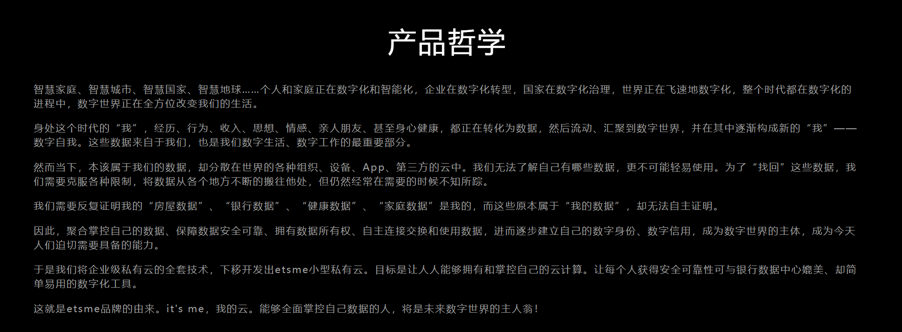

## 前言

前段时间找工作，面试了 "亿次网联（杭州）科技有限公司" 这家公司。

他们的风格，我还是挺喜欢的，诚恳直白。他们的产品哲学，挺有意思: [etsme怎么样？etsme发展前景\_产品哲学\_品牌愿景\_价值观-etsme官网](https://www.etsme.com/brand)

不管个人还是公司，有追求本身是件挺好的事情，不论成败。这比靠垄断吃饭，管理乱七八糟的公司，好太多。

但是，我个人，并不看好这个品牌的前景。

## 我不看好这个品牌的前景

我们每天都在直接产生数据。比如，水电费，消费记录，短视频记录等。我们每天都在间接产生数据。比如人与人之间的互动，谈话。这些数据有个特点，不同位置自动 "生成", 自动 "存储" 到不同的地方。

建立 "数字自我" 的一个前提是，(ta)可以便捷的连接到每一份数据。数据是基础。但是，目前，数据相当封闭，数据存储在不同的孤岛中。比如知乎，不处于登录状态，连自己的主页都无法查看。金融等数据，出于安全考虑，必须处于一个相对封闭的状态。我们的数据，被不同的 APP “垄断” 着。

因此，etsme 无法连接到每一份数据。所以，它采取的方法是，数据本地存储，存储在自己的私有云中。这也意味着着，我们日常自动生成的数据，etsme 无法访问。etsme 只能访问，我们主动向其上传的数据。

普通人，应该很少主动向 etsme 上传数据。比如，主动在上面记账，写日记，写文章等待。普通人唯一可能使用的是，上传相册和盗版视频资源。所以，etsme 注定没有足够的数据作为支撑。

提到相册上传，不得不提另一个问题，网络连通性问题。etsme 部署在家庭场景，外部需要打洞才能访问。虽然 IPv6 用不完，但是国内环境下，也不一定能打洞成功。而且，这个场景是 NAS 的天下。

## 我看好这个公司

我上面是按照 ToC 的场景，分析品牌的可信性 -- 没有数据支撑，注定无法构建"数据自我"。

但是，这个产品，在 ToB 场景下，还是有故事可讲的，特别是现在 AI 的发展。

我们国家，有无数个小公司，每个公司都有生产数据。ToB 场景下，这些生产数据存储在私有云中，形成一个 AI 知识库，这是很好的嘛。

我个人不看好任何本地存储。我认为数据应该上云。大多数安全/保密等原因，强制数据本地存储的的，都是钱多的，烧的慌。

中国很大，不同地方的经济发展水平差异很大，不同人和公司的观念差异很大。中医都能有这么大的生存空间。一家踏实的公司，活着还是没有问题的。

## 最后

对于 etsme来说，我认为它的 ToC 的理念可能走不通，但是能在 ToB 下，继续活着也挺好。

人也一样，在不违法的情况下，有理念是挺好的事情，毕竟人生就几十年，之后就噶屁了。

我没啥理念，极其普通平凡的活着就行。
