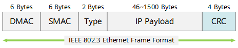

## 前言

之前，计算过三层/四层的校验和：[computing-the-internet-checksum](./computing-the-internet-checksum.md)，它的校验和计算在 RFC 中定义。

二层校验和的定义，在[IEEE 802.3](https://ieeexplore.ieee.org/document/9844436/versions#versions)中定义(我没看过)。 日常情况下，我们是不会感知到二层的校验和的。即使抓包，我们也看不到二层的校验和。网卡驱动会为我们剥掉二层的校验和。

本文简单快速的了解下二层校验和。至于，二层校验和的算法，为什么这么设计，硬件上如何实现，软件上如何加速等问题，我不知道，也不关心。对二层校验和的计算有个大致的印象即可，毕竟工作上也用不到。

## FCS 的计算

在标准的以太帧格式中，最后有4个字节长度的冗余位，用于存储CRC校验的值，这个冗余位又常称为帧检验序列FCS（Frame Check Sequence）。(来源: [什么是CRC(Cyclic Redundancy Check)](https://info.support.huawei.com/info-finder/encyclopedia/zh/CRC.html))



FCS 计算过程也比较简洁。先将 CRC 初始值设为 `0xFFFFFFFF`，然后依次处理以太网帧中除 FCS 外的每个字节，将当前 CRC 与该字节进行异或，再对结果逐位处理 8 次；每次检查最低位，若为 1，则将 CRC 右移一位后与多项式 `0xEDB88320` 异或，若为 0，则仅右移一位。所有字节处理完成后，再将 CRC 与 `0xFFFFFFFF` 异或，所得的 32 位结果就是该以太网帧的 FCS。

```c
function calculate_fcs(frame_without_fcs):
    crc = 0xFFFFFFFF
    polynomial = 0xEDB88320

    for byte in frame_without_fcs:
        crc = crc XOR byte

        repeat 8 times:
            if (crc AND 1) != 0:
                crc = (crc >> 1) XOR polynomial
            else:
                crc = crc >> 1

    crc = crc XOR 0xFFFFFFFF
    crc = crc AND 0xFFFFFFFF

    return crc
```

talk is cheap, show your code.

我们首先从网上下载一份包含 FCS 抓包文档。(当然，你也可以自己抓，如果驱动支持的话)。

从 [PcapNg · Wik · GitLab](https://gitlab.com/wireshark/wireshark/-/wikis/Development/PcapNg) 中下载 [icmp2.ntar](../../assets/2026-09-19-2-icmp2.ntar), 它包含了有效的 FCS。

再找 AI 写一个计算 FCS 的 python 代码。

```python
#!/usr/bin/env python3
"""Calculate Ethernet FCS values from a pcapng file using Scapy."""

import argparse
import binascii
import sys

from scapy.all import Ether, rdpcap


USE_BUILTIN_CRC32 = True
CRC32_POLYNOMIAL = 0xEDB88320


def crc32_custom(data):
    """Calculate CRC-32/IEEE 802.3 using the reflected algorithm."""
    crc = 0xFFFFFFFF
    for byte in data:
        crc ^= byte
        for _ in range(8):
            if crc & 1:
                crc = (crc >> 1) ^ CRC32_POLYNOMIAL
            else:
                crc >>= 1
    return (crc ^ 0xFFFFFFFF) & 0xFFFFFFFF


def crc32_fcs(frame):
    data = bytes(frame)
    if USE_BUILTIN_CRC32:
        value = binascii.crc32(data) & 0xFFFFFFFF
    else:
        value = crc32_custom(data)
    return value, value.to_bytes(4, "little")


def inspect_packet(packet, has_fcs):
    if not packet.haslayer(Ether):
        return None, None, "non-Ethernet packet"

    raw = bytes(packet[Ether])
    if len(raw) < 14:
        return None, None, "Ethernet frame is too short"

    if has_fcs:
        if len(raw) <= 18:
            return None, None, "not enough data for FCS"
        frame, captured = raw[:-4], raw[-4:]
        value, expected = crc32_fcs(frame)
        status = "match" if captured == expected else "mismatch"
        return value, captured.hex(), status

    value, _ = crc32_fcs(raw)
    return value, None, "not present (calculated)"


def main():
    parser = argparse.ArgumentParser(
        description="Calculate FCS for each Ethernet packet in a pcapng file"
    )
    parser.add_argument("pcapng", nargs="?", default="icmp2.pcapng")
    parser.add_argument(
        "--fcs",
        choices=("present", "absent"),
        required=True,
        help="Specify whether packet data contains FCS bytes",
    )
    args = parser.parse_args()

    try:
        packets = rdpcap(args.pcapng)
        has_fcs = args.fcs == "present"
        for number, packet in enumerate(packets, start=1):
            value, captured, status = inspect_packet(packet, has_fcs)
            if value is None:
                print(f"Packet {number}: unable to calculate ({status})")
                continue
            text = f"Packet {number}: calculated FCS = 0x{value:08x}"
            if captured is not None:
                text += f", captured FCS = {captured}"
            print(f"{text}, {status}")
    except (OSError, ValueError, RuntimeError) as exc:
        print(f"Error: {exc}", file=sys.stderr)
        return 1
    return 0


if __name__ == "__main__":
    raise SystemExit(main())
```

运行下，看看效果。

```shell
root@ubuntu24 ~/w/s/t/CRC-32 [2]# ./fcs_pcapng.py --fcs present icmp2.pcapng 
WARNING: PcapNg: bad blocklen 110 (MUST be a multiple of 4. Ignored padding b'\x00\x00'
WARNING: PcapNg: bad blocklen 110 (MUST be a multiple of 4. Ignored padding b'\x00\x00'
WARNING: more PcapNg: bad blocklen 110 (MUST be a multiple of 4. Ignored padding b'\x00\x00'
Packet 1: calculated FCS = 0xf62479ea, captured FCS = ea7924f6, match
Packet 2: calculated FCS = 0x71eb41d3, captured FCS = d341eb71, match
Packet 3: calculated FCS = 0x7612d298, captured FCS = 98d21276, match
Packet 4: calculated FCS = 0x701bd4e6, captured FCS = e6d41b70, match
Packet 5: calculated FCS = 0xae75aecb, captured FCS = cbae75ae, match
Packet 6: calculated FCS = 0x7949207d, captured FCS = 7d204979, match
Packet 7: calculated FCS = 0xff2e3d49, captured FCS = 493d2eff, match
Packet 8: calculated FCS = 0x237f27d0, captured FCS = d0277f23, match
```

高效的 CRC-32 算法软件实现，可以参考(我不看): https://github.com/python/cpython/blob/main/Modules/binascii.c

高效的算法，最好直接调库，不要自己实现，大佬除外。

## FCS 的验证

FCS 的验证算法有两种。

1. 重新计算并比较：接收端对不包含 FCS 的帧内容重新计算 CRC，并将结果与帧尾携带的 FCS 比较，一致则验证通过。
2. 整体计算并检查余数：接收端将包含 FCS 在内的完整帧重新进行 CRC 运算，若最终得到预定义的固定余数(0x2144DF1C)，则验证通过。

```python
#!/usr/bin/env python3
"""Verify Ethernet FCS by calculating CRC-32 over the complete frame."""

import argparse
import binascii
import sys

from scapy.all import Ether, rdpcap


ETHERNET_CRC32_RESIDUE = 0x2144DF1C


def verify_frame(frame):
    """Return the CRC-32 of frame, including its four-byte FCS."""
    value = binascii.crc32(frame) & 0xFFFFFFFF
    return value, value == ETHERNET_CRC32_RESIDUE


def main():
    parser = argparse.ArgumentParser(
        description="Verify Ethernet FCS using the CRC-32 residue method"
    )
    parser.add_argument("pcapng", nargs="?", default="imp.pcapng")
    args = parser.parse_args()

    try:
        packets = rdpcap(args.pcapng)
        for number, packet in enumerate(packets, start=1):
            if not packet.haslayer(Ether):
                print(f"Packet {number}: unable to verify (non-Ethernet packet)")
                continue

            frame = bytes(packet[Ether])
            if len(frame) < 18:
                print(f"Packet {number}: unable to verify (frame is too short)")
                continue

            captured_fcs = frame[-4:]
            crc, valid = verify_frame(frame)
            status = "valid" if valid else "invalid"
            print(
                f"Packet {number}: full-frame CRC-32 = 0x{crc:08x}, "
                f"captured FCS = {captured_fcs.hex()}, {status}"
            )
    except (OSError, ValueError, RuntimeError) as exc:
        print(f"Error: {exc}", file=sys.stderr)
        return 1
    return 0


if __name__ == "__main__":
    raise SystemExit(main())

```

运行结果如下:

```shell
root@ubuntu24 ~/w/s/t/CRC-32# ./verify_fcs.py icmp2.pcapng 
WARNING: PcapNg: bad blocklen 110 (MUST be a multiple of 4. Ignored padding b'\x00\x00'
WARNING: PcapNg: bad blocklen 110 (MUST be a multiple of 4. Ignored padding b'\x00\x00'
WARNING: more PcapNg: bad blocklen 110 (MUST be a multiple of 4. Ignored padding b'\x00\x00'
Packet 1: full-frame CRC-32 = 0x2144df1c, captured FCS = ea7924f6, valid
Packet 2: full-frame CRC-32 = 0x2144df1c, captured FCS = d341eb71, valid
Packet 3: full-frame CRC-32 = 0x2144df1c, captured FCS = 98d21276, valid
Packet 4: full-frame CRC-32 = 0x2144df1c, captured FCS = e6d41b70, valid
Packet 5: full-frame CRC-32 = 0x2144df1c, captured FCS = cbae75ae, valid
Packet 6: full-frame CRC-32 = 0x2144df1c, captured FCS = 7d204979, valid
Packet 7: full-frame CRC-32 = 0x2144df1c, captured FCS = 493d2eff, valid
Packet 8: full-frame CRC-32 = 0x2144df1c, captured FCS = d0277f23, valid
```
