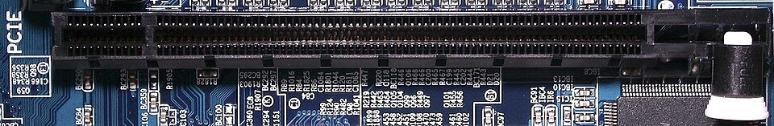
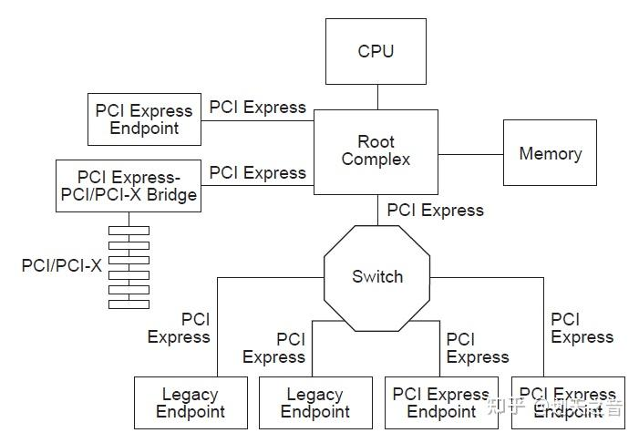

# 前言

在DPDK中，通常使用 [dpdk-devbind Application](https://doc.dpdk.org/guides/tools/devbind.html) 来 bind/unbind 设备。

在vpp中，[vpp/src/plugins/dpdk/device/init.c at master · FDio/vpp](https://github.com/FDio/vpp/blob/master/src/plugins/dpdk/device/init.c#L618) 在程序启动的时候，自动bind设备。

本文，将探究下，DPDK场景下，网卡设备的bind/ubind过程。

# PCIe背景简介

在开始介绍，网卡绑定过程之前，我们可以先了解下PCIe。

**这对于理解数据包的零拷贝，设备为什么要bind，很重要**。

**参考文档：（本节，下面的部分内容，来自这些链接）**

- [PCIe介绍 - 知乎](https://zhuanlan.zhihu.com/p/683142746)
- [PCIe（一） —— 基础概念与设备树 | Soul Orbit](https://r12f.com/posts/pcie-1-basics/)
- [PCIe系列第一讲、PCIe接口的速度与管脚介绍-腾讯云开发者社区-腾讯云](https://cloud.tencent.com/developer/article/1652994)
- [原来PCIe这么简单，一定要看！-腾讯云开发者社区-腾讯云](https://cloud.tencent.com/developer/article/1458755)

## PCIe名词解释

### PCIe

[PCIe](https://zh.wikipedia.org/wiki/PCI_Express)(Peripheral Component Interconnect Express)，是一种高速串行计算机扩展总线标准，用于连接计算机主板与各种高性能外设，如图形卡、固态硬盘和网卡等。它由英特尔在2001年提出，旨在取代老旧的PCI、PCI-X和AGP总线标准。

如果有台式机的话，主板上肯定有PCIe的插槽。这是PCIe ×16插槽图片。



### PCIe设备地址

比如 `0000:03:00.0` ，这就是一个PCIe地址。它是 Linux 系统中用于唯一标识一个 PCI（或 PCIe）设备的地址。下面这个表格可以帮你直观地理解它的结构。

| 地址部分 | 示例值 | 解释说明 |
| --- | --- | --- |
| **域 (Domain)**​ | `0000` | 用于区分不同的 PCIe 域（通常为`0000`，在简单系统中可省略） |
| **总线 (Bus)**​ | `03` | 主板上的 PCIe 总线编号（示例中为总线 3） |
| **设备 (Device)**​ | `00` | 连接在该总线上的具体设备编号（示例中为设备 0） |
| **功能 (Function)**​ | `.0` | 设备的特定功能编号（例如，一个多口网卡的不同端口） |

## PCIe各个版本的规格与速率

之前遇到过，将 [ConnectX7 NICs](https://www.nvidia.com/en-us/networking/ethernet-adapters/) 的 400Gbps(50GB/s)网卡插入 PCIe4上。不管流量怎么打，流量只能打到230Gbps，然后查了好几天。(最后看lspci的时候，无意中发现了这个问题)

所以，PCIe这个基本的传输速率，还是要知道的。

下面，找AI生成下 PCIe的速率表格。

下表汇总了从PCIe 1.0到已发布的PCIe 7.0规范的关键数据，帮助你快速了解其演进历程。所有速率均为**双向（全双工）总带宽**。

| PCIe 版本 | 编码方式 | 原始传输速率 (GT/s) | x1 带宽 | x4 带宽 | x8 带宽 | x16 带宽 |
| --- | --- | --- | --- | --- | --- | --- |
| **PCIe 1.0** | 8b/10b | 2.5 GT/s | 500 MB/s | 2 GB/s | 4 GB/s | 8 GB/s |
| **PCIe 2.0** | 8b/10b | 5.0 GT/s | 1 GB/s | 4 GB/s | 8 GB/s | 16 GB/s |
| **PCIe 3.0** | 128b/130b | 8.0 GT/s | ~2 GB/s | ~8 GB/s | ~16 GB/s | ~32 GB/s |
| **PCIe 4.0** | 128b/130b | 16.0 GT/s | ~4 GB/s | ~16 GB/s | ~32 GB/s | ~64 GB/s |
| **PCIe 5.0** | 128b/130b | 32.0 GT/s | ~8 GB/s | ~32 GB/s | ~64 GB/s | ~128 GB/s |
| **PCIe 6.0** | 128b/130b + PAM4 | 64.0 GT/s | ~16 GB/s | ~64 GB/s | ~128 GB/s | ~256 GB/s |
| **PCIe 7.0** | PAM4 | 128.0 GT/s | ~32 GB/s | ~128 GB/s | ~256 GB/s | ~512 GB/s |

要准确理解上表中的数据，需要掌握以下几个核心概念：

1. **GT/s 与 MB/s 的区别**
**GT/s**：表示每秒传输的原始比特数，是物理层的信号速率 。
**MB/s**：表示实际的有效数据带宽，是用户能体验到的最终速度。
两者之间需要通过**编码方式**进行换算。
2. **编码方式与有效带宽**数据在传输时需经过编码，会引入额外开销，因此有效带宽通常低于原始传输速率 。
**8b/10b 编码**：每传输8位有效数据，需发送10位信号，开销为20%。例如，PCIe 2.0 x1的有效带宽为 `5 GT/s × (8/10) ÷ 8 = 0.5 GB/s`（即500 MB/s）。
**128b/130b 编码**：每128位有效数据仅需发送130位信号，开销降至约1.5%。这使得PCIe 3.0及以后版本的效率大幅提升 。
3. **通道数的作用**PCIe链路可以由1条到32条通道捆绑组成（常见x1, x4, x8, x16）。**总带宽 = 单通道带宽 × 通道数**。例如，x16插槽的带宽就是x1的16倍，这解释了为什么显卡要插在x16插槽上

🔍 实际应用中的注意事项

- **向下兼容性**：更高版本的PCIe插槽可以兼容较低版本的设备，反之亦然。但设备将以两者中较低的版本速率运行 。
- **实际速率损耗**：表格中的是理论峰值带宽。实际应用中，还会受到系统架构、驱动程序、数据包格式等多种因素影响，实际速率会低于理论值 。
- **当前主流应用**：目前消费级市场的主流是PCIe 4.0和5.0，常见于高端显卡和NVMe固态硬盘。PCIe 6.0和7.0主要面向数据中心、AI计算等对带宽有极致需求的领域 。

希望这份详细的梳理和表格能帮助你全面了解PCIe的速率规格。如果你对某个特定版本或应用场景有更深入的疑问，我很乐意提供进一步的信息。

## PCIe的硬件结构

一个PCI Express Fabric由点对点的Link组成，用于连接一组组件。下图展示了一个例子PCI Express Fabric的拓扑结构。这个图展示了一个单一的PCI Express Fabric实例，也称为层次结构，由一个根复杂器（Root Complex）、多个端点（I/O设备）、一个交换机和一个PCI Express到PCI/PCI-X桥接器组成，它们通过PCI Express Link相互连接。



### Root Complex

Root Complex（根复杂器）是PCI Express总线架构中的一个重要组成部分，它是连接CPU和内存子系统与PCI Express设备之间的桥梁。Root Complex通常由一个或多个PCI Express端口组成，每个端口连接到一个或多个PCI Express设备，形成一个I/O层次结构。Root Complex还负责管理PCI Express总线的配置和控制，包括分配总线带宽、处理传输错误、管理电源管理和热插拔等功能。

在PCI Express架构中，Root Complex是一个逻辑实体，可以由一个芯片组或处理器集成电路实现。Root Complex可以支持多个PCI Express端口，每个端口可以连接到一个或多个PCI Express设备。PCI Express设备可以是端点设备或交换机设备，它们可以通过PCI Express总线进行通信和数据传输。

### Endpoint

Endpoint（端点）是指在PCI Express总线架构中可以作为请求方或完成方的功能类型。它可以代表自身执行PCI Express事务，也可以代表一个独立的非PCI Express设备执行PCI Express事务。

(比如，将网卡直接插在PCIe槽上， 这个网卡就是一个endpoint。至于网卡如何和Root Complex 如何通信的，可以不管。)

### Switch

PCIe交换机（PCIe Switch）是一种用于构建PCI Express（PCIe）总线拓扑结构的设备。它允许多个PCIe设备通过高速数据通道进行连接和通信。

PCIe交换机的主要功能是转发PCIe事务，类似于传统PCI总线上的PCI桥接器。它可以将来自一个PCIe设备的事务转发到另一个PCIe设备，实现设备之间的数据传输和通信。

PCIe交换机通常具有多个端口，每个端口可以连接一个PCIe设备。这些端口可以是上游端口（连接到其他交换机或主机）或下游端口（连接到终端设备或其他交换机的上游端口）。

通过使用PCIe交换机，可以构建复杂的PCIe拓扑结构，例如树状结构、星型结构或多级结构。这样可以实现多个设备之间的高速数据传输和通信，并提供更高的带宽和灵活性。

（把它理解成网络场景中的交换机即可）

### 其他

PCI Express to PCI/PCI-X Bridge ：PCI Express to PCI/PCI-X桥接器是一种设备，用于连接PCI Express（PCIe）总线和传统的PCI或PCI-X总线。它允许PCIe系统与PCI或PCI-X设备进行兼容性连接和通信。（兼容老的PCI设备的，可以不管）

## DMA与IOMMU与vfio-pci

上图中，Root Complex 还有根线连接在 memory 上。此时，我们可能会好奇，memory 又不是 PCIe 设备，为什么要连接 Root Complex 呢？这可以关键，这涉及到 DMA 和 IOMMU。

(这节是很复杂的部分。我也搞不懂。问问AI)

### DMA

DMA (Direct Memory Access) 是一种关键的技术，它允许外部设备（如显卡、FPGA加速卡、高速网卡等）直接与主机系统内存读写数据，而无需中央处理器 (CPU) 的持续参与。这不仅显著降低了 CPU 开销，还实现了高带宽、低延迟的数据传输，对于高性能计算、数据采集和实时处理至关重要。

DMA 传输涉及主机（Root Complex）和端点设备（Endpoint，如 FPGA 卡或 GPU）之间的交互。基本流程如下：

1. 初始化与地址配置：(someone)负责分配用于 DMA 传输的内存缓冲区，并将该缓冲区的地址告知 PCIe 端点设备。
2. 启动传输：PCIe 端点设备，可以直接读/写，主机内存。
3. 传输完成通知。

（大概是这样，具体不清楚：DMA 使得网卡可以直接读写内存，无需CPU的持续参与）

### IOMMU

相关链接：[IOMMU技术简介（十四）-CSDN博客](https://blog.csdn.net/u011037593/article/details/156135396) 、[解惑IOMMU-腾讯云开发者社区-腾讯云](https://cloud.tencent.com/developer/article/2246619)

传统的DMA控制器在主机上。但是，对于高性能网卡来说，DMA控制器在网卡上。

在主机上，虚拟内存和物理内存的转换，用的是MMU。

但是，现在网卡直接绕过CPU，直接访问内存了，所以需要一个IOMMU，将设备使用的虚拟地址，转换成物理地址。

(IOMMU 还有其他功能，但是看不明白，就不管它了。)

### vfio-pci

相关链接：[7. Linux Drivers — Data Plane Development Kit 25.11.0 documentatio](https://doc.dpdk.org/guides/linux_gsg/linux_drivers.html#vfio)

VFIO-PCI 是 Linux 内核中实现高性能 设备直通（Device Passthrough）​ 的关键驱动，它允许虚拟机或用户态程序安全、直接地控制物理PCI/PCIe设备。

**换句话说，高性能网卡，通过DMA和IOMMU，向内存中，写入数据包。使用vfio-pci，用户态程序可以直接访问。即，数据包的零拷贝。**

**(在DPDK中，这些数据包直接写入大页中的mempool。 而rx ring 中的指针，指向mempool中的元素。)**

**(到这里，我们就基本理解了数据包零拷贝的整个过程了。)**

(至于vfio-pci内部是如何做到的，母鸡)

# 系统中PCIe设备的查看

上面介绍了PCIe硬件的基本拓扑。下面我们来看看，在系统层面上，如何查看这个PCIe设备。

## 相关命令的使用

日常，我喜欢使用 `lshw` 这个命令，来查看网络相关的PCIe设备了。

- 我这是在vmware虚拟机中，有五个网卡。
- 有两个网卡看不到网卡名，是因为被 bind 了，脱离内核的管控了。

```
root@localhost ~# lshw -c network -businfo
Bus info          Device          Class          Description
============================================================
pci@0000:03:00.0  ens160          network        VMXNET3 Ethernet Controller
pci@0000:04:00.0  ens161          network        VMXNET3 Ethernet Controller
pci@0000:0c:00.0                  network        VMXNET3 Ethernet Controller
pci@0000:13:00.0                  network        VMXNET3 Ethernet Controller
pci@0000:1b:00.0  ens256          network        VMXNET3 Ethernet Controller
```

正经看PCIe设备的命令是 `lspci` 。

```
root@localhost ~ [1]# lspci -s 0000:0c:00.0 -vvv -nn
0c:00.0 Ethernet controller [0200]: VMware VMXNET3 Ethernet Controller [15ad:07b0] (rev 01)
	DeviceName: Ethernet4
	Subsystem: VMware VMXNET3 Ethernet Controller [15ad:07b0]
	Physical Slot: 193
	Control: I/O+ Mem+ BusMaster- SpecCycle- MemWINV- VGASnoop- ParErr- Stepping- SERR- FastB2B- DisINTx-
	Status: Cap+ 66MHz- UDF- FastB2B- ParErr- DEVSEL=fast >TAbort- <TAbort- <MAbort- >SERR- <PERR- INTx-
	Interrupt: pin A routed to IRQ 19
	Region 0: Memory at fcffc000 (32-bit, non-prefetchable) [size=4K]
	Region 1: Memory at fcffd000 (32-bit, non-prefetchable) [size=4K]
	Region 2: Memory at fcffe000 (32-bit, non-prefetchable) [size=8K]
	Region 3: I/O ports at 9000 [size=16]
	Expansion ROM at fcf00000 [virtual] [disabled] [size=64K]
	Capabilities: [40] Power Management version 3
		Flags: PMEClk- DSI- D1+ D2+ AuxCurrent=0mA PME(D0+,D1+,D2+,D3hot+,D3cold+)
		Status: D0 NoSoftRst- PME-Enable- DSel=0 DScale=0 PME-
	Capabilities: [48] Express (v2) Endpoint, MSI 00
		DevCap:	MaxPayload 128 bytes, PhantFunc 0, Latency L0s <64ns, L1 <1us
			ExtTag- AttnBtn- AttnInd- PwrInd- RBE- FLReset- SlotPowerLimit 0.000W
		DevCtl:	CorrErr- NonFatalErr- FatalErr- UnsupReq-
			RlxdOrd- ExtTag- PhantFunc- AuxPwr- NoSnoop-
			MaxPayload 128 bytes, MaxReadReq 128 bytes
		DevSta:	CorrErr- NonFatalErr- FatalErr- UnsupReq- AuxPwr- TransPend-
		LnkCap:	Port #0, Speed 5GT/s, Width x32, ASPM L0s, Exit Latency L0s <64ns
			ClockPM- Surprise- LLActRep- BwNot- ASPMOptComp-
		LnkCtl:	ASPM Disabled; RCB 64 bytes, Disabled- CommClk-
			ExtSynch- ClockPM- AutWidDis- BWInt- AutBWInt-
		LnkSta:	Speed 5GT/s (ok), Width x32 (ok)
			TrErr- Train- SlotClk- DLActive- BWMgmt- ABWMgmt-
		DevCap2: Completion Timeout: Not Supported, TimeoutDis- NROPrPrP- LTR-
			 10BitTagComp- 10BitTagReq- OBFF Not Supported, ExtFmt- EETLPPrefix-
			 EmergencyPowerReduction Not Supported, EmergencyPowerReductionInit-
			 FRS- TPHComp- ExtTPHComp-
			 AtomicOpsCap: 32bit- 64bit- 128bitCAS-
		DevCtl2: Completion Timeout: 50us to 50ms, TimeoutDis- LTR- OBFF Disabled,
			 AtomicOpsCtl: ReqEn-
		LnkCtl2: Target Link Speed: 2.5GT/s, EnterCompliance- SpeedDis-
			 Transmit Margin: Normal Operating Range, EnterModifiedCompliance- ComplianceSOS-
			 Compliance De-emphasis: -6dB
		LnkSta2: Current De-emphasis Level: -6dB, EqualizationComplete- EqualizationPhase1-
			 EqualizationPhase2- EqualizationPhase3- LinkEqualizationRequest-
			 Retimer- 2Retimers- CrosslinkRes: unsupported
	Capabilities: [84] MSI: Enable- Count=1/1 Maskable- 64bit+
		Address: 0000000000000000  Data: 0000
	Capabilities: [9c] MSI-X: Enable- Count=25 Masked-
		Vector table: BAR=2 offset=00000000
		PBA: BAR=2 offset=00001000
	Capabilities: [100 v1] Device Serial Number 00-0c-29-ff-ff-13-56-1f
	Kernel modules: vmxnet3
```

这么多输出信息，一下子看到会很懵，很多我也看不明白。

能找到我们需要的信息即可。

| **属性** | **值** | **备注** |
| --- | --- | --- |
| 设备类型 | Ethernet controller [0200] | 0x02 表示这是一个以太网控制器 |
| 速率天花板 | LnkCap: Port #0, Speed 5GT/s, Width x32 (单向约 16 GB/s) | 设备最终运行的状态（`LnkSta`）是设备能力（`DevCap`）和链路能力（`LnkCap`）相互协商，并取两者都能支持的最低公共标准的结果。 |
| 生产商ID和设备ID | VMware VMXNET3 Ethernet Controller [15ad:07b0] | PCIe设备的生产商ID和设备ID，可以在这里查看：[All PCI Vendors \| Device Hunt](https://devicehunt.com/all-pci-vendors)为什么要知道这些信息呢。因为在DPDK中，NVIDIA的绑卡，不需要bind。 |

## 相关的文件查看

`lspci` 的源码是 [pciutils/pciutils: The PCI Utilities](https://github.com/pciutils/pciutils/tree/master)

我没有去看它的源码实现过程。但是，不难猜，它是从系统文件中，提取有效信息的。

`/sys/bus/pci/devices` 是所有PCIe设备的位置。

`/sys/bus/pci/drivers` 是所有PCIe设备驱动的位置。

以 `0000:0c:00.0` 为例，我们可以直接从文件中提取上面的内容。

```
root@rocky-02 /s/b/p/d/0000:0c:00.0# pwd
/sys/bus/pci/devices/0000:0c:00.0
root@rocky-02 /s/b/p/d/0000:0c:00.0# ls
acpi_index            consistent_dma_mask_bits  dma_mask_bits    label           max_link_width  power_state   resource   revision          uevent
ari_enabled           current_link_speed        driver_override  link            modalias        remove        resource0  rom               vendor
broken_parity_status  current_link_width        enable           local_cpulist   msi_bus         rescan        resource1  subsystem
class                 d3cold_allowed            firmware_node    local_cpus      numa_node       reset         resource2  subsystem_device
config                device                    irq              max_link_speed  power           reset_method  resource3  subsystem_vendor

# config 文件，是PCIe设备的配置信息。
# 上面 lspci 的信息，都可以从这个文件里面提取出来。
# 不过，它略微有点不友好，全是二进制信息
# hexdump -C config

# 其他的文件就很贴心了
## 查看设备类型
oot@rocky-02 /s/b/p/d/0000:0c:00.0# cat class 
0x020000

## 查看设备速度
root@rocky-02 /s/b/p/d/0000:0c:00.0# cat current_link_speed 
5.0 GT/s PCIe

## 查看生产商ID和设备ID
root@rocky-02 /s/b/p/d/0000:0c:00.0# cat vendor 
0x15ad
root@rocky-02 /s/b/p/d/0000:0c:00.0# cat device 
0x07b0
```

# PCIe设备驱动的bind和unbind

我们可以源码层面了解设备的bind/unbind：[dpdk-devbind Application](https://doc.dpdk.org/guides/tools/devbind.html)、[vpp/src/plugins/dpdk/device/init.c at master · FDio/vpp](https://github.com/FDio/vpp/blob/master/src/plugins/dpdk/device/init.c#L618)

但它两只是设备绑定的实现方式。没有这两个，设备还不能绑定了？

所以，必然存在 Blueprint/Manual ，介绍如何bind/unbind PCIe设备。

假定，接下来，我们要为网卡绑定vfio-pci 驱动。

```
# 加载内核模块
modprobe vfio-pci

# 如果虚拟机中不支持 iommu
## 判断依据：/sys/class/iommu 下没有任何文件
echo Y  >  /sys/module/vfio/parameters/enable_unsafe_noiommu_mode
```

## PCIe设备驱动绑定步骤

相关链接 ：[Linux device drivers: bind and unbind - Stack Overflow](https://stackoverflow.com/questions/72089614/linux-device-drivers-bind-and-unbind) 、[kernel.org/doc/Documentation/ABI/testing/sysfs-bus-pci](https://www.kernel.org/doc/Documentation/ABI/testing/sysfs-bus-pci)

### 操作下，混个脸熟

PCIe设备的bind/unbind分为下面三步：

1. 设置 `driver_override`
2. bind/unbind 设备
3. 清除`driver_override`

我们 bind 一个设备，熟下手。

```
root@rocky-02 ~# lshw -c network -businfo
Bus info          Device          Class          Description
============================================================
pci@0000:03:00.0  ens160          network        VMXNET3 Ethernet Controller
pci@0000:04:00.0                  network        VMXNET3 Ethernet Controller
pci@0000:0c:00.0  ens193          network        VMXNET3 Ethernet Controller
pci@0000:13:00.0  ens224          network        VMXNET3 Ethernet Controller
pci@0000:1b:00.0  ens256          network        VMXNET3 Ethernet Controller

# 下面我们来给0000:0c:00.0 绑定下 vfio-pci

# 先设置 driver_overrid
root@rocky-02 ~# echo vfio-pci > /sys/bus/pci/devices/0000:0c:00.0/driver_override

# 然后解绑，已经绑定的驱动
echo 0000:0c:00.0 > /sys/bus/pci/devices/0000:0c:00.0/driver/unbind

# 然后绑定到 vfio-pci 上
echo 0000:0c:00.0 > /sys/bus/pci/drivers/vfio-pci/bind

# 清除 driver_override 设置
echo > /sys/bus/pci/devices/0000:0c:00.0/driver_override

# 查看，绑定成功
lspci -s 0000:0c:00.0 -vvv -nn
	Kernel driver in use: vfio-pci
	Kernel modules: vmxnet3
```

### 绑定步骤分析

#### driver_override

通常来说，在系统重启后，我们会看大设备总是绑定在合适的驱动上。因为系统会分析PCIe设备的vender id 和 device id ，选择合适的驱动。即，我们不可能将任意一个驱动，绑定到一个网卡上。它内部自有匹配规则。

`driver_override` 可以覆盖既有的规则。当指定`driver_override`的时候，只有`driver_override` 中的驱动，才有机会绑定到网卡上。（往`driver_override` 写入空，即可 clear 既有的覆盖）。

需要注意的是：

1. 往`driver_override` 写入驱动名，并不会自动 unbind 网卡，已经bind的网卡。
2. 也不会自动加载对应的驱动；更不会去自动bind对应的驱动。
3. `driver_override` 还支持写入 “none”，表示不接受任何驱动的绑定。
4. `driver_override` 只支持写入一个驱动名，不支持驱动列表。
5. 系统重启后失效。

#### bind/unbind

bind 和 unbind 的含义，显而易见，故不在说明。

## dpdk和vpp中的设备绑定过程分析

dpdk 是通过一个python脚本来绑定设备的。

vpp 是实现在C语言下，实现设备的绑定的。

它们核心逻辑，和上一节介绍的内容，完全相同。因为，流程就是这样。

但是，它们多了些细节。(仅考虑网络设备)

1. 对应从命令行或者配置文件中传入的PCIe地址。它们要判断，这个设备是不是一个网络设备，这个设备是否存在。因为它们要能兜住所有的错误类型，并给出明确的错误提示。
2. dpdk是手动绑定过程，调用脚本的用户自行决定是否绑定到vfio。但是，vpp是一个自动的绑定过程，它需要考虑，设备是否有必要绑定到vfio。比如对于[NVIDIA MLX](https://doc.dpdk.org/guides/nics/mlx5.html) 网卡，它不应该绑定到vfio。因为这类网卡，它的PMD可以和内核驱动共存。原理嘛，不知道，可见 [Linux Drivers — Bifurcated Driver](https://doc.dpdk.org/guides/linux_gsg/linux_drivers.html#bifurcated-driver)
3. 对于已经处于up状态的网卡，是否应该自动绑定。
不自动绑定的理由是， 网卡是up状态，说明 kernel 正使用这个网卡。万一这个网卡是ssh网卡，那可别绑定。
但是，网卡是up状态，不自动绑定，也会带来别的问题。别人系统重启了，kernel 先自动接管了网卡，导致dpdk/vpp 程序，因为没有办法自动接管网卡，导致程序启动失败。
这是一种权衡。
4. 有 vfio-pci 情况下，选 vfio-pci 。但是万一没有呢，那只好退一步选 `igb_uio` 。这种自动判断过程，给程序带去有些复杂些。

# 撸一个网卡的bind过程

网卡的bind过程，应该像dpdk那样单独整一个脚本，还是像vpp那样集成到代码中，视情况而定。

如果生产过程中，使用的网卡供应商相对稳定，那我们不妨，将网卡bind过程，集成到代码中。

如果，不确定生产过程中，会使用哪些网卡，面临哪些场景，我们还是像dpdk那样，把网卡bind过程，解耦出来的比较好。实在不行，给它套一层脚本的壳也行。

我们也撸一个试试水。

有整体思路 + AI 编程，难度不大。但是下面的代码，没有经过生产环境验证。

首先是头文件定义 device_bind.hpp

```
#pragma once

#include <cstdint>
#include <string>
#include <vector>

// references: dpdk-bind.py + vpp/src/vlib/linux/pci.c

class EthernetDevice {
private:
  std::string pci_address; // PCI address (domain:bus:device.function)
  uint16_t vendor_id;      // Vendor ID
  uint16_t device_id;      // Device ID
  uint16_t device_class;   // Device class

public:
  EthernetDevice(const std::string &addr, uint16_t vid, uint16_t did,
                 uint16_t dclass);

  std::string pci_address_get() { return pci_address; };
  uint16_t vendor_id_get() { return vendor_id; };
  uint16_t device_id_get() { return device_id; };
  uint16_t device_class_get() { return device_class; };

  std::string vendor_name_get() const;
  std::string device_name_get() const;
  std::string device_class_name_get() const;
  std::string info_format_string() const;

  std::string interface_name_get(const std::string &pci_address) const;
  bool interface_status_get(const std::string &pci_address) const;
};

class EthernetDeviceBinder {
private:
  std::vector<EthernetDevice> ethernet_devices;

  bool has_iommu();
  void check_noiommu_mode();

public:
  void init();
  void bind(std::string pci_address, bool force);
};
```

下面是头文件的实现。device_bind.cpp

```
#include <boost/filesystem.hpp>
#include <cstdint>
#include <iostream>
#include <sstream>
#include <string>
#include <vector>

extern "C" {
#include <pci/pci.h>
}

#include "common.hpp"
#include "device_bind.hpp"
#include "log.hpp"

static const std::string sysfs_pci_drv_path = "/sys/bus/pci/drivers/";
static const std::string sysfs_pci_dev_path = "/sys/bus/pci/devices/";

EthernetDevice::EthernetDevice(const std::string &addr, uint16_t vid,
                               uint16_t did, uint16_t dclass)
    : pci_address(addr), vendor_id(vid), device_id(did), device_class(dclass) {}

std::string EthernetDevice::vendor_name_get() const {
  struct pci_access *pacc = pci_alloc();
  char vendor_name[256] = "Unknown";

  const char *v_name = pci_lookup_name(pacc, vendor_name, sizeof(vendor_name),
                                       PCI_LOOKUP_VENDOR, vendor_id, device_id);

  std::string result = v_name ? std::string(v_name) : std::string(vendor_name);
  pci_cleanup(pacc);
  return result;
}

std::string EthernetDevice::device_name_get() const {
  struct pci_access *pacc = pci_alloc();
  char device_name[256] = "Unknown";

  const char *d_name = pci_lookup_name(pacc, device_name, sizeof(device_name),
                                       PCI_LOOKUP_DEVICE, vendor_id, device_id);

  std::string result = d_name ? std::string(d_name) : std::string(device_name);
  pci_cleanup(pacc);
  return result;
}

std::string EthernetDevice::device_class_name_get() const {
  struct pci_access *pacc = pci_alloc();
  char class_str[256] = {};

  // TODO: a crash will be triggered when device_class is illegal
  const char *name = pci_lookup_name(pacc, class_str, sizeof(class_str),
                                     PCI_LOOKUP_CLASS, device_class);
  std::string result = name ? std::string(name) : "Unknown";

  pci_cleanup(pacc);
  return result;
}

std::string EthernetDevice::info_format_string() const {
  std::ostringstream oss;
  oss << "PCI Address: " << pci_address << "\n";
  oss << "  Vendor ID: 0x" << std::hex << vendor_id << " (" << vendor_name_get()
      << ")\n";
  oss << "  Device ID: 0x" << std::hex << device_id << " (" << device_name_get()
      << ")\n";
  oss << "  Class: 0x" << std::hex << device_class << " ("
      << device_class_name_get() << ")";
  return oss.str();
}

std::string
EthernetDevice::interface_name_get(const std::string &pci_address) const {
  namespace fs = boost::filesystem;

  fs::path pci_device_path(sysfs_pci_dev_path + pci_address);
  if (!fs::exists(pci_device_path)) {
    return "";
  }

  fs::path net_dir_path = pci_device_path / "net";
  if (!fs::exists(net_dir_path)) {
    return "";
  }

  for (auto &interface : fs::directory_iterator(net_dir_path)) {
    if (fs::is_directory(interface.path())) {
      return interface.path().filename().string();
    }
  }

  return "";
}

bool EthernetDevice::interface_status_get(
    const std::string &pci_address) const {
  std::string interface_name = interface_name_get(pci_address);

  if (interface_name.empty()) {
    return false;
  }

  std::string status_path = "/sys/class/net/" + interface_name + "/operstate";
  std::ifstream status_file(status_path);

  if (!status_file.is_open()) {
    return false;
  }

  std::string status;
  std::getline(status_file, status);

  return (status == "up");
}

/*************************** PciDeviceEnumerator *********************/

class PciDeviceEnumerator {
public:
  std::vector<EthernetDevice> ethernet_devices_enumerate() {
    std::vector<EthernetDevice> ethernet_devices;

    struct pci_access *pacc = pci_alloc();
    pci_init(pacc);
    pci_scan_bus(pacc);

    struct pci_dev *dev;
    for (dev = pacc->devices; dev; dev = dev->next) {
      pci_fill_info(dev, PCI_FILL_IDENT | PCI_FILL_BASES | PCI_FILL_CLASS);

      if ((dev->device_class >> 8) == 0x02) { // Network controller class
        char addr_str[32];
        snprintf(addr_str, sizeof(addr_str), "%04x:%02x:%02x.%d", dev->domain,
                 dev->bus, dev->dev, dev->func);

        EthernetDevice eth_dev(std::string(addr_str), dev->vendor_id,
                               dev->device_id, dev->device_class);

        ethernet_devices.push_back(eth_dev);
      }
    }

    pci_cleanup(pacc);

    return ethernet_devices;
  }

  void ethernet_devices_print(const std::vector<EthernetDevice> &devices) {
    LOG_INFO << "Found " << devices.size() << " Ethernet devices:";
    for (const auto &dev : devices) {
      LOG_INFO << dev.info_format_string();
    }
  }
};

/**************** EthernetDeviceBinder ********************/

void EthernetDeviceBinder::init() {
  PciDeviceEnumerator enumerator;
  ethernet_devices = enumerator.ethernet_devices_enumerate();
  enumerator.ethernet_devices_print(ethernet_devices);
}

bool EthernetDeviceBinder::has_iommu() {
  namespace fs = boost::filesystem;
  const std::string iommu_path = "/sys/class/iommu";

  if (fs::exists(iommu_path)) {
    return fs::directory_iterator(iommu_path) != fs::directory_iterator();
  }
  return false;
}

void EthernetDeviceBinder::check_noiommu_mode() {
  const std::string filename =
      "/sys/module/vfio/parameters/enable_unsafe_noiommu_mode";

  // Check current value
  std::ifstream read_file(filename);
  if (!read_file.is_open()) {
    throw std::runtime_error("Error: Cannot open " + filename +
                             "failed to check unsafe noiommu mode. Please "
                             "execute modprobe vfio_pci first.");
  }

  char value;
  read_file.get(value);
  read_file.close();

  // If already enabled, return
  if (value == '1' || value == 'y' || value == 'Y') {
    return;
  }

  // Enable noiommu mode
  std::ofstream write_file(filename);
  if (!write_file.is_open()) {
    throw std::runtime_error(
        "Error: failed to enable unsafe noiommu mode - Cannot open " +
        filename);
  }

  write_file << "1";
  write_file.close();

  LOG_INFO << "Warning: enabling unsafe no IOMMU mode for VFIO drivers";
}

void EthernetDeviceBinder::bind(std::string pci_address, bool force) {
  namespace fs = boost::filesystem;

  auto it = ethernet_devices.begin();
  for (; it != ethernet_devices.end(); ++it) {
    if (it->pci_address_get() == pci_address) {
      break;
    }
  }

  if (it == ethernet_devices.end()) {
    throw std::runtime_error("Device with PCI address " + pci_address +
                             " not found");
  }

  if (it->vendor_id_get() == 0x15b3) {
    LOG_INFO << "Mellanox network cards(" << it->pci_address_get()
             << ") do not require binding";
    return;
  }

  if (force == false && it->interface_status_get(pci_address) == true) {
    throw std::runtime_error(
        "The network card( " + pci_address +
        " )is in the UP state. Before binding, please down it");
  }

  if (has_iommu() == false) {
    check_noiommu_mode();
  }

  const std::string device_dir = sysfs_pci_dev_path + pci_address;

  // 1. set driver override
  const std::string driver_override_file = device_dir + "/driver_override";
  write_to_file(driver_override_file, "vfio-pci");

  // 2. unbind driver
  const std::string driver_unbind_file = device_dir + "/driver/unbind";
  if (fs::exists(driver_unbind_file)) {
    write_to_file(driver_unbind_file, it->pci_address_get());
  }

  // 3. bind to vfio-pci
  const std::string bind_driver_file = sysfs_pci_drv_path + "/vfio-pci/bind";
  write_to_file(bind_driver_file, it->pci_address_get());

  // 4. clear driver override
  write_to_file(driver_override_file, "");
}
```
