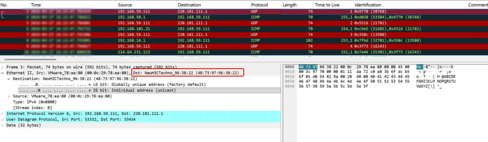
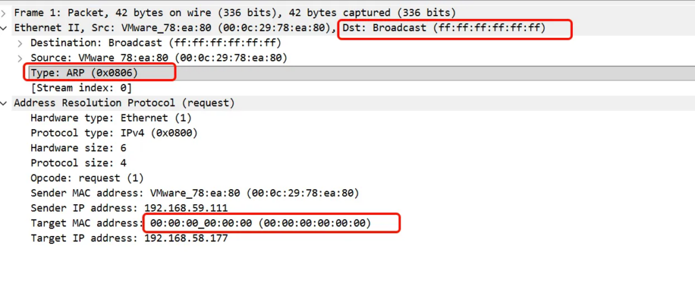
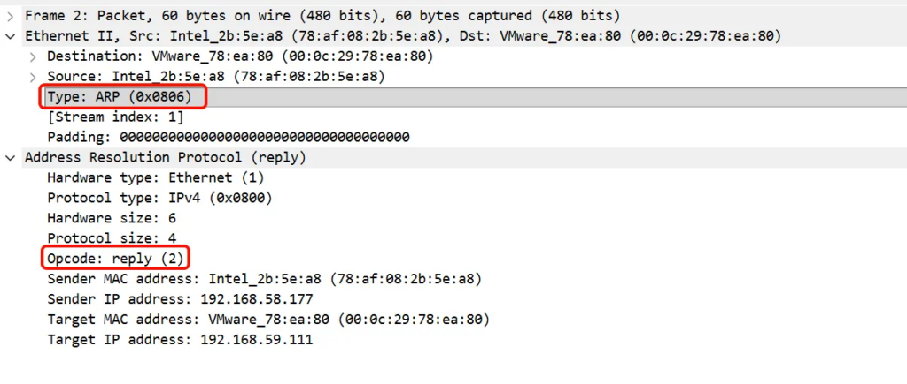

## 前言

ARP（Address Resolution Protocol，地址解析协议）的作用是，在 IPv4 网络中，将 IP 地址映射为物理 MAC 地址。

本文介绍：ARP 的作用、ARP 数据包的格式 、ARP 的通信流程。

详细的介绍，可参考：[RFC 826 - An Ethernet Address Resolution Protocol: Or Converting Network Protocol Addresses to 48.bit Ethernet Address for Transmission on Ethernet Hardware](https://datatracker.ietf.org/doc/rfc826/)

## ARP 的作用

### 路由简介

通过路由，我们可以拿到下一跳（next hop）的 IP 地址。

下一跳的定义： 当前设备把数据包发出去之后，第一个接收这个数据包的路由器或主机。

ARP 的作用是将 ”IP 地址“映射成 MAC 地址。这里的 ”IP 地址“，是指下一条的地址，而不是数据包中的 dest IP。

当然，ARP 本身并不关心，这个”IP 地址“ 是下一跳的地址，还是数据包的 dest ip。ARP 只是做 IP 到 MAC 的映射。

但是，如果我们不搞清楚，为什么，这个”IP 地址“ 是下一跳的地址（即路由过程），我们就没法真正理解 ARP 的作用。

详细的路由原理介绍，见网上的其他资料。本文使用一个简单的示例，介绍一个需要路由的数据包的 MAC。

这是我当前机器的情况。

- 内网机器有一个网卡 ens160，它的 IP 是 192.168.59.111。
- 这个机器的默认网关是 192.168.58.1 。当一个目标 IP 找不到路由时，走默认路由，从 ens160 发包，到 192.168.58.1。

```
2: ens160: <BROADCAST,MULTICAST,UP,LOWER_UP> mtu 1500 qdisc mq state UP group default qlen 1000
    link/ether 00:0c:29:78:ea:80 brd ff:ff:ff:ff:ff:ff
    altname enp3s0
    inet 192.168.59.111/23 brd 192.168.59.255 scope global dynamic noprefixroute ens160
       valid_lft 78739sec preferred_lft 78739sec
    inet6 fe80::20c:29ff:fe78:ea80/64 scope link noprefixroute 
       valid_lft forever preferred_lft forever

root@localhost ~# ip route 
default via 192.168.58.1 dev ens160 proto dhcp src 192.168.59.111 metric 100 
192.168.58.0/23 dev ens160 proto kernel scope link src 192.168.59.111 metric 100 
```

问题：从这台机器访问 www.baidu.com 时，这个网络数据包的 dest mac 是什么？是 baidu 机器的 mac，还是什么 mac ？

`traceroute` 可以显示数据包到达网络主机的路由路径。（关于这个工具的使用，可以见附录。）

我们试验下。

```
root@localhost ~ [SIGINT]# traceroute -4 www.baidu.com -n -N 1 -q 1 -p 33434
traceroute to www.baidu.com (220.181.111.1), 30 hops max, 60 byte packets
 1  192.168.58.1  4.195 ms
 2  192.168.101.21  4.937 ms
 3  192.168.16.1  3.901 ms
 4  114.64.231.113  4.953 ms
 5  192.168.36.9  7.066 ms
 6  192.168.155.37  9.014 ms
 7  192.168.35.1  6.837 ms
 8  *
 9  36.110.255.61  9.856 ms^C⏎ 
```

我们也抓下包。（这里，我们其实只想抓 `traceroute`这个进程的包。但是 tcpdump 不支持按照进程抓包。[mozillazg/ptcpdump](https://github.com/mozillazg/ptcpdump) 这个工具，支持按照进程抓包。）

```
# icmp[0] 表示 ICMP 类型字段：
#   11 = Time Exceeded（中间路由器回复）
#   3  = Destination Unreachable（目标主机回复，需配合 code=3）

# traceroute 默认是udp协议，端口从33434 开始逐渐递增

# 下面可以抓traceroute 发送和回复的报文
tcpdump -i ens160 -vvv -nn '(udp and portrange 33434-65535) or icmp[0] = 11 or icmp[0] = 3' -w traceroute.pcapng
```

从抓包结果，可以清晰看到，这个包的 MAC 为 48:73:97:96:38:22。



接着查询，可以看到，这个 MAC 就是默认网关(192.168.58.1)的 MAC。

```
root@localhost ~# ip neigh 
192.168.58.177 dev ens160 lladdr 78:af:08:2b:5e:a8 REACHABLE 
192.168.58.1 dev ens160 lladdr 48:73:97:96:38:22 REACHABLE 
fe80::4a73:97ff:fe96:3822 dev ens160 lladdr 48:73:97:96:38:22 router STALE 
```

**所以，我们现在可以给出结论：ARP 用于将 IP 映射成 MAC。（这个 IP 是下一跳的 IP，而不是数据包的 dest IP**。虽然 ARP 本身不关心，到底将哪个 IP 映射成对应的 MAC）

### ARP 的作用

网络分层设计，每层都有很多种协议。物理线路上传递的是以太帧。

ARP 干的事情是，将 IPv4 转换成 MAC。NDP 是用来将 IPv6 转换成 MAC。

## ARP 数据包的内容

抓个 ARP 的包瞅瞅。

```
# 清空arp缓存(邻居表)
ip neigh flush all

# 抓取 arp 数据包
tcpdump -vvv -i ens160 "arp" -w arp.pcapng
```

ARP 报文总体结构如下：

```
    Ethernet transmission layer (not necessarily accessible to the user):
        48.bit: Ethernet address of destination
        48.bit: Ethernet address of sender
        16.bit: Protocol type = ether_type$ADDRESS_RESOLUTION
    Ethernet packet data:
        16.bit: (ar$hrd) Hardware address space (e.g., Ethernet, Packet Radio Net.)
        16.bit: (ar$pro) Protocol address space.  For Ethernet hardware, this is from the set of type fields ether_typ$<protocol>.
         8.bit: (ar$hln) byte length of each hardware address
         8.bit: (ar$pln) byte length of each protocol address
        16.bit: (ar$op)  opcode (ares_op$REQUEST | ares_op$REPLY)
        nbytes: (ar$sha) Hardware address of sender of this packet, n from the ar$hln field.
        mbytes: (ar$spa) Protocol address of sender of this packet, m from the ar$pln field.
        nbytes: (ar$tha) Hardware address of target of this packet (if known).
        mbytes: (ar$tpa) Protocol address of target.
```

### 请求报文



### 响应报文



## ARP 的流程

### 数据包的生成

当数据包通过网络层向下传递时，路由机制确定下一跳的协议地址，以及期望通过哪块硬件发送数据包。

```
1. 底层查询地址解析模块
2. 地址解析模块尝试在本地映射表中查找 <协议类型, 目标协议地址> 对
3. 如果找到：
   ├─ 返回对应的 48 位以太网地址给调用者
   └─ 硬件驱动使用该地址发送数据包
4. 如果未找到：
   ├─ 通知调用者丢弃当前数据包（假设上层会重传）
   ├─ 构造以太网数据包，类型字段设为 ether_type$ADDRESS_RESOLUTION
   ├─ 填充地址解析协议字段：
   │  ├─ ar$hrd = ares_hrd$Ethernet
   │  ├─ ar$pro = 待解析的协议类型
   │  ├─ ar$hln = 6（48 位以太网地址的字节数）
   │  ├─ ar$pln = 该协议地址的字节长度
   │  ├─ ar$op = ares_op$REQUEST
   │  ├─ ar$sha = 本机 48 位以太网地址
   │  ├─ ar$spa = 本机协议地址
   │  ├─ ar$tpa = 目标主机的协议地址
   │  └─ ar$tha = 可设为空或硬件广播地址（全 1）
   └─ 将该数据包广播到路由机制确定的以太网段上所有机器
```

### 数据包的接受与处理流程

当接收到地址解析数据包时，接收方的以太网模块将其交给地址解析模块，执行如下算法。

```
1. ? 我支持 ar$hrd 指定的硬件类型吗？
   ├─ 否 → 丢弃数据包
   └─ 是 → （几乎肯定）
        ├─ [可选] 检查硬件地址长度 ar$hln 是否合理
        ├─ ? 我支持 ar$pro 指定的协议吗？
        │   ├─ 否 → 丢弃数据包
        │   └─ 是 →
        │       ├─ [可选] 检查协议地址长度 ar$pln 是否合理
        │       ├─ Merge_flag := false
        │       ├─ ? <协议类型, 发送方协议地址> 对是否已在转换表中？
        │       │   ├─ 是 → 用数据包中的新硬件地址更新该表项，Merge_flag := true
        │       │   └─ 否 → 继续
        │       ├─ ? 我是目标协议地址吗？(ar$tpa == 本机协议地址)
        │       │   ├─ 否 → 丢弃数据包
        │       │   └─ 是 →
        │       │       ├─ 如果 Merge_flag 为 false：
        │       │       │   └─ 将三元组 <协议类型, 发送方协议地址, 发送方硬件地址> 加入转换表
        │       │       ├─ ? 操作码是 ares_op$REQUEST 吗？（现在才检查操作码！）
        │       │       │   ├─ 否 → 丢弃数据包（是响应包，无需处理）
        │       │       │   └─ 是 →
        │       │       │       ├─ 交换硬件地址和协议地址字段：
        │       │       │       │   ├─ 将本机硬件/协议地址填入发送方字段
        │       │       │       │   └─ 将请求包中的发送方地址填入目标字段
        │       │       │       ├─ 设置 ar$op = ares_op$REPLY
        │       │       │       └─ 将响应包单播发送到（新的）目标硬件地址
        │       │       │           （在与接收请求相同的硬件接口上）
```

这个算法的好处是，一次广播 REQUEST 可使所有站点更新该主机的新地址。

这个算法流程，仅供参考。因为上面 merge_flag 的操作挺冗余的。

可以，先直接应答arp，然后再更新邻居表，代码会简洁些。linux kernel 中就是这么做的：[linux/net/ipv4/arp.c:arp_process](https://github.com/torvalds/linux/blob/master/net/ipv4/arp.c)

### 表项的老化

表项老化/超时机制的实现超出本协议范围。

必须要有老化机制的。

1. 比如，A 机器和 B 机器以前通信过。A 中保存了 B 的 IP 到 MAC 的映射。
2. 现在 B 机器坏了，更换成 B'了。现在是，IP 没变，但是 MAC 变了。假设之后，B 一直没有发送过消息。
3. A 此时想给 B 发消息，如果没有老化机制，则 MAC 地址一直是旧的，导致 B 无法收到消息。

## 附录

### traceroue 的简单使用

[traceroute(8) - Linux manual page](https://man7.org/linux/man-pages/man8/traceroute.8.html) 用于追踪 IP 网络中数据包前往指定主机所经过的路由路径。该程序通过发送具有较小 TTL 值的探测包，并监听网关返回的 ICMP "time exceeded"（超时）回复，来尝试追踪 IP 数据包前往某个互联网主机的路径。具体流程如下：

1. 初始探测包的 TTL 设为 1，然后逐次递增
2. 当收到目标主机返回的 ICMP "port unreachable"（端口不可达）或 TCP RST（重置）响应时，表示已到达目标主机
3. 或者当达到最大跳数限制（默认 30 跳）时停止
4. 每个 TTL 值默认发送 3 个探测包，并打印一行输出，显示：TTL 值、网关地址以及每个探测包的往返时间（RTT）
5. 地址后面可根据请求附加其他信息
6. 如果同一跳的探测包来自不同网关，将分别打印每个响应系统的地址
7. 如果在指定超时时间内未收到响应，则该探测包显示为 `*`（星号）

上文中，我们指定了一些 traceroute 的参数：

- -4：显式强制使用 IPv4 进行追踪。（因为 ARP 只适用 IPv4。IPv6 使用的是 NDP）
- -n：显示时不尝试将 IP 地址映射为主机名
- -N：指定同时发送的探测包数量。并发发送多个探测包可显著加速追踪过程。默认值为 16。（因为我想看到请求和响应交替出现的报文，所以我将其设置为 1，即每次发送一个探测包，收到回复后，再发送新的探测包）
- -q：设置每跳发送的探测包数量，默认为 3。
- -p：指定目标端口基值（每个探测包的端口号递增。递增的好处是，收到回复的包，看端口号，就知道对应的 ttl 是多少）
