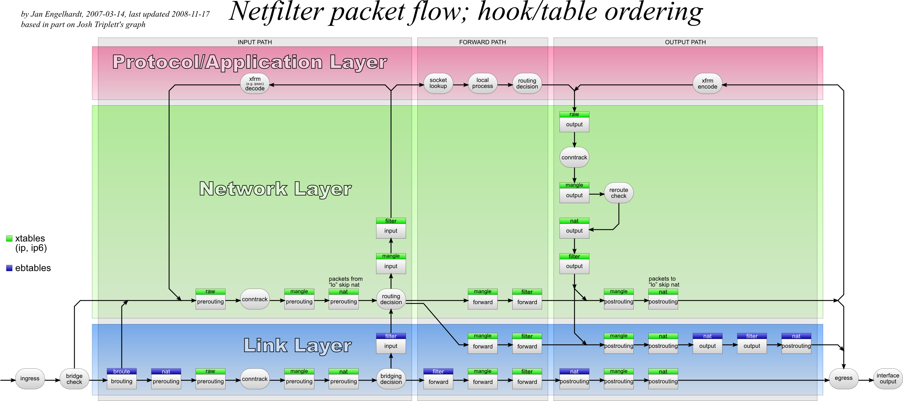
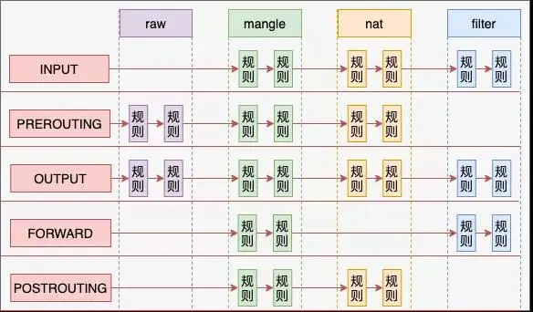

# 前言

本文介绍 iptables 的基本使用。

# iptables 的四表五链

相关链接：[来，今天飞哥带你理解 Iptables 原理！-iptables原理详解](https://www.51cto.com/article/694031.html)

首先得对四表五链有个基础的理解，否则没法写/理解规则。

网上查资料，我们能看到这个图。我搞不懂这个图，但这个图能让我知道不同规则的触发顺序。

下面将介绍介绍 iptables 的四表五链。



## 五链

iptables 的规则是存储在 list 中的。因为 list 结构容易进行增删。

根据包的处理顺序，链有五种：

- PREROUTING：在进行路由选择之前处理数据包。(如果 dst ip 是本地，则进入 INPUT。否则，进入 FORWARD， 转发该数据包，即路由器。)
- INPUT：针对目的地为本机的数据包。
- FORWARD：针对通过本机转发到其他地方的数据包。
- OUTPUT: 针对从本机发出的数据包。
- POSTROUTING：在完成路由选择之后处理数据包。

每条链都是一组规则的集合，按照顺序依次尝试匹配传入的数据包。如果找到匹配项，则根据规则指定的动作（如ACCEPT接受、DROP丢弃等）处理数据包；如果没有匹配任何规则，则采取该链的默认策略。

## 四表

Filter 表：这是最常用的表，主要用于决定是否允许数据包通过。它处理的数据包是最基本的安全需求，如阻止或允许流量。

NAT 表：Network Address Translation 表，用于修改数据包的源地址或目标地址。

Mangle 表：这个表用于对数据包进行修改，如更改TTL（生存时间）值或者为数据包设置特殊标志等高级路由需求。

Raw 表：主要用于处理数据包的连接跟踪。(??)

一个链中有多种规则。而不同规则可以分为上面四类。

## 四表与五链之间的关系

相关链接：[linux - What's the point of naming Iptables' tables as "tables"? - Unix & Linux Stack Exchange](https://unix.stackexchange.com/questions/642772/whats-the-point-of-naming-iptables-tables-as-tables)

1. 每条链都是一组规则的集合。
2. 每条链上的一组规则，按照对包的处理不同，可以分为四类。
3. 链上规则，按照对包处理的不同也是有顺序的，raw > manage > nat > filter
4. 包进来的时候，顺着链上的规则，按照顺序匹配。



# iptables 的规则

在大致知道了四表五链的基本内容后，我们使用 iptables 来增删查规则。

本节来自：[trimstray/iptables-essentials: Iptables Essentials: Common Firewall Rules and Commands.](https://github.com/trimstray/iptables-essentials?tab=readme-ov-file)

## 基本使用

### 保存与加载规则

```
iptables-save -f [file]
iptables-restore [file]
```

### 查看

```
# 列出所有的规则并显示详细信息
iptables -n -L -v

# 在列出规则时显示每条规则的行号
iptables -n -L -v --line-numbers

# 列出指定链的规则
iptables -n -v -L INPUT

# 列出 iptables 语法的规则
iptables -S

# 列出指定链的规则
iptables -S INPUT
```

### 增加

```
# 插入一条规则
## iptables -I chain [rulenum] rule-specification [options]
## 默认时插在链表的最前面；
## 默认时插在 filter 表中
### 在 INPUT 链的最前面，filter 表中插入一条规则
### 丢弃 src ip 为 192.168.38.255 的所有流量
iptables -I INPUT -s 192.168.38.255 -j DROP

# 在链表的最后追加一条规则
iptables -A INPUT -i eth0 -s 192.168.252.10 -j DROP

# 设置指定链的默认策略（Policy）。默认策略决定了当数据包不匹配任何已定义的规则时，应采取什么动作。
## --policy  -P chain target
##				Change policy on chain to target
```

### 删除

```
# 删除一条规则
## iptables -D chain rulenum [options]

## 按照编号删除
iptables -D INPUT 1

## 按照规则删除
### 其实很好理解。规则的编号，和规则本身的内容，都能唯一的匹配到一条规则
iptables -D INPUT -s 192.168.38.254/32 -j DROP

## 清除一条链上所有的规则
## --flush   -F [chain]		Delete all rules in  chain or all chains

## 删除用户自定义的链
## --delete-chain
##            -X [chain]		Delete a user-defined chain
```

# 附录

## 应该优先使用nftables

nftables 是iptables的继任者。目前来说，Linux 不同的发行版都很好的支持了 nftables。（但是，目前一些公司还在使用 iptables，所以得了解 iptables 的使用。）

问：debian / ubuntu / rocky /centos / rethad , 分别是从什么时候开始支持 nftables? 回答内容， 整理成表格格式。

| **发行版** | **版本** | `**nftables**`******支持情况及备注** |
| --- | --- | --- |
| Debian | Debian 9 (Stretch) | 可用，但默认使用 `iptables`。从 Debian 10 (Buster) 开始更积极推动向 `nftables`迁移。 |
| Ubuntu | Ubuntu 16.04 LTS (Xenial Xerus) | 作为技术预览包含在内。直到 Ubuntu 20.04 LTS (Focal Fossa)，用户可以更容易地迁移到 `nftables`。 |
| Rocky Linux | Rocky Linux 8 | 成为默认防火墙框架，取代了之前的 `iptables`。 |
| CentOS | CentOS 8 | 成为默认防火墙框架。CentOS 7 主要依赖于 `iptables`，但可通过额外软件仓库安装 `nftables`。 |
| RHEL | RHEL 8 | 成为默认防火墙框架，取代了之前版本中使用的 `iptables`。RHEL 7 主要依赖于 `iptables`，但可安装 `nftables`。 |

## 防火墙应该包含哪些功能

如果有天，我们要设计防火墙，或者说设计 ACL，我们应该让其包含哪些功能，或者说如何设计？

比如，下面的 Syn-flood protection

```
iptables -N syn_flood
iptables -A INPUT -p tcp --syn -j syn_flood
iptables -A syn_flood -m limit --limit 1/s --limit-burst 3 -j RETURN
iptables -A syn_flood -j DROP
```

将这些规则拆分后，我们可以得出这样的内容：

- 在什么位置执行规则：比如这里的 INPUT 位置。
- 规则可以描述包的特征：比如这里的 -p tcp --syn
- 满足特征的包，执行对应的动作：比如这里的 -j syn_flood
- 不同的功能要以模块的方式提供：比如这里的 -m limit --limit 1/s --limit-burst 3

防火墙的设计或许应该满足这样的条件：在特定的位置，满足特征的包，执行对应的动作；不同的功能按照模块的方式提供；
