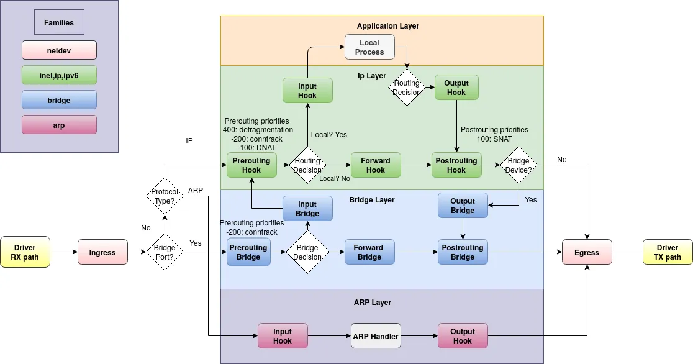

# 前言

平时在工作中，接触到的还基本是 [iptables](basic-use-of-iptables.md) 。

[nftables](https://www.netfilter.org/projects/nftables/index.html) 是 `iptables`的继任者。自 Linux 内核 3.13 开始，`nftables`即得到了支持，现在已经挺成熟的了。

所以，在日常工作中，当遇到需要 `iptables`的时候，或许应该优先使用 `nftables`。

关于 `nftables`的使用文档可参考：[nftables wiki](https://wiki.nftables.org/wiki-nftables/index.php/Main_Page)

- [Quick reference-nftables in 10 minutes - nftables wiki](https://wiki.nftables.org/wiki-nftables/index.php/Quick_reference-nftables_in_10_minutes)
- [man nft](https://www.mankier.com/8/nft)

我翻看了下文档，可能仅仅知道点简单的操作。工作用到了时候再说呗，用不到就先放放。

# 简单使用

## 名称概念

Reluset：规则集，是一个笼统的概念，表示内核中设置的所有表，链。

Table：表，chains、sets、stateful objects 的容器。它通过address family 和 名称来标识。address family 必须是 ip, ip6, inet, arp, bridge, netdev 之一。

Chains：链，rules 的容器。一个链属于一个表。

- 链的种类有filter、nat、route。
- 链挂载的 hook 点有prerouting, input, output, postrouting。一个 hook 点可能挂多个链。
- 每个链都有个优先级。优先级参数接受一个有符号整数值或标准优先级名称，用于指定具有相同钩子值的链的遍历顺序。排序是升序的，即较低的优先级值优先于较高的优先级值。
- Standard priority names： raw 表示 -300；mangle 表示 -150；filter 表示 0；

Rules：规则，添加到给定表的给定链中。

## 使用示例

```
# 添加一个新表，协议族是inet(同时支持ip和ip6)，表名是filter
nft add table inet filter

# 表中添加一个新的链
## inet协议簇中，添加到filter表中；链名为input；链类型为filter；hook点是input；优先级为0；默认策略是接收流量
nft add chain inet filter input \{ type filter hook input priority 0 \; policy accept \; \}

# inet协议簇中，filter表中，input链中，添加放行指定tcp port的规则
nft add rule inet filter input tcp dport \{ telnet, ssh, http, https \} accept
```

一个数据包进来，它将经历下面流程：

1. 数据包从网口进来，路由决定是本地的包，进入 input hook 点。
2. input hook 点上可能挂载了多个链(目前上面仅仅挂了一个链)。每个链都有一个数字表示的优先级。数字越小，这个链的优先级越高。
3. 按照链优先级的高低，判断优先使用的链。对包应用链中的规则，命中则执行对应的动作。


