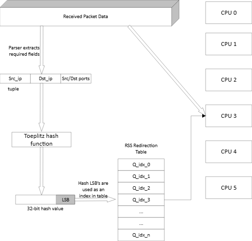

# RSS 是什么

RSS(Receive side scaling) 是一种网络驱动技术，它能高效地将网络接收处理任务分配到多处理器系统中的多个 CPU 上。

下图是它的一般处理逻辑：图片来源([Toeplitz Hash Library](https://doc.dpdk.org/guides-25.11/prog_guide/toeplitz_hash_lib.html))



1. 网卡驱动程序，提取数据包信息，可以是四元组{src_ip, dst_ip, src_port, dst_port}，或者二元组{src_ip, dst_ip} 等。
2. 将数据包信息，和 hash key 作为输入，通过哈希函数，计算出一个 hash 值。
3. 最低有效位(least significant bits, LSB) 作为 index，指向 RSS Redirection Table (ReTa)。
4. RSS Redirection Table 中存储的是 queue id(的循环)。
5. 经过上面 1-4 的计算，网卡就可以将数据包，放入不同的队列中。
6. 多个 CPU 从多个队列中取数据包。（不同的 CPU 不要从同一个队列中取，避免竞争。一个 CPU 可以取多个队列。）

上面是大体的逻辑。相关链接也可见(介绍上，大同小异)：

- [Introduction to Receive Side Scaling (RSS) - Windows drivers | Microsoft Learn](https://learn.microsoft.com/en-us/windows-hardware/drivers/network/introduction-to-receive-side-scaling)
- kernel.org/doc/Documentation/networking/scaling.txt

# 为什么需要 RSS

1. 为了速度。如果只有一个队列，不同 CPU 访问同一个队列，就得互斥访问，肯定没有多队列快。
2. 现在的高性能网卡非常的快。一个 CPU 来不及处理，一个网卡的流量的。

1. 多队列是必然的话，必须得考虑，队列间的负载均衡。RSS 就是做这个的。
2. 负载均衡的时候，我们还得考虑，将相同流的流量，得进入同一个队列，由同一个 CPU 处理。

1. 比如，有状态的 firewall，它需要在 tcp syn 时候，建立连接表，在 tcp fin 的时候，销毁连接表。如果这个连接表，是全局的，那必须引入 RCU。
2. 所以，有些时候，我们会使用 per-thread 的连接表。这就要求，相同的流，必须由同一个 CPU 处理。
3. 使用 Toeplitz hash 函数，可以实现，同一个流的 hash 值相同。（至于计算原理嘛，我的线性代数稀烂，就不管它了)

# DPDK 中如何使用 RSS

RSS 的计算过程，是在网卡驱动上实现的。

所以，如果我们不做网卡驱动的相关开发，直接调用接口就好。

大体调用逻辑如下。

1. 网卡收包的时候，设置使用多队列。
2. 设置，使用数据包上的哪些信息，作为 hash 函数的输入。
3. 可以指定网卡驱动支持的 hash 函数。
4. 等

```
static struct rte_eth_conf port_conf_default = {
    .rxmode =
        {
            .mq_mode = RTE_ETH_MQ_RX_NONE,
        },
    .txmode =
        {
            .mq_mode = RTE_ETH_MQ_TX_NONE,
        },
};

  port_conf = port_conf_default;

  // always enable RSS
  uint64_t rss_hf = RTE_ETH_RSS_LEVEL_INNERMOST | RTE_ETH_RSS_IP |
                    RTE_ETH_RSS_TCP | RTE_ETH_RSS_UDP;

  port_conf.rxmode.mq_mode = RTE_ETH_MQ_RX_RSS;
  port_conf.rx_adv_conf.rss_conf.rss_hf =
      rss_hf & port_info.flow_type_rss_offloads;

  // configuration drawdown
  if (port_conf.rx_adv_conf.rss_conf.rss_hf != rss_hf) {
    LOG_WARNING << "Port " << dev.port_id
                << " modified RSS hash function based on hardware support,"
                   "requested:"
                << rss_hf
                << " suppport(as default):" << port_info.flow_type_rss_offloads;
    port_conf.rx_adv_conf.rss_conf.rss_hf = port_info.flow_type_rss_offloads;
  }

  // symmetrical flows are distributed to the same CPU
  // maybe try drivers/net/sfc/sfc.c:default_rss_key
  // port_conf.rx_adv_conf.rss_conf.algorithm =
  //     RTE_ETH_HASH_FUNCTION_SYMMETRIC_TOEPLITZ_SORT;
```

相关链接：[DPDK rss hash教程 - 知乎](https://zhuanlan.zhihu.com/p/1926947818972622879)

# vmware 虚拟机中 RSS 不起作用？

我在 vmware 中，测下 dpdk 的 RSS 的功能。感觉不好使。

查看网卡的 xstat，能看到所有的数据包，都是从 queue 0 收上来的。

[62. Poll Mode Driver for Paravirtual VMXNET3 NIC](https://doc.dpdk.org/guides-25.03/nics/vmxnet3.html) 中写了 VMXNET3 PMD 是支持 RSS 的。

所以，我代码哪里有问题？？

所有，使用 testpmd 测了下，发现：

1. 貌似， vmxnet3 nic 支持 ipv4 ipv4-tcp ipv6 ipv6-tcp rss
2. 但是实际设置 rss 的时候，会失败。
3. 此事必有蹊跷，先放一放。

```
root@localhost ~/w/s/d/build (laboratory)# ./dpdk-prefix/bin/dpdk-testpmd -- -i --rxq=4 --txq=4 --enable-rss

testpmd> set nbcore 4
testpmd> set fwd io
testpmd> start
io packet forwarding - ports=2 - cores=4 - streams=8 - NUMA support enabled, MP allocation mode: native
Logical Core 1 (socket 0) forwards packets on 2 streams:
  RX P=0/Q=0 (socket 0) -> TX P=1/Q=0 (socket 0) peer=02:00:00:00:00:01
  RX P=1/Q=0 (socket 0) -> TX P=0/Q=0 (socket 0) peer=02:00:00:00:00:00
Logical Core 2 (socket 0) forwards packets on 2 streams:
  RX P=0/Q=1 (socket 0) -> TX P=1/Q=1 (socket 0) peer=02:00:00:00:00:01
  RX P=1/Q=1 (socket 0) -> TX P=0/Q=1 (socket 0) peer=02:00:00:00:00:00
Logical Core 3 (socket 0) forwards packets on 2 streams:
  RX P=0/Q=2 (socket 0) -> TX P=1/Q=2 (socket 0) peer=02:00:00:00:00:01
  RX P=1/Q=2 (socket 0) -> TX P=0/Q=2 (socket 0) peer=02:00:00:00:00:00
Logical Core 4 (socket 0) forwards packets on 2 streams:
  RX P=0/Q=3 (socket 0) -> TX P=1/Q=3 (socket 0) peer=02:00:00:00:00:01
  RX P=1/Q=3 (socket 0) -> TX P=0/Q=3 (socket 0) peer=02:00:00:00:00:00

testpmd> show port stats all
testpmd> show port xstats all

testpmd> port config all rss ipv4
Configuration of RSS hash at ethernet port 0 failed with error (95): Operation not supported.
Configuration of RSS hash at ethernet port 1 failed with error (95): Operation not supported

testpmd> show port info 0
...
Supported RSS offload flow types:
  ipv4  ipv4-tcp  ipv6  ipv6-tcp
...
```
