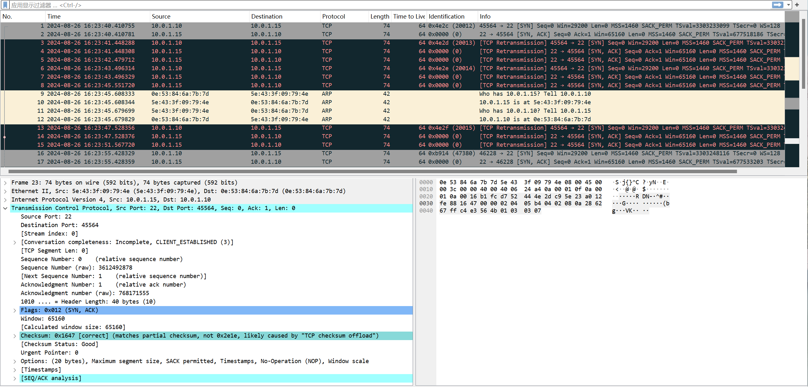
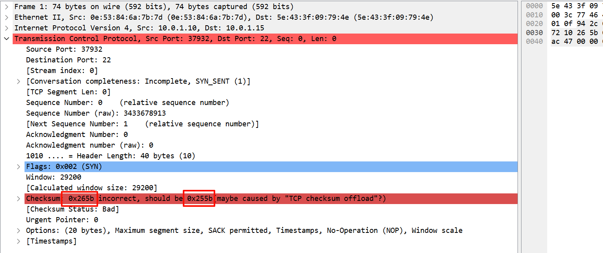

# 前言

前置阅读：[ebpf教程(4.2):bpf map的使用 -- 统计网速-CSDN博客](https://blog.csdn.net/sinat_38816924/article/details/141400532?spm=1001.2014.3001.5501)

在这之前需要掌握ebpf程序的加载，ebpf map的使用。可以参考上面的”前置阅读“。

本文介绍xdp中，数据包的解析与修改。

本文修改自：

- [xdp-tutorial/packet01-parsing/README.org at master · xdp-project/xdp-tutorial](https://github.com/xdp-project/xdp-tutorial/blob/master/packet01-parsing/README.org)
- [xdp-tutorial/packet02-rewriting/README.org at master · xdp-project/xdp-tutorial](https://github.com/xdp-project/xdp-tutorial/blob/master/packet02-rewriting/README.org)

# 端口转发

因为我之前已经知道常见的协议格式：[MAC首部 IP首部 TCP首部介绍-CSDN博客](https://da1234cao.blog.csdn.net/article/details/107558223)

日常工作中，也读过一些数据包解析的代码。所以，在xdp中**简单的**解析和修改数据包没啥难度。

当然数据包的解析是个复杂的事情。除非打我一顿，否则我绝不从头去敲数据包解析的代码。因为这玩意不容易写好。所以，本文的示例，我也没手动敲数据包解析，而是调用了libxdp中的解析函数。

## ebfp 内核代码

`xdp_forward_map `用来存储用户空间配置的端口转发规则，内核应用这个规则。

`xdp_stats_map `用来记录数据包的统计信息。

当数据包从网卡收上来后，逐层解析数据包，检查是否命中规则。如果命中规则，则修改数据包的目标端口号，然后放行数据包。数据包进入协议栈。

```
#include <linux/types.h>

#include <bpf/bpf_helpers.h>
#include <linux/bpf.h>
#include <xdp/parsing_helpers.h>

#include "common.h"

// Port forwarding mapping table
struct {
  __uint(type, BPF_MAP_TYPE_HASH);
  __type(key, unsigned short);
  __type(value, struct data_record);
  __uint(max_entries, 100);
} xdp_stats_map SEC(".maps");

// Record the number of packets from different ports
struct {
  __uint(type, BPF_MAP_TYPE_HASH);
  __type(key, unsigned short);
  __type(value, unsigned short);
  __uint(max_entries, 100);
} xdp_forward_map SEC(".maps");

static __always_inline __u16 csum_incremental_compute(__u16 old_value,
                                                      __u16 new_value,
                                                      __u16 old_csum) {
  __u32 csum = 0;
  csum = ~old_csum + ~old_value + new_value;

  csum = (csum & 0xffff) + (csum >> 16);
  return ~((csum & 0xffff) + (csum >> 16));
}

SEC("xdp")
int xdp_port_forward(struct xdp_md *ctx) {
  void *data_end = (void *)(long)ctx->data_end;
  void *data = (void *)(long)ctx->data;

  struct hdr_cursor nh;
  struct ethhdr *eth;
  struct iphdr *iphdr;
  struct ipv6hdr *ipv6hdr;
  struct udphdr *udphdr;
  struct tcphdr *tcphdr;

  int eth_type;
  int ip_type;

  nh.pos = data;

  /* Parse Ethernet and IP/IPv6 headers */
  eth_type = parse_ethhdr(&nh, data_end, &eth);
  if (eth_type == bpf_htons(ETH_P_IP)) {
    ip_type = parse_iphdr(&nh, data_end, &iphdr);
  } else if (eth_type == bpf_htons(ETH_P_IPV6)) {
    ip_type = parse_ip6hdr(&nh, data_end, &ipv6hdr);
  } else {
    bpf_printk("Current ip type, not processed:%d", ip_type);
    goto out;
  }
  bpf_printk("Current ip type:%d", ip_type);

  if (ip_type == IPPROTO_UDP) {
    bpf_printk("No udp packets are currently being processed");
    goto out;
    // TODO !
  } else if (ip_type == IPPROTO_TCP) {
    if (parse_tcphdr(&nh, data_end, &tcphdr) < 0) {
      bpf_printk("parse_tcphdr failed: insufficient data.");
      goto out;
    }
    bpf_printk("parse_tcphdr success.");

    // Look up the mapping table to determine which port the current data packet
    // should be forwarded to
    unsigned short key = bpf_ntohs(tcphdr->dest);
    unsigned short *forward_port =
        (unsigned short *)bpf_map_lookup_elem(&xdp_forward_map, &key);
    if (forward_port == NULL) {
      bpf_printk("No rules for destination port %d", key);
      goto out;
    }

    bpf_printk("port %d forward to port %d", key, *forward_port);

    // Modify the data packet && recalculate the check sum

    // method 1: self compute incremental csum. failed.
    bpf_printk("old check sum  %d", tcphdr->check);
    // unsigned short old_dest = tcphdr->dest;
    // unsigned short new_dest = bpf_htons(*forward_port);
    // tcphdr->dest = new_dest;
    // tcphdr->check = csum_incremental_compute(old_dest, new_dest,
    // tcphdr->check);

    // method 2: call bpf_csum_diff() compute csum. failed.
    struct tcphdr tcphdr_old;
    tcphdr_old = *tcphdr;
    tcphdr->dest = bpf_htons(*forward_port);
    __u32 csum = bpf_csum_diff((__be32 *)&tcphdr_old, 4, (__be32 *)tcphdr, 4,
                               ~tcphdr->check);
    csum = (csum & 0xffff) + (csum >> 16);
    csum = ((csum & 0xffff) + (csum >> 16));
    tcphdr->check = ~csum;

    bpf_printk("new check sum  %d", tcphdr->check);

    // Recording Statistics
    __u32 bytes = (char *)data_end - (char *)data;
    struct data_record *record = bpf_map_lookup_elem(&xdp_stats_map, &key);
    if (record != NULL) {
      record->rx_packets++;
      record->rx_bytes += bytes;
    } else {
      struct data_record record_tmp = {};
      record_tmp.rx_packets++;
      record_tmp.rx_bytes += bytes;
      if (bpf_map_update_elem(&xdp_stats_map, &key, &record_tmp, 0) < 0) {
        goto out;
      }
    }
  }

out:
  return XDP_PASS;
}

char _license[] SEC("license") = "GPL";
```

## 用户层代码

用户层代码：加载ebpf代码到内核；在 `forward_map_fd` 中写入规则； 从 `stats_map_fd` 中读取统计信息并打印。

```
#include <argp.h>
#include <net/if.h>
#include <signal.h>
#include <stdio.h>
#include <stdlib.h>
#include <time.h>
#include <unistd.h>

#include <bpf/libbpf.h>
#include <xdp/libxdp.h>

#include "common.h"

#define PROG_NAME_MAXSIZE 32
#define NANOSEC_PER_SEC 1000000000 /* 10^9 */

struct main_config {
  char filename[PATH_MAX];
  char prog_name[PROG_NAME_MAXSIZE];
  char ifname[IF_NAMESIZE];
  int ifindex;
  int interval;
};

struct data_record_user {
  unsigned int port;
  struct data_record record;
  struct timespec ts;
};

static struct main_config main_config;
static volatile bool exiting = false;
struct bpf_object *obj = NULL;
int stats_map_fd;
int forward_map_fd;

static int parse_opt(int key, char *arg, struct argp_state *state) {
  switch (key) {
  case 'd':
    snprintf(main_config.ifname, sizeof(main_config.ifname), "%s", arg);
    break;
  case 0:
    main_config.interval = atoi(arg);
    break;
  }
  return 0;
}

static void sig_handler(int sig) { exiting = true; }

int load_bpf_and_xdp_attach() {
  int ret = 0;

  obj = bpf_object__open(main_config.filename);
  if (obj == NULL) {
    perror("bpf_object__open failed");
    exit(EXIT_FAILURE);
  }

  struct xdp_program_opts prog_opts = {};
  prog_opts.sz = sizeof(struct xdp_program_opts);
  prog_opts.obj = obj;
  prog_opts.prog_name = main_config.prog_name;

  struct xdp_program *prog = xdp_program__create(&prog_opts);
  if (prog == NULL) {
    perror("xdp_program__create failed");
    exit(EXIT_FAILURE);
  }

  ret = xdp_program__attach(prog, main_config.ifindex, XDP_MODE_UNSPEC, 0);
  if (ret != 0) {
    perror("xdp_program__attach failed");
    exit(EXIT_FAILURE);
  }

  int prog_fd = xdp_program__fd(prog);
  if (prog_fd < 0) {
    perror("cant get program fd");
    exit(EXIT_FAILURE);
  }

  return prog_fd;
}

static void stats_print(const struct data_record_user *record) {
  /* Print for each XDP actions stats */
  char *fmt = "Port %d %'11lld pkts  %'11lld Kbit\n";

  printf(fmt, record->port, record->record.rx_packets,
         record->record.rx_bytes * 8 / 1000);
}

int map_get_value(int mapfd, __u32 key, struct data_record_user *value) {
  int ret;
  struct data_record record;

  ret = bpf_map_lookup_elem(mapfd, &key, &record);
  if (ret != 0) {
    perror("bpf_map_lookup_elem failed");
    return -1;
  }

  value->port = key;
  value->record.rx_packets = record.rx_packets;
  value->record.rx_bytes = record.rx_bytes;

  ret = clock_gettime(CLOCK_MONOTONIC, &value->ts);
  if (ret != 0) {
    perror("clock_gettime failed");
    return -1;
  }

  return 0;
}

void speed_poll() {

  while (!exiting) {
    __u32 key = 0;
    void *keyp = &key, *prev_keyp = NULL;
    struct data_record_user record = {};
    int err;

    while (bpf_map_get_next_key(forward_map_fd, prev_keyp, keyp) == 0) {
      if (map_get_value(stats_map_fd, key, &record) == 0) {
        stats_print(&record);
      }
      prev_keyp = keyp;
    }
    sleep(main_config.interval);
  }
}

int main(int argc, char *argv[]) {
  int ret = 0;

  memset(&main_config, 0, sizeof(main_config));
  snprintf(main_config.filename, sizeof(main_config.filename), "%s",
           "xdp_prog_kernel.o");
  snprintf(main_config.prog_name, sizeof(main_config.prog_name), "%s",
           "xdp_port_forward");
  main_config.interval = 1;

  struct argp_option options[] = {
      {"dev", 'd', "device name", 0, "Set the network card name"},
      {"interval", 0, "statistical interval", 0,
       "Set the statistical interval"},
      {0},
  };

  struct argp argp = {
      .options = options,
      .parser = parse_opt,
  };

  argp_parse(&argp, argc, argv, 0, 0, 0);

  // check parameter
  int ifindex = if_nametoindex(main_config.ifname);
  if (ifindex == 0) {
    perror("if_nametoindex failed");
    exit(EXIT_FAILURE);
  }
  main_config.ifindex = ifindex;

  // print config
  printf("prog name: %s\n", main_config.prog_name);
  printf("choice dev: %s\n", main_config.ifname);
  printf("%s's index: %d\n", main_config.ifname, ifindex);
  printf("sampling interval for statistics: %d\n", main_config.interval);

  // Clear previous prog
  struct xdp_multiprog *mp = xdp_multiprog__get_from_ifindex(ifindex);
  ret = libxdp_get_error(mp);
  if (!ret) {
    ret = xdp_multiprog__detach(mp);
    if (ret != 0) {
      perror("xdp_multiprog__detach failed.");
      exit(EXIT_FAILURE);
    }
  }

  /* Cleaner handling of Ctrl-C */
  signal(SIGINT, sig_handler);
  signal(SIGTERM, sig_handler);

  int prog_fd = load_bpf_and_xdp_attach();

  struct bpf_map *stats_map =
      bpf_object__find_map_by_name(obj, "xdp_stats_map");
  if (stats_map == NULL) {
    perror("bpf_object__find_map_by_name look for xdp_stats_map failed");
    exit(EXIT_FAILURE);
  }
  stats_map_fd = bpf_map__fd(stats_map);

  struct bpf_map *forward_map =
      bpf_object__find_map_by_name(obj, "xdp_forward_map");
  if (forward_map == NULL) {
    perror("bpf_object__find_map_by_name look for xdp_forward_map failed");
    exit(EXIT_FAILURE);
  }
  forward_map_fd = bpf_map__fd(forward_map);

  // Insert a port forwarding rule
  unsigned short port = 10000;
  unsigned short forward_port = 22;
  ret = bpf_map_update_elem(forward_map_fd, &port, &forward_port, 0);
  if (ret != 0) {
    printf("fail to insert forward rule");
    goto cleanup;
  }

  speed_poll();

cleanup:
  mp = xdp_multiprog__get_from_ifindex(ifindex);
  ret = xdp_multiprog__detach(mp);
  if (ret != 0) {
    perror("xdp_multiprog__detach failed.");
    exit(EXIT_FAILURE);
  }

  bpf_object__close(obj);
}
```

## 公共依赖的头文件

```
#pragma once

#include <linux/bpf.h>
#include <linux/types.h>

struct data_record {
  __u64 rx_packets;
  __u64 rx_bytes;
};
```

## 构建过程

```
cmake_minimum_required(VERSION 3.10)

project(xdp-port-forward)

find_package(PkgConfig)
pkg_check_modules(LIBBPF REQUIRED libbpf)
pkg_check_modules(LIBXDP REQUIRED libxdp)

find_path(ASM_TYPES_H_PATH NAMES asm/types.h PATHS /usr/include/x86_64-linux-gnu)
if(ASM_TYPES_H_PATH)
    message(STATUS "Found asm/types.h at ${ASM_TYPES_H_PATH}")
    include_directories(${ASM_TYPES_H_PATH})
else()
    message(FATAL_ERROR "asm/types.h not found")
endif()

set(BPF_C_FILE ${CMAKE_CURRENT_SOURCE_DIR}/xdp_prog_kernel.c)
set(BPF_O_FILE ${CMAKE_CURRENT_BINARY_DIR}/xdp_prog_kernel.o)
add_custom_command(OUTPUT ${BPF_O_FILE}
    COMMAND clang -g -O2 -target bpf -D__x86_64__ -I${ASM_TYPES_H_PATH} -c ${BPF_C_FILE} -o ${BPF_O_FILE}
    COMMAND_EXPAND_LISTS
    VERBATIM
    DEPENDS ${BPF_C_FILE}
    COMMENT "[clang] Building BPF file: ${BPF_C_FILE}")

add_custom_target(generate_bpf_obj ALL
    DEPENDS ${BPF_O_FILE}
)

add_executable(xdp_load_and_stats xdp_load_and_stats.c)
target_link_libraries(xdp_load_and_stats PRIVATE ${LIBBPF_LIBRARIES} ${LIBXDP_LIBRARIES})
```

## 运行

```
# 启动程序
 ./xdp_load_and_stats --dev=ens19

# 另一台机器(10.0.1.10)，向ens19发起连接
## ens19的ip是10.0.1.15
## ebpf程序会将ens19上的10000端口号，修改为22
ssh root@10.0.1.15 -p 10000

# 用户态输出
...
Port 10000           5 pkts            2 Kbit
Port 10000           5 pkts            2 Kbit
Port 10000           5 pkts            2 Kbit
Port 10000           5 pkts            2 Kbit.
...

# 内核输出
...
 <idle>-0       [004] ..s2. 539155.640667: bpf_trace_printk: Current ip type:6
          <idle>-0       [004] .Ns2. 539155.640673: bpf_trace_printk: parse_tcphdr success.
          <idle>-0       [004] .Ns2. 539155.640675: bpf_trace_printk: port 10000 forward to port 22
          <idle>-0       [004] .Ns2. 539155.640675: bpf_trace_printk: old check sum  37436
          <idle>-0       [004] .Ns2. 539155.640676: bpf_trace_printk: new check sum  35940
          <idle>-0       [004] ..s2. 539156.474322: bpf_trace_printk: Current ip type:6
          <idle>-0       [004] .Ns2. 539156.474333: bpf_trace_printk: parse_tcphdr success.
          <idle>-0       [004] .Ns2. 539156.474335: bpf_trace_printk: port 10000 forward to port 22
          <idle>-0       [004] .Ns2. 539156.474335: bpf_trace_printk: old check sum  61251
          <idle>-0       [004] .Ns2. 539156.474336: bpf_trace_printk: new check sum  59755
          <idle>-0       [004] ..s2. 539157.677078: bpf_trace_printk: Current ip type:6
          <idle>-0       [004] .Ns2. 539157.677091: bpf_trace_printk: parse_tcphdr success.
          <idle>-0       [004] .Ns2. 539157.677094: bpf_trace_printk: port 10000 forward to port 22
          <idle>-0       [004] .Ns2. 539157.677094: bpf_trace_printk: old check sum  35646
          <idle>-0       [004] .Ns2. 539157.677095: bpf_trace_printk: new check sum  34150
....
```

问题是，虽然数据包的端口被修改并喂给了22端口，但是ssh并不能正常运行。即连接了，但是连接不正常。



暂时不管它。因为工作上，暂时不需要用到端口转发。用到时，再说。

# 校验和计算

## 自行计算校验值

上面代码中，我使用了bpf helper 函数 --  `bpf_csum_diff()` 来增量计算校验和。并且校验和计算正确。

可以看到上面还有个函数 `csum_incremental_compute()` 。它也是增量计算校验和。我是根据 [RFC 1624 - Computation of the Internet Checksum via Incremental Update](https://datatracker.ietf.org/doc/html/rfc1624) 敲的代码，但是不知道，为什么，计算出来的值，总是比正确的校验和小1。



`0x265b` 是主机序列，它的网路序是 `0x5b26` 。

`0x255b` 是主机序，它的网络序是 `0x5b25` 。

计算出来的校验值总是比正确的校验值小于一。我不知道为啥。。

## 校验和的更多阅读

自行构建数据包和修改数据包时，都不得不计算或修改校验和。

校验和是一项基本功吧。我知道一个大概。我不想收到敲校验和的代码，遇到的话，还是找个抄抄的号。

校验和的相关内容，可以阅读下面内容：

- [RFC 1071 - Computing the Internet checksum](https://datatracker.ietf.org/doc/html/rfc1071)
- [RFC 1624 - Computation of the Internet Checksum via Incremental Update](https://datatracker.ietf.org/doc/html/rfc1624)
- [解析IPv4和IPv6报文首部校验和算法 | 网络热度](https://www.packetmania.net/2020/11/24/Analyze-IPv4-IPv6-checksum/?highlight=checksum)
