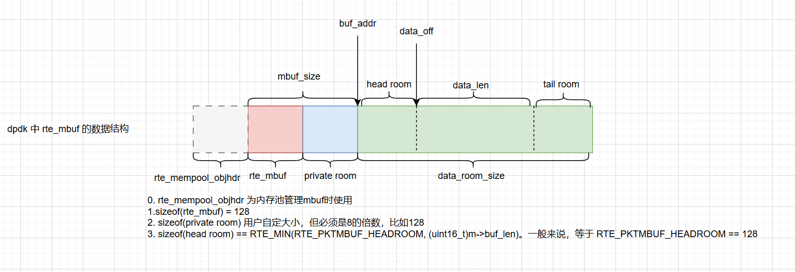
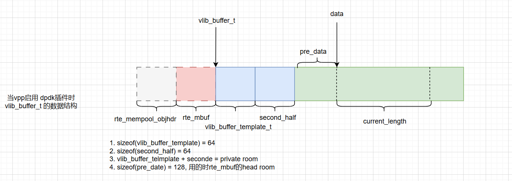

如下图所示，详细内容见源码，可以留意这几个函数

- `VLIB_BUFFER_SET_EXT_HDR_SIZE` ： `vlib_buffer_pool_create` 函数 给 `vlib_buffer_t` 前面添加额外的空间。
- `dpdk_process_rx_burst` ：将 `rte_mbuf` 转换成 `vlib_buffer_t` 。由于数据存储在相同的内存位置，无需移动，代价很小。

这种设计有可取性：在C语言中，操作指针，隐藏不应该显示的部分。
