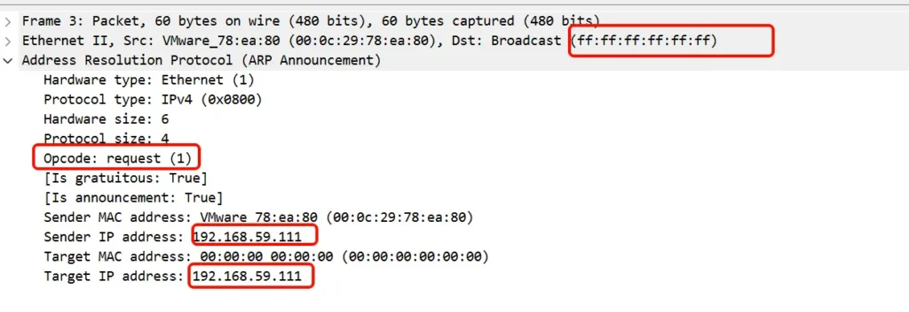
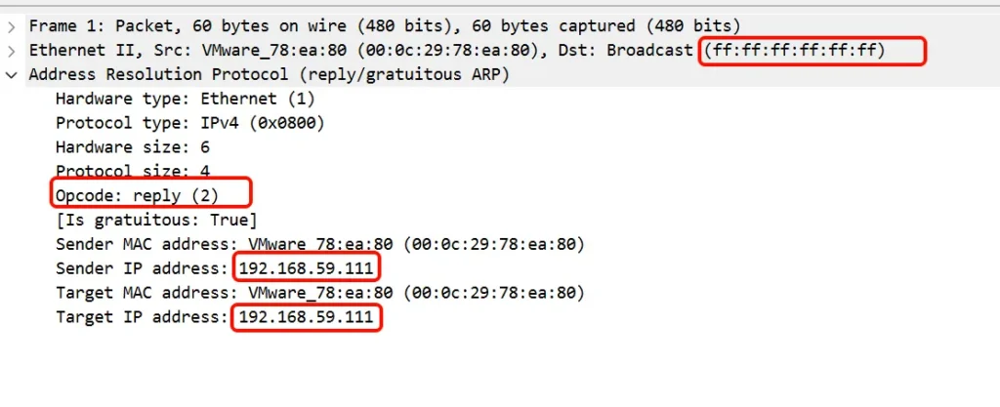

## 前言

在上一篇中([ARP 介绍（一）](arp-introduction.md))，我们介绍 ARP，这一链路层协议，用于将 IP 映射成 MAC，以将使得数据包可以在以太网中传播。

本文，将介绍 APR 的其他应用场景：proxy ARP、gratuitous ARP

注：本文只是概念性的介绍，并未做实验进行验证。

## proxy ARP

相关链接：

1. [RFC 1027 - Using ARP to implement transparent subnet gateways](https://datatracker.ietf.org/doc/html/rfc1027)
2. [了解代理ARP - Cisco](https://www.cisco.com/c/zh_cn/support/docs/ip/dynamic-address-allocation-resolution/13718-5.html)

### 工作流程

工作的环境背景：

1. 如果ARP请求，从一个网络的主机，发往同一网段，但不在同一物理网络上的另一台主机，那么连接这两个网络的设备(路由器)，就可以回答该ARP请求，这个过程称作ARP代理(Proxy ARP)。
2. **路由器接口配置不同网段，主机配置更宽的掩码。主机“以为”对方在同网段，路由器“撒谎”代答 ARP**。

```
┌─────────────────────────────────────────┐
│  主机配置（宽掩码，认为同网段）            │
│  • 主机A: 10.1.1.10 /16                 │
│  • 主机B: 10.1.2.20 /16                 │
│  • 两者计算：10.1.0.0 == 10.1.0.0 ✓     │
└─────────────────────────────────────────┘

┌─────────────────────────────────────────┐
│  路由器配置（窄掩码，实际不同网段）        │
│  • G0/0: 10.1.1.1 /24                   │
│  • G0/1: 10.1.2.1 /24                   │
│  • 开启代理 ARP                          │
└─────────────────────────────────────────┘
```

网络流程：

```
主机 A：通信准备
├─ 用户执行命令：ping 192.168.2.20
├─ 主机 A 计算目标网段：192.168.2.20 & 255.255.0.0
├─ 主机 A 判断：目标 IP 与本机 IP 在同一网段
└─ 主机 A 决策：不走网关，直接发起 ARP 请求

主机 A：发送 ARP 请求
├─ 构造 ARP Request 报文
│ ├─ 发送端 MAC：MAC_A
│ ├─ 发送端 IP：192.168.1.10
│ ├─ 目标端 MAC：00:00:00:00:00:00
│ └─ 目标端 IP：192.168.2.20 (Target IP)
├─ 封装以太网帧
│ └─ 目的 MAC：FF:FF:FF:FF:FF:FF (广播)
└─ 动作：从网卡发出广播报文

路由器：接收与初步检查
├─ 接口 (G0/0) 收到广播帧
├─ 检查目的 MAC：是广播地址 → 接收
├─ 检查协议类型：是 ARP (0x0806)
├─ 解析 ARP 报文：提取 Target IP = 192.168.2.20
├─ 判断 1：Target IP 是否是路由器本机接口 IP？
│ ├─ 是 → 走普通 ARP 响应流程 (回复本机接口 MAC)，流程结束
│ └─ 否 → 如果未开启 proxy arp，丢弃，流程结束。否则，继续判断
│
├─ 判断 2：查询路由表，是否存在通往 192.168.2.20 的路由？
│ ├─ 否 (无路由) → 丢弃报文，流程结束
│ └─ 是 (有路由) → 记录出接口 (例如 G0/1)，继续判断
│
└─ 判断 3：路由出接口 是否等于 收到请求的入接口？
├─ 是 (出接口 == 入接口) → 丢弃报文 (防止环路/次优路径)，流程结束
└─ 否 (出接口 != 入接口) → 满足代理 ARP 条件，进入响应构造

路由器：构造代理 ARP 响应
├─ 构造 ARP Reply 报文
│ ├─ 操作码：设置为 2 (Reply)
│ ├─ 发送端 MAC：设置为入接口 (G0/0) 的 MAC 地址 (关键)
│ ├─ 发送端 IP：设置为 Target IP (192.168.2.20) (冒充目标)
│ ├─ 目标端 MAC：设置为主机 A 的 MAC (MAC_A)
│ └─ 目标端 IP：设置为 主机 A 的 IP (192.168.1.10)
├─ 封装以太网帧
│ └─ 目的 MAC：MAC_A (单播发送，不再广播)
└─ 动作：从入接口 (G0/0) 发送响应报文

主机 A：接收响应并更新缓存
├─ 收到 ARP Reply 单播报文
├─ 验证目标 IP：匹配本机 IP → 接收
├─ 更新 ARP 缓存表
│ ├─ IP 地址：192.168.2.20
│ └─ MAC 地址：路由器的 G0/0 接口 MAC (注意：不是主机 B 的真实 MAC)
└─ 动作：缓存更新完成，开始发送数据

主机 A：发送 ICMP 数据报文
├─ 构造 IP 包
│ ├─ 源 IP：192.168.1.10
│ └─ 目的 IP：192.168.2.20
├─ 封装以太网帧
│ ├─ 源 MAC：MAC_A
│ └─ 目的 MAC：路由器的 G0/0 接口 MAC (基于 ARP 缓存)
└─ 动作：发送数据帧给路由器

路由器：三层数据转发
├─ 接口 (G0/0) 收到数据帧
├─ 检查目的 MAC：匹配本机 → 接收并解封装
├─ 检查目的 IP：192.168.2.20
├─ 查询路由表：匹配到出接口 G0/1，下一跳为直连
├─ 查询 ARP 缓存：是否有 192.168.2.20 的真实 MAC？
│ ├─ 无 → 从 G0/1 接口发起正常 ARP 请求 获取主机 B 的真实 MAC
│ └─ 有 → 直接使用
├─ 重新封装以太网帧
│ ├─ 源 MAC：路由器 G0/1 接口 MAC
│ ├─ 目的 MAC：主机 B 的真实 MAC
│ ├─ 源 IP：192.168.1.10 (保持不变)
│ └─ 目的 IP：192.168.2.20 (保持不变)
└─ 动作：从 G0/1 接口转发给主机 B

主机 B：接收数据
├─ 收到数据帧
├─ 检查目的 MAC：匹配本机 → 接收
├─ 检查目的 IP：192.168.2.20 → 匹配
└─ 动作：上交 ICMP 协议栈，准备回复 Ping
```

代价：主机 A ARP 表中，10.1.2.20 的 MAC 地址是路由器的 MAC（不是 B 的真实 MAC）。

### 动机

看完 proxy arp 流程后，我们的第一反应可能是，proxy arp 是一种善意的 arp 欺骗。

为什么需要 proxy arp？它有什么应用场景？

1. 让主机在无需感知子网存在的前提下，实现跨物理网络的通信。（主机的子网掩码配置的很宽）
2. 正常稳定运行的情况下，完全不需要 proxy arp？不同物理网络上的机器，就应该使用不同的网段，正常的走路由？
3. 没见过的网络场景，了解下即可。

## gratuitous ARP

gratuitous ARP（GARP， 免费 ARP）没有专门的独立 RFC 文档。

[RFC 5227 - IPv4 Address Conflict Detection](https://datatracker.ietf.org/doc/html/rfc5227) 是最接近 "gratuitous ARP 规范" 的文档。

但是，本文并不想涉及 IP 的冲突检测。

本文，仅仅简单介绍 gratuitous ARP 的基本概念。

### 基本概念

gratuitous ARP 的含义：设备未经请求而发送的 ARP 广播消息，用于向本地网络通告其 IP 地址到 MAC 地址的映射关系。

gratuitous ARP 的特征：

1. ARP 数据包中的源 IP 地址和目标 IP 地址，设置为发送方自身的 IP 地址。
2. 目标 MAC 地址是广播地址（FF:FF:FF:FF:FF:FF）
3. 它不是对传统 ARP 请求的响应；它是主动发送的。

gratuitous ARP 的作用：

1. 当设备启动或加入网络时，它会发送一个请求类型的 gratuitous ARP。如果收到回复，则表明该 IP 地址已被其他设备占用。
2. 如果更换了网络接口卡，设备会使用 gratuitous ARP， 通知其他设备使用新的 MAC 地址更新其 ARP 表。

### 试验

#### 设备启动的时候可以发送一个gratuitous ARP

```
# 机器A上，开启arp_notify，然后down/up 网卡

root@localhost ~/tmp# ip a
2: ens160: <BROADCAST,MULTICAST,UP,LOWER_UP> mtu 1500 qdisc mq state UP group default qlen 1000
    link/ether 00:0c:29:78:ea:80 brd ff:ff:ff:ff:ff:ff
    altname enp3s0
    inet 192.168.59.111/23 brd 192.168.59.255 scope global dynamic noprefixroute ens160

root@localhost ~/tmp# sysctl -a | grep arp_notify | grep ens160
net.ipv4.conf.ens160.arp_notify = 0
root@localhost ~/tmp# sysctl -w net.ipv4.conf.ens160.arp_notify=1
net.ipv4.conf.ens160.arp_notify = 1

root@localhost ~/tmp# ip link set ens160 down
root@localhost ~/tmp# ip link set ens160 up
```

在同一广播域下的另一台设备上抓包。



#### gratuitous ARP 可以是 reply 类型

使用 [arping(8)](https://man7.org/linux/man-pages/man8/arping.8.html)命令，发送一个 reply opcode 的 gratuitous ARP。

```
root@localhost ~# arping -A -c 1 -I ens160 192.168.59.111
```

在同一广播域下的另一台设备上抓包。



## arp 行为控制参数

上面只介绍了两种。我们可以在 kernel.org/doc/Documentation/networking/ip-sysctl.txt 中，查看 kernel arp 总共有哪些控制参数。

```
root@localhost ~# sysctl -a | grep arp
net.ipv4.conf.all.arp_accept = 0
net.ipv4.conf.all.arp_announce = 0
net.ipv4.conf.all.arp_filter = 0
net.ipv4.conf.all.arp_ignore = 0
net.ipv4.conf.all.arp_notify = 0
net.ipv4.conf.all.drop_gratuitous_arp = 0
net.ipv4.conf.all.proxy_arp = 0
net.ipv4.conf.all.proxy_arp_pvlan = 0
net.ipv4.conf.default.arp_accept = 0
net.ipv4.conf.default.arp_announce = 0
net.ipv4.conf.default.arp_filter = 0
net.ipv4.conf.default.arp_ignore = 0
net.ipv4.conf.default.arp_notify = 0
net.ipv4.conf.default.drop_gratuitous_arp = 0
net.ipv4.conf.default.proxy_arp = 0
net.ipv4.conf.default.proxy_arp_pvlan = 0
net.ipv4.conf.ens160.arp_accept = 0
net.ipv4.conf.ens160.arp_announce = 0
net.ipv4.conf.ens160.arp_filter = 0
net.ipv4.conf.ens160.arp_ignore = 0
net.ipv4.conf.ens160.arp_notify = 0
net.ipv4.conf.ens160.drop_gratuitous_arp = 0
net.ipv4.conf.ens160.proxy_arp = 0
net.ipv4.conf.ens160.proxy_arp_pvlan = 0
```

### 作用范围

可以看到，对于同一个控制参数，又分为了三类：`default`、`all`、`<ifname>`

`default` 一个网卡在新建的时候，使用的默认值。

`all`是一份全局配置。在运行的时候，和接口的值进行组合运算。组合的方式有三种：

| 组合方式 | 直觉 |
| --- | --- |
| AND | `all` 和接口 都为真 才为真（更严） |
| OR | 任一为真 即为真（更宽） |
| MAX | 取两者较大 |

`<ifname>`该接口自己的配置。

### 控制参数

找 AI 生成下，这些参数的作用。

| 参数 | 控制方向 | 作用 | 典型问题 |
| --- | --- | --- | --- |
| arp_ignore | 入站 | 是否响应ARP | ARP Flux |
| arp_announce | 出站 | ARP源IP选择 | IP混乱 |
| arp_filter | 入站 | 基于路由过滤 | 错误响应 |
| arp_accept | 入站 | 接收GARP | ARP欺骗 / VIP |
| arp_notify | 出站 | 发送GARP | IP变更通知 |
| drop_gratuitous_arp | 入站 | 丢弃GARP | ARP攻击 |
| proxy_arp | 入站+出站 | 代理ARP | 子网通信 |

### arp_ignore

这里这看一个 `arp_ignore` 。其他的参数，也不想挨个去看了。

它的源码位于：[linux/net/ipv4/arp.c at master · torvalds/linux](https://github.com/torvalds/linux/blob/master/net/ipv4/arp.c)

```
#define IN_DEV_ARP_IGNORE(in_dev)	IN_DEV_MAXCONF((in_dev), ARP_IGNORE)

static int arp_ignore(struct in_device *in_dev, __be32 sip, __be32 tip)
{
	struct net *net = dev_net(in_dev->dev);
	int scope;

	switch (IN_DEV_ARP_IGNORE(in_dev)) {
	case 0:	/* Reply, the tip is already validated */
		return 0;
	case 1:	/* Reply only if tip is configured on the incoming interface */
		sip = 0;
		scope = RT_SCOPE_HOST;
		break;
	case 2:	/*
		 * Reply only if tip is configured on the incoming interface
		 * and is in same subnet as sip
		 */
		scope = RT_SCOPE_HOST;
		break;
	case 3:	/* Do not reply for scope host addresses */
		sip = 0;
		scope = RT_SCOPE_LINK;
		in_dev = NULL;
		break;
	case 4:	/* Reserved */
	case 5:
	case 6:
	case 7:
		return 0;
	case 8:	/* Do not reply */
		return 1;
	default:
		return 0;
	}
	return !inet_confirm_addr(net, in_dev, sip, tip, scope);
}
```

不能看懂它的源码，但是对于这个参数的使用，可以猜测八九不离十。

- 配置有效是采用 MAX 的方式进行运算。
- 0 ：默认行为，总是回复 arp 。
- 1 ：arp 包中的 tip 字段， 配置在收包的这个网卡上，才回复
- 2：(arp 包中的 tip 字段， 配置在收包的这个网卡上) && (sip 和 tip 在同一个网段)
- 3：scope 为 host 的 不回复。（这里涉及到，IP scope 分为 host(自己用), link(二层使用，不可路由), global(可路由)，是地址属性。为什么要有这个属性标签？它又是怎么用的？不知道，哪天查查。）
- 4,5,6,7：保留，和 0 是等效。
- 8：不回复 arp
