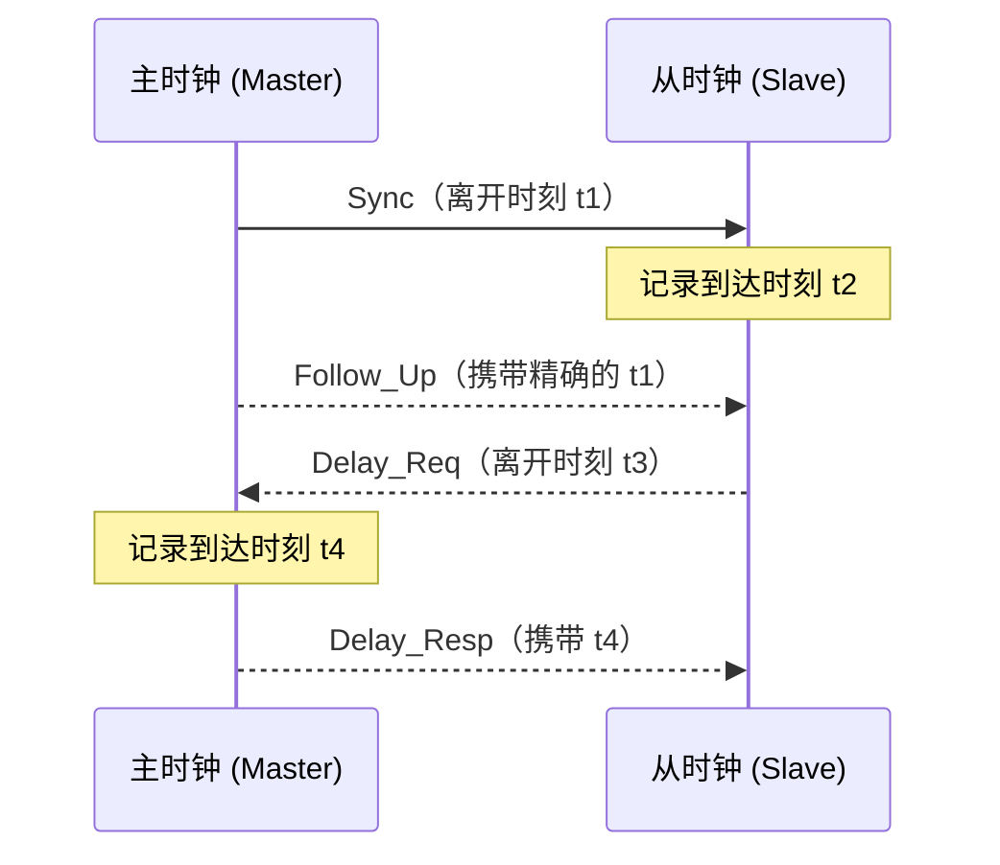
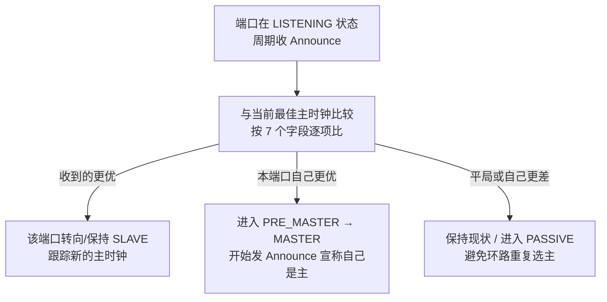
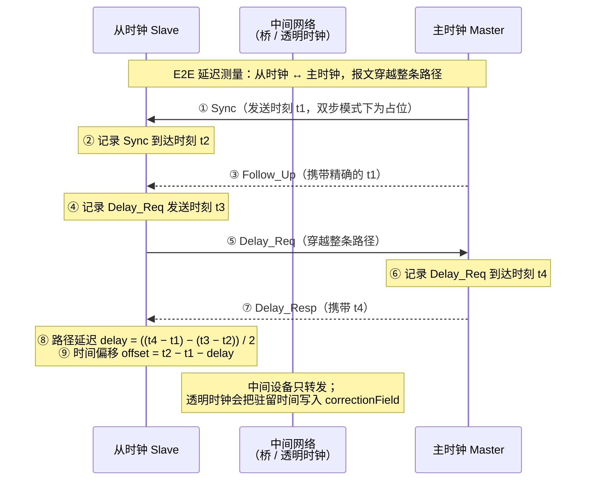
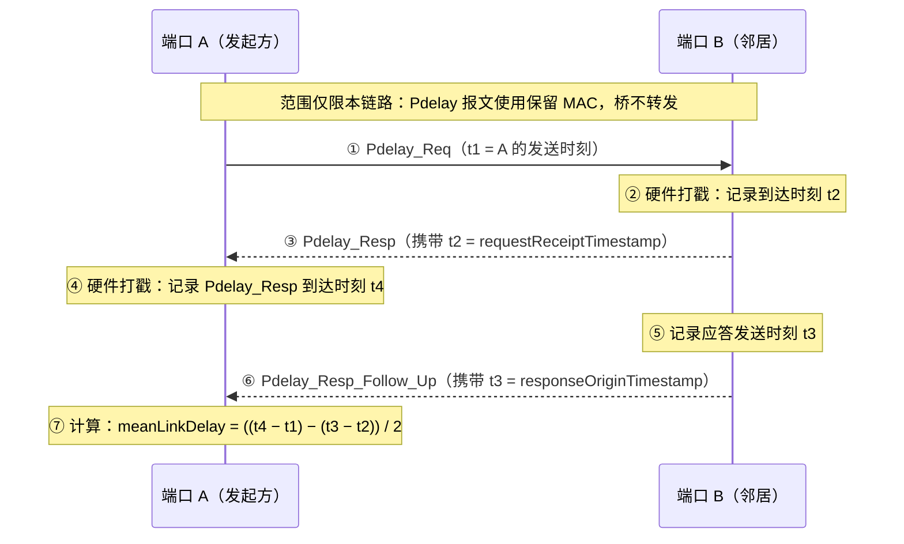

## 背景介绍：时间敏感网络

普通以太网是"尽力而为"的。数据到交换机后要排队，遇到拥塞就延迟甚至丢弃，谁先谁后完全看运气。这对普通上网没问题，但对运动控制、机器人、工业现场总线这类业务是致命的 —— 它们要求数据在微秒到毫秒级内"按时必达"。

TSN (Time-Sensitive Networking，时间敏感网络) 的目标，是让普通以太网，从"尽力而为"变成"确定性"网络：可预测的延迟上界、极低的抖动、零丢包和全网统一时钟。它用三大支柱解决这个问题：
1. 时间同步 —— 全网先用同一把尺子量时间
2. 流量调度与整形 —— 给关键流量开"绿灯"，保证准时到达
3. 可靠性与冗余 —— 关键流量走双路径，一条断了另一条顶上

[IEEE 1588-2019](https://standards.ieee.org/ieee/1588/6825/) 标准中，定义的 PTP (Precision Time Protocol) 协议，使用数据包，对网络中的时钟，进行同步。


## PTP 协议简介

了解下，大概是咋回事就行。毕竟也不用手撸 PTP 协议。那天需要手撸协议了，再考虑具体的报文字段，报文协商过程，也不迟。

### IEEE 1588 基本原理

IEEE 1588（PTP，Precision Time Protocol）是一套让网络中各个设备把本地时钟同步到微秒、甚至亚微秒级精度的协议。

它的核心思路很简单：选一个主时钟（Grandmaster），其余从时钟（Slave）通过报文交换，校正自己的本地时间。

以最常用的 end-to-end 方式为例，主从之间周期性交换四类报文：





- Sync / Follow_Up：主时钟周期性发送 Sync，从时钟记下收到它的精确时刻 t2。单步模式下 Sync 自己带 t1；双步模式（更常用）则由紧随其后的 Follow_Up 报文携带精确的 t1。
- Delay_Req / Delay_Resp：从时钟主动发起一次往返测量，记录自己发出 Delay_Req 的时刻 t3，主时钟收到后记录 t4，并通过 Delay_Resp 把 t4 告诉从时钟。

从时钟拿到 t1、t2、t3、t4 后，先算链路延迟：

```
delay = ((t4 - t1) - (t3 - t2)) / 2
```

再算与主时钟的时间偏移：

```
offset = t2 - t1 - delay
```

然后把自己的本地时钟调整 offset 这么多即可。

这里隐含一个假设：主到从和从到主的传播延迟是对称的，这也是实际部署中要保证链路对称的原因。

### 时钟类型

PTP 里的"时钟类型"定义的是设备在网络同步拓扑中扮演的角色。

IEEE 1588 定义了三种基本类型：普通时钟（OC）、边界时钟（BC）、透明时钟（TC）。

另外"主时钟（Grandmaster）"不是一个设备类型，而是一个由 BMCA 选出来的角色。见下一节介绍。

#### 普通时钟 (Ordinary Clock)

- 一个 PTP 端口，要么做主（Master），要么做从（Slave），不能同时两个角色。
- 端点设备基本都是 OC：传感器、控制器、服务器、测试仪器等。
- 作为从钟时，它接收上游 Sync 并计算 offset/delay；作为主钟时，它向下游发布时间。
- 因为只有一个端口，OC 无法"边收边发"，所以不支持级联（要级联就得用 BC）。

#### 边界时钟 (Boundary Clock)

- 多个 PTP 端口，可以同时在上游端口做从、在下游端口做主。
- 典型设备是交换机/路由器/桥。它对上游的同步报文"终结"：作为从钟同步到上游主时钟，然后在自己的每个下游端口重新生成 Sync/Follow_Up 等报文（重新打时间戳、重新走一轮协议）

#### 透明时钟 (Transparent Clock)

- 不终结同步报文，也不参与主从角色和 BMCA。它像一个"透明管道"：收到 Sync 后原样转发，但会测量报文在自己设备里的驻留时间（residence time），并把这个时间累加进报文的 correctionField。

### 如何选举出主时钟

（有点像 OSPF 协议）

主时钟（Grandmaster，GM）的选举靠 BMCA（Best Master Clock Algorithm，最佳主时钟算法）。它的思路是：每个 PTP 端口周期性地通过 Announce 报文广播自己眼中的"最佳主时钟信息"，收到后逐条比较，最终全网收敛到同一个最优时钟作为 GM。选举不是集中式的，每个端口独立做比较，然后靠协议收敛出唯一结果。

Announce 报文携带一组"主时钟数据集"，BMCA 按固定顺序逐项比较，越靠前的字段越优先，能分出胜负就不再往后比：

| 顺序  | 字段                      | 规则       | 典型含义                                            |
| --- | ----------------------- | -------- | ----------------------------------------------- |
| 1   | priority1               | 越小越好     | 管理员手工指定，用于强制某台设备当选（默认 128）                      |
| 2   | clockClass              | 越小越好     | 时钟同步状态：6≈锁定 GNSS、7≈锁定原子钟、52≈自由振荡、248≈默认、255≈纯从钟 |
| 3   | clockAccuracy           | 越小越好     | 时钟精度等级（如 0x21≈25ns、0x22≈100ns、0x32≈未知）          |
| 4   | offsetScaledLogVariance | 越小越好     | 时钟稳定度/方差                                        |
| 5   | priority2               | 越小越好     | 第二级手工优先级                                        |
| 6   | stepsRemoved            | 越小越好     | 距 GM 的跳数，越近越优                                   |
| 7   | grandmasterIdentity     | **越大越好** | 最后确定性裁决（由时钟 ID 派生，纯打破平局）                        |

所以直观理解：管理员想钦定谁当主 → 调 priority1；没有人为干预 → 比谁的时间源更权威（clockClass）、更准（clockAccuracy）、更稳（方差）；都相同 → 比谁离源头近（stepsRemoved）；还相同 → 按时钟 ID 大小定胜负。



几个关键机制：

- Announce 超时重选：每个端口维护 `announceReceiptTimeout`（通常 3 个公告周期）。如果主时钟突然失联、Announce 超时，端口回到 LISTENING 重新参与选举，网络自动收敛到下一个最优时钟。
- stepsRemoved 逐跳加一：边界时钟每转发一跳，Announce 里的 stepsRemoved 就加 1，所以从钟能知道 GM 离自己多远，BMCA 也会优先选"更近的"主。
- PASSIVE 状态：在有冗余路径的桥接网络中，非根路径的端口会进入 PASSIVE，只接收不发送，防止同一网络里出现多个互相竞争的主时钟。
- slave-only 设备：clockClass=255 且配置为纯从钟的设备永远不会当选 GM，只做消费者。
- 多域独立选举：每个 domainNumber 是一个独立的同步域，各自选自己的 GM，互不干扰。

### PTP 报文格式

见：[IP报文格式大全 - 华为](https://support.huawei.com/enterprise/zh/doc/EDOC1100174722/7631975b)

PTP 消息有两种格式：
- 一种是，over Ethernet ，其帧头中以太类型值=0x88F7。在实际应用中还可能携带VLAN。
- 一种是，over UDP，事件消息头的UDP目的端口号是319，通用消息的UDP目的端口号是320。

### PTP协议的两种传输延时测量机制：请求应答（Request-Response）和端延时（Peer Delay）

请求应答（Request-Response，也叫 E2E）：从时钟和主时钟之间做一次端到端测量。Delay_Req 要从从钟一路穿过中间网络到达主钟，主钟记录 t4 再回 Delay_Resp。测出来的是"从钟到主钟整条路径"的总延迟。



端延时（Peer Delay，P2P）：每两个直接相连的端口之间各自独立测量，测的只是自己这条物理链路的延迟。Pdelay 报文有明确的特征：绝不被桥转发，只在相邻两个端口之间打一个来回（这也是为什么它用链路本地组播地址 01-80-C2-00-00-0E）。




## gPTP 介绍

gPTP（Generalized Precision Time Protocol，通用精确时间协议）就是 IEEE 802.1AS 标准定义的时间同步协议——它是 IEEE 1588 在 TSN/桥接以太网里的专用 profile，也是整个 TSN 体系的时间基础。可以把它理解成"为确定性网络改造过的 1588"。


- 每个桥都是边界时钟（Boundary Clock）
    - 同步是逐跳接力的：每台时间感知桥在上游端口做从钟，同步到上游；再在自己的下游端口重新生成 Sync，当主钟。误差不会跨多跳无界累积，每跳都重新校准一次。
- 每条链路独立做 Peer Delay 测量
    - 相邻两个端口之间用 `Pdelay_Req/Resp/Resp_Follow_Up` 测量本段链路延迟（meanLinkDelay），同时算出相邻节点间的频率比（neighborRateRatio）。gPTP 只用 P2P 机制，不用 1588 的 E2E（Delay_Req/Resp）。每段链路测完，路径延迟就是各段之和，拓扑变化只影响变化的那条链路。
- 精简的报文集和固定参数
    - 只用 Announce、Sync、Follow_Up、Pdelay_Req/Resp/Resp_Follow_Up、Signaling 七种报文，没有 Management 报文和 E2E 报文。默认参数按 802.1AS 固定：同步间隔 125 ms、Pdelay 间隔 1 s、Announce 间隔 1 s，域号 0。这保证了"即插即用"，不需要像通用 1588 那样逐个配置。
- gPTP 专用 BMCA
    - 选主算法沿用 1588 的 BMCA 但参数固定（priority1/priority2 用默认值），所以 GM 的选定主要由 clockClass（是否锁定 GNSS/原子钟）和时钟质量决定，减少人工干预。Announce 报文里同时携带 UTC 偏移和闰秒信息——gPTP 内部用 TAI 时标，UTC 由接收方按偏移换算。
- 依赖硬件时间戳
    - gPTP 的精度建立在硬件时间戳上：Sync 发送/接收瞬间由网卡 PHC 打戳，双步模式用 Follow_Up 携带精确时间。纯软件时间戳跑 gPTP 通常达不到 TSN 需要的精度。
- 为什么不用透明时钟透传，而是要求每台桥都是边界时钟？
    - 透传把"全路径的测量误差"打包交给了下游：透明时钟测驻留时间的误差会逐跳累加，跳数越多，下游要消化的误差越大。
    - 边界时钟把误差切碎到每一跳、各自消化：每跳都重新同步、重新生成 Sync，上一跳的同步误差不会被带入下一跳，端到端误差不再逐跳累加。代价是更高的硬件成本。

## 相关链接
- [IEEE 1588 basic overview](https://docs.nxp.com/bundle/AN12149/page/topics/ieee_1588_basic_overview.html)
- [25-PTP配置-新华三集团-H3C](https://www.h3c.com/cn/d_202304/1838002_30005_0.htm)
- [IP报文格式大全 - 华为](https://support.huawei.com/enterprise/zh/doc/EDOC1100174722/7631975b)
