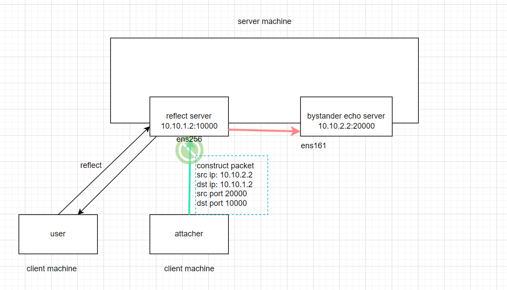
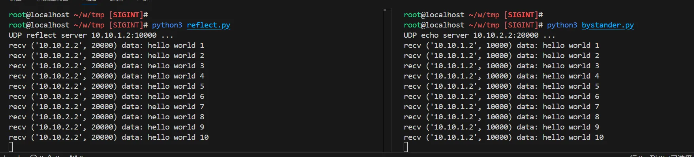

# 原理介绍

相关链接：

- [2.2.11. Reverse Path Forwarding Red Hat Documentation](https://docs.redhat.com/en/documentation/red_hat_enterprise_linux/6/html/security_guide/sect-security_guide-server_security-reverse_path_forwarding)
- [RFC 3704 - Ingress Filtering for Multihomed Networks](https://datatracker.ietf.org/doc/html/rfc3704)
- [Linux内核参数之rp_filter - 知乎](https://zhuanlan.zhihu.com/p/414499521)

`rp_filter`，即 Reverse Path filtering（反向路径过滤），是 Linux 系统中的一个内核参数，用于增强网络安全性。

我们可以通过 `sysctl`命令查看改参数的设置情况。

```
root@localhost ~# sysctl -a | grep rp_filter
net.ipv4.conf.all.arp_filter = 0
net.ipv4.conf.all.rp_filter = 1
net.ipv4.conf.default.arp_filter = 0
net.ipv4.conf.default.rp_filter = 1
net.ipv4.conf.ens160.arp_filter = 0
net.ipv4.conf.ens160.rp_filter = 1
net.ipv4.conf.ens161.arp_filter = 0
net.ipv4.conf.ens161.rp_filter = 1
net.ipv4.conf.ens224.arp_filter = 0
net.ipv4.conf.ens224.rp_filter = 1
net.ipv4.conf.ens256.arp_filter = 0
net.ipv4.conf.ens256.rp_filter = 1
net.ipv4.conf.lo.arp_filter = 0
net.ipv4.conf.lo.rp_filter = 1
```

其主要作用是，根据数据包的源IP地址，检查数据包是否可以从正确的接口出去，以此来决定，是否允许该数据包继续被处理或转发。这个机制有助于防止IP欺骗攻击，并减少不必要的路由问题。

**它可以防止通过一个接口进入的包通过另一个接口离开**。也存在出站路由和入站路由不同的场景，有时也被称为非对称路由。路由器通常会以这种方式路由数据包，但大多数主机不需要这样做。我们的主机通常是，数据包从一个接口进来，再从该接口出去。

我们可以通过 `sysctl`命令修改这个参数。如果需要使修改在重启后仍然生效，需要修改 `/etc/sysctl.d/`下的文件。具体操作可参考：[sysctl - Arch Linux 中文维基](https://wiki.archlinuxcn.org/wiki/Sysctl)

```
sysctl -w net.ipv4.conf.ens161.rp_filter=0
sysctl -w net.ipv4.conf.ens161.rp_filter=1
sysctl -w net.ipv4.conf.ens161.rp_filter=2
```

- 0 - 关闭 rp_filter，不对数据包进行反向路径检测。
- 1 - 开启严格的模式。使用源 IP 地址，查找路由表，查看对应的出口。判断当前进入的接口，和未来出去的接口，是不是同一个。
- 2- 宽松模式。通过路由，至少有一个接口可以到达这个源地址。即使这个数据包，并不是从当前进入的接口出去，该数据包也会被接受。

# 实验

我先介绍下图的角色。

reflect server: 在 `10.10.1.2:10000`上启动了一个反射服务，反射收到的任何 UDP 数据包。

bystander echo server: 在 `10.10.2.2:20000`上启动了一个 echo 服务，它会打印收到的数据包。

attacher：是个坏家伙。它将构造结构的数据包，并发送给 reflect server。reflect server 收到数据包后，把这个数据包反射给了bystander echo server。

上面这个过程，模仿了 DDOS 攻击。DDOS 攻击者，构造随机的 src ip 数据包，并攻击服务器。服务器又将流量给扩散出去了。

而 rp_filter 可以抑制上面的扩散过程。



首先配置下网络。

```
ip addr add 10.10.1.2/24 dev ens256
ip addr add 10.10.2.2/24 dev ens161

default via 192.168.38.1 dev ens160 proto dhcp src 192.168.38.248 metric 100 
10.10.1.0/24 dev ens256 proto kernel scope link src 10.10.1.2 
10.10.2.0/24 dev ens161 proto kernel scope link src 10.10.2.2 
192.168.38.0/23 dev ens160 proto kernel scope link src 192.168.38.248 metric 100
```

然后关闭下 rp_filter。

```
sysctl -w net.ipv4.conf.all.rp_filter=0
sysctl -w net.ipv4.conf.ens161.rp_filter=0
sysctl -w net.ipv4.conf.ens256.rp_filter=0
```

这是 reflect server: 在 `10.10.1.2:10000`上的反射服务。

```
import socket

def udp_echo_server(bind_ip, port):
    server_socket = socket.socket(socket.AF_INET, socket.SOCK_DGRAM)
    server_socket.setsockopt(socket.SOL_SOCKET, socket.SO_REUSEADDR, 1)

    try:
        server_socket.bind((bind_ip, port))
        print(f"UDP reflect server {bind_ip}:{port} ...")

        while True:
            data, client_address = server_socket.recvfrom(1024)
            print(f"recv {client_address} data: {data.decode('utf-8', errors='replace')}")
            server_socket.sendto(data, client_address)
    except Exception as e:
        print(f"err: {e}")
    finally:
        server_socket.close()

if __name__ == "__main__":
    udp_echo_server("10.10.1.2", 10000)
```

这是bystander echo server 在 `10.10.2.2:20000`上的 echo 服务。

```
import socket

def udp_echo_server(bind_ip, port):
    server_socket = socket.socket(socket.AF_INET, socket.SOCK_DGRAM)
    server_socket.setsockopt(socket.SOL_SOCKET, socket.SO_REUSEADDR, 1)

    try:
        server_socket.bind((bind_ip, port))
        print(f"UDP echo server {bind_ip}:{port} ...")

        while True:
            data, client_address = server_socket.recvfrom(1024)
            print(f"recv {client_address} data: {data.decode('utf-8', errors='replace')}")
    except Exception as e:
        print(f"err: {e}")
    finally:
        server_socket.close()

if __name__ == "__main__":
    udp_echo_server("10.10.2.2", 20000)
```

attacher 构造数据包，并发送给 reflect server。

```
from scapy.all import Ether, IP, UDP, Raw, sendp, RandShort
import time

def send_udp_packets(iface, dst_ip, dst_port, num_packets=10):
    for i in range(num_packets):
        eth_layer = Ether(src="00:0c:29:78:ea:9e", dst="00:0c:29:78:ea:94")

        ip_layer = IP(src="10.10.2.2", dst=dst_ip)
        
        udp_layer = UDP(sport=20000, dport=10000)
        
        payload = Raw(load=f"hello world {i+1}")
        
        packet = eth_layer / ip_layer / udp_layer / payload
        
        sendp(packet, iface=iface, verbose=False)
        
        print(f"Sent packet {i+1}: {packet.summary()}")
        time.sleep(0.1)  

if __name__ == "__main__":
    interface = "ens256"
    
    send_udp_packets(interface, "10.10.1.2", 8080, 10)
```

然后我们即可看到，恶意的数据包，从 reflect server 扩散给了 bystander echo server 。



当我们再启用 `net.ipv4.conf.all.rp_filter`后，即可抑制这个扩散。

（只有 all.fp_filter 和 ens256.rp_filter 均设置为 0 时，ens256 的rp_filter才能关闭。all.fp_filter =1， ens256.rp_filter = 0，ens256 的rp_filter 关不掉。 可能是因为，内部是做或运算的，只有两者都为0才能关掉。）

# 最后：系统计数

有时候我们不知道这个 rp_filter 参数。我们不知道包为什么没有收到。

这时候，我们可以看看和网络相关的系统计数。

比如，我们可以看看和 rp_filter 相关的计数。

我们可以使用 netstat 命令查看。 `netstat -s` 从 `/proc/net/netstat` 中读取的统计数据。

```
root@localhost ~# netstat -s | grep -i filter
    IPReversePathFilter: 161
root@localhost ~# sysctl -w net.ipv4.conf.all.rp_filter=1
net.ipv4.conf.all.rp_filter = 1
root@localhost ~# netstat -s | grep -i filter
    IPReversePathFilter: 171
```
