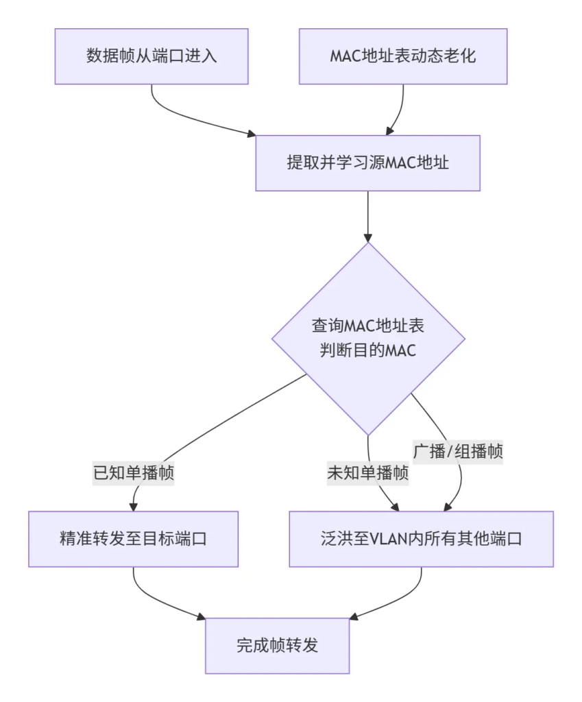
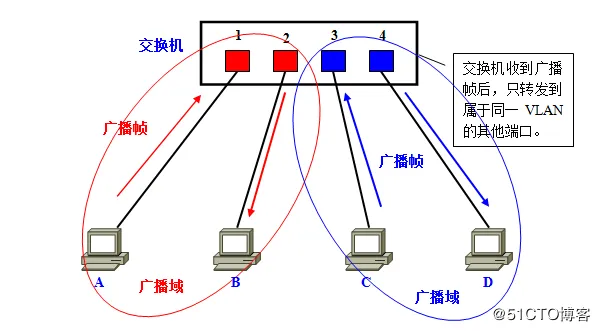
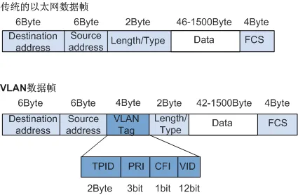
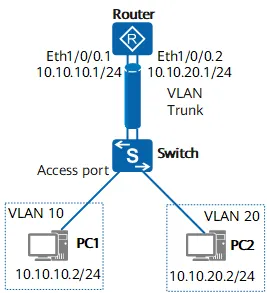
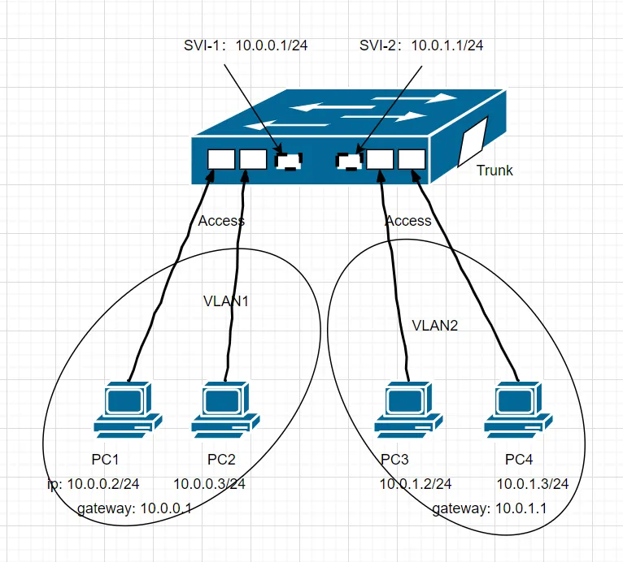
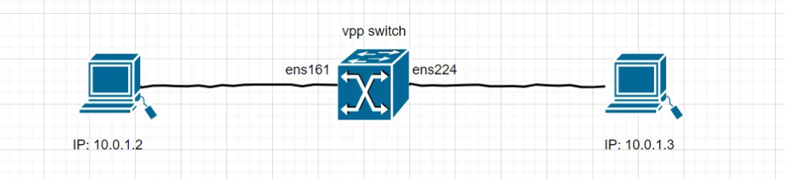
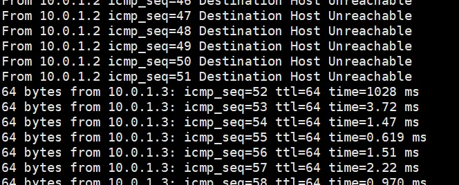

注：我没在参与过，生产场景下，交换机的开发和维护，所以有点纸上谈兵。当年的计算机网络课程，也学的稀烂，就当补补课吧。

# 交换机简介

## 二层交换机

~~找 AI，抄抄答案。~~

二层交换机是工作在OSI模型第二层（数据链路层）的网络设备，其核心功能是基于MAC地址，在局域网内进行以太网帧的快速交换。其工作原理可以概括为三个核心机制：**学习、转发/过滤、泛洪**，并辅以MAC地址表老化机制和防止环路的生成树协议。

为了直观展示数据帧在二层交换机内的处理逻辑，下图描绘了其完整的工作流程：



下面，我们详细解析这一流程中的关键步骤与技术特点。

MAC地址学习**：**

- 当交换机从一个端口收到一个以太网帧时，会解析出该帧的源MAC地址。
- 随后，它会将这对“MAC地址-端口”的映射关系，作为一个条目记录在内部的MAC地址表（也称转发表）中。
- 如果该MAC地址已存在于表中，交换机则会刷新其老化时间。这个过程是动态和自动的。

转发/过滤与泛洪：

- 完成源地址学习后，交换机在 MAC地址表中，查询目的MAC地址对应的端口。
- 已知单播帧：若在地址表中找到对应的端口，交换机会将数据帧仅转发到该特定端口。(目的MAC地址，所对应的端口，正是这个数据帧进入交换机的那个端口)
- 未知单播帧：若目的MAC地址在地址表中没有对应条目，交换机会执行泛洪，将帧发送到（同一VLAN内的）所有其他端口（接收端口除外），以确保目标设备能收到此帧。
- 广播/组播帧：处理过程，和未知单播帧相同。

## VLAN 介绍

下面部分图文，来自链接：

- [图文并茂VLAN详解，让你看一遍就理解VLAN-腾讯云开发者社区-腾讯云](https://cloud.tencent.com/developer/article/1412795)
- [IEEE 802.1Q封装的VLAN数据帧格式 - 华为](https://support.huawei.com/enterprise/zh/doc/EDOC1100088136/34cc009b)
- [配置子接口实现VLAN间通信的示例 - NetEngine AR600, AR6100, AR6200, AR6300 典型配置案例（命令行） - 华为](https://support.huawei.com/enterprise/zh/doc/EDOC1100130778/516eb78d)

### 为什么要有 VLAN

VLAN 的核心作用，是通过逻辑（而非物理）方式，将一个大的物理局域网，划分为多个独立的广播域。

如果整个网络只有一个广播域，那么一旦发出广播信息，就会传遍整个网络，并且对网络中的主机带来额外的负担。



VLAN的划分依据：VLAN的创建非常灵活，可以根据不同策略划分：

- 基于端口：最常用、最简单的方式。将交换机的特定端口静态地分配给一个VLAN。连接在该端口上的所有设备都属于这个VLAN
- 基于MAC地址：根据设备的MAC地址动态划分。即使设备更换了物理端口，只要连接到交换机，仍会自动归属到其VLAN，安全性高但初期配置复杂。
- 基于IP子网：根据设备的IP地址进行划分。适用于对管理简便性要求较高的场景，当用户切换IP地址时，其VLAN成员身份可能随之改变

### VLAN 报文格式

要使交换机能够分辨不同VLAN的报文，需要在报文中添加标识VLAN信息的字段。IEEE 802.1Q协议规定，在以太网数据帧的目的MAC地址和源MAC地址字段之后、协议类型字段之前加入4个字节的VLAN标签（又称VLAN Tag，简称Tag），用于标识数据帧所属的VLAN。VLAN标签在VLAN数据帧中的位置如图所示。



### 不同 VLAN 之间如何通信

在交换机二层层面，为了避免广播风暴，不同 VLAN 之间的数据相互隔离了。

那，不同 VLAN 之间，如何通信？



#### 交换机的 **Trunk** 和 **Access** 端口

Access端口是终端设备的“专属网关”，其数据处理流程非常明确：

- 接收方向：当从连接的电脑收到一个不带VLAN标签的“原始”数据帧（Untagged Frame）时，交换机会强制给这个帧打上该Access端口所属VLAN的标签（即端口的PVID）。如果意外收到一个带标签的帧，且其VLAN ID与端口的PVID不一致，则该帧通常会被丢弃。
- 发送方向：当需要将数据帧发送给电脑时，交换机会将VLAN标签撕掉，还原成一个标准的以太网帧。因为普通电脑的网卡无法识别带VLAN标签的帧。

Trunk端口是网络设备间的“信息高速公路”，其核心在于识别和承载多个VLAN的流量：

- 接收方向：它会检查所有到来的数据帧。对于无标记帧，会打上Native VLAN（默认为VLAN 1）的标签。对于有标记的帧，则会检查该VLAN ID是否在允许通过的列表上，是则放行，否则丢弃。
- 发送方向：在发送数据帧前，会判断帧的VLAN ID是否与Native VLAN相同。如果相同，就剥离标签发送（确保对端设备能正确处理）；如果不同，就带着标签直接发送，以便对端交换机识别该帧属于哪个VLAN。

#### VLAN 子接口

VLAN子接口是一个重要的网络虚拟化技术，它允许你在单个物理接口上配置多个逻辑接口，每个逻辑接口可以独立处理特定VLAN的流。

VLAN子接口，最经典的应用，是单臂路由。让一台Linux服务器充当路由器，通过一个物理接口，连接交换机Trunk口，利用多个VLAN子接口，实现不同VLAN之间的通信。

没有 VLAN 子接口的话，路由器无法处理，交换机 Trunk 口来的流量。路由器物理接口的设计是面向三层IP数据包的，默认期望收到的是标准的、不带VLAN标签的以太网帧。

- 从交换机的Trunk链路发送来的数据帧，都带有 VLAN标签。路由器的物理接口无法解析这个额外的4字节标签，它会将这个带Tag的帧视为不符合标准格式的帧，通常选择直接丢弃。
- 一个路由器物理接口只能配置一个IP地址。这意味着它只能作为一个广播域（或子网）的网关。而Trunk链路上承载着多个VLAN，每个VLAN都是一个独立的广播域，需要各自独立的网关IP地址。一个物理接口无法满足这个“一对多”的网关需求。

比如，我们可以在 Linux 中，使用 ip 命令，创建临时的 vlan 子接口。

```
sudo ip link add link eth0 name eth0.100 type vlan id 100
```

## 三层交换机

上面，我们介绍二层交换机的时候，不同 VLAN 之间的通信，不得不接入一个单臂的路由器。

三层交换机就比较厉害，借助 SVI(交换机的虚拟接口)， 不同 VLAN 之间，即可通信。

这其中的内部处理逻辑，可能如下：



我们考虑下，PC1 访问 PC4 的流程：

1. PC1(10.0.0.2) 和 PC4(10.0.1.4) 在不同网段，所以 PC1 需走默认路由(10.0.0.1)。
2. PC1 需要先获取 10.0.0.1 对应的 mac，所以它给交换机发送了一个 arp 请求数据包。
3. 交换机，查看 VLAN1 对应的 mac 表，返回表中 SVI 的 mac 地址。这个 SVI 地址是静态插入的，不是动态学习来的。
4. 交换机可以选择，不进行洪泛，因为以及找到了对应的 mac 地址了。交换机对 PC1 发送 arp 应答包。
5. PC1 收到 arp 应答包后，构造发送数据包。数据包的头部是 [PC1_src_mac, SVI-1_dst_mac, PC1_src_ip, PC4_dst_ip]
6. 交换机收到 PC1 来的数据包后，提取 dst mac，查找 VLAN1 对应的 mac 表。一查，dmac 是 SVI-1。将这个二层的包，脱去 mac 层，送入三层查找路由表。此时，数据包的头部是 [PC1_src_ip, PC4_dst_ip]
7. 三层交换机，根据 dst_ip，查询路由表，决断这个包应该从 SVI-2 出去。但是，注意，SVI-2 只是一个虚拟接口，它没法直接往真实世界发包。
8. 三层交换机，在 VLAN2 对应的 mac 表中，广播 arp 报文，获取到 PC4 ip 对应的 mac。
9. 三层交换机，给数据包添加 mac 层后，将包送回到二层的。数据包头部是 [SVI-2_src_mac, PC-4_dst_mac, PC1_src_ip, PC4_dst_ip]
10. 交换机，根据此时包的 dmac，将包送到了 PC4 机器上。
11. 至此，三层交换机，使用自身的路由功能，将数据包跨 vlan 传送。

# vpp switch 实验

了解交换机的基本原理，还是得看软件层面，虚拟交换机的实现。因为软件角度，我们能看到具体的实现过程。交换机的硬件实现，我们只能配置配置，感受不到内在的机制。

本次实验来自：[Switching — The Vector Packet Processor](https://s3-docs.fd.io/vpp/26.02/gettingstarted/progressivevpp/switching.html)

## 实验过程

网络拓扑非常简单：两个相同网段的机器，通过交换机，互相访问。



vppctl 进行最简单基础的配置。

```
set interface state ens161 up
set interface state ens224 up

create bridge-domain 1
set interface l2 bridge ens161 1
set interface l2 bridge ens224 1
```

vpp 启动前，两台机器无法通信。 vpp switch 配置后，两台机器即可通信。挺有意思的。



## vpp switch 原理简单分析

trace 下，可以看到它的 graph node 转发流程是：

```
# 未知的dmac，有flood
dpdk-input -> ethernet-input -> l2-input -> l2-learn -> l2-fwd -> l2-flood -> l2-output -> ens224-output -> ens224-tx

# 已知mac情况下，直接转发
dpdk-input -> ethernet-input -> l2-input -> l2-learn -> l2-fwd -> l2-output -> ens224-output -> ens161-tx
```

这些 node 内部的具体实现，没有去看。

但是，注意到，mac 学习表，使用了 [Bounded-index Extensible Hashing (bihash) — The Vector Packet Processor](https://fd.io/docs/vpp/v2101/gettingstarted/developers/bihash)来存储。

这个 bihash ，是一个无锁的，线程安全的 hash 表。所以 mac 表老化时，可以不用考虑线程安全问题。

真是，数据结构选的好，代码烦恼少。

## 其他

上面是简单的二层交换机实验。

vpp switch 可能可以实现三层交换机的功能：vpp 提供了 [bvi create](https://s3-docs.fd.io/vpp/26.02/cli-reference/clis/clicmd_src_vnet_l2.html#bvi-create) 命令，来创建虚拟接口。并且，这个接口，可以加入到 bridge domain 中。
