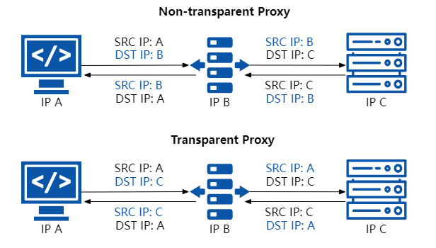
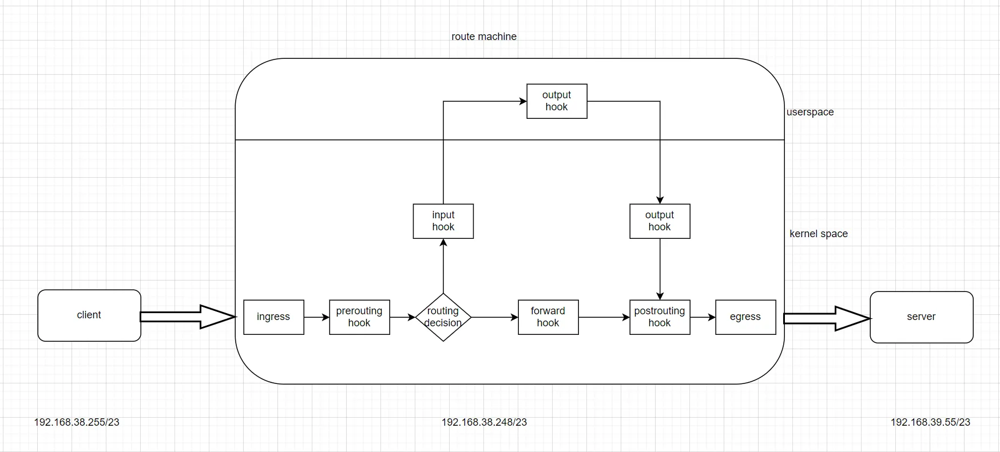

# 前言

我们在校园或者图书馆，会连接一些公共网络。在连接后，初次访问访问网络时，浏览器会自动跳转到一个登陆页面。这背后的原理嘛，不知道。

本文，将有个类似的实现。当访问任意一个地址的 80 端口时，这个访问将被劫持，并返回一个自定义的界面。这里，是为了感受下 tproxy(transparent proxy，透明代理) 的使用。

接着，我们将从内核源码的角度，感受下 tproxy 背后的原理。

注：在开始本文之间，需要对 iptables 有简单的了解，[nftables的简单使用 – da1234cao](basic-use-of-nftables.md)

# tproxy 简介

图片来自：[什么是 tproxy 透明代理？ | Jimmy Song](https://jimmysong.io/blog/what-is-tproxy/)



从上图来看，tproxy 还是比较神奇的。

这个 `IP B`没有修改任何报文信息，让 `IP A`认为，它正在与 `IP C`通信；

同样的，这个 `IP B`没有修改任何报文信息，让 `IP C`认为，它正在与 `IP A`通信；

但是，上面这张图，可能还是不直观。因为这结构图，看着 `IP B`就像是一个普通的路由器。

毕竟，报文在网络中传输，在不解析到 TLS 层的情况下，无法区分出一个包是否被劫持了。毕竟，任何一个机器都能构造一个任意结构的数据包。

**所以，看了文字简介，看不出来什么是“透明代理”，还是看代码**。

# tproxy example 实验

我们跑一个简单的代码，感受下。

示例来自：[FarFetchd/simple_tproxy_example: Minimal working example of transparent proxying with iptables TPROXY](https://github.com/FarFetchd/simple_tproxy_example)

## 网络拓扑

先介绍下，我的网络拓扑。



客户端配置。

```
# client 的ip是 192.168.38.255
## 添加下路由，让数据包，默认走192.168.38.248
2: ens160: <BROADCAST,MULTICAST,UP,LOWER_UP> mtu 1500 qdisc mq state UP group default qlen 1000
    link/ether 00:0c:29:8c:e8:3d brd ff:ff:ff:ff:ff:ff
    altname enp3s0
    inet 192.168.38.255/23 brd 192.168.39.255 scope global dynamic noprefixroute ens160
       valid_lft 11291sec preferred_lft 11291sec

ip route add default via 192.168.38.248 dev ens160

root@localhost ~# ip route 
default via 192.168.38.248 dev ens160 # 优先级最高
default via 192.168.38.1 dev ens160 proto dhcp src 192.168.38.255 metric 100 
192.168.38.0/23 dev ens160 proto kernel scope link src 192.168.38.255 metric 100
```

router 其实就是一个 rocky9 的机器。我们开启下它的路由转发功能。

```
sysctl -w net.ipv4.ip_forward=1
```

这样，client 访问 server 的时候，流量都会走 router 了。

## tproxy 启动

阅读和编译上面仓库的代码。然后启动程序。

```
./tproxy_captive_portal 192.168.38.248
```

当然，我们还需要做些工作。

```
iptables -t mangle -A PREROUTING -i ens160 -p tcp --dport 80 -m tcp -j TPROXY --on-ip 192.168.38.248 --on-port 1234 --tproxy-mark 1/1

ip rule add fwmark 1/1 table 1

ip route add local 0.0.0.0/0 dev lo table 1
```

这些命令，对数据包的作用如下。

1. 在 mangle 表(优先级)，prerouting hook 点，对于 ens160 网卡来的流量，如果访问 http 服务，（则把对应的流量转到本地的 1234 端口上），数据包 mark 值为 1。所以，数据包，在 prerouting 的时候，被打上 mark 值。
2. 接着，数据包到 routeing decison ，根据 mark 值，应用的是 路由表 1。
3. 路由表 1 上的规则是，所有目标地址是 ipv4 的流量，都进入 lo 设备。
4. 进入 lo 设备后，数据包，通过套接字，被 tproxy_captive_portal 接收。
5. tproxy_captive_portal 劫持了流量，并直接返回内容。

运行结果如下。

```
root@localhost ~/w/tmp# curl http://1.1.1.1
You thought you were connecting to 1.1.1.1:80, but it was actually me, TPROXY!⏎                                                                                                               
root@localhost ~/w/tmp# curl http://8.8.8.8
You thought you were connecting to 8.8.8.8:80, but it was actually me, TPROXY!⏎  
```

**实验到这步了，我们对 tproxy 有点感觉了。**

**但是，发生了什么？既然上面的 iptables 可以将流量重定向到 1234 端口，后面的两个 rule 又有什么作用？**

**在日常编程中，或许，我们已经可以着手工作了。但是，到这里，我们还是不清楚，tproxy 做了什么**。

# tproxy 原理简介

来自：[TProxy 探秘 | Yesterday17's Blog](https://blog.mmf.moe/post/tproxy-investigation/)

我们不得不去内核中一探究竟。这部分源码在 kernel 的 `net/netfilter/xt_TPROXY.c`

具体，这里就不展开了。详细见上面的链接和源码本身。

我没有看明白详细的内容，看了个大概，不影响理解 tproxy 的原理的。

tproxy 的核心如下：

- 内核中，可以使用五元组(协议+端口)，来确定收发数据包的 套接字(socket)。
- 透明代理，这个“透明”是相对于客户端和服务端的。代理服务器本身，作为中间人，要两头转发。
- 客户端的数据包，经过代理服务器时，不修改数据包的任何内容。tproxy 将处理数据包的socket，指定为 tproxy 的 socket。虽然这个 socket 对应的五元组，没有一个是本地的。
- 上层的 tproxy 应用，通过 socket， 收到内容，可直接转发给真正的服务器。
- 回来的流量，也可做类似的处理。

# 附录

## tproxy example 代码

可以直接访问上面的 git 仓库获取。我这里拷贝了一份。

```
#include <arpa/inet.h>
#include <sys/socket.h>
#include <stdio.h>
#include <stdlib.h>
#include <string.h>
#include <unistd.h>

// Before running this program, run these commands:
//
// 1) sudo iptables -t mangle -A PREROUTING -i eth0 -p tcp --dport 80 -m tcp \
//                  -j TPROXY --on-ip 192.168.123.1 --on-port 1234           \
//                  --tproxy-mark 1/1
// 2) sudo sysctl -w net.ipv4.ip_forward=1
// 3) sudo ip rule add fwmark 1/1 table 1
// 4) sudo ip route add local 0.0.0.0/0 dev lo table 1
// NOTE: I specified --dport 80 here to avoid messing up ssh etc. You could also
//       use an iptables -j ACCEPT ahead of this rule to make such exceptions.
//       It's much more interesting to leave --dport out, so your TPROXY
//       iptables rule will grab ALL the traffic! Especially if you also change
//       eth0 to wlan0 and run an open wifi access point ;)
// NOTE: don't forget to substitute your eth0's IP for 192.168.123.1!
//
// The above commands (#1) establish the TPROXY action; (#2) allow your system
// to forward packets from one interface to another; (#3) specify a special new
// routing table for packets given the 1/1 mark by TPROXY; and in that new
// routing table, (#4) redirect all packets to loopback, so your listener can
// see them. The redirect to lo is necessary because when the packets come in
// eth0 with a non-local dest address, they're not considered for delivery to
// local sockets, just forwarding logic.

// Although it goes into the kernel's machinery as if it were a real port, it's
// not, or at least not in a way that's relevant to us TPROXY-using coders. The
// value you pick has absolutely no relation to either src or dst ports in any
// packets that you exchange with the client. It just needs to match --on-port.
#define TPROXY_BIND_PORT 1234

void crash(const char* msg)
{
  perror(msg);
  exit(1);
}

int main(int argc, char** argv)
{
  if (argc != 2)
  {
    printf("usage: tproxy_captive_portal <ip addr to bind>\n\n" \
           "IMPORTANT: you must bind to the same address + port you passed\n" \
           "via --on-ip and --on-port to the TPROXY iptables rule. Use the\n" \
           "IP address of the interface that traffic will come in through.\n");
    exit(1);
  }
  int listener_fd = socket(AF_INET, SOCK_STREAM, 0);
  if (listener_fd < 0)
    crash("couldn't allocate socket");
  const int yes = 1;
  if (setsockopt(listener_fd, SOL_SOCKET, SO_REUSEADDR, &yes, sizeof(yes)) < 0)
    crash("SO_REUSEADDR failed");
  if (setsockopt(listener_fd, SOL_IP, IP_TRANSPARENT, &yes, sizeof(yes)) < 0)
    crash("IP_TRANSPARENT failed. Are you root?");

  struct sockaddr_in bind_addr;
  bind_addr.sin_family = AF_INET;
  inet_pton(AF_INET, argv[1], &bind_addr.sin_addr.s_addr);
  bind_addr.sin_port = htons(TPROXY_BIND_PORT);
  if (bind(listener_fd, (struct sockaddr*)&bind_addr, sizeof(bind_addr)) < 0)
    crash("bind failed");

  if (listen(listener_fd, 10) < 0)
    crash("listen failed");
  printf("now TPROXY-listening on %s, '''''port''''' %d",
         argv[1], TPROXY_BIND_PORT);
  printf("...\nbut actually accepting any TCP SYN with dport 80, regardless of"\
         " dest IP, that hits the loopback interface!\n\n");
  while (1)
  {
    // client_addr will contain the client's IP+port, just like any other
    // TCP connection accept()ance.
    // intended_dest_addr will contain the IP+port that the client THINKS it's
    // talking to.
    struct sockaddr_in client_addr, intended_dest_addr;
    socklen_t client_addr_len = sizeof(client_addr);
    socklen_t dest_addr_len = sizeof(intended_dest_addr);

    int client_fd = accept(listener_fd, (struct sockaddr*)&client_addr,
                                                          &client_addr_len);
    getsockname(client_fd, (struct sockaddr*)&intended_dest_addr,
                                             &dest_addr_len);
    printf("accepted socket from %s:%d; ",
           inet_ntoa(client_addr.sin_addr),
           ntohs(client_addr.sin_port));
    printf("they think they're talking to %s:%d\n",
           inet_ntoa(intended_dest_addr.sin_addr),
           ntohs(intended_dest_addr.sin_port));
    char http_response[1000];
    sprintf(http_response,
            "HTTP/1.0 200 OK\r\n\r\nYou thought you were connecting "
            "to %s:%d, but it was actually me, TPROXY!",
            inet_ntoa(intended_dest_addr.sin_addr),
            ntohs(intended_dest_addr.sin_port));
    send(client_fd, http_response, strlen(http_response), 0);

    shutdown(client_fd, SHUT_RDWR);
    close(client_fd);
  }
}
```

# 最后

tproxy 作用在路由器上，非常自然。

tproxy 如果想要将机器自身的流量 proxy，可能有点费劲。

tproxy 有作用场景？母鸡，工作上，我还没敲过相应的代码。
