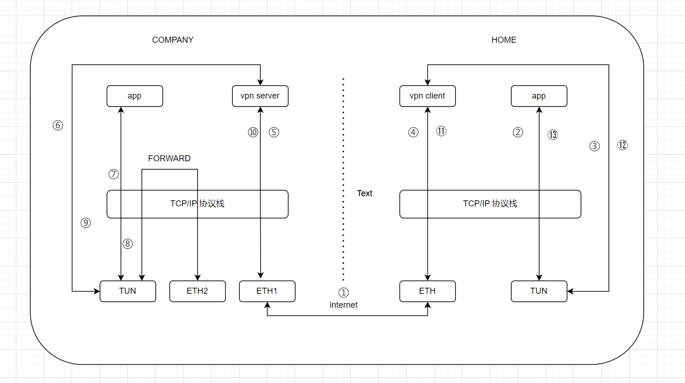

# 前言

参考自：[VPN 原理以及实现](https://paper.seebug.org/1648/)

> TUN/TAP 是操作系统内核中的虚拟网络设备，由软件进行实现，向操作系统和应用程序提供与硬件网络设备完全相同的功能。其中 TAP 是以太网设备(二层设备)，操作和封装以太网数据帧，TUN 则是网络层设备(三层设备)，操作和封装网络层数据包。

工作中不写vpn，但是得了解tun/tap的使用，要不然有的代码看不明白。而，通过vpn可以很好的了解tun/tap的使用。

# vpn的基本原理介绍

公司的开发服务器是内网环境中。有时候，我们会通过vpn，连接到公司的内网环境，以操作这些服务器。

vpn的基本原理如下所示。



① 首先是，打开电脑上的vpn客户端，它将与vpn服务端建立连接。vpn客户端创建一个TUN设备。

② 此时，我们电脑上的程序，比如通过ssh去连接公司的服务器。由于目标地址和TUN在同一个网段，流量在内核协议栈中，根据路由表，进入TUN设备中。

③ vpp client从TUN设备中收取三层数据包。

④ vpp client 将三层数据包整体作为数据，送入协议栈，由真实网卡发送给服务端的网卡。

⑤ vpp server 这个程序，从网卡中读取出这个三层数据包。

⑥ vpp server 将读取到的三层数据包，写入 TUN设备。

⑦ 写入TUN设备的三层数据包，进入协议栈。如果目标IP是本机，则有本机的IP接收。如果目标IP非本机，由于此时已经开启了ip转发功能(net.ipv4.ip_forward)，数据包从另一个网卡发出，进入局域网的其他机器。简单起见，目标地址是本机上的一个程序。

⑧ 本机的程序，发送回复消息。消息进入协议栈，根据路由进入TUN设备。（后面的过程和上面流程相同了，为了详细起见，我继续往下介绍流程。）

⑨ vpp server 从 TUN设备中读取三层数据包。

⑩ vpp server 将三层数据包作为数据，送入协议栈，从真实网卡发出。

⑪ vpp client 从真实网卡收到数据包。由于经过了协议栈，脱去了外层的封装，只剩下原来的三层数据包。

⑫ vpp client 将收到的数据写入 TUN 设备。

⑬ 写入 TUN 设备的数据，自动进入协议栈。经过协议栈，脱去封装后，为原始数据，供app使用。

# 一个简单的vpn示例

"Talk is cheap, show your `code`"。

下面的示例修改自：[gregnietsky/simpletun: Example program for tap driver VPN](https://github.com/gregnietsky/simpletun)

```
/**************************************************************************
 * simpletun.c                                                            *
 *                                                                        *
 * A simplistic, simple-minded, naive tunnelling program using tun/tap    *
 * interfaces and TCP. DO NOT USE THIS PROGRAM FOR SERIOUS PURPOSES.      *
 *                                                                        *
 * You have been warned.                                                  *
 *                                                                        *
 * (C) 2010 Davide Brini.                                                 *
 *                                                                        *
 * DISCLAIMER AND WARNING: this is all work in progress. The code is      *
 * ugly, the algorithms are naive, error checking and input validation    *
 * are very basic, and of course there can be bugs. If that's not enough, *
 * the program has not been thoroughly tested, so it might even fail at   *
 * the few simple things it should be supposed to do right.               *
 * Needless to say, I take no responsibility whatsoever for what the      *
 * program might do. The program has been written mostly for learning     *
 * purposes, and can be used in the hope that is useful, but everything   *
 * is to be taken "as is" and without any kind of warranty, implicit or   *
 * explicit. See the file LICENSE for further details.                    *
 *                                                                        *
 * Modified from: https://github.com/gregnietsky/simpletun                *
 *************************************************************************/

#include <arpa/inet.h>
#include <errno.h>
#include <fcntl.h>
#include <linux/if_tun.h>
#include <net/if.h>
#include <stdarg.h>
#include <stdio.h>
#include <stdlib.h>
#include <string.h>
#include <sys/ioctl.h>
#include <sys/select.h>
#include <sys/socket.h>
#include <sys/stat.h>
#include <sys/time.h>
#include <sys/types.h>
#include <unistd.h>

/* buffer for reading from tun/tap interface, must be >= 1500 */
#define BUFSIZE 2000
#define CLIENT 0
#define SERVER 1
#define PORT 55555

static const char *server_ip = "10.0.0.1";
static const char *client_ip = "10.0.0.2";
static const char *netmask = "255.255.255.0";

int debug;
char *progname;

/**************************************************************************
 * tun_alloc: allocates or reconnects to a tun/tap device. The caller     *
 *            must reserve enough space in *dev.                          *
 **************************************************************************/
int tun_alloc(char *dev, int flags) {

  struct ifreq ifr;
  int fd, err;
  char *clonedev = "/dev/net/tun";

  if ((fd = open(clonedev, O_RDWR)) < 0) {
    perror("Opening /dev/net/tun");
    return fd;
  }

  memset(&ifr, 0, sizeof(ifr));

  ifr.ifr_flags = flags;

  if (*dev) {
    strncpy(ifr.ifr_name, dev, IFNAMSIZ);
  }

  if ((err = ioctl(fd, TUNSETIFF, (void *)&ifr)) < 0) {
    perror("ioctl(TUNSETIFF)");
    close(fd);
    return err;
  }

  strcpy(dev, ifr.ifr_name);

  return fd;
}

int set_tun_ip(const char *ifname, const char *ip_str,
               const char *netmask_str) {
  int sockfd;
  struct ifreq ifr;
  struct sockaddr_in *addr;

  // 打开一个套接字（用于 ioctl 调用）
  if ((sockfd = socket(AF_INET, SOCK_DGRAM, 0)) < 0) {
    perror("socket");
    return -1;
  }

  // 设置接口名称
  strncpy(ifr.ifr_name, ifname, IFNAMSIZ);

  // 设置 IP 地址
  addr = (struct sockaddr_in *)&ifr.ifr_addr;
  addr->sin_family = AF_INET;
  if (inet_pton(AF_INET, ip_str, &addr->sin_addr) <= 0) {
    perror("inet_pton (IP)");
    close(sockfd);
    return -1;
  }
  if (ioctl(sockfd, SIOCSIFADDR, &ifr) < 0) {
    perror("ioctl (SIOCSIFADDR)");
    close(sockfd);
    return -1;
  }

  // 设置子网掩码
  addr = (struct sockaddr_in *)&ifr.ifr_netmask;
  addr->sin_family = AF_INET;
  if (inet_pton(AF_INET, netmask_str, &addr->sin_addr) <= 0) {
    perror("inet_pton (Netmask)");
    close(sockfd);
    return -1;
  }
  if (ioctl(sockfd, SIOCSIFNETMASK, &ifr) < 0) {
    perror("ioctl (SIOCSIFNETMASK)");
    close(sockfd);
    return -1;
  }

  // 启用接口
  if (ioctl(sockfd, SIOCGIFFLAGS, &ifr) < 0) {
    perror("ioctl (SIOCGIFFLAGS)");
    close(sockfd);
    return -1;
  }
  ifr.ifr_flags |= IFF_UP | IFF_RUNNING; // 启用设备
  if (ioctl(sockfd, SIOCSIFFLAGS, &ifr) < 0) {
    perror("ioctl (SIOCSIFFLAGS)");
    close(sockfd);
    return -1;
  }

  close(sockfd);
  return 0;
}

/**************************************************************************
 * cread: read routine that checks for errors and exits if an error is    *
 *        returned.                                                       *
 **************************************************************************/
int cread(int fd, char *buf, int n) {

  int nread;

  if ((nread = read(fd, buf, n)) < 0) {
    perror("Reading data");
    exit(1);
  }
  return nread;
}

/**************************************************************************
 * cwrite: write routine that checks for errors and exits if an error is  *
 *         returned.                                                      *
 **************************************************************************/
int cwrite(int fd, char *buf, int n) {

  int nwrite;

  if ((nwrite = write(fd, buf, n)) < 0) {
    perror("Writing data");
    exit(1);
  }
  return nwrite;
}

/**************************************************************************
 * read_n: ensures we read exactly n bytes, and puts them into "buf".     *
 *         (unless EOF, of course)                                        *
 **************************************************************************/
int read_n(int fd, char *buf, int n) {

  int nread, left = n;

  while (left > 0) {
    if ((nread = cread(fd, buf, left)) == 0) {
      return 0;
    } else {
      left -= nread;
      buf += nread;
    }
  }
  return n;
}

/**************************************************************************
 * do_debug: prints debugging stuff (doh!)                                *
 **************************************************************************/
void do_debug(char *msg, ...) {

  va_list argp;

  if (debug) {
    va_start(argp, msg);
    vfprintf(stderr, msg, argp);
    va_end(argp);
  }
}

/**************************************************************************
 * my_err: prints custom error messages on stderr.                        *
 **************************************************************************/
void my_err(char *msg, ...) {

  va_list argp;

  va_start(argp, msg);
  vfprintf(stderr, msg, argp);
  va_end(argp);
}

/**************************************************************************
 * usage: prints usage and exits.                                         *
 **************************************************************************/
void usage(void) {
  fprintf(stderr, "Usage:\n");
  fprintf(stderr,
          "%s -i <ifacename> [-s|-c <serverIP>] [-p <port>] [-u|-a] [-d]\n",
          progname);
  fprintf(stderr, "%s -h\n", progname);
  fprintf(stderr, "\n");
  fprintf(stderr, "-i <ifacename>: Name of interface to use (mandatory)\n");
  fprintf(stderr, "-s|-c <serverIP>: run in server mode (-s), or specify "
                  "server address (-c <serverIP>) (mandatory)\n");
  fprintf(stderr, "-p <port>: port to listen on (if run in server mode) or to "
                  "connect to (in client mode), default 55555\n");
  fprintf(stderr, "-u|-a: use TUN (-u, default) or TAP (-a)\n");
  fprintf(stderr, "-d: outputs debug information while running\n");
  fprintf(stderr, "-h: prints this help text\n");
  exit(1);
}

int main(int argc, char *argv[]) {

  int tap_fd, option;
  int flags = IFF_TUN;
  char if_name[IFNAMSIZ] = "";
  int maxfd;
  uint16_t nread, nwrite, plength;
  char buffer[BUFSIZE];
  struct sockaddr_in local, remote;
  char remote_ip[16] = ""; /* dotted quad IP string */
  unsigned short int port = PORT;
  int sock_fd, net_fd, optval = 1;
  socklen_t remotelen;
  int cliserv = -1; /* must be specified on cmd line */
  unsigned long int tap2net = 0, net2tap = 0;

  progname = argv[0];

  /* Check command line options */
  while ((option = getopt(argc, argv, "i:sc:p:uahd")) > 0) {
    switch (option) {
    case 'd':
      debug = 1;
      break;
    case 'h':
      usage();
      break;
    case 'i':
      strncpy(if_name, optarg, IFNAMSIZ - 1);
      break;
    case 's':
      cliserv = SERVER;
      break;
    case 'c':
      cliserv = CLIENT;
      strncpy(remote_ip, optarg, 15);
      break;
    case 'p':
      port = atoi(optarg);
      break;
    case 'u':
      flags = IFF_TUN;
      break;
    case 'a':
      flags = IFF_TAP;
      break;
    default:
      my_err("Unknown option %c\n", option);
      usage();
    }
  }

  argv += optind;
  argc -= optind;

  if (argc > 0) {
    my_err("Too many options!\n");
    usage();
  }

  if (*if_name == '\0') {
    my_err("Must specify interface name!\n");
    usage();
  } else if (cliserv < 0) {
    my_err("Must specify client or server mode!\n");
    usage();
  } else if ((cliserv == CLIENT) && (*remote_ip == '\0')) {
    my_err("Must specify server address!\n");
    usage();
  }

  /* initialize tun/tap interface */
  if ((tap_fd = tun_alloc(if_name, flags | IFF_NO_PI)) < 0) {
    my_err("Error connecting to tun/tap interface %s!\n", if_name);
    exit(1);
  }

  if (cliserv == SERVER) {
    set_tun_ip(if_name, server_ip, netmask);
  } else {
    set_tun_ip(if_name, client_ip, netmask);
  }

  do_debug("Successfully connected to interface %s\n", if_name);

  if ((sock_fd = socket(AF_INET, SOCK_STREAM, 0)) < 0) {
    perror("socket()");
    exit(1);
  }

  if (cliserv == CLIENT) {
    /* Client, try to connect to server */

    /* assign the destination address */
    memset(&remote, 0, sizeof(remote));
    remote.sin_family = AF_INET;
    remote.sin_addr.s_addr = inet_addr(remote_ip);
    remote.sin_port = htons(port);

    /* connection request */
    if (connect(sock_fd, (struct sockaddr *)&remote, sizeof(remote)) < 0) {
      perror("connect()");
      exit(1);
    }

    net_fd = sock_fd;
    do_debug("CLIENT: Connected to server %s\n", inet_ntoa(remote.sin_addr));

  } else {
    /* Server, wait for connections */

    /* avoid EADDRINUSE error on bind() */
    if (setsockopt(sock_fd, SOL_SOCKET, SO_REUSEADDR, (char *)&optval,
                   sizeof(optval)) < 0) {
      perror("setsockopt()");
      exit(1);
    }

    memset(&local, 0, sizeof(local));
    local.sin_family = AF_INET;
    local.sin_addr.s_addr = htonl(INADDR_ANY);
    local.sin_port = htons(port);
    if (bind(sock_fd, (struct sockaddr *)&local, sizeof(local)) < 0) {
      perror("bind()");
      exit(1);
    }

    if (listen(sock_fd, 5) < 0) {
      perror("listen()");
      exit(1);
    }

    /* wait for connection request */
    remotelen = sizeof(remote);
    memset(&remote, 0, remotelen);
    if ((net_fd = accept(sock_fd, (struct sockaddr *)&remote, &remotelen)) <
        0) {
      perror("accept()");
      exit(1);
    }

    do_debug("SERVER: Client connected from %s\n", inet_ntoa(remote.sin_addr));
  }

  /* use select() to handle two descriptors at once */
  maxfd = (tap_fd > net_fd) ? tap_fd : net_fd;

  while (1) {
    int ret;
    fd_set rd_set;

    FD_ZERO(&rd_set);
    FD_SET(tap_fd, &rd_set);
    FD_SET(net_fd, &rd_set);

    ret = select(maxfd + 1, &rd_set, NULL, NULL, NULL);

    if (ret < 0 && errno == EINTR) {
      continue;
    }

    if (ret < 0) {
      perror("select()");
      exit(1);
    }

    if (FD_ISSET(tap_fd, &rd_set)) {
      /* data from tun/tap: just read it and write it to the network */

      nread = cread(tap_fd, buffer, BUFSIZE);

      tap2net++;
      do_debug("TAP2NET %lu: Read %d bytes from the tap interface\n", tap2net,
               nread);

      /* write length + packet */
      plength = htons(nread);
      nwrite = cwrite(net_fd, (char *)&plength, sizeof(plength));
      nwrite = cwrite(net_fd, buffer, nread);

      do_debug("TAP2NET %lu: Written %d bytes to the network\n", tap2net,
               nwrite);
    }

    if (FD_ISSET(net_fd, &rd_set)) {
      /* data from the network: read it, and write it to the tun/tap interface.
       * We need to read the length first, and then the packet */

      /* Read length */
      nread = read_n(net_fd, (char *)&plength, sizeof(plength));
      if (nread == 0) {
        /* ctrl-c at the other end */
        break;
      }

      net2tap++;

      /* read packet */
      nread = read_n(net_fd, buffer, ntohs(plength));
      do_debug("NET2TAP %lu: Read %d bytes from the network\n", net2tap, nread);

      /* now buffer[] contains a full packet or frame, write it into the tun/tap
       * interface */
      nwrite = cwrite(tap_fd, buffer, nread);
      do_debug("NET2TAP %lu: Written %d bytes to the tap interface\n", net2tap,
               nwrite);
    }
  }

  return (0);
}
```

编译和运行这个程序。

```
gcc simpletun.c -o simpletun

# 服务端
## 服务端ip为 192.168.1.4
./simpletun -i tun0 -s -d

# 服务端放行端口
## rock9
firewall-cmd --add-port=55555/tcp

# 客户端
./simpletun -i tun0 -c 192.168.1.4 -d
```

此时，客户端可以ping通过服务端的TUN设备，服务端可以ping通客户端的TUN设备。

# 最后

最后，我们可以总结 TUN设备使用的两条规律。

1. vpn可以直接向TUN设备中，write数据。写入TUN设备中的应该是一个三层数据包，会自动进入协议栈。如果数据包的目标IP不是本机，需要考虑开启路由转发功能。
2. vpn可以直接从TUN设备中，read数据。read的数据，不是上面直接write入的数据，而是其他程序经过协议栈，进入TUN的数据。read出来的数据，是一个三层的数据包。
