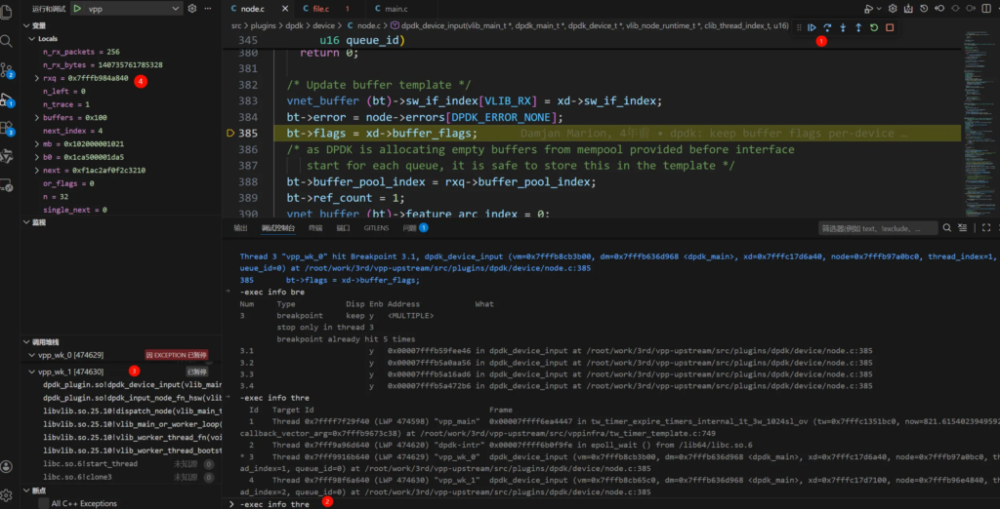

# 前言

以前，了解过 gdb 的简单使用：[GDB调试与栈帧解析-CSDN博客](https://blog.csdn.net/sinat_38816924/article/details/106086366)

后来，感觉 vscode 的调试真方便，就一直使用 vscode 来调试代码了：[VSCode下Linux环境下C++调试指南：配置与实践-CSDN博客](https://blog.csdn.net/sinat_38816924/article/details/124238534)

gdb 还是挺挺复杂的一个工具。

本文以 [vpp/src/plugins/dpdk/device/node.c](https://github.com/FDio/vpp/blob/master/src/plugins/dpdk/device/node.c) 为例，了解下 gdb 是如何进行多线程调试的。

# gdb 中进行多线程调试

## 核心的命令

找 AI 生成下。

GDB的多线程调试功能，确实能有效应对，并发程序中的各种挑战。下面这个表格汇总了核心命令，方便快速掌握。

| 命令/功能 | 说明 | 适用场景 |
| --- | --- | --- |
| `info threads` | 列出所有线程，显示其GDB内部ID、状态和当前执行位置。 | 快速查看程序当前所有线程的整体状态。 |
| `thread <id>` | 切换到指定ID的线程，使后续命令（如`bt`, `print`）在该线程上下文中执行。 | 需要详细检查某一特定线程的调用栈或变量时。 |
| `thread apply` | 让一个、多个或所有线程执行同一个GDB命令（如`thread apply all bt`打印所有线程堆栈）。 | 批量操作线程，例如一次性查看所有线程的调用栈。 |
| `set scheduler-locking` | 控制单步调试时其他线程的行为（`on`：仅当前线程运行；`step`：单步时仅当前线程运行；`off`：所有线程并发运行，此为默认值）。 | 避免单步调试时被其他线程打断，专注分析当前线程逻辑。 |
| `break ... thread <id>` | 在指定行或函数处设置断点，但仅当指定线程执行到此时才会触发。 | 只想监控某个特定线程的执行路径，避免其他线程触发同一断点造成干扰。 |

## 尝试下

查看下当前被调试程序的线程情况。

```
(gdb) info threads 
  Id   Target Id                                      Frame 
* 1    Thread 0x7ffff7f29f40 (LWP 469110) "vpp_main"  0x00007ffff6ea5283 in clib_bitmap_get (ai=0x7fffb9848208, i=825) at /root/work/3rd/vpp-upstream/src/vppinfra/bitmap.h:224
  2    Thread 0x7fff9a96d640 (LWP 469113) "dpdk-intr" 0x00007ffff6b0f9fe in epoll_wait () from /lib64/libc.so.6
  3    Thread 0x7fff9916b640 (LWP 469114) "vpp_wk_0"  0x00007ffff6f31a39 in vlib_get_main_by_index (thread_index=0) at /root/work/3rd/vpp-upstream/src/vlib/global_funcs.h:32
  4    Thread 0x7fff98f6a640 (LWP 469115) "vpp_wk_1"  0x00007ffff6f2c9d5 in vlib_get_node (vm=0x7fffb8cb65c0, i=283) at /root/work/3rd/vpp-upstream/src/vlib/node_funcs.h:89
```

打一个普通的断点。

- 看 what 信息。如果“What”列只显示位置信息（如文件行号、函数名），那么这个断点，默认将对所有线程生效。
- 因为这一个函数，对应四个不同的变体，所以它有四个 location。

```
(gdb) info breakpoints 
No breakpoints, watchpoints, tracepoints, or catchpoints.
(gdb) break dpdk/device/node.c:385
Breakpoint 4 at 0x7fffb59fee46: dpdk/device/node.c:385. (4 locations)

(gdb) info breakpoints 
Num     Type           Disp Enb Address            What
4       breakpoint     keep y   <MULTIPLE>         
4.1                         y   0x00007fffb59fee46 in dpdk_device_input at /root/work/3rd/vpp-upstream/src/plugins/dpdk/device/node.c:385
4.2                         y   0x00007fffb5a0aa56 in dpdk_device_input at /root/work/3rd/vpp-upstream/src/plugins/dpdk/device/node.c:385
4.3                         y   0x00007fffb5a16ad6 in dpdk_device_input at /root/work/3rd/vpp-upstream/src/plugins/dpdk/device/node.c:385
4.4                         y   0x00007fffb5a472b6 in dpdk_device_input at /root/work/3rd/vpp-upstream/src/plugins/dpdk/device/node.c:385

(gdb) delete breakpoints 4
```

现在，我只想调试线程 3 的这个位置。我可以选择切换到线程 3，然后把其他线程都挂起，专心调试线程 3。

- 在GDB调试的语境下，将线程挂起的核心机制是ptrace系统调用，它提供了更底层和直接的控制。
- 至于 ptrace 的原理嘛，不知道，先不管它。

```
(gdb) thread 3

(gdb) set scheduler-locking on

(gdb) show scheduler-locking 
Mode for locking scheduler during execution is "on".

(gdb) set scheduler-locking off
(gdb) delete breakpoints 5
```

set scheduler-locking on 设置后，所有其他线程停止执行。感觉这个“副作用”有点大。

我们可以让断点，只在特定线程生效。

```
(gdb) break dpdk/device/node.c:385 thread 3
Breakpoint 6 at 0x7fffb59fee46: dpdk/device/node.c:385. (4 locations)
(gdb) info breakpoints 
Num     Type           Disp Enb Address            What
6       breakpoint     keep y   <MULTIPLE>         
	stop only in thread 3
6.1                         y   0x00007fffb59fee46 in dpdk_device_input at /root/work/3rd/vpp-upstream/src/plugins/dpdk/device/node.c:385
6.2                         y   0x00007fffb5a0aa56 in dpdk_device_input at /root/work/3rd/vpp-upstream/src/plugins/dpdk/device/node.c:385
6.3                         y   0x00007fffb5a16ad6 in dpdk_device_input at /root/work/3rd/vpp-upstream/src/plugins/dpdk/device/node.c:385
6.4                         y   0x00007fffb5a472b6 in dpdk_device_input at /root/work/3rd/vpp-upstream/src/plugins/dpdk/device/node.c:385

(gdb) c
Continuing.

Thread 3 "vpp_wk_0" hit Breakpoint 6.1, dpdk_device_input (vm=0x7fffb8cb3b00, dm=0x7fffb636d968 <dpdk_main>, xd=0x7fffc17d6a40, node=0x7fffb96a6080, thread_index=1, queue_id=0)
    at /root/work/3rd/vpp-upstream/src/plugins/dpdk/device/node.c:385
385	  bt->flags = xd->buffer_flags;
(gdb) info threads 
  Id   Target Id                                      Frame 
  1    Thread 0x7ffff7f29f40 (LWP 469110) "vpp_main"  0x00007ffff6ea4489 in tw_timer_expire_timers_internal_1t_3w_1024sl_ov (tw=0x7fffc1351bc0, now=2499.4779948061323, 
    callback_vector_arg=0x7fffb96a53a8) at /root/work/3rd/vpp-upstream/src/vppinfra/tw_timer_template.c:752
  2    Thread 0x7fff9a96d640 (LWP 469113) "dpdk-intr" 0x00007ffff6b0f9fe in epoll_wait () from /lib64/libc.so.6
* 3    Thread 0x7fff9916b640 (LWP 469114) "vpp_wk_0"  dpdk_device_input (vm=0x7fffb8cb3b00, dm=0x7fffb636d968 <dpdk_main>, xd=0x7fffc17d6a40, node=0x7fffb96a6080, thread_index=1, 
    queue_id=0) at /root/work/3rd/vpp-upstream/src/plugins/dpdk/device/node.c:385
  4    Thread 0x7fff98f6a640 (LWP 469115) "vpp_wk_1"  0x00007fffb59fee4a in dpdk_device_input (vm=0x7fffb8cb65c0, dm=0x7fffb636d968 <dpdk_main>, xd=0x7fffc17d7100, node=0x7fffb96fb880, 
    thread_index=2, queue_id=0) at /root/work/3rd/vpp-upstream/src/plugins/dpdk/device/node.c:385
```

# 其他

## vscode 下的多线程调试

上面，我们 了解了 gdb 如何调试多线程。在 vscode 中，多线程的调试差不多。

参考：[使用 Visual Studio Code 调试代码 - VSCode · AI 代码编辑器](https://vscode.js.cn/docs/debugtest/debugging)、[VSCode多线程调试(C/C++程序)_vscode多线程如何调试-CSDN博客](https://blog.csdn.net/2303_76255607/article/details/146204221)

在 vscode 的 debug console ，使用 -exec + gdb 参数即可。比命令行的 gdb 好用。（但是吧，没有 table 命令补齐了。


