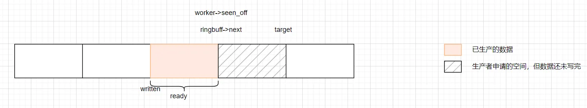

# 前言

多生产者多消费者(multiple-producer，multiple-consumer) 的无锁(lock-free)环形缓冲区(ring-buffer)，有其特定的使用场景。

在一些高性能场景下，锁是绝对不能使用的。不仅锁不能使用，为了避免 cache miss，每个工作线程会选择使用 per-thread data方式，进行数据读取与写入。

所以，有时候我们会看到，有 N 个线程，且每个线程是生产者，也是消费者的时候，每个线程，创建自己的 ring，这样就不需要考虑 ， 给 ring 加锁的问题了。

但是，在高性能的场景下，有 N 个生产者,M 个消费者时，我们可能就需要一个 MPMC 的 无锁环形缓冲区。

有生之年，我肯定不会去写，无锁的 MPMC ring buffer 的。这玩意，太复杂了，我肯定写不对，写不好。

我最近看了一个 MPSC 的 lock-free ring buffer：[rmind/ringbuf: Lock-free ring buffer (MPSC)](https://github.com/rmind/ringbuf)

本文将记录这个过程。

# rmind/ringbuf 的使用

在开始源码分析之前，我们先看看这个工具是如何使用的。

参考[ringbuf/src/t_stress.c at master · rmind/ringbuf](https://github.com/rmind/ringbuf/blob/master/src/t_stress.c)，我也敲了一个示例。

~~感觉我现在，编程能力退步的厉害。没有 AI 给生成一个底样，代码都不会写了，尴尬~~。

```
#include <assert.h>
#include <pthread.h>
#include <stdint.h>
#include <stdio.h>
#include <stdlib.h>
#include <string.h>
#include <unistd.h>

#include "ringbuf.h"

#define PRODUCER_NUM 3
#define BUFFER_SIZE 4096
#define MESSAGE_CONTENT_MAX_LEN 64

ringbuf_t *ring = NULL;
char *buffer = NULL;

static volatile unsigned long producer_count = 0;
static volatile unsigned long consumer_count = 0;
static volatile int stats_running = 1;

struct message {
  int len;
  int checksum;
  char content[MESSAGE_CONTENT_MAX_LEN];
};

void generate_random_message(struct message *msg) {
  msg->len = rand() % (MESSAGE_CONTENT_MAX_LEN - 1) + 1;

  for (int i = 0; i < msg->len - 1; i++) {
    msg->content[i] = (char)(rand() % (126 - 32) + 32);
  }
  msg->content[msg->len - 1] = '\0';

  msg->checksum = 0;
  for (int i = 0; i < msg->len - 1; i++) {
    msg->checksum ^= (int)msg->content[i];
  }
}

int validate_message(const struct message *msg) {
  if (msg->len <= 0 || msg->len > MESSAGE_CONTENT_MAX_LEN) {
    return 0;
  }

  int calculated_checksum = 0;
  for (int i = 0; i < msg->len - 1; i++) {
    calculated_checksum ^= (int)msg->content[i];
  }

  return (calculated_checksum == msg->checksum) ? 1 : 0;
}

void *producer_thread(void *arg) {
  const unsigned id = (uintptr_t)arg;
  ringbuf_worker_t *worker = ringbuf_register(ring, id);

  while (1) {
    ssize_t offset = ringbuf_acquire(ring, worker, sizeof(struct message));
    if (offset >= 0) {
      struct message *message = (struct message *)(buffer + offset);
      generate_random_message(message);

      ringbuf_produce(ring, worker);

      __atomic_fetch_add(&producer_count, 1, __ATOMIC_RELAXED);
    }
    usleep(rand() % 100);
  }

  return NULL;
}

void *consumer_thread(void *arg) {
  while (1) {
    size_t len, off;
    len = ringbuf_consume(ring, &off);

    if (len > 0) {
      assert(len % sizeof(struct message) == 0);

      size_t rem = len;
      while (rem > 0) {
        struct message *message = (struct message *)(buffer + off);
        int ret = validate_message(message);
        assert(ret == 1);
        rem -= sizeof(struct message);
        off += sizeof(struct message);
      }

      ringbuf_release(ring, len);

      __atomic_fetch_add(&consumer_count, len / sizeof(struct message),
                         __ATOMIC_RELAXED);
    } else {
      usleep(50000);
    }
  }

  return NULL;
}

void *stats_thread(void *arg) {
  unsigned long prev_producer_count = 0;
  unsigned long prev_consumer_count = 0;

  printf("%-15s %-15s %-15s %-15s\n", "Producer Rate", "Consumer Rate",
         "Total Produced", "Total Consumed");

  while (stats_running) {
    sleep(1);

    unsigned long current_producer_count =
        __atomic_load_n(&producer_count, __ATOMIC_RELAXED);
    unsigned long current_consumer_count =
        __atomic_load_n(&consumer_count, __ATOMIC_RELAXED);

    unsigned long producer_rate = current_producer_count - prev_producer_count;
    unsigned long consumer_rate = current_consumer_count - prev_consumer_count;

    printf("%-15lu %-15lu %-15lu %-15lu\n", producer_rate, consumer_rate,
           current_producer_count, current_consumer_count);

    prev_producer_count = current_producer_count;
    prev_consumer_count = current_consumer_count;
  }

  return NULL;
}

int main() {
  pthread_t producers[PRODUCER_NUM];
  pthread_t consumer;
  pthread_t stats;

  size_t ringbuf_obj_size = 0;
  ringbuf_get_sizes(PRODUCER_NUM, &ringbuf_obj_size, NULL);

  ring = calloc(ringbuf_obj_size, sizeof(char));
  assert(ring != NULL);

  buffer = calloc(BUFFER_SIZE, sizeof(char));
  assert(buffer != NULL);

  ringbuf_setup(ring, PRODUCER_NUM, BUFFER_SIZE);

  srand((unsigned int)time(NULL));

  for (int i = 0; i < PRODUCER_NUM; i++) {
    if (pthread_create(&producers[i], NULL, producer_thread,
                       (void *)(uintptr_t)i) != 0) {
      fprintf(stderr, "Failed to create producer thread %d\n", i);
      return 1;
    }
  }

  if (pthread_create(&consumer, NULL, consumer_thread, NULL) != 0) {
    fprintf(stderr, "Failed to create consumer thread\n");
    return 1;
  }

  if (pthread_create(&stats, NULL, stats_thread, NULL) != 0) {
    fprintf(stderr, "Failed to create stats thread\n");
    return 1;
  }

  for (int i = 0; i < PRODUCER_NUM; i++) {
    pthread_join(producers[i], NULL);
  }
  pthread_join(consumer, NULL);
  pthread_join(stats, NULL);

  printf("All threads completed\n");
  return 0;
}
```

以上面的代码为例，介绍下 ringbuf 相关的 API 使用。

1. void ringbuf_get_sizes(unsigned nworkers, size_t *ringbuf_obj_size, size_t *ringbuf_worker_size)
返回 ringbuf_t 结构体需要的大小。因为这个结构体使用了柔性数组，所以需要 get 下这个结构体需要的空间。关于柔性数组的介绍，可以参考：[C语言-柔性数组成员的使用_flexible array member-CSDN博客](https://blog.csdn.net/sinat_38816924/article/details/136435087)
2. int ringbuf_setup(ringbuf_t *rbuf, unsigned nworkers, size_t length)
设置环形缓冲区的长度。
3. ringbuf_worker_t *ringbuf_register(ringbuf_t *rbuf, unsigned i)
将当前工作线程（线程或进程）注册为生产者。每个生产者必须自行注册。 `i` 是工作线程编号，从零开始。
4. `void ringbuf_unregister(ringbuf_t *rbuf, ringbuf_worker_t *worker)`
将指定的工作线程从生产者列表中注销。
5. ssize_t ringbuf_acquire(ringbuf_t *rbuf, ringbuf_worker_t *worker, size_t len)
6. 请求环形缓冲区中给定长度的空间。返回空间可用的偏移量，如果失败则返回-1。一旦数据就绪（通常是在写入环形缓冲区完成后），必须调用 `ringbuf_produce` 函数来指示这一点。
7. void ringbuf_produce(ringbuf_t *rbuf, ringbuf_worker_t *worker)
表示缓冲区中获取的范围已生成，可以被消费。
8. size_t ringbuf_consume(ringbuf_t *rbuf, size_t *offset)
获取一个可以被消费的连续范围。如果没有可消费的数据，则返回零。一旦数据被消费（通常是在从环形缓冲区读取完成后），必须调用 `ringbuf_release` 函数来指示这一点。
9. void ringbuf_release(ringbuf_t *rbuf, size_t nbytes)
表示已消费的范围现在可以释放，并且现在可以由生产者重用。

在 C 语言中，构建外部依赖项目的时，又不想以源码方式依赖。这是一个有点麻烦的事情。好在 AI 救我狗命。下面是构建的 cmake 文件。

```
cmake_minimum_required(VERSION 3.14)
project(ringbuf-demo)

include(ExternalProject)

ExternalProject_Add(
    ringbuf_external
    GIT_REPOSITORY "https://github.com/rmind/ringbuf.git"
    GIT_TAG        "master"
    CONFIGURE_COMMAND ""
    BUILD_COMMAND     ""
    INSTALL_COMMAND   ""
)

ExternalProject_Get_Property(ringbuf_external SOURCE_DIR)
file(MAKE_DIRECTORY ${SOURCE_DIR}/src)
set(RINGBUF_INCLUDE_DIR "${SOURCE_DIR}/src")

add_library(ringbuf STATIC IMPORTED)
set_target_properties(ringbuf PROPERTIES
    IMPORTED_LOCATION "${SOURCE_DIR}/src/ringbuf.c"
)
target_include_directories(ringbuf INTERFACE "${RINGBUF_INCLUDE_DIR}")

add_executable(main main.c)
target_link_libraries(main PRIVATE ringbuf)
add_dependencies(main ringbuf_external)
```

上面程序的运行效果如下。

```
root@localhost ~/w/s/t/r/build# ./main
Producer Rate   Consumer Rate   Total Produced  Total Consumed 
1063            1008            1063            1008           
1103            1103            2166            2111           
1058            1102            3224            3213           
1089            1045            4313            4258           
1103            1103            5416            5361           
1067            1101            6483            6462           
1080            1046            7563            7508           
1102            1102            8665            8610           
1102            1102            9767            9712           
1054            1100            10821           10812          
1093            1047            11914           11859      
```

# rmind/ringbuf 的源码分析

在分析之前，我们需要一些背景介绍。

## 内存顺序介绍

参考：[__atomic Builtins (Using the GNU Compiler Collection (GCC))](https://gcc.gnu.org/onlinedocs/gcc/_005f_005fatomic-Builtins.html)

在多线程环境下，如果不做任何同步限制，不同线程观察到的内存操作顺序，可能和代码编写的顺序不一致。

导致内存顺序问题的原因有多种，比如：编译优化、CPU乱序执行，CPU缓存等

| 影响因素 | 发生层面 | 核心原因 | 对内存顺序的影响 |
| --- | --- | --- | --- |
| 编译优化 | 编译器 | 为了提升性能，编译器可能会调整指令顺序。 | 可能改变源码中指令的顺序。 |
| CPU乱序执行 | CPU运行时 | 现代CPU采用流水线、多发射等技术，为提高效率会乱序执行指令。 | 可能改变指令的实际执行顺序。 |
| CPU缓存 | 硬件架构 | 每个CPU核心可能有自己的缓存，修改不能立即被其他CPU看到。 | 导致一个线程的写入结果对另一个线程不是立即可见的。 |

在 C/C++ 中，`__ATOMIC_RELAXED`、`__ATOMIC_ACQUIRE`等常量，是 GCC 编译器内置的原子操作内存顺序约束。

| 内存顺序常量 | 核心作用 | 典型应用场景 |
| --- | --- | --- |
| `__ATOMIC_RELAXED` | 只保证操作本身的原子性，不提供任何线程间同步约束 。 | 计数器 ，无严格顺序要求的统计。 |
| `__ATOMIC_CONSUME` | 提供数据依赖顺序保证：依赖于当前加载值的操作不会重排到该加载之前 。 | 依赖于原子指针的解引用操作（目前较少使用，常由 `ACQUIRE`替代）。 |
| `__ATOMIC_ACQUIRE` | 获取操作：确保当前线程中后续的读写操作不会被重排到该操作之前。 | 锁的获取 ，线程间数据同步的“读取方” 。 |
| `__ATOMIC_RELEASE` | 释放操作：确保当前线程中之前的读写操作不会被重排到该操作之后。 | 锁的释放 ，线程间数据同步的“写入方” 。 |
| `__ATOMIC_ACQ_REL` | 获取-释放操作：同时具备 `ACQUIRE`和 `RELEASE`的语义 。 | 读-修改-写操作（如 `compare_exchange_weak`）。 |
| `__ATOMIC_SEQ_CST` | 顺序一致性：提供最强的顺序保证，建立所有线程一致的全局操作顺序。这是默认选项 。 | 需要严格顺序的算法 ，或对同步细节不确定时的安全选择 。 |

`__ATOMIC_SEQ_CST` 比较难以理解，我介绍下。

```
# 假设有两个全局标志 x和 y，初始均为 false，以及一个计数器 z初始为 0。有四个线程分别执行以下操作：
线程1(write_x): 将 x设置为 true。
线程2(write_y): 将 y设置为 true。
线程3(read_x_then_y): 循环直到 x为 true，然后检查 y，如果 y也为 true则增加 z。
线程4(read_y_then_x): 循环直到 y为 true，然后检查 x，如果 x也为 true则增加 z。
```

在程序结束后，我们可能会直觉地认为 `z`的值至少为 1（要么线程3增加，要么线程4增加，或者两者都增加）。然而，如果使用较弱的内存顺序（如 `__ATOMIC_RELAXED`），可能会出现 `z`为 `0`的情况。这是因为线程3可能看到 `x`变为 `true`但 `y`仍为 `false`，而同时线程4看到 `y`变为 `true`但 `x`仍为 `false`，导致两个判断条件都不成立。

使用 `__ATOMIC_SEQ_CST`可以杜绝这种可能性。它保证了所有线程对 `x`和 `y`的修改顺序有一致的观察视角。如果 `x`的修改在全局顺序中先于 `y`，那么所有线程都会看到这一顺序，线程4在看到 `y`为 `true`后，必然会看到 `x`也为 `true`，从而确保 `z`会被增加。

尽管 `__ATOMIC_SEQ_CST`提供了最强的保证，但其便利性是以性能开销为代价的。为了维护全局顺序，它可能需要使用较强的内存屏障指令，这可能导致处理器流水线停顿并限制指令级并行性。

## CAS 中的 ABA 问题

相关连接：[什么是ABA问题？ - 知乎](https://www.zhihu.com/question/23281499)

ABA问题的根源在于比较并交换（Compare-and-Swap, CAS）这一核心原子操作的“盲目乐观”。

- CAS的工作原理：CAS操作会检查某个内存位置的值是否等于一个预期值（A），如果相等，才将它更新为一个新值（B）。整个过程是原子的。
- 问题的产生：假设有两个生产者线程（P1和P2）同时操作一个无锁队列。

1. 时刻1：P1读取队列的头指针，得到地址 `A`。
2. 时刻2：在P1执行CAS操作之前，它被操作系统挂起（时间片耗尽）。
3. 时刻3：P2开始执行，它成功地从队列中弹出头节点（地址 `A`）。
4. 时刻4：紧接着，P2又压入了一个新节点，而巧合的是，由于内存分配器的工作方式，新节点的地址恰好也是 `A`（之前释放的节点内存被重用）。此时，队列的头指针变回了 `A`，但指向的已经是一个全新的节点。
5. 时刻5：P1恢复运行，它准备用CAS操作将头指针从 `A`更新为另一个地址。此时它检查头指针，发现值依然是 `A`，于是CAS操作成功。P1认为一切正常，但实际上队列的状态已经被P2的并发操作所改变，这可能导致数据丢失、内存泄漏或程序逻辑错误。

简单来说，CAS操作只检查值是否相等，而无法感知到这个值代表的状态或对象是否已经发生过变化。这正是“ABA”这个名字的由来：该位置的值从A变为B，又变回了A。

解决ABA问题的核心思想是让CAS操作不再“盲目”，即让它在比较值时，能识别出这是“当前的A”还是“曾经的A”。版本计数器最常用和有效的解决方案。它的核心思想是：不单独使用指针进行CAS，而是将一个版本号（或标记）和指针组合成一个整体（例如通过结构体或利用指针未使用的地址高位）。每次修改指针时，版本号都会递增。这样，即使指针值变回原来的 `A`，但版本号已经从（例如）`v1`增加到了 `v2`。在进行CAS操作时，需要同时比较指针和版本号。由于版本号只增不减，因此可以唯一标识指针的每一次生命周期。

## ringbuf 的源码分析

如果生产者和消费者在一个线程里面，那生产和消费的逻辑将非常简单。


但是，rmind/ringbuf 是一个 MPSC 的 lock-free ring buffer。(代码只有 500 行左右，但是可有点难读，我没有完全搞清楚所有分支的组合情况，只能说差不多。但是这种复杂的代码，差不多就是差很多。)



1. next 是空闲区域的起始位置。多个生产者，以竞争的方式，开辟需要的空间。
CAS 失败的话，继续重试。
如果开辟空间过程中，有回环发生，阻塞所有的其他生产者，直到回环完成。
开辟出来的空间，只有被使用完后，才会被消费者消费。
2. written ~ min(seen_off，next) 之间，是已经生产完成的内容，可供消费者消费。
如果 next < writeten ，即发生了回环，实际完成的内容范围是 wirteen ~ end

## 最后

1. 在生产环境中，慎用这个库，因为它可能还有没经过足够多的实践，不够保险。
2. 那使用哪个无锁环形缓冲区库呢，未知。
