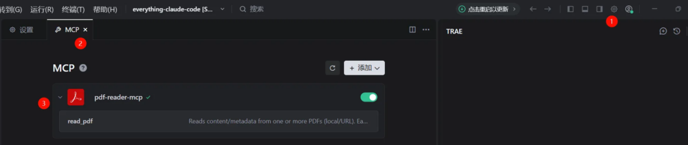
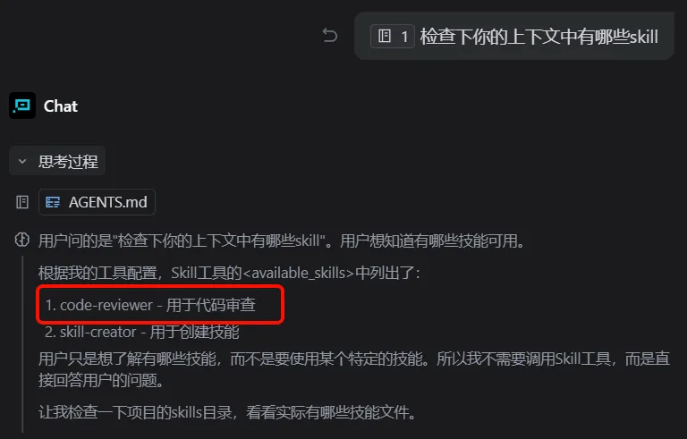
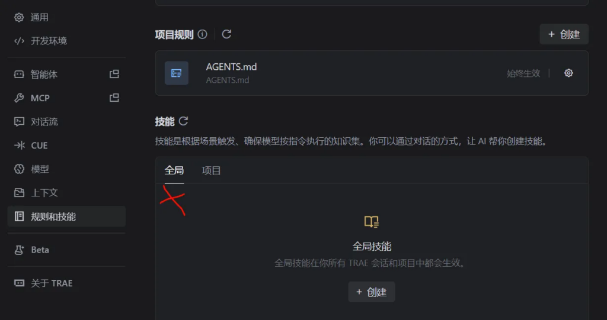

# 前言

现在有很多大模型：chatgpt、通义千问（Qwen）、豆包（Doubao-Seed）等。

大模型发展到现在，我直接使用 google 搜索引擎的频率，降低了很多。

使用大模型的编辑器，比如 cursor、Trae ，挺好。（微软的 vscode，是一个改变生态的编辑器。）

本文简单介绍下 Trae 中，如何使用 MCP 和 skill。

我对这些新东西不咋会用，感觉有点落后于时代了。

# Agent, MCP 和 skill 简介

相关链接：[Hello-Agents](https://datawhalechina.github.io/hello-agents/#/)

"MCP" 和 "skill" 是两个名词。本节简单介绍下这两个名词。详细内容，见上面链接。

## Agent 简介

[大型语言模型](https://zh.wikipedia.org/wiki/%E5%A4%A7%E5%9E%8B%E8%AF%AD%E8%A8%80%E6%A8%A1%E5%9E%8B)（large language model，LLM）能够预测人类语言语料库中固有的句法、语义，且展示出相当多训练期间“记住”的关于世界的常识。

现在，我希望 LLM 做这样的事情：请根据今天的天气，给我推荐下本地的旅游景点。

LLM 是无法直接完成这件事的。

我们创建了一个名为 Agent（智能体）的程序，来做这件事。

1. Agent 告诉 LLM：

- 我当前有一套外部工具的接口，query_weather()、tourist_attractions_information()。
- 当我给你输入一段文字的时候，你感觉需要调用哪个接口时，请务必返回接口的名词。
- 请你实现“根据今天的天气，给我推荐下本地的旅游景点”

1. LLM 接受到上面的内容后，回复：你调用下 "query_weather"
2. Aagent 收到回复后：

1. 解析字符串，发现要调用 query_weather。
2. 于是 Agent 这个程序调用这个函数，并返回了今天天气信息，比如返回内容为 “晴天，16 度”
3. 然后再次问LLM：“请根据今天的天气，给我推荐下本地的旅游景点”+ “今天晴天，16 度”

1. LLM 接受到上面的内容后，回复调用 “tourist_attractions_information”
2. Aagent 收到回复后：

1. 解析字符串，发现要调用 tourist_attractions_information
2. 于是 Agent 这个程序调用这个函数，并返回热门的景点信息，比如“故宫，八达岭，颐和园”
3. 然后再次问LLM：“请根据今天的天气，给我推荐下本地的旅游景点”+ “今天晴天，16 度” + “本地的景点有故宫，八达岭，颐和园”
4. LLM 接受到上面的内容后回复：建议去八达岭长城吧，气候正事宜，巴拉巴拉。

整体流程可能是这样，网上是这么说的。

则，我们现在可以给 agent 做功能定义了：能够根据目标，自主规划，调用工具，并执行一系列行动来完成任务的 AI 系统。

## MCP 简介

详细请阅读： [第十章 智能体通信协议](https://datawhalechina.github.io/hello-agents/#/./chapter10/%E7%AC%AC%E5%8D%81%E7%AB%A0%20%E6%99%BA%E8%83%BD%E4%BD%93%E9%80%9A%E4%BF%A1%E5%8D%8F%E8%AE%AE)

> MCP（Model Context Protocol）用于 Agent 与工具的标准化通信。它提供了一套标准化的接口规范，让智能体能够以统一的方式访问各种外部服务，而无需为每个服务编写专门的适配器。这就像互联网的 TCP/IP 协议，它让不同的设备能够相互通信。

日常我们使用/提到 MCP 的话，更多的是 MCP 服务。即，与 Agent 交互的外部服务。

## skill 简介

详细请阅读：[hello-agents/Extra-Chapter/Extra05-AgentSkills解读.md](https://github.com/datawhalechina/hello-agents/blob/main/Extra-Chapter/Extra05-AgentSkills%E8%A7%A3%E8%AF%BB.md)

> Agent Skills 是一种标准化的程序性知识封装格式。如果说 MCP 为智能体提供了"手"来操作工具，那么 Skills 就提供了"操作手册"或"SOP（标准作业程序）"，教导智能体如何正确使用这些工具。
> 
> 
> 
> 
> 
> 这种设计理念源于一个简单但深刻的洞察：连接性（Connectivity）与能力（Capability）应该分离。MCP 专注于前者，Skills 专注于后者。这种职责分离带来了清晰的架构优势：
> 
> 
> 
> 
> 
> 
> MCP 的职责：提供标准化的访问接口，让智能体能够"够得着"外部世界的数据和工具
> 
> 
> 
> Skills 的职责：提供领域专业知识，告诉智能体在特定场景下"如何组合使用这些工具"
> 
> 
> 
> 
> 用一个类比来理解：MCP 像是 USB 接口或驱动程序，它定义了设备如何连接；而 Skills 像是软件应用程序，它定义了如何使用这些连接的设备来完成具体任务。你可以拥有一个功能完善的打印机驱动（MCP），但如果没有告诉你如何在 Word 里设置页边距和双面打印（Skill），你仍然无法高效地完成打印任务。

# Trae 中 MCP 和 skill 的使用

详细见官方文档[什么是 TRAE ？ - 文档 - TRAE CN](https://docs.trae.cn/ide/what-is-trae?_lang=zh)

## MCP 的使用

按需添加吧，和安装插件的流程差不多。

比如，我们使用 Trae 看代码的时候，希望将 pdf 的官方资料，添加到 Agent 的上下文中，这个 MCP 就很方便。



## skill 的使用

比如，我们想在 Trae CN 中 使用 [gemini-cli/.gemini/skills/code-reviewer/SKILL.md](https://github.com/google-gemini/gemini-cli/blob/main/.gemini/skills/code-reviewer/SKILL.md) 这个 skill，进行代码 review。因为这是一个比较通用的 skill，我希望它可以全局使用，我可以将其放入到家目录下。

```
root@localhost ~/.trae-cn# pwd
/root/.trae-cn
root@localhost ~/.trae-cn# mkdir -p skills/code-reviewer
root@localhost ~/.trae-cn# cd skills/code-reviewer/
```



注意，因为我是通过 remote ssh 方式开发的。所以，当我希望全局使用某个 skill 的时候不，我需要将其放到家目录下。

注： remote ssh 方式下，下面这样上传 skill 不起作用。


