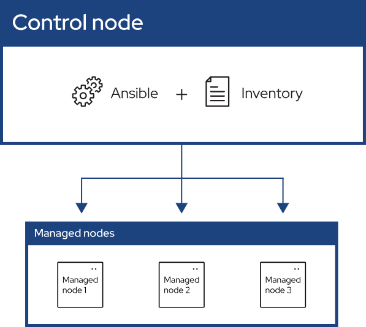

# 前言

编译一个大型的C项目时，安装项目的依赖库是一件麻烦的事情。

1. 项目没有明确说明需要哪些库。所以在编译前，我们不知道需要哪些依赖库。当编译失败时，根据提示安装需要的库。
2. 常用的 Linux 开发环境有两大类：centos系 和 debian 系。这两种 Linux 系统上，相同的库的名称可能还不相同。有的还需要设置源(repo)才能安装需要的库。有的库可能还需要下载安装。
3. 如果项目比较优雅，它会提供命令，或者脚本，或者构建目标的方式来安装依赖库。有没有什么更优雅的方式来安装这些库呢。

最近，我看到 `ansible` 这个工具。它可以用来一条命令，为多台命令部署环境。

同样的， `ansible` 也可以用一条命令，为当前主机部署环境。 `ansible` 可以让我们免于痛苦的写shell脚本。



# Ansible 的简单使用

参考：[Getting started with Ansible — Ansible Community Documentation](https://docs.ansible.com/ansible/latest/getting_started/index.html)

## Ansible的安装

参考：[Installation Guide — Ansible Community Documentation](https://docs.ansible.com/ansible/latest/installation_guide/index.html)

```
# 国内使用清华源
# python3 -m pip install -i <https://pypi.tuna.tsinghua.edu.cn/simple> --upgrade pip

# python3 -m pip install ansible
## 但是安装完会提示不建议这样安装。建议安装在venv中
## WARNING: Running pip as the 'root' user can result in broken permissions and conflicting behaviour with the system package manager. It is recommended to use a virtual environment instead: <https://pip.pypa.io/warnings/venv>

# 参考官方文档，可以：<https://docs.python.org/zh-cn/3.13/tutorial/venv.html>
## dnf install python3.12
## python3.12 -m venv python312_venv
## source python312_venv/bin/activate
## python3 -m pip install ansible

# 使用 pipx 是最方便的了
pipx install --include-deps ansible
```

## 创建一个**inventory**

参考：[Building an inventory — Ansible Community Documentation](https://docs.ansible.com/ansible/latest/getting_started/get_started_inventory.html) 、[How to build your inventory — Ansible Community Documentation](https://docs.ansible.com/ansible/latest/inventory_guide/intro_inventory.html)

`ansible` 通过 `inventory` 文件中记录了主机的位置，可以使用一条命令管理大量主机。`inventory` 有 `ini` 和 `YAML` 两种格式。我比较喜欢 `YAML` 格式。这里创建一个 `inventory.yaml` 文件。

```
myhosts:
  hosts:
    virtualbox-ubuntu24-02:
      ansible_host: 10.0.2.4
      ansible_port: 22
      ansible_user: root
```

- `myhosts` 是我们自定义的group。 `virtualbox-ubuntu24-02` 表示我这台机器的名称。
- **`ansible_host`** ：主机名
- **`ansible_port`** ：连接的端口(默认值是22)
- `ansible_user` ：连接主机时使用的用户名。

更多连接主机时的参数可见上面的链接。

接下来，我们来验证下我们的inventory文件是否合法。

```
root@localhost ~/w/ansible_quickstart# ansible-inventory -i inventory.yaml --list
```

`ping` 下 `myhosts` 组下的机器，看下网络通不通。

```
root@localhost ~/w/ansible_quickstart# ansible myhosts -m ping -i inventory.yaml
```

## 创建一个playbook

参考：[Creating a playbook — Ansible Community Documentation](https://docs.ansible.com/ansible/latest/getting_started/get_started_playbook.html) 、[Using Ansible playbooks — Ansible Community Documentation](https://docs.ansible.com/ansible/latest/playbook_guide/index.html)

`playbook` 是 `YAML` 格式的自动化蓝图， `ansible` 使用它来部署和配置托管节点。

我们创建一个 playbook-1.yaml 文件。它在 myhosts 组的机器上安装 `sl` 命令。 `ansible.builtin.apt` 模块的使用可见：[ansible.builtin.apt module – Manages apt-packages — Ansible Community Documentation](https://docs.ansible.com/ansible/latest/collections/ansible/builtin/apt_module.html)

```
- name: My first play
  hosts: myhosts
  tasks:
   - name: install sl
     ansible.builtin.apt:
       name: sl
       state: present
```

接下来，执行下面的命令，应用上面的任务。(注意：当前机器需要可以免密登陆 myhosts 中的机器。)

```
ansible-playbook -i inventory.yaml playbook-1.yaml
```

# ansible在本地安装软件

`ansible` 的初衷是一次在多个远程机器上部署环境。

`ansible` 也可以在本地安装。 `hosts` 上指定 [`localhost`](http://localhost) 就行。

```
- name: My first play
  hosts: localhost
  tasks:
   - name: install sl
     ansible.builtin.apt:
       name: sl
       state: present
```

# 最后

`ansible` 的优点是可以同时为多个机器部署环境。但是如果仅仅只为一台机器部署环境，它确实有些退回了 shell 即能满足的功能。

`ansible` 在本质上是有些类似于 `Dockfile` 的。因为它们都是在其他文件系统中部署内容。

对于单台机器而言，化繁为简的使用 shell 也许才是更好的选择。

# 更多阅读

- `ansible` 的官方文档：[https://docs.ansible.com/ansible/latest/index.html](https://docs.ansible.com/ansible/latest/index.html)
- `ansible` 的名词解释： [https://docs.ansible.com/ansible/latest/getting_started/basic_concepts.html](https://docs.ansible.com/ansible/latest/getting_started/basic_concepts.html)

# 附录

## 不同的架构/系统，执行不同的任务

参考：[](https://docs.ansible.com/ansible/latest/playbook_guide/playbooks_reuse_roles.html)[Conditionals — Ansible Community Documentation](https://docs.ansible.com/ansible/latest/playbook_guide/playbooks_conditionals.html) 、[ansible.builtin.import_tasks module – Import a task list — Ansible Community Documentation](https://docs.ansible.com/ansible/latest/collections/ansible/builtin/import_tasks_module.html#ansible-collections-ansible-builtin-import-tasks-module)

```
root@virtualbox ~/w/ansible-tutorial# tree
.
├── playbook-rhel.yaml
├── playbook-ubuntu.yaml
└── playbook.yaml

# playbook.yaml
---
- name: My first play
  hosts: localhost
  tasks:
    - name: Include playbook for Debian-based systems
      include_tasks: playbook-ubuntu.yaml
      when: ansible_facts['distribution'] == "Ubuntu"

    - name: Include playbook for RHEL-based systems
      include_tasks: playbook-rhel.yaml
      when: ansible_facts['distribution'] == "RedHat"

# playbook-ubuntu.yaml
---
- name: Task for Ubuntu/Debian
  apt:
      name: sl
      state: present

# playbook-rhel.yaml
---
- name: Task for Ubuntu/Debian
  yum:
      name: sl
      state: present
```


This content is licensed under a [Creative Commons Attribution 4.0 International license.](https://creativecommons.org/licenses/by/4.0/)
