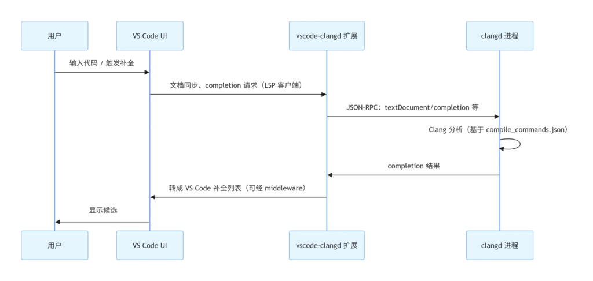
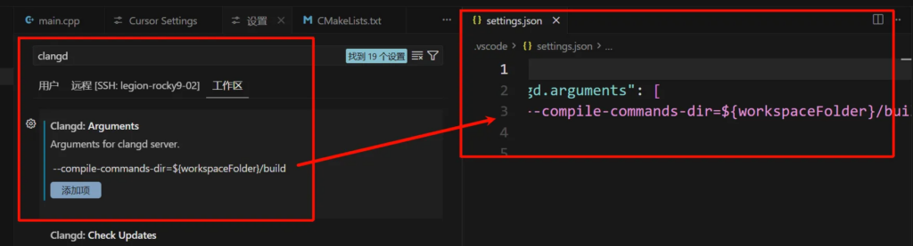
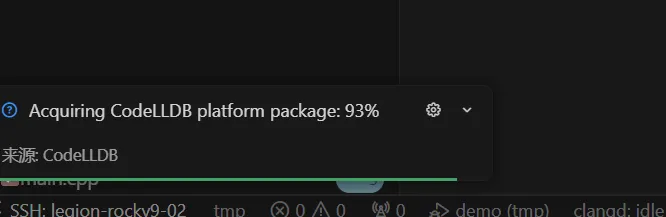
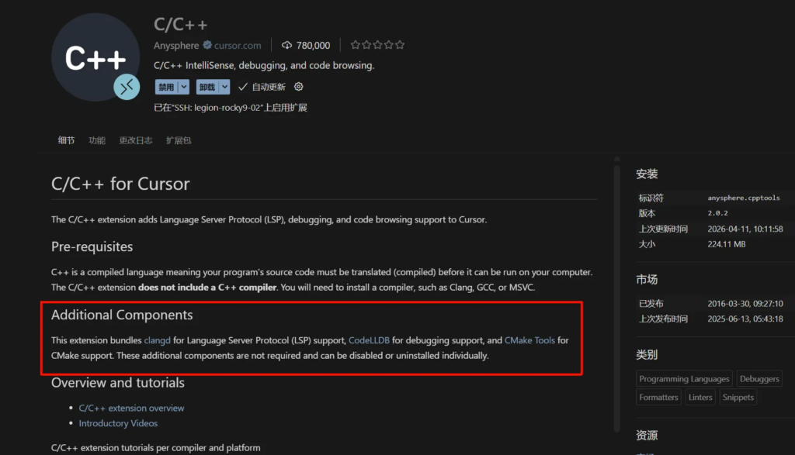

# 前言

cursor 中无法使用 [microsoft C/C++](https://marketplace.visualstudio.com/items?itemName=ms-vscode.cpptools) 插件。

没有这个插件，在 cursor 中看 C/C++ 的代码非常不便。

在同事的推荐下，使用了 [clangd](https://marketplace.visualstudio.com/items?itemName=llvm-vs-code-extensions.vscode-clangd) 插件来进行代码阅读。

clangd 挺好用的。本文记录下 clangd 的使用过程。

# clangd 的基本使用

我们先不管 clangd 的是什么。我们先看看它怎么用：[Getting started](https://clangd.llvm.org/installation)

clangd 的使用分为三步：

- 安装 clangd
- 为编辑器安装 clangd 插件
- 告诉 clangd ，我们的项目是如何编译的。

## install clangd

```
root@rocky-02 ~/w/3rd# clangd --version
clangd version 19.1.7 (RESF 19.1.7-1.el9)
Features: linux
Platform: x86_64-unknown-linux-gnu; target=x86_64-redhat-linux-gnu
```

## install editor plugins

在 cursor 中，搜索和安装 clangd 扩展。（**确保 Microsoft C/C++ 扩展没有安装。**因为他俩功能上有冲突**。**）

## project setup

我们需要告诉 clangd 我们的项目是如何编译的。

以一个简单的构建过程为例。

这是我们需要构建的源码。

```
#include <iostream>
int main() {
  std::cout << "Hello, World!" << std::endl;
  return 0;
}
```

这是我们的 cmake 文件。

```
CMAKE_MINIMUM_REQUIRED(VERSION 3.20)
PROJECT(demo VERSION 1.0.0 LANGUAGES CXX)
ADD_EXECUTABLE(${PROJECT_NAME} main.cpp)
```

构建的使用，[CMAKE_EXPORT_COMPILE_COMMANDS](https://cmake.org/cmake/help/latest/variable/CMAKE_EXPORT_COMPILE_COMMANDS.html)选项，以生成 `compile_commands.json` 文件。compile_commands.json 是 [JSON Compilation Database](https://clang.llvm.org/docs/JSONCompilationDatabase.html) 规范的实现文件，以 JSON 格式记录项目中每个源文件的完整编译命令，是代码分析工具的核心配置文件。

```
root@rocky-02 ~/w/s/tmp# mkdir build && cd build
root@rocky-02 ~/w/s/t/build# cmake .. -DCMAKE_EXPORT_COMPILE_COMMANDS=ON
root@rocky-02 ~/w/s/t/build# make
```

查看生成的 `compile_commands.json` 文件。

```
root@rocky-02 ~/w/s/t/build# cat compile_commands.json 
[
{
  "directory": "/root/work/self/tmp/build",
  "command": "/opt/rh/gcc-toolset-14/root/usr/bin/c++    -o CMakeFiles/demo.dir/main.cpp.o -c /root/work/self/tmp/main.cpp",
  "file": "/root/work/self/tmp/main.cpp",
  "output": "CMakeFiles/demo.dir/main.cpp.o"
}
]⏎     
```

clangd 会在您编辑的文件的父目录中查找 `compile_commands.json` 文件，同时也会在名为 `build/` 的子目录中查找。例如，如果正在编辑 `$SRC/gui/window.cpp` 文件，则会依次在 `$SRC/gui/` 、 `$SRC/gui/build/` 、 `$SRC/` 、 `$SRC/build/` … 等目录中搜索。

# vscode-clangd 和 clangd 之间的关系

## Language Server 简述

[Language Server](https://learn.microsoft.com/zh-cn/visualstudio/extensibility/language-server-protocol?view=visualstudio) 是一种专用的扩展机制，通过 Language Server Protocol (LSP) 在编辑器（客户端）和分析工具（服务端）之间进行通信。它实现了跨语言的智能功能，如自动补全、错误诊断、跳转定义和代码重构，使轻量级编辑器具备强大的 IDE 能力。

LSP 通信通常是两个进程之间的交互。VS Code 插件（客户端）启动并管理一个外部的语言服务器进程（服务端）。它们之间采用基于 JSON-RPC 的 LSP 协议 交互。支持自动补全 (Completion)、错误检查与诊断 (Diagnostics)、跳转到定义 (Go to Definition)。

通过 LSP，同一种语言的服务端可以被轻松移植到其他支持 LSP 的 IDE（如 Vim, Emacs）中。

## vscode-clangd 和 clangd 之间的关系

clangd 是一个 language server 。vscode-clangd 和 clangd 的交互时序大体如下。



即，`vscode-clangd`会启动一个 `clangd`的服务。启动的时候，可以指定 `clangd`启动参数。通常来说，我们不需要指定参数，使用默认值即可。

有时候会用到。比如我们生成的 `compile_commands.json` 文件，不在 `clangd` 的搜索路径中。。我们可以在启动 `clangd`的时候，指定下启动参数。



# clangd more

## 使用 bear 记录构建过程

`CMAKE_EXPORT_COMPILE_COMMANDS` 只为通过 CMake 原生规则（如 add_library/add_executable）编译的单元生成条目。`add_custom_command`调用 `clang` 不会出现在 compile_commands.json 文件中。比如这个示例 [FindBpfObject.cmake](https://github.com/libbpf/libbpf-bootstrap/blob/master/tools/cmake/FindBpfObject.cmake) 。

但是 [Bear](https://github.com/rizsotto/Bear) 可以。它通过 LD_PRELOAD 预加载库，劫持系统的 exec 调用。构建过程中所有编译器（gcc/clang）调用都被捕获。 过滤、整理后，生成 `compile_commands.json`文件。

```
root@rocky-02 ~/w/s/d/4/build (laboratory)# bear -- make
```

## 配置

`.clang` 是一个 YAML 格式的配置文件。它可以对 `compile_commands.json`中记录的编译过程，进行微调。偶尔会用到。比如下面这个(注意，这个 相对路径 `.`是构建目录，而不是源码目录。)

```
CompileFlags:
  Add: [-I.]
```

啥意思呢。比如， `compile_commands.json` 中记录的是 `clang xxx.c`。

添加这个 `.clang`配置后，就相当于 `clang -I. xxx.c`

大多数时候不需要设置。用到的时候，可以参考 [Configuration](https://clangd.llvm.org/config)

# 其他

## CodeLLDB

~~使用 `clangd`后，我们无法再使用 Microsoft C/C++ 扩展。所以，也没法使用 C/C++ 扩展来调试代码了。~~

我们可以使用 [CodeLLDB](https://marketplace.visualstudio.com/items?itemName=vadimcn.vscode-lldb) 进行代码调试。

有点需要注意的是。Visual Studio Code 的 CodeLLDB 扩展被拆分为两个部分：一个轻量级前端（即扩展本身）和一个平台特定的后端（即调试器适配器）。所以，我们第一次使用该插件的时候，会弹出 出"acquiring codelldb platform package"



由于网络原因，我们下载的时候，可能会卡住，或者很慢 [stuck on "Acquiring CodeLLDB platform package" when installing in WSL VSCode · Issue #805 · vadimcn/codelldb](https://github.com/vadimcn/codelldb/issues/805)

所以，这个扩展，我们也可以离线安装：[VSCode: Acquiring CodeLLDB platform package 速度慢_wx62c2d17f67691的技术博客_51CTO博客](https://blog.51cto.com/u_15707179/5442598)

## C/C++ for Cursor extension

我们可以直接安装这个扩展。安装这个扩展的时候，cursor 会自动拉取并安装 clangd、CodeLLDB、CMake Tools

本质，还是 clangd 扩展提供 IntelliSense 功能。

调试的时候，我试了下，直接使用使用 C/C++ extension 提供的调试功能，把CodeLLDB 禁用了，也可以继续调试。


