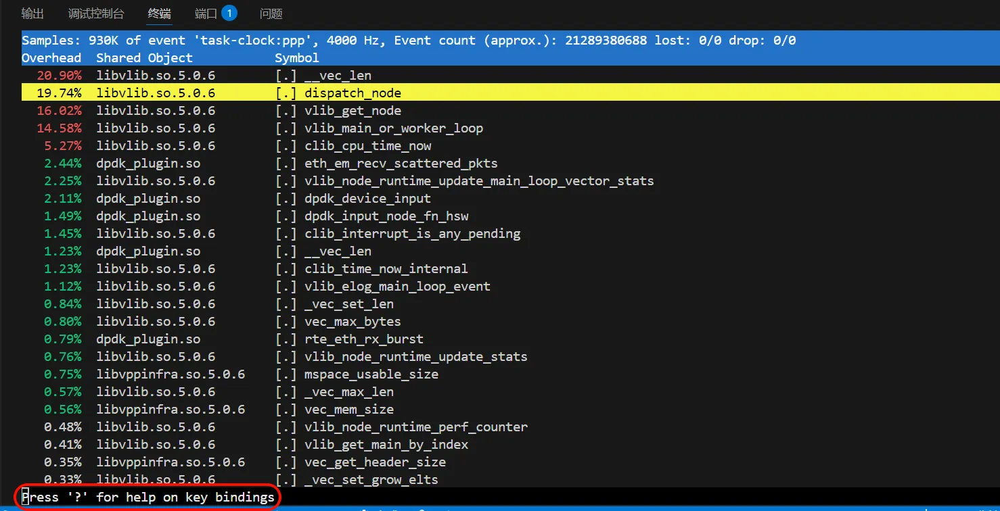
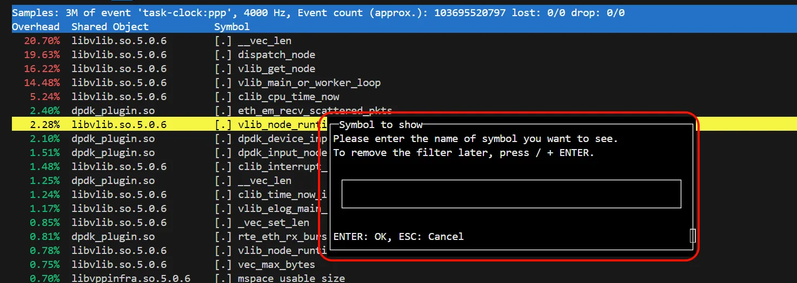
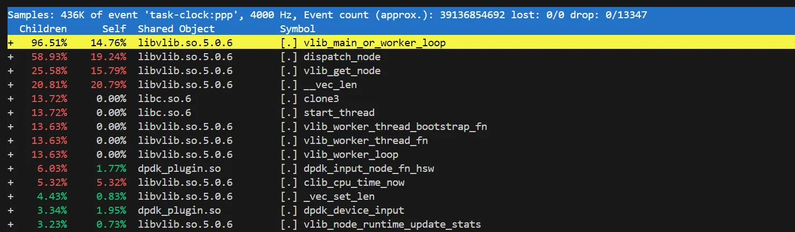
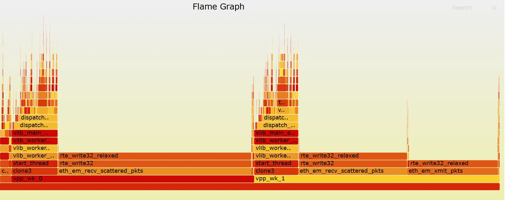

# perf 是什么

[perf](https://perfwiki.github.io/main/) 是linux上的性能分析工具，挺好的工具。但是这个工具的命令还是有些复杂。通常情况下，特定的场景中，知道几个常用的操作即可。本文介绍如何使用perf查找热点代码。

# 准备工作

使用是 perf 的安装。

```
dnf install perf
```

我们通常使用perf对一个程序进行性能分析。我们得知道如何查看这个进程得PID，以及这个进程的每个线程ID。

```
# 一个进程的pid
[root@localhost vpp] ps -aux | grep vpp
[root@localhost vpp] pidof vpp
740280

# 查看一个进程有哪些线程
[root@localhost vpp] ps -T -p 740280
 740280  740280 ?        00:00:02 vpp_main
 740280  740463 ?        00:00:44 vpp_wk_0
 740280  740464 ?        00:00:44 vpp_wk_1
```

接下来，我们看下 `perf` 的基本使用。下面的内容逻辑比较跳跃，为使用时顺手记录。

# perf top 的使用

```
# 查看进程的性能

## 不同的方式查看性能
perf top -h
Usage: perf top [<options>]
  -C, --cpu <cpu>       list of cpus to monitor
  -p, --pid <pid>       profile events on existing process id
  -t, --tid <tid>       profile events on existing thread id

 
## 查看指定pid的性能
perf top -p 740280
```



当前页面 输入 ？可以查看帮助信息。我唯一常用得功能是，通过 “/” 找到符号。



有时候我们会看到 `__vec_len` 这个基础函数占用了大量的CPU。这个基础函数，被不同的函数调用。如果我们想知道比较高层次的函数的CPU使用情况。我们可以再加一些参数，函数堆栈的层次显示CPU的使用情况。

```
perf top -p 740280 --call-graph dwarf
```



# perf 生成火焰图

通常我们使用 `perf top` 实时查看性能情况。有时候，我们想把性能情况分享给他人查看，我们可以使用perf 生成火焰图。下面有两种方式，这两种方式本质应该是一种。使用方式二即可。

方式一

```
dnf install 
#perf record -p 740280 --call-graph dwarf
perf record -p 740280 -e cpu-clock --call-graph dwarf

git ： <https://github.com/brendangregg/FlameGraph.git>
perf script | ./FlameGraph/stackcollapse-perf.pl | ./FlameGraph/flamegraph.pl > perf.svg
```

方式二: [Chapter 25. Getting started with flamegraphs | Red Hat Product Documentation](https://docs.redhat.com/en/documentation/red_hat_enterprise_linux/9/html/monitoring_and_managing_system_status_and_performance/getting-started-with-flamegraphs_monitoring-and-managing-system-status-and-performance#getting-started-with-flamegraphs_monitoring-and-managing-system-status-and-performance)

```
dnf install js-d3-flame-graph
perf script flamegraph -p 740280 sleep 10
```



# 虚拟机中使用perf

如果有运行的时候报错，或者无法收集信息，可以参考：[vmware中的perf报错 – da1234cao](vmware-perf-error.md)

# 其他

## top的使用

perf 似乎无法看到每个CPU的使用情况。比如，我有一个进程，这个进程有非常多的线程，每个线程都设置了不同CPU的亲和性。我想查看是不是每个CPU都被使用了？是否有“一核有难，多核围观”的情况。这时候我们可以使用top。

注：如果不喜欢top，也可以尝试下htop。

还是使用top吧。htop 查看线程名不太方便。我们也不需要记住top的操作，直接问AI即可。

### top 如何按照CPU进行排序

- 在 `top` 运行时，按下 `f` 进入字段管理界面。这里您可以浏览所有可用的字段，并通过上下箭头选择您想要添加到显示或者作为排序依据的字段。
- 按下 `s` 可以设置当前高亮的字段为排序依据。
- 使用 `d` 或空格键可以切换字段是否显示在主界面中。
- 完成选择后按 `q` 返回主界面。

### top中显示线程名

- 在top运行时，按下 `H`

### top中查看CPU的使用情况

- 在top运行时，按下 `1` 。

```
# 至于每个参数的含义，问下ai
## id 表示 空闲(idle)时间的百分比
%Cpu0  :  0.0 us,  0.3 sy,  0.0 ni, 99.3 id,  0.0 wa,  0.3 hi,  0.0 si,  0.0 st
%Cpu1  :  1.7 us,  0.3 sy,  0.0 ni, 97.3 id,  0.0 wa,  0.3 hi,  0.3 si,  0.0 st
%Cpu2  : 99.2 us,  0.0 sy,  0.0 ni,  0.0 id,  0.0 wa,  0.8 hi,  0.0 si,  0.0 st
%Cpu3  : 98.3 us,  0.4 sy,  0.0 ni,  0.0 id,  0.0 wa,  0.8 hi,  0.4 si,  0.0 st
```

### 查看一个线程使用多少CPU

top 好像无法查看一个线程使用了多少CPU了。问下AI。

```
ps -mo pid,tid,%cpu,psr -p <PID>

ps -T -p 778143
    PID    SPID TTY          TIME CMD
 778143  778143 ?        00:00:58 vpp_main
 778143  778195 ?        00:00:00 dpdk-intr
 778143  778321 ?        00:36:14 vpp_wk_0 # 这个线程
 778143  778322 ?        00:36:13 vpp_wk_1
 
 root@localhost ~/w/3rd# ps -mo pid,tid,%cpu,psr -p 778143
    PID     TID %CPU PSR
 778143       -  200   -
      -  778143  2.6   1
      -  778195  0.0   1
      -  778321 99.2   2 # 正在使用2号CPU.使用了99.2的CPU
      -  778322 99.1   3
```

我们要特别注意线程亲和性的继承。避免多个线程亲和一个CPU。
