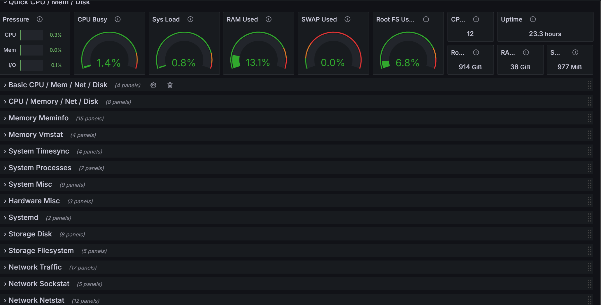

# 前言

参考：

- [Getting started with Prometheus | Prometheus](https://prometheus.io/docs/tutorials/getting_started/)
- [Install Grafana | Grafana documentation](https://grafana.com/docs/grafana/latest/setup-grafana/installation/)

`node_exporter` 用来获取机器的信息。

`prometheus` 通过http请求，拿到这些信息。

`Grafana` 可以将这些信息渲染成好看的图表。

# rocky9上软件的安装与配置

## prometheus 的安装与配置

```
dnf search prometheus
dnf install golang-github-prometheus

root@bogon ~# systemctl status prometheus.service
○ prometheus.service - Monitoring system and time series database
     Loaded: loaded (/usr/lib/systemd/system/prometheus.service; disabled; preset: disabled)
     Active: inactive (dead)
       Docs: https://prometheus.io/docs/introduction/overview/
             man:prometheus(1)

# 通过服务我们能查看到配置文件位置，启动参数等
# cat /usr/lib/systemd/system/prometheus.service

# prometheus 配置文件位置是 /etc/prometheus/prometheus.yml
```

配置的含义可参考官方文档。访问该机器的 9090 端口，查看 prometheus 有没有安装成功。

## node_exporter 的安装与配置

我们来安装下 `node_exporter` 。

```
dnf install golang-github-prometheus-node-exporter

root@rocky9-nas ~ [4]# systemctl status node_exporter.service 
○ prometheus-node-exporter.service - Prometheus exporter for machine metrics
     Loaded: loaded (/usr/lib/systemd/system/prometheus-node-exporter.service; disabled; preset: disabled)
     Active: inactive (dead)
       Docs: https://github.com/prometheus/node_exporter
```

浏览器里访问 `http://ip:9100/metrics` 测试 `node_exporter` 是否获取到节点的监控指标。

## Grafana 的安装与配置

```
dnf install grafana

root@rocky9-nas ~# systemctl status grafana-server.service
● grafana-server.service - Grafana instance
     Loaded: loaded (/usr/lib/systemd/system/grafana-server.service; enabled; preset: disabled)
     Active: active (running) since Fri 2025-09-05 21:17:16 CST; 12h ago
       Docs: http://docs.grafana.org
   Main PID: 10035 (grafana)
      Tasks: 24 (limit: 35796)
     Memory: 130.1M
        CPU: 35.363s
     CGroup: /system.slice/grafana-server.service
             ├─10035 /usr/sbin/grafana server --config=/etc/grafana/grafana.ini --pidfile=/var/run/grafana/grafana-server.pid --packaging=rpm cfg:default.>
             └─10048 /usr/share/performancecopilot-pcp-app/datasources/redis/pcp_redis_datasource_linux_amd64
```

之后，我们导入数据源，为数据源添加dashboard。效果是瓜瓜的好。



# 附录

## 问题处理 - grafana 添加 prometheus 数据源失败

1. 报错信息。

```
Post "http://192.168.38.255:9090/api/v1/query": dial tcp 192.168.38.255:9090: connect: permission denied - There was an error returned querying the Prometheus API.
```

1. 查看 grafana 日志。

```
localhost.localdomain grafana[3555]: {"@level":"warn","@message":"Failed to get prometheus buildinfo","err":"error querying resource: Get \"http://192.168.38.255:9090/api/v1/status/buildinfo\": dial tcp 192.168.38.255:9090: connect: permission denied","logger":"tsdb.prometheus"}
localhost.localdomain grafana[3555]: {"@level":"warn","@message":"Failed to get prometheus heuristics","err":"failed to get buildinfo: error querying resource: Get \"http://192.168.38.255:9090/api/v1/status/buildinfo\": dial tcp 192.168.38.255:9090: connect: permission denied","logger":"tsdb.prometheus"}
localhost.localdomain grafana[3555]: logger=context userId=1 orgId=1 uname=admin level=info msg="Request Completed" method=GET path=/api/datasources/uid/ee3789f8-e70e-459f-b7a6-a085a029d326/health status=400 remote_addr=192.168.38.219 time_ms=1 duration=1.42902ms size=196 referer=http://192.168.38.255:3000/connections/datasources/edit/ee3789f8-e70e-459f-b7a6-a085a029d326 handler=/api/datasources/uid/:uid/health
```

这个错误表明：Grafana 无法通过网络访问 Prometheus 服务（192.168.38.255:9090），原因不是“连接拒绝”（connection refused），而是 permission denied —— 这通常不是网络不通，而是系统级权限或安全策略阻止了连接。

1. 当前的系统是 rocky9。查看下 SELinux 的状态。

```
root@localhost ~# sestatus
SELinux status:                 enabled
SELinuxfs mount:                /sys/fs/selinux
SELinux root directory:         /etc/selinux
Loaded policy name:             targeted
Current mode:                   enforcing
Mode from config file:          enforcing
Policy MLS status:              enabled
Policy deny_unknown status:     allowed
Memory protection checking:     actual (secure)
Max kernel policy version:      33
```

SELinux 有三种运行模式：enforcing，强制执行安全策略，任何违反策略的行为都会被阻止并记录日志；permissive，不强制执行策略，违规行为仅记录日志但允许执行。disabled，SELinux 完全关闭，不加载任何策略。当前 SELinux 处于强制模式。

1. 查看是否是 SELinux 导致的拒绝。

```
# SELinux 通过内核的审计子系统（audit）来发送这些日志消息。
# 具体来说，当发生拒绝时，SELinux 会产生一条 AVC (Access Vector Cache) denial 消息。
# 简单说：SELinux 负责“判断是否允许”，而 auditd 负责“把判断结果（特别是拒绝）记下来”

# ausearch: 这是 Linux Audit（审计）系统的命令行工具，用于查询和搜索由 auditd 守护进程记录的审计日志。
# -m avc: 这个选项指定搜索的消息类型（message type）为 AVC。
# -ts recent: 这个选项指定搜索的时间范围。recent: 是一个预定义的时间关键词，通常指最近几分钟内的日志
ausearch -m avc -ts recent

# 可以看到，确实是selinux拒绝的访问请求
type=AVC msg=audit: avc:  denied  { name_connect } for  pid=3555 comm="grafana" dest=9090 scontext=system_u:system_r:grafana_t:s0 tcontext=system_u:object_r:websm_port_t:s0 tclass=tcp_socket permissive=0
```

Grafana 进程（在 grafana_t 域中）尝试连接 TCP 端口 9090，但该端口被标记为 websm_port_t 类型，而 SELinux 策略不允许 grafana_t 域连接 websm_port_t 类型的端口，因此连接被拒绝。

1. 如何解决这个问题。

```
# ai 给出的解决方案
## 但是这个方案不太优雅。
## 因为这个配置不是 promethes或者grafana的一部分
## 当环境交由他人维护的时候，或者排查问题的时候，很难找到这个点
# semanage port -a -t prometheus_port_t -p tcp 9090

# 网上应该有其他方法
# https://socketdaddy.com/linux/selinux-blocking-grafana-connection-how-i-fixed-it/
# https://community.grafana.com/t/grafana-no-database-access-possible-after-fedora-upgrade-connect-permission-denied/138012/10

getsebool -a | grep grafana 
grafana_can_reverse_proxy --> off
grafana_can_tcp_connect_elasticsearch_port --> off
grafana_can_tcp_connect_mysql_port --> off
grafana_can_tcp_connect_postgresql_port --> off
grafana_can_tcp_connect_prometheus_port --> off

setsebool -P grafana_can_tcp_connect_prometheus_port on
```

有时间得了解下，如何通过安装包的方式，优雅的添加和设置这些选项。
