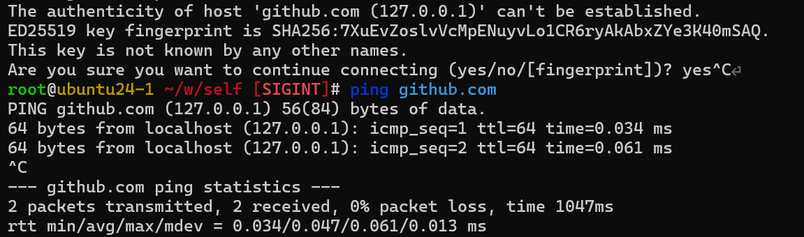

# 问题描述

早上准备敲敲代码，从github上拉仓库时，提示我输入密码。

尝试了几次后，我定睛一看，域名解析不对。域名被污染。



# 问题解决思路

最终级的解决方案肯定时把DNS解析过程给代理出去。

但是，我感觉，这里换一个DNS服务器应该就没问题了。我当前的环境时ubuntu24。所以我来刷新下DNS解析缓存，换个DNS服务器试试。

```
resolvectl --help
resolvectl status
resolvectl statistics
resolvectl flush-caches

# 还是不行，得换dns服务器了
root@ubuntu24-1 ~/w/self# resolvectl query -4 github.com
github.com: 127.0.0.1                          -- link: ens33
-- Information acquired via protocol DNS in 14.1ms.
-- Data is authenticated: no; Data was acquired via local or encrypted transport: no
-- Data from: network

# 这个配置不是持久化的。
resolvectl dns ens33 8.8.8.8
root@ubuntu24-1 ~/w/self# resolvectl query -4 github.com
github.com: 20.205.243.166                     -- link: ens33
-- Information acquired via protocol DNS in 47.0ms.
-- Data is authenticated: no; Data was acquired via local or encrypted transport: no
-- Data from: network

# 持久化下
netplan set ethernets.ens33.nameservers.addresses=["114.114.114.114","8.8.8.8"]
netplan apply
```

DNS的问题解决了，但是我现在不想敲代码了，哈哈。

# reference

- [linux 静态ip的配置 – da1234cao](configuring-a-static-ip-on-linux.md)
