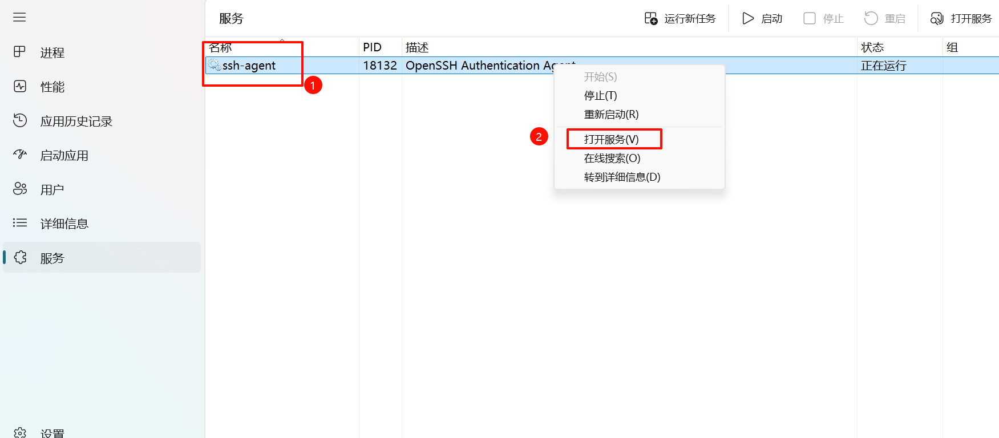
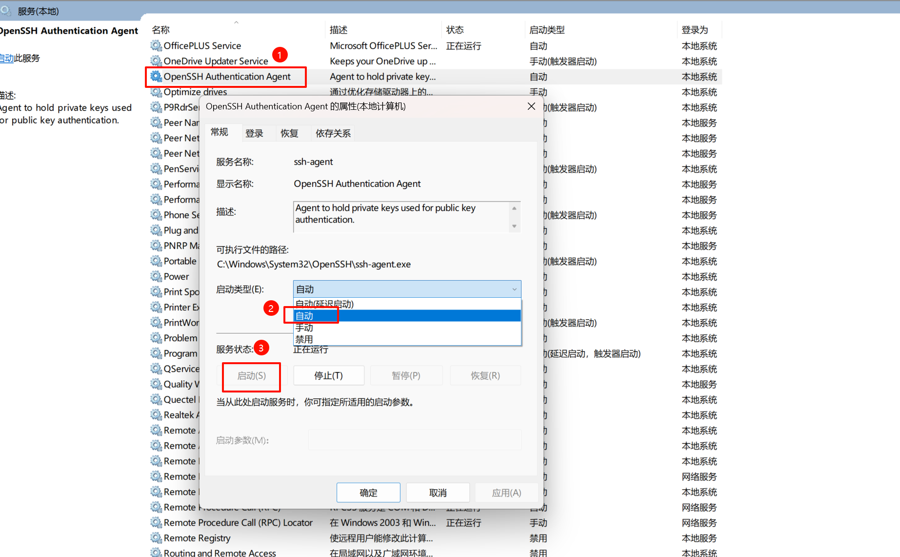
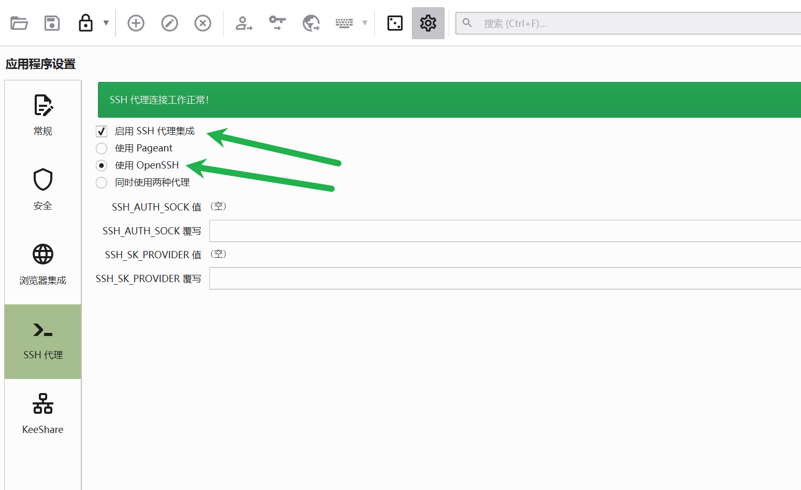
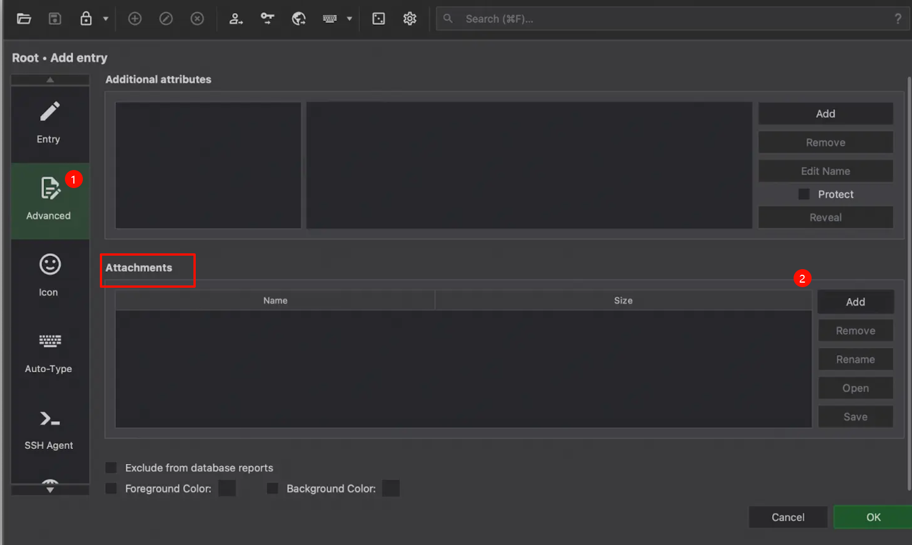
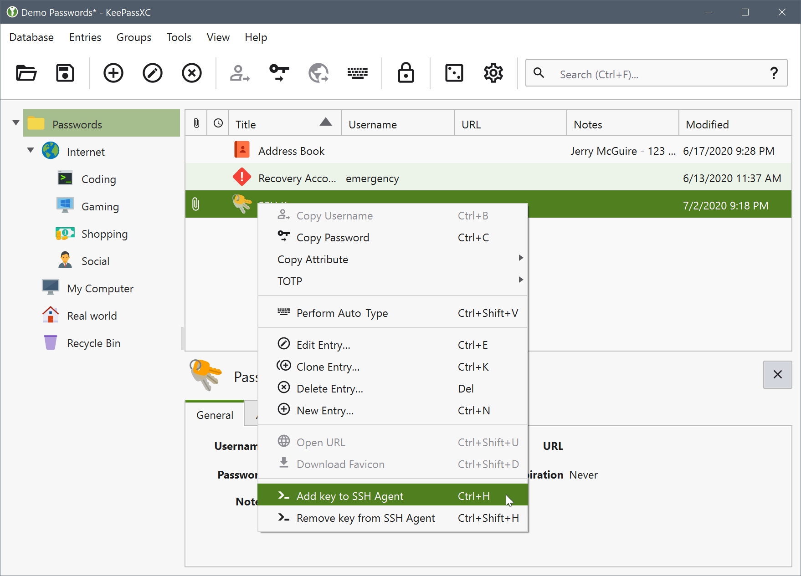

# 背景介绍

我日常在windows上，通过 vscode 的 remote ssh 到服务器上编程。为了在服务器上进行代码的拉取和推动，我将私钥上传一份到服务器上。

1. 可是服务器有多个，特别是开启多个虚拟机的时候，逐个上传私钥是个不安全的事情。
2. 为了安全起见，不同组的服务器，我使用了不用的私钥。
3. 私钥的命名没做好，就会忘记哪个私钥对应哪组服务器。
4. 我又不乐意用密码，特别是弱密码。

摸索了摸索，今天终于有了一套非常便捷的密钥管理与使用方法，步骤如下：

1. 创建一个密钥对。并将公钥上传到不同的服务器上。
通常情况下，一对密钥足够应对所有场景了。因为我们仅仅将公钥在网上分发。私钥始终安全。
如果真的有需要使用多个密钥对，主要做好文件命名。
2. 将这个密钥，放在 keepass xc 中保存，并做好配置。
解锁数据库的时候，密钥自动加载到 ssh agent中。
锁定数据库的时候，密钥自动从 ssh agent 中移除。
keepass 的数据库中存在在坚果云中。意味着，一份密钥，可以在不同主机间自动同步。
3. 配置 `~/.ssh/config` 文件。
所有的服务器都能通过密钥免密登录。
**服务器上无需上传任何私钥。在推拉仓库的时候，通过 `ForwardAgent` ，将服务器需要的验证转发到本地**。

# 密钥对的创建与公钥的上传

相关链接：[Git管理多个SSH密钥-CSDN博客](https://yanzhenjie.blog.csdn.net/article/details/69487932)

```
ssh-keygen -t rsa -b 4096 -C "id_rsa_common"

# 所有密钥场景，均使用这一份密钥

# 将公钥拷贝到服务器的这个文件中 ~/.ssh/authorized_keys
# 有多个服务器的话，每个公钥都上传一份就好。

# 这个公钥也上传一份到github上
```

# 将密钥存放在keepass xc 中

相关链接：[keepass密码管理器使用 – da1234cao](using-keepass-password-manager.md) 、[KeePass如何搭配坚果云实现多设备同步？ | 坚果云帮助中心](https://help.jianguoyun.com/?p=3348)

## windows上启用ssh-agent服务

首先打开任务管理器，找到ssh-agent 服务。



然后启动这个服务，并设置为开机自启。



## keepassxc 配置 ssh agent

操作配置配置来自：[KeePassXC: User Guide — KeePassXC: User Guide](https://keepassxc.org/docs/KeePassXC_UserGuide#_ssh_agent_integration) 、[KeePassXC to easily and securely manage your SSH Keys](https://cloud.theodo.com/en/blog/ssh-keys-keepassxc) 、[linux – How do I use KeePassXC as an SSH agent? – Super User](https://superuser.com/questions/1595123/how-do-i-use-keepassxc-as-an-ssh-agent)

首先设置中要开启 SSH 代理。



然后添加附件。这个附件可供后面的步骤使用。



然后创建新条目，或在编辑模式下打开现有条目。在 password 字段中设置密钥文件的密码。转到高级类别并附加您以前生成的密钥文件。转到 SSH 代理类别(1)并从列表(2)中选择附件。按 OK 接受条目。根据您选择的选项，KeePassXC 将加载密钥并显示它以供使用。


如果选择不在数据库解锁时自动加载密钥，则可以使用条目列表中的上下文菜单手动使密钥可用。



之后在命令行，可以通过 `ssh-add -l` 来验证密钥是否添加成功。

# 配置 `~/.ssh/config` 文件

相关链接：[ssh_config(5) - Linux manual page](https://man7.org/linux/man-pages/man5/ssh_config.5.html)

比如我现在有两条机器。配置可以如下。

```
Host legion-rocky9-01
    HostName 192.168.1.11
    User root
    ForwardAgent yes

Host legion-rocky9-02
    HostName 192.168.1.4
    User root
    ForwardAgent yes
```

此时，由于 ssh-agent，我们可以免密登录机器。

```
ssh legion-rocky9-02
```

**`ForwardAgent` 指定是否将与身份验证代理的连接转发到远程计算机（因为我们现在已经登录了服务器，所以远程计算机是我们的本地）**。

**我们可以直接在服务器上使用git拉取仓库。当有身份验证的时候，请求转发到本地。而本地使用了ssh-agent，所以我们在服务器上，即使服务器上没有对应的git私钥，我们也能顺利的拉取仓库代码**。
