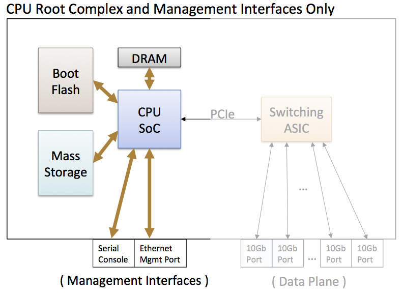

# 前言

详细内容见官方文档： [Overview — Open Network Install Environment documentation](https://opencomputeproject.github.io/onie/overview/index.html)

这里仅仅简单随笔记录下。

# ONIE是什么？

- ONIE(Open Network Install Environment) 由 引导程序，linux内核和 busybox 组成。可以认为它是一个小的Linux操作系统。
- 这个小的Linux操作系统，接管基本的硬件。

# ONIE有什么用？

- 网络硬件可以在出厂的时候安装上专有的操作系统。但是之后想更换操作系统可能有点麻烦？
- ONIE安装在网络硬件上。之后，可以通过ONIE更加便捷的安装的其他操作系统。

# 移植ONIE适配自家的网络硬件难吗？

- 需要编译内核适配自家的网络硬件设备。
- 对于普通的开发人员挺难。但是如果公司里面有内核开发人员，那不难。

This content is licensed under a [Creative Commons Attribution 4.0 International license.](https://creativecommons.org/licenses/by/4.0/)
