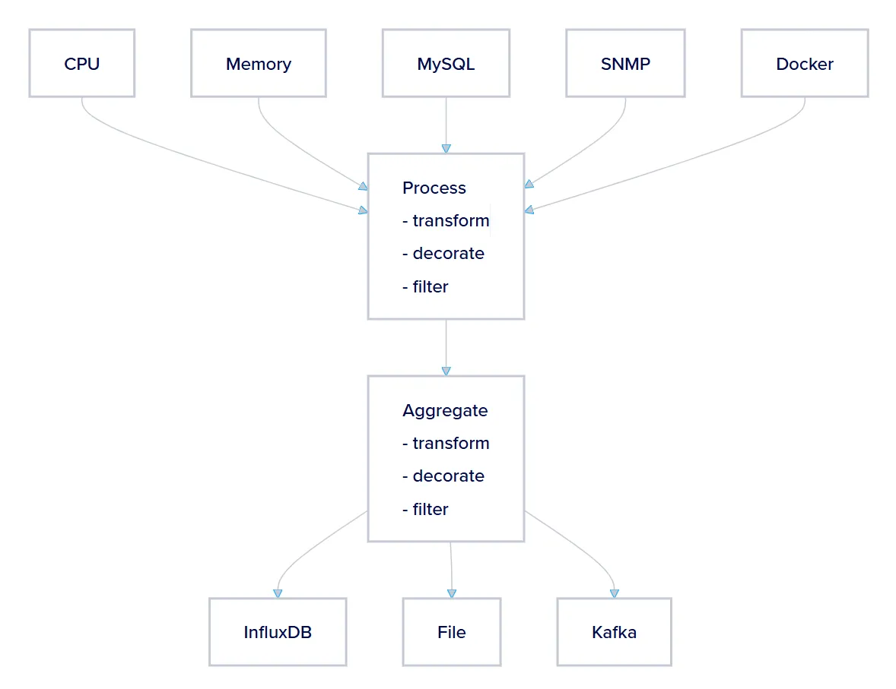
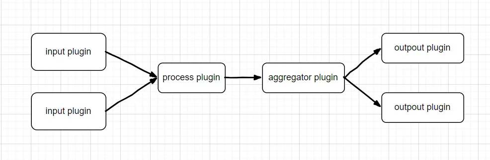

# 前言

网路场景中，为了极致的压榨性能，会选用 DPDK 这类 kernal bypass 机制：[DPDK and Kernel Bypass: When Microseconds Matter More Than Your Sanity - The Internet Papers](https://theinternetpapers.com/posts/dpdk-and-kernel-bypass-when-microseconds-matter-more-than-your-sanity.html)

> 性能提升是实实在在的。我们谈论的是在现代硬件上每秒处理 1000 万到 1 亿个数据包的速率。延迟从几十微秒降低到个位数微秒。

那 DPDK 比 kernel 快多少呢？[Linux Kernel vs DPDK: HTTP Performance Showdown | talawah.io](https://talawah.io/blog/linux-kernel-vs-dpdk-http-performance-showdown/)

> 即使操作系统和应用程序被优化到极致，DPDK 的性能仍然比内核网络栈高出 51%。

DPDK 是对单台机器性能的极限压榨。然后，在一个机房里面，有上百台机器被同时压榨。（可怜的机器 -v-）

上百台机器运行状态的查看和管理，可能得依赖 prometheus 。prometheus 这套工具的使用链是：exporter -> prometheus -> grafana。（从产品角度出发， DPDK + 云原生工具， 比较好）

最近，我看了下 [Telegraf](https://docs.influxdata.com/telegraf/v1/) 的使用。telegraf 是 InfluxDB 生态中的一部分。InfluxDB 和 prometheus 差不多吧：[Prometheus vs InfluxDB](https://uptrace.dev/comparisons/prometheus-vs-influxdb)

本文简单介绍下 telegraf 。

# telegraf 简介

## 基本结构

telegraf 是一个 agnet 程序。它能够收集并发送来自数据库、系统和物联网传感器的指标和事件。



telegraf 是一个插件驱动的 agent。它支持四类插件：输入插件、输出插件、聚合插件和处理器插件。



## 简单使用

### telegraf 的安装

参考：[Install Telegraf | Telegraf Documentation](https://docs.influxdata.com/telegraf/v1/install/)

我日常使用的是 rocky9 的系统。在 rocky 上的安装方式如下。

```
cat <<EOF | sudo tee /etc/yum.repos.d/influxdata.repo
[influxdata]
name = InfluxData Repository - Stable
baseurl = https://repos.influxdata.com/stable/\$basearch/main
enabled = 1
gpgcheck = 1
gpgkey = https://repos.influxdata.com/influxdata-archive.key
EOF

dnf install telegraf
```

### telegraf 的简单使用

编辑下 telegraf 的配置 `/etc/telegraf/telegraf.conf`

比如下面这个没啥意义的写法。

- [PromQL Input Plugin](https://docs.influxdata.com/telegraf/v1/input-plugins/promql/) ，从 prometheus 中提取数据
- [Prometheus Output Plugin](https://docs.influxdata.com/telegraf/v1/output-plugins/prometheus_client/)，输入的数据，可以通过 prometheus output 创建的 exporter 输出。

```
[[inputs.promql]]
  url = "http://{YOUR_PROMETHEUS_IP}:9090"

  [[inputs.promql.instant]]
    query = "{METRIC}"

[[outputs.prometheus_client]]
  listen = ":9273"
  path = "/metrics"
  metric_version = 2
```

telegraf 已经提供了不少 plugin 了。

如果既有的插件不满足要求的话，我们可以创建自己的 plugin：[Integrate with external plugins](https://docs.influxdata.com/telegraf/v1/configure_plugins/external_plugins/) 、[telegraf/EXTERNAL_PLUGINS.md at master](https://github.com/influxdata/telegraf/blob/master/EXTERNAL_PLUGINS.md)

### 其他

业务性的代码，AI 的编程能力比我好的多。

之前，在其他场景下，我用 go 写过一个 exporter。现在回头看，质量不好。

我瞄了下 telegraf 的 exporter 代码，明显它的更好：[telegraf/plugins/outputs/prometheus_client at master · influxdata/telegraf](https://github.com/influxdata/telegraf/tree/master/plugins/outputs/prometheus_client)
