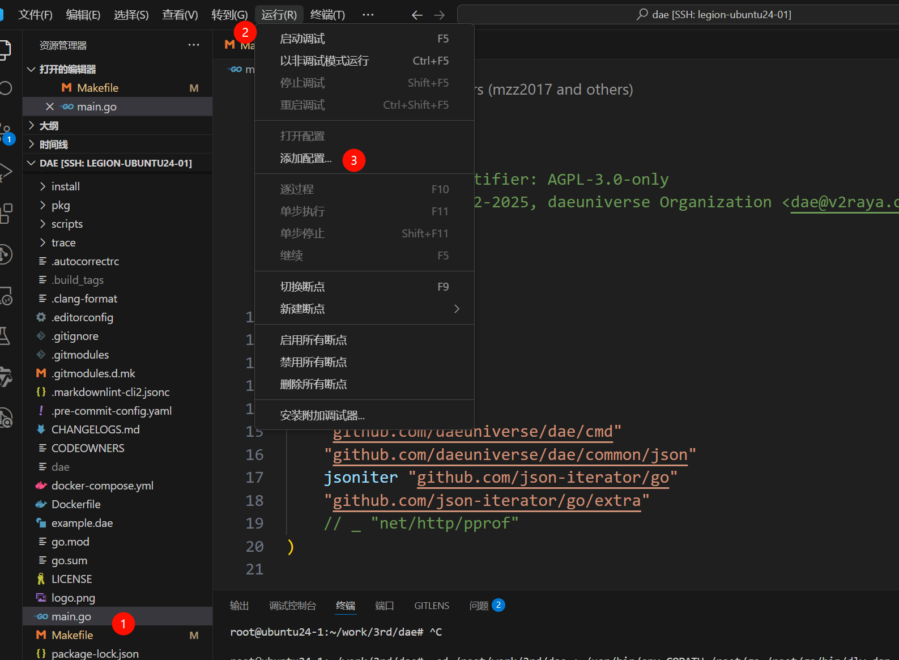
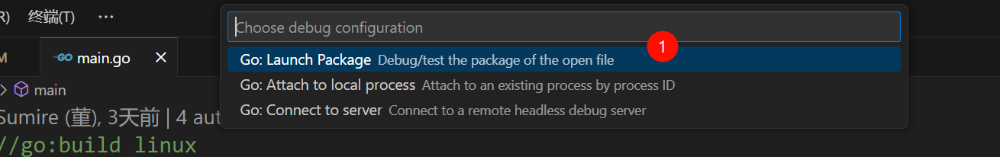
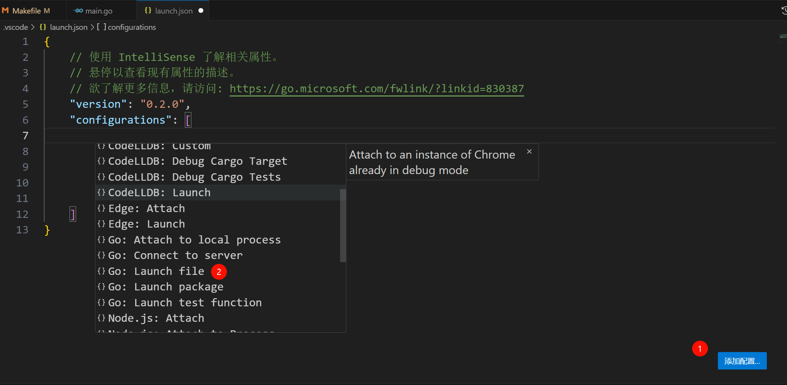
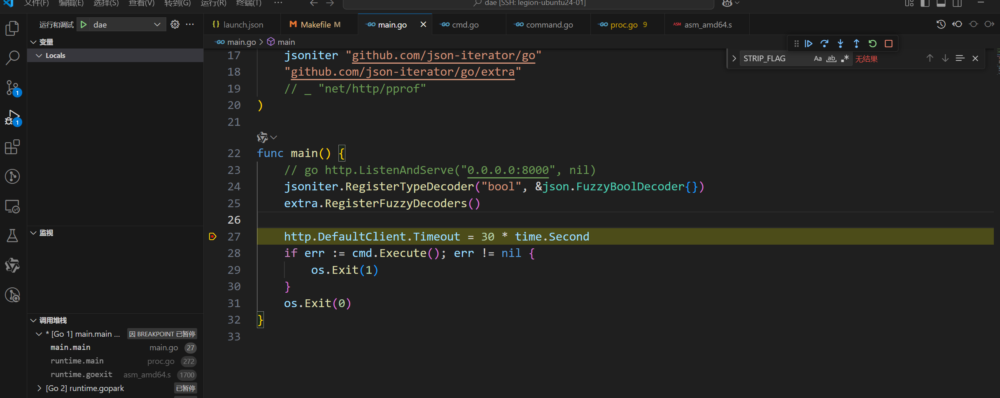

# dae的使用

[daeuniverse/dae](https://github.com/daeuniverse/dae/tree/main) 基于 eBPF 的 Linux 高性能透明代理解决方案。

安装与使用过程参考：[简单易用的Linux研发网络全面加速方案](https://gameapp.club/post/2024-02-24-speed-up-your-network/#%E9%85%8D%E7%BD%AE)

## dae 的安装

首先是安装。 一些系统支持包管理器安装，见 [dae-Quick Start Guide](https://github.com/daeuniverse/dae/blob/main/docs/en/README.md)。

我当前的系统是ubuntu24.04 不支持管理器直接安装。 [daeuniverse/dae-installer](https://github.com/daeuniverse/dae-installer) 提供了脚步安装。

```
sudo sh -c "$(wget -qO- https://github.com/daeuniverse/dae-installer/raw/main/installer.sh)" @ install
```

我是把仓库拉下来安装的。

```
proxychains git clone https://github.com/daeuniverse/dae-installer.git
code dae-installer/
proxychains ./installer.sh help
proxychains ./installer.sh install

----------------------------------------------------------------------
----------------------------------------------------------------------
dae have been installed/updated, installed version:
v0.9.0
You can start dae by running:
systemctl start dae.service
You can enable dae service so it can be started at system boot:
systemctl enable dae.service # systemd 服务方式
----------------------------------------------------------------------
----------------------------------------------------------------------
Your configuration file is:
/usr/local/etc/dae/config.dae # 配置文件位置
And this file should be read by root only, you should
change the permission of this file by running:
chmod 600 /usr/local/etc/dae/config.dae
----------------------------------------------------------------------
----------------------------------------------------------------------

systemctl show -p FragmentPath dae.service
FragmentPath=/etc/systemd/system/dae.service # 具体的程序启动方式
```

## dae 的配置文件

下面是我的配置。具体的配置含义，可参考 [dae/docs/en/configuration at main · daeuniverse/dae](https://github.com/daeuniverse/dae/tree/main/docs/en/configuration)

```
root@ubuntu24-1 ~# cat /usr/local/etc/dae/config.dae 
global {
    lan_interface: ens33
    wan_interface: auto
    log_level: info
    auto_config_kernel_parameter: true
    dial_mode: domain
    allow_insecure: false
}

subscription {
}

node {
    ladder: 'xxx'
}

group {
    self_proxy {
        policy: fixed(0)
    }
}

dns {
  upstream {
    alidns: 'udp://dns.alidns.com:53'
    googledns: 'tcp+udp://dns.google:53'
  }
  routing {
    request {
      qname(geosite:cn) -> alidns
      fallback: googledns
    }
    response {
        upstream(googledns) -> accept
        fallback: accept
    }
  }
}

routing {
    pname(NetworkManager) -> direct
    dip(geoip:private) -> direct
    ip(geoip:cn) -> direct
    domain(geosite:cn) -> direct
 
    fallback: self_proxy
}                                 
```

## 注意事项

如果希望通过 dae 代理本机的流量，需要配置 `wan_interface` 。这个配置要求内核版本 `>=5.17`。

```
# ubuntu24 内核版本
6.8.0-60-generic

# rocky9.5 内核版本
5.14.0-503.14.1.el9_5.x86_64
```

所以，rocky9.5 -- 最新的rocky版本，无法使用 `wan_interface` 配置。

# dae的源码编译

## 源码编译

参考：[build-by-yourself.md at main · daeuniverse/dae](https://github.com/daeuniverse/dae/blob/main/docs/en/user-guide/build-by-yourself.md)

首先是配置下go代理，避免拉模块拉不动。参考：[Golang设置网络代理 - 知乎](https://zhuanlan.zhihu.com/p/572151744)

```
go env -w GOPROXY=https://goproxy.cn,direct
```

然后是安装依赖与构建。

```
apt install clang llvm golang-go make

git clone https://github.com/daeuniverse/dae.git
cd dae
git submodule update --init
make
```

## vscode 中调试dae代码

默认编译出来的二进制文件没有调试符号，也去除了路径信息，无法调试。我们稍微修改下Makefile。

```
BUILD_ARGS := -trimpath -ldflags "-s -w -X github.com/daeuniverse/dae/cmd.Version=$(VERSION) -X github.com/daeuniverse/dae/common/consts.MaxMatchSetLen_=$(MAX_MATCH_SET_LEN)" $(BUILD_ARGS)

# 移除其中的 -trimpath -s -w
## -trimpath: 去掉编译过程中生成的可执行文件以及中间文件中的导入路径信
## -s：此选项会禁止生成符号表（symbol table）
## -w：该选项会禁止生成调试信息
BUILD_ARGS := -gcflags="all=-N -l" -ldflags "-X github.com/daeuniverse/dae/cmd.Version=$(VERSION) -X github.com/daeuniverse/dae/common/consts.MaxMatchSetLen_=$(MAX_MATCH_SET_LEN)" $(BUILD_ARGS)
```

```
make NOSTRIP=y
```

然后是如何配置在vscode中调试go。

首先安装[Go in Visual Studio Code](https://code.visualstudio.com/docs/languages/go)插件。Go 扩展通过使用 [Delve](https://github.com/go-delve/delve?tab=readme-ov-file)调试器让你能够调试 Go 代码。

在 VS Code 中调试 Go 程序 详细过程可参考：[debugging · golang/vscode-go Wiki](https://github.com/golang/vscode-go/wiki/debugging) 。这个文档太长了，我大概摸索了下，和调试 C 程序的流程差不多。

第一步，在一个go的tab上，点击“运行”-“添加配置”。



第二步，我是调试本地文件，所以选第一个。



然后生成下面的 `launch.json` 文件。点击“添加配置”。选择 “Launch file"。



然后，编辑按需编辑配置即可。比如下面这个配置。

```
{
    // 使用 IntelliSense 了解相关属性。 
    // 悬停以查看现有属性的描述。
    // 欲了解更多信息，请访问: https://go.microsoft.com/fwlink/?linkid=830387
    "version": "0.2.0",
    "configurations": [
        {
            "name": "dae",
            "type": "go",
            "request": "launch",
            "mode": "exec",
            "program": "${workspaceFolder}/dae",
            "cwd": "${workspaceFolder}",
            "args": [
                "run",
                "-c",
                "/usr/local/etc/dae/config.dae",
            ],
            "stopOnEntry": true,
            "console": "integratedTerminal",
        }
    ]
}
```

之后就可以调试代码了。



# 最后

今天是端午节，则在敲电脑呢？
