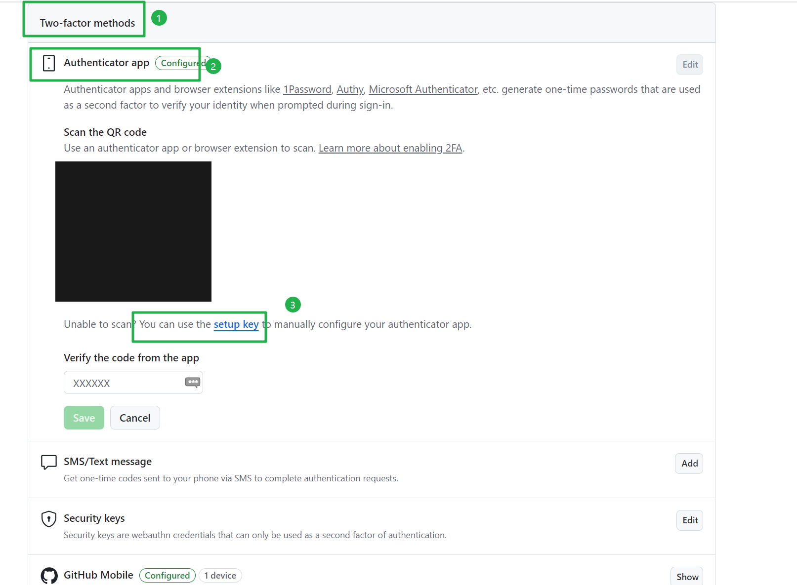
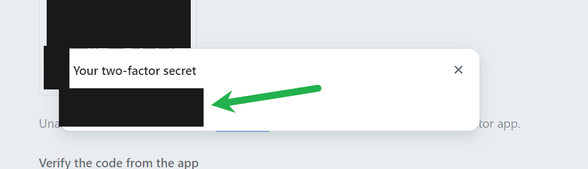
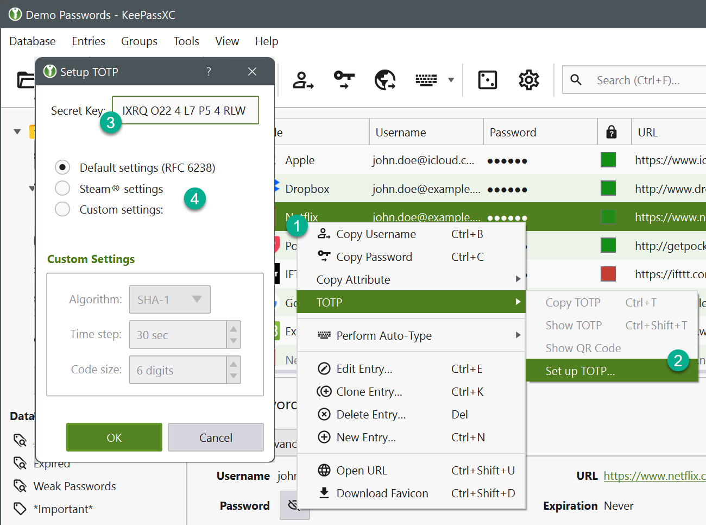
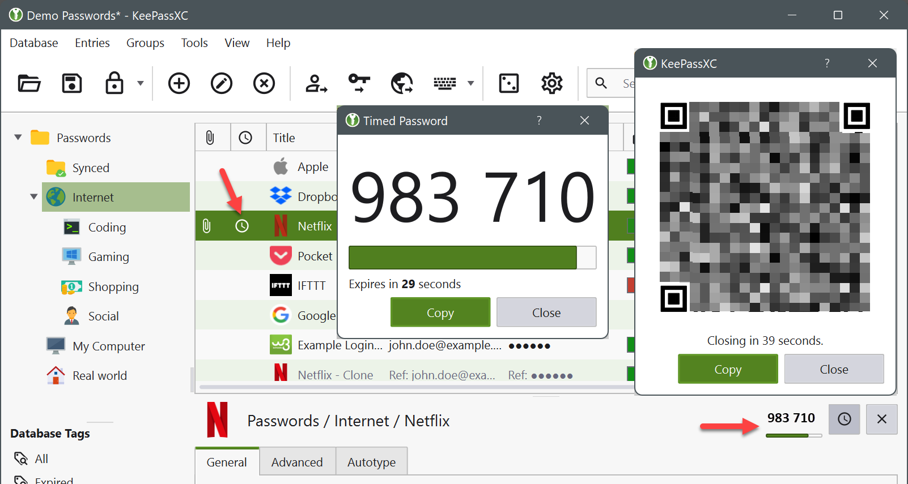
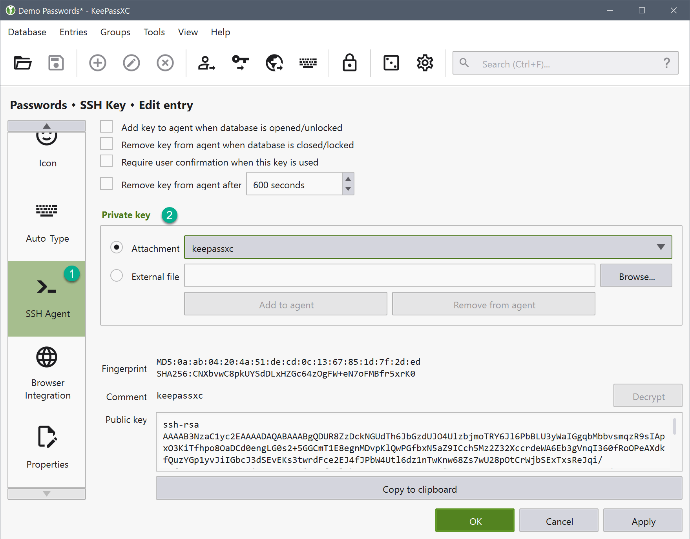

# 前言

三年前，我开始使用keepass管理密码：[keepass密码管理器使用_keepassxc 自动填充-CSDN博客](https://blog.csdn.net/sinat_38816924/article/details/119886873)

但是那时候，我不太会使 keepassxc 的浏览器插件。所以，我一直在浏览器中也存储着一份密码。

这不好。我最近重新尝试了下 keepassxc 的浏览器插件，好使的很。

所以这里简单记录下。

# 软件安装

电脑端使用的是 keepassxc，支持全平台：[Download – KeePassXC](https://keepassxc.org/download/#windows)

也从上面的链接中安装下 浏览器插件。

安卓端，我一直使用的是 keepass2android 。

# keepassxc 的一些使用技巧

密码文件可以考虑使用坚果云的webdev同步。这些操作都比较常见。我来介绍点不常见的。

## keepassxc 作为 github 的2FA 验证器

1. 

它的原理也简单。github会生成一个字符串，包含程序名、用户、secret字符串。这个secret字符串，只有我和服务方知道。keepassxc 使用这些内容，去申请一个 TOTP (Time based One Time Password, 动态口令)。TOTP有效期很短，通常只有30秒。然后，登录github时，使用 TOTP 来验证。

操作来自：[KeePassXC: User Guide --- KeePassXC: User Guide](https://keepassxc.org/docs/KeePassXC_UserGuide#_adding_totp_to_an_entry) 、[使用 KeePassXC 配置 TOTP 作为 GitHub 的 2FA 验证器 - 安装升级与设置 - openSUSE 中文论坛](https://forum.suse.org.cn/t/topic/15776) 、[two factor authentication - Is there a free way to set up GitHub 2FA without a mobile device? - Stack Overflow](https://stackoverflow.com/questions/68824508/is-there-a-free-way-to-set-up-github-2fa-without-a-mobile-device)

第一步，是要在github 上拿到 包含程序名、用户、secret的字符串。

在双因素认证这里，点击 “setup 。



然后复制这里的 secret 。



此时，回到我们 keepassxc 的github 条目上。右键单击所需的条目(1) ，选择 TOTP → Set up TOTP... (2) ，设置对话框将出现。在该对话框中，粘贴网站(3)的密码，设置任何自定义设置(罕见)(4) ，然后按 OK 保存设置。



使用 TOTP 配置条目后，您将在该条目的行中看到一个时钟图标，并能够在预览窗格中显示当前代码。此外，还可以导航到条目的 TOTP 菜单，以在单独的窗口中显示代码。您还可以将该秘密和配置视为二维码，以便导出到移动设备。TOTP 代码可以通过浏览器扩展插件输入到窗体中。



之后，浏览器登录github时，用户名/密码/TOTP都可以自动填充，非常方便。

## keepassxc 配置 ssh agent

ssh-agent 是一种控制用来保存公钥身份验证所使用的私钥的程序，可见 ：[ssh转发代理：ssh-agent用法详解 - 骏马金龙 - 博客园](https://www.cnblogs.com/f-ck-need-u/p/10484531.html)

我日常在linux环境中敲代码。有时候会使用下面方法，避免重复输入私钥的密码。

```

# https://stackoverflow.com/questions/17846529/could-not-open-a-connection-to-your-authentication-agent
eval `ssh-agent -s`
ssh-add ~/.ssh/id_rsa
```

keepassxc 可以将上面的步骤自动话。当打开keepassxc的时候，自动加入密钥。当锁定keepassxc的时候，自动删除密码。更棒的是，这些私钥不用存储在家目录下，可以直接存储在keepassxc中。这样密码，私钥便可使用同一个软件管理。

### windows上启用ssh-agent服务

首先打开任务管理器，找到ssh-agent 服务。


然后启动这个服务，并设置为开机自启。


### keepassxc 配置 ssh agent

操作配置配置来自：[KeePassXC: User Guide --- KeePassXC: User Guide](https://keepassxc.org/docs/KeePassXC_UserGuide#_ssh_agent_integration) 、[KeePassXC to easily and securely manage your SSH Keys](https://cloud.theodo.com/en/blog/ssh-keys-keepassxc) 、[linux - How do I use KeePassXC as an SSH agent? - Super User](https://superuser.com/questions/1595123/how-do-i-use-keepassxc-as-an-ssh-agent)

首先设置中要开启 SSH 代理。


然后添加附件。这个附件可供后面的步骤使用。


然后创建新条目，或在编辑模式下打开现有条目。在 password 字段中设置密钥文件的密码。转到高级类别并附加您以前生成的密钥文件。转到 SSH 代理类别(1)并从列表(2)中选择附件。按 OK 接受条目。根据您选择的选项，KeePassXC 将加载密钥并显示它以供使用。



如果选择不在数据库解锁时自动加载密钥，则可以使用条目列表中的上下文菜单手动使密钥可用。


之后在命令行，可以通过 `ssh-add -l` 来验证密钥是否添加成功。

# 更多阅读

- [KeePassXC: User Guide](https://keepassxc.org/docs/KeePassXC_UserGuide)
