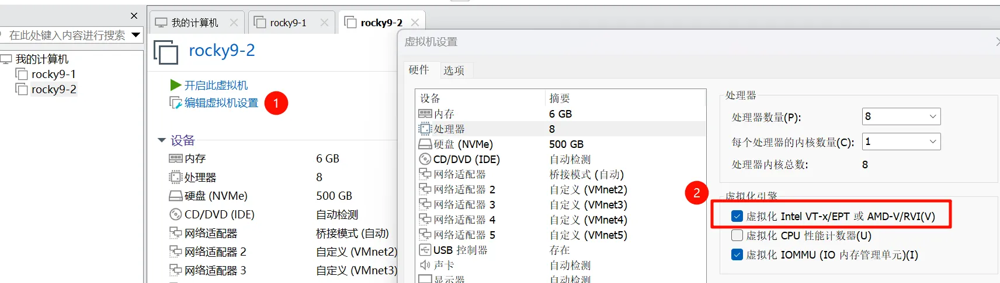
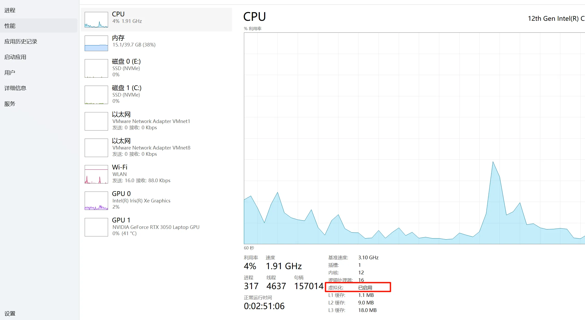
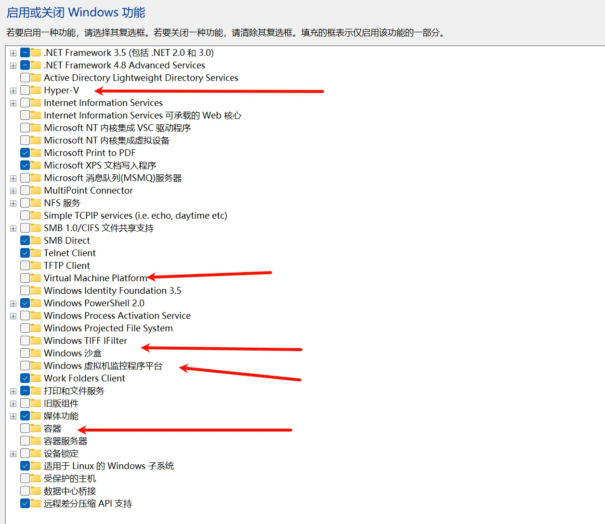
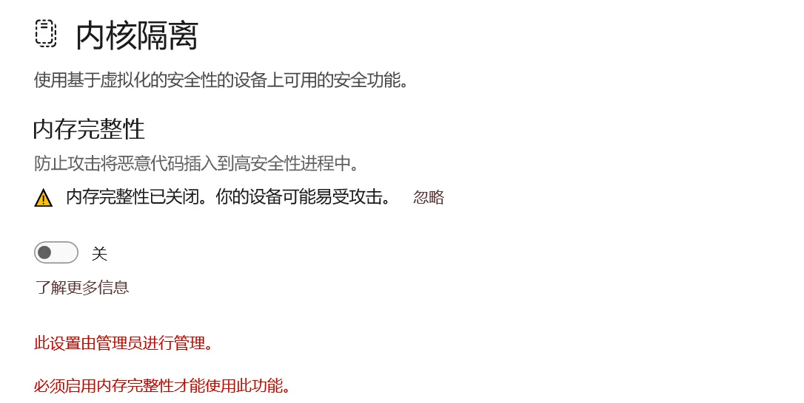

# 问题描述

主机：AMD Ryzen 5 6600H with Radeon Graphics

windows 版本：windows11 24H2

vmware 版本：Workstation 17 Pro 17.6.3

vmware 中的虚拟机：Rocky Linux 9.5

perf 版本：perf version 5.14.0-570.33.2.el9_6.x86_64

```
root@localhost ~/w/tmp# perf record --call-graph dwarf,8192 -C 3
Lowering default frequency rate from 4000 to 1000.
Please consider tweaking /proc/sys/kernel/perf_event_max_sample_rate.

Message from syslogd@localhost at Aug 29 21:58:53 ...
 kernel:Uhhuh. NMI received for unknown reason 20 on CPU 3.

root@localhost ~/w/tmp# dmesg
[14271.258680] Uhhuh. NMI received for unknown reason 30 on CPU 3.
[14271.258684] Dazed and confused, but trying to continue
[14286.386714] vfio-pci 0000:04:00.0: vfio-noiommu device opened by user (vpp:32653)
[14286.463743] vfio-pci 0000:13:00.0: vfio-noiommu device opened by user (vpp:32653)
[14294.853265] Uhhuh. NMI received for unknown reason 20 on CPU 3.
[14294.853269] Dazed and confused, but trying to continue
[14295.338182] Uhhuh. NMI received for unknown reason 10 on CPU 3.
[14295.338186] Dazed and confused, but trying to continue
[14295.711827] Uhhuh. NMI received for unknown reason 00 on CPU 3.
[14295.711831] Dazed and confused, but trying to continue
[14297.713484] Uhhuh. NMI received for unknown reason 30 on CPU 3.
[14297.713488] Dazed and confused, but trying to continue
[14321.806045] Uhhuh. NMI received for unknown reason 20 on CPU 3.
[14321.806050] Dazed and confused, but trying to continue

[14450.054503] ------------[ cut here ]------------
[14450.054884] WARNING: CPU: 3 PID: 0 at arch/x86/events/core.c:1592 x86_pmu_stop+0xa2/0xb0
[14450.054892] Modules linked in: vfio_pci vfio_pci_core vfio_iommu_type1 vfio iommufd tls rfkill vsock_loopback vmw_vsock_virtio_transport_common vmw_vsock_vmci_transport vsock vmw_balloon intel_rapl_msr vmwgfx vmw_vmci intel_rapl_common drm_ttm_helper ttm pcspkr drm_kms_helper i2c_piix4 joydev drm fuse xfs libcrc32c crct10dif_pclmul crc32_pclmul ata_generic crc32c_intel nvme ata_piix ghash_clmulni_intel libata nvme_core nvme_auth vmxnet3 t10_pi serio_raw dm_mirror dm_region_hash dm_log dm_mod
[14450.054928] CPU: 3 PID: 0 Comm: swapper/3 Kdump: loaded Tainted: G     U            -------  ---  5.14.0-503.14.1.el9_5.x86_64 #1
[14450.054931] Hardware name: VMware, Inc. VMware Virtual Platform/440BX Desktop Reference Platform, BIOS 6.00 11/12/2020
[14450.054933] RIP: 0010:x86_pmu_stop+0xa2/0xb0
[14450.054936] Code: 00 a8 01 75 25 83 c8 01 89 83 e0 01 00 00 eb a9 48 89 df e8 20 fe ff ff 83 8b e0 01 00 00 02 5b 5d 41 5c 41 5d e9 e9 e5 ef 00 <0f> 0b eb d7 66 2e 0f 1f 84 00 00 00 00 00 90 90 90 90 90 90 90 90
[14450.054938] RSP: 0018:ffffa38600570e38 EFLAGS: 00010002
[14450.054940] RAX: 0000000000000001 RBX: ffff910b40e6eaf8 RCX: 000000000000002f
[14450.054941] RDX: 0000fffffff930a1 RSI: 0000000000000000 RDI: 0000000000000001
[14450.054942] RBP: ffff910bf7ed9ce0 R08: 0000000000000003 R09: 0000000000000cde
[14450.054944] R10: 00000d242395bec0 R11: 0000000000089007 R12: 0000000000000004
[14450.054945] R13: ffff910bf7ed9ee0 R14: ffffa386000efda8 R15: ffff910b40868000
[14450.054946] FS:  0000000000000000(0000) GS:ffff910bf7ec0000(0000) knlGS:0000000000000000
[14450.054948] CS:  0010 DS: 0000 ES: 0000 CR0: 0000000080050033
[14450.054949] CR2: 00007fa3104d4584 CR3: 00000001243f6000 CR4: 0000000000350ef0
[14450.054952] Call Trace:
[14450.054953]  <IRQ>
[14450.054954]  ? srso_alias_return_thunk+0x5/0xfbef5
[14450.054959]  ? show_trace_log_lvl+0x26e/0x2df
[14450.054965]  ? show_trace_log_lvl+0x26e/0x2df
[14450.054969]  ? perf_adjust_freq_unthr_context+0x121/0x200
[14450.054974]  ? x86_pmu_stop+0xa2/0xb0
[14450.054976]  ? __warn+0x7e/0xd0
[14450.054979]  ? x86_pmu_stop+0xa2/0xb0
[14450.054982]  ? report_bug+0x100/0x140
[14450.054986]  ? handle_bug+0x3c/0x70
[14450.054989]  ? exc_invalid_op+0x14/0x70
[14450.054991]  ? asm_exc_invalid_op+0x16/0x20
[14450.054996]  ? x86_pmu_stop+0xa2/0xb0
[14450.054998]  ? x86_pmu_stop+0x50/0xb0
[14450.055000]  perf_adjust_freq_unthr_context+0x121/0x200
[14450.055003]  perf_event_task_tick+0x51/0xa0
[14450.055006]  scheduler_tick+0xd6/0x2c0
[14450.055010]  ? srso_alias_return_thunk+0x5/0xfbef5
[14450.055013]  update_process_times+0x7f/0x90
[14450.055017]  ? __pfx_tick_nohz_highres_handler+0x10/0x10
[14450.055020]  tick_sched_handle+0x21/0x60
[14450.055021]  ? __pfx_tick_nohz_highres_handler+0x10/0x10
[14450.055023]  tick_nohz_highres_handler+0x6d/0x90
[14450.055025]  __hrtimer_run_queues+0x112/0x2b0
[14450.055030]  hrtimer_interrupt+0xfc/0x210
[14450.055032]  __sysvec_apic_timer_interrupt+0x4e/0x100
[14450.055036]  sysvec_apic_timer_interrupt+0x6d/0x90
[14450.055039]  </IRQ>
[14450.055039]  <TASK>
[14450.055040]  asm_sysvec_apic_timer_interrupt+0x16/0x20
[14450.055043] RIP: 0010:acpi_safe_halt+0x1b/0x30
[14450.055045] Code: 90 90 90 90 90 90 90 90 90 90 90 90 90 90 90 65 48 8b 04 25 00 2a 03 00 48 8b 00 a8 08 75 0c eb 07 0f 00 2d 01 d6 45 00 fb f4 <fa> e9 1a 03 23 00 66 66 2e 0f 1f 84 00 00 00 00 00 0f 1f 40 00 90
[14450.055047] RSP: 0018:ffffa386000efe58 EFLAGS: 00000246
[14450.055048] RAX: 0000000000004000 RBX: 0000000000000001 RCX: 0000000000000020
[14450.055049] RDX: ffff910bf7ec0000 RSI: ffff910b41f22800 RDI: 0000000000000001
[14450.055050] RBP: ffff910b41f22864 R08: ffffffff9c8cd3a0 R09: 0000000000000018
[14450.055051] R10: 0000000000000247 R11: ffff910bf7ef1c64 R12: 0000000000000001
[14450.055052] R13: ffffffff9c8cd420 R14: 0000000000000001 R15: 0000000000000000
[14450.055056]  ? srso_alias_return_thunk+0x5/0xfbef5
[14450.055058]  acpi_idle_do_entry+0x2f/0x50
[14450.055060]  acpi_idle_enter+0x7b/0xc0
[14450.055062]  cpuidle_enter_state+0x7d/0x430
[14450.055065]  cpuidle_enter+0x29/0x40
[14450.055068]  cpuidle_idle_call+0xfa/0x160
[14450.055071]  do_idle+0x7b/0xe0
[14450.055073]  cpu_startup_entry+0x26/0x30
[14450.055075]  start_secondary+0x115/0x140
[14450.055078]  secondary_startup_64_no_verify+0x187/0x18b
[14450.055084]  </TASK>
[14450.055085] ---[ end trace 0000000000000000 ]---
[14452.255246] Uhhuh. NMI received for unknown reason 30 on CPU 3.
[14452.255252] Dazed and confused, but trying to continue
[14458.079034] Uhhuh. NMI received for unknown reason 00 on CPU 3.
[14458.079053] Dazed and confused, but trying to continue
```

# 问题分析

**NMI（Non-Maskable Interrupt）是什么？**

- NMI 是一种无法被屏蔽的硬件中断，通常用于处理严重错误（如硬件故障、看门狗超时等）或由性能监控单元（PMU）触发采样。
- `perf` 工具在进行性能采样时，会通过 PMU(Performance Monitoring Unit) 设置性能计数器溢出时触发 NMI，从而打断当前执行流，记录调用栈（call graph）。

**“NMI received for unknown reason XX” 是什么意思？**

- 当 CPU 收到一个 NMI，但系统无法识别其来源时，就会打印这条警告。
- 在使用 `perf` 时，这个 NMI 很可能是 perf 自己触发的（用于采样），但由于某些原因，内核没能正确识别它是 perf 发起的。
- 但在某些系统上，BIOS 或硬件可能没有正确设置 NMI 源，导致内核“不认识”这个中断。

**“Dazed and confused, but trying to continue”**

- 这是 Linux 内核在遇到无法解析的 NMI 时的“幽默”提示，意思是：“我懵了，但还想继续运行。”
- 虽然系统没崩溃，但这表明中断处理存在异常，长期可能影响稳定性或 perf 数据准确性。

结合你的环境（VMware 虚拟机 + RHEL 9.5 内核 5.14.0-503）和日志，根本原因很可能是：

**VMware 默认未启用完整的 PMU 虚拟化支持（Performance Monitoring Unit virtualization）**，导致 `perf` 使用的硬件性能计数器行为异常，引发 NMI 源无法识别，最终触发内核警告。

# 问题初步解决

在 VMware 虚拟机中，**如果无法开启 CPU 性能计数器虚拟化（Performance Counter Virtualization / PMU virtualization）**，那么 `perf` 就无法使用底层的 **硬件性能监控单元（PMU）**，比如：

- `cpu-cycles`
- `instructions`
- `cache-misses`
- `branch-instructions`

这些依赖 CPU 硬件寄存器的事件将无法正常工作，或返回 0、不准、甚至触发你之前看到的 NMI 错误和内核警告。

但好消息是：`perf` 支持使用“软件事件”（Software Events）

这些事件不依赖 CPU 硬件计数器，而是由 **Linux**内核本身提供，完全基于软件模拟或内核统计，因此在任何虚拟机中都能正常运行。

你可以通过以下命令查看所有可用的软件事件：

```
root@localhost ~/w/tmp# perf list | grep -i  software
  alignment-faults                                   [Software event]
  bpf-output                                         [Software event]
  cgroup-switches                                    [Software event]
  context-switches OR cs                             [Software event]
  cpu-clock                                          [Software event]
  cpu-migrations OR migrations                       [Software event]
....
```

我们可以查看 cpu-clock 这个软件事件，在虚拟机中查看热点函数。

```
perf top --call-graph dwarf,8192 -C 3 -e cpu-clock
```

# 附录

## 为vmware虚拟机开启虚拟化

我有两台机器。在Intel的机器上设置成功了，在AMD的机器上，设置没有效果。。

相关链接：

[用VMware 17 运行虚拟机报错 “此平台不支持虚拟化的 Intel VT-x/EPT”，咋解决？ - 知乎](https://www.zhihu.com/question/647240995)

[【经验】VMware｜Win11的Ubuntu虚拟机启动虚拟化，报错此平台不支持虚拟化的 Intel VT-x/EPT（方案汇总+自己的解决方案） - shandianchengzi - 博客园](https://www.cnblogs.com/shandianchengzi/p/18155365)









# 最后

现在的AI真的很厉害。把报错信息发送给AI，问题能分析的七七八八。

前提是，这个问题对应的产品，使用的人比较多。

如果是内部造的轮子，那出问题排查起来就比较麻烦。商业项目还是少造轮子的好。
