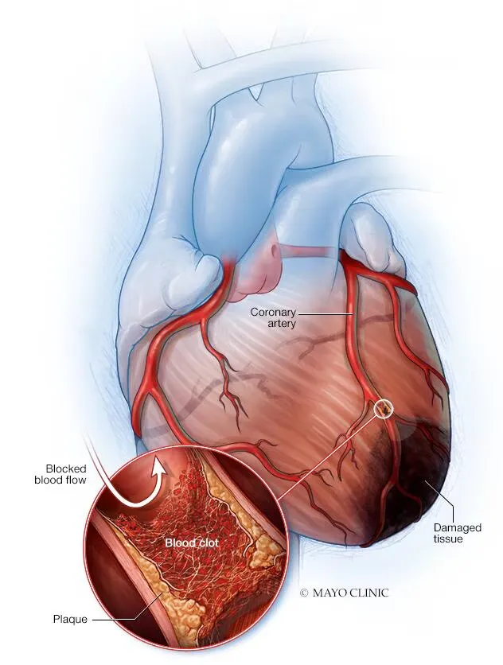

# 前言

心梗（心肌梗死）和脑梗（急性缺血性脑卒中）的发病原理相似。都是动脉血管被堵塞，导致下游组织因缺血缺氧而坏死。心梗和脑梗发生时，请立即拨打 120。

# 心梗

本节内容来源：

1. [心梗：杀人无数，藏匿在血管中的定时炸弹！身体有哪些求救信号？该如何自救与预防？_哔哩哔哩_bilibili](https://www.bilibili.com/video/BV1SzBPBdEk8/)
2. [心梗发作这样做，关键时候可以救自己一命，每个人都要学会！_哔哩哔哩_bilibili](https://www.bilibili.com/video/BV1cL4y1t7KV/)
3. [急性冠状动脉综合征（心脏病发作；心肌梗死；不稳定型心绞痛） - 心脏和血管疾病 - 《默沙东诊疗手册大众版》](https://www.msdmanuals.cn/home/heart-and-blood-vessel-disorders/coronary-artery-disease/acute-coronary-syndromes-heart-attack-myocardial-infarction-unstable-angina)
4. [心脏病发作 - Symptoms & causes - Mayo Clinic](https://www.mayoclinic.org/zh-hans/diseases-conditions/heart-attack/symptoms-causes/syc-20373106)

## 心梗的症状

心脏病发作时，最典型的症状通常是胸部正中疼痛，并辐射至后背、下颌或左臂。少数情况下，疼痛辐射至右臂。疼痛可能产生在这些部位中的一个或多个部位，而根本不是在胸部。

约三分之一的心脏病发作患者未出现胸痛。

其他症状包括头晕或晕厥，突发大汗、恶心、气短和心脏沉重感（心悸）。

心梗期间，患者烦躁不安、大汗、焦虑和抑郁。唇、手或脚变得轻微发青或发灰。

老年患者可能会有不典型症状。许多老年人最明显的症状是气短。症状也可能与胃功能紊乱或卒中相似。老年人可能会失去方向感。但是，和年轻患者一样，大约三分之二的老年患者有胸痛。老年患者，尤其是女性，通常比年轻的患者要花更长的时间承认她们患病或去寻找医生帮助。

尽管有各种可能的症状，但多达 5 分之 1 的心梗患者仅有轻微症状或根本没有症状。这种无症状心梗仅在行常规心电图检测之后才被识别。

## 心梗的发病原理

心脏为全身泵血，以为全身提供氧气。心脏本身也需要富氧血液。冠状动脉负责运送这种血液。

心梗定义：冠状动脉突发阻塞，心肌某区域的血供大幅度减少或中断。如果血供大幅度减低或中断超过几分钟，心肌组织将坏死。心脏病发作（也称为心肌梗死 ）是指由于心肌缺血导致心脏组织坏死。

血栓是导致冠状动脉阻塞的最常见原因。通常，胆固醇和其他脂肪物质堆积在动脉壁内（粥瘤）已经造成动脉局部狭窄。动脉斑块可能破裂或撕裂，并释放物质使血小板粘附，促进血栓形成。大约三分之二的患者，血栓可以自溶，一般在一日内或一日左右。然而，此时，一些心肌损伤已经发生了。

# 脑梗

本节内容来源：

1. [脑梗是怎么来的？预防脑梗的五个关键_哔哩哔哩_bilibili](https://www.bilibili.com/video/BV19gzaBVEwA/)
2. [国家医疗保障局 医保动态 医药科普主题征文一等奖获奖文章——家有老人突发脑梗：尽早就医，守好早期溶栓时间窗！](https://www.nhsa.gov.cn/art/2024/12/8/art_14_15031.html)

## 脑梗的症状

急性脑梗死，又称急性缺血性脑卒中，也就是咱们老百姓俗称的“中风”。识别它的关键在于及时发现症状。以下是一些急性脑梗的常见症状，以帮助大家快速判断：

1. 面部歪斜：让患者微笑，出现一侧脸部下垂或不对称、嘴角歪斜；
2. 言语不清：与患者交谈，患者说话含糊不清或无法说话；
3. 肢体无力：患者感觉一侧身体麻木无力，甚至无法抬起手脚；
4. 走路不稳：患者走路摇摇晃晃，不能保持平衡；
5. 其他可能伴随的症状：突然眼前发黑、突然剧烈头痛、突然发生眩晕；

## 脑梗的发病原理

当脑内血管被某些东西堵塞时，相应的脑细胞也会因缺血而坏死，无法正常发挥功能，这就是脑梗死的本质。堵塞血管的东西通常是血栓，它是血液凝固所形成的固体质块。而导致血栓形成有三大因素：高血压、糖尿病、高脂血症。老年人是这些慢性病的高发人群，这就是为什么脑梗好发于老年人的原因。还有些人患有先天性房颤，来源于心脏的栓子就会跟随患者的心房颤动而流到狭小的脑血管处进行堵塞。

# 最后

心梗和脑梗的发生，有些突然，且前期症状不是特别明显。

要小心。预防是根本。

- 健康的生活方式：低盐、低脂、低糖，多吃蔬菜水果全谷物；多运动；保持睡眠；
- 关注血压、血脂、血糖等指标；
