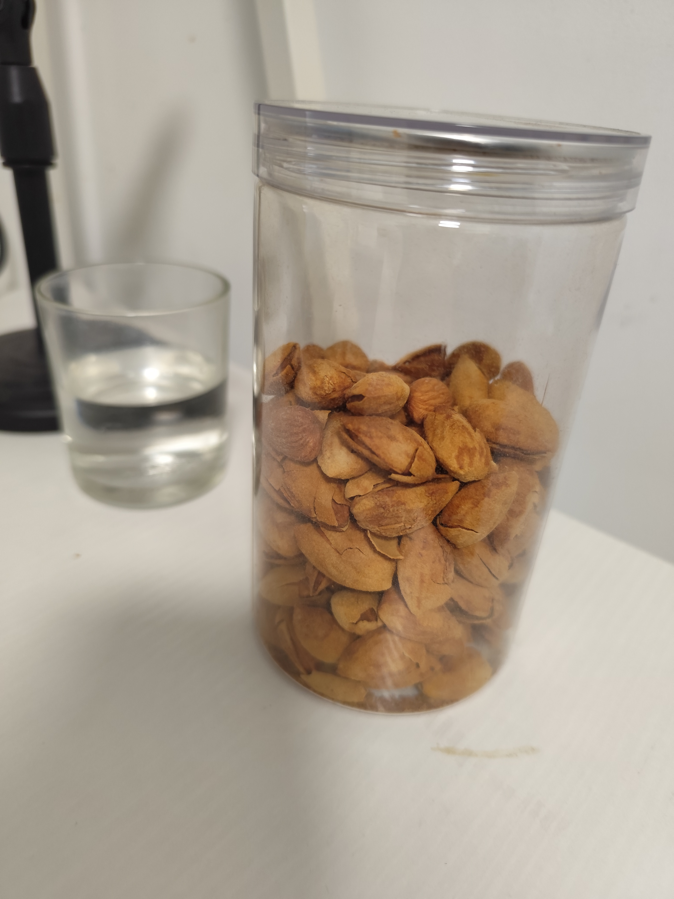

# 零食界的巴旦木

巴旦木，我挺喜欢吃的。

从 [fatsecret](https://www.fatsecret.cn/)可以看到：

- 100克巴旦木：含有50.64克的脂肪，21.26克的蛋白质；含有578卡路里。
- 100克米饭：含有116卡路里。

# 植物界的巴旦木

巴旦木是[扁桃](https://zh.wikipedia.org/wiki/%E6%89%81%E6%A1%83)果核内的种子。扁桃是蔷薇科李属的一个种。

巴旦木不是杏仁，虽然它们看着挺像。扁桃和杏树都属于蔷薇科李属，但它们不是同一个种。

# 市场上的巴旦木

在价格上， [惠农网](https://www.cnhnb.com/) 可以看到，目前

- (干)巴旦木大概25元/斤。
- (湿)花生米大概7元/斤。

在进出口上，我没有找到巴旦木详细的进出口数据(国内产量与进口占比)。从 [美国农业部近日发布的《中国坚果年度报告》- 坚果果干网](https://www.csnc.cn/gnxx/info.aspx?itemid=28289&parent) 可知，目前中国主要从美国和澳大利亚进口巴旦木。

至于国内的巴旦木消费统计，可以在 [发现报告](https://www.fxbaogao.com/) 上查看 《【天猫】加州*巴旦木*创新趋势白皮书》。

# 附录

## 植物学分类

生物分类法，也称为分类学或系统分类学，是生物学中用于识别、命名和归类所有生物体的科学。它通过一系列层次结构来组织生物，使得科学家们可以根据生物之间的进化关系和相似性对其进行分类。以下是生物分类法的基本框架：

1. **界（Kingdom）**：这是生物分类的最大单位，传统上包括动物界（Animalia）、植物界（Plantae）、真菌界（Fungi）、原生生物界（Protista）、古细菌界（Archaea）和细菌界（Bacteria）。不过，随着研究的深入，界级分类可能会有所调整。
2. **门（Phylum）**：位于界之下，进一步细分生物种类。例如在动物界中，有节肢动物门（Arthropoda）、脊索动物门（Chordata）等。
3. **纲（Class）**：门之下的一个分类等级。比如，在脊索动物门下有哺乳纲（Mammalia）、鸟纲（Aves）等。
4. **目（Order）**：纲之下的分类单位。如在哺乳纲中有食肉目（Carnivora）、灵长目（Primates）等。
5. **科（Family）**：目之下的一个分类等级。例如，在灵长目中有人科（Hominidae），其中包括人类及我们最近的亲戚如黑猩猩和大猩猩。
6. **属（Genus）**：科之下的分类单位，是一个相对较小的分类群。例如，在人科下有人属（Homo）。
7. **种（Species）**：最基本的分类单位，指一群能够通过交配繁殖出可育后代的生物个体。例如，智人（Homo sapiens）是我们这个物种的科学名称。

此外，有时还会使用亚种（Subspecies）作为更细的分类级别，用以描述同一物种内具有明显地理或形态差异的群体。

生物分类法不仅帮助科学家理解和研究生物多样性，还为生物命名提供了标准体系，即双名法。每一种生物都有一个由其属名和种加词组成的独特二名制名称，这有助于避免因不同语言或地区对同一种生物的不同称呼造成的混淆。随着时间的推移和技术的发展，生物分类法也在不断演进和完善中。
