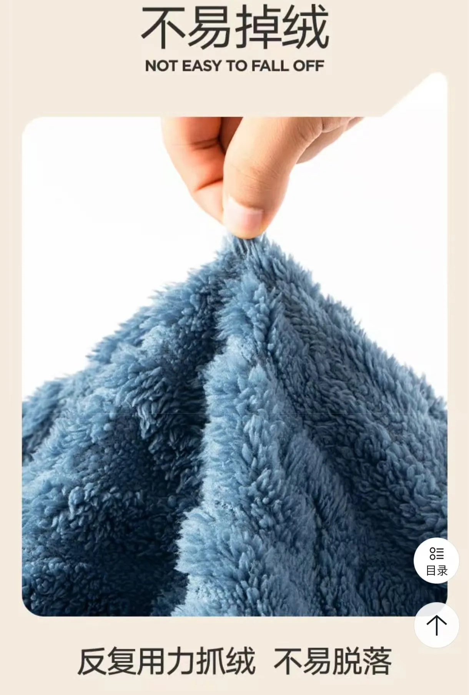
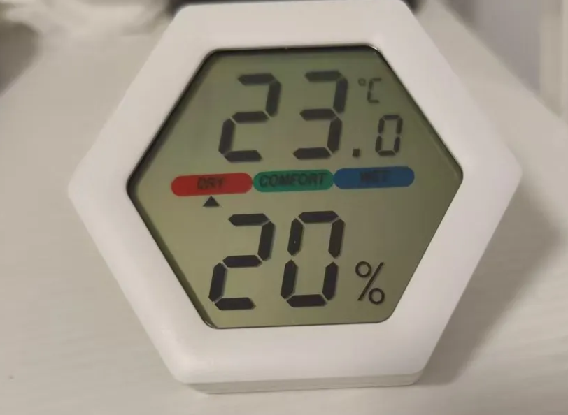

# 前言

我有件冬天穿的衣服，以前穿很舒服。但是，这个冬天，我留意到，它的静电很大。

研究下。

# 静电的原因

## 衣服容易起静电的原因

相关链接：[如何消除衣服上的静电？纺织品化学工程师专业解答_哔哩哔哩](https://www.bilibili.com/video/BV18g411N7Ed/?spm_id_from=333.337.search-card.all.click&vd_source=ea1e003da1d6dc8e1c2cff14189549ee) 、[什么材质的衣服能够不起静电？ - 知乎](https://www.zhihu.com/question/37117302)

原因一：衣服大量使用了涤纶(聚脂纤维)、氨纶这些化纤材料。这些材料的公定回潮率低，容易起静电。**棉的公定回潮率比较高，当衣服包含40%及以上的棉时，就不容易起静电了**。

原因二：环境太干燥。中国的北方要比南方干的多。

## 我那件衣服为甚静电这么厉害

原因一：它是100%的聚脂纤维。这个材料的衣服就容易起静电。（冬天比较知名的[摇粒绒](https://www.zhihu.com/question/438994922)，也是聚酯纤维材料，容易起静电。）

原因二：我的这件衣服，在上海穿没有静电，在北京穿有静电。北京很干。

# 以后买衣服

- 为了避免静电，含棉率不能低于35%。
