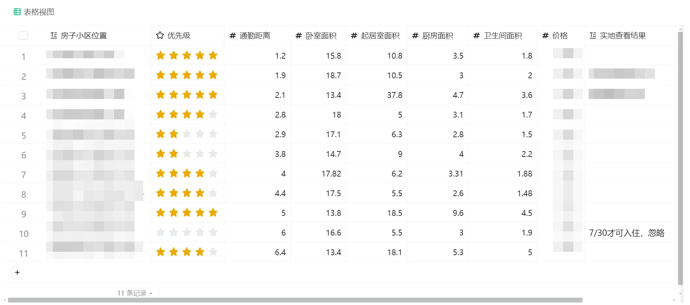

# 摘要

本文从时间和空间两个维度，介绍如何在北京和上海租合租房。

首先是空间角度，主要考虑的是通勤距离，周围环境，公共区域的清洁程度，卧室内部的舒适度。通过空间角度，我们可以知道，什么样的房子是合适的。

接着是时间角度。租房前，我们需要需要知道从哪里可以获取到准确的房源信息，目前似乎只有“自如”可以做到。实际的租房过程中，我们要提起筛选几套合适的房源，然后在中介的带领下实地查看比较。租房后，我们需要考虑公共区域的卫生维护，要保持住一个下限。

最后给出了租房的实操过程。

（本篇咋感觉是“自如”的软文 🤣）

# 空间维度

所租房子的空间维度，主要有四个方面：房子与公司的距离、房子周围的环境、房子的公共区域、卧室内部。

通过空间角度，我们可以知道，什么样的房子是合适的。

## 房子与公司的距离：通勤距离

**情况允许的话，还是建议通勤时间控制在半小时左右**。

过长的通勤时间是种折磨。

| 通勤方式 | 距离 |
| --- | --- |
| 步行 | 2.5 公里以内 |
| 自行车 | 6 公里以内 |
| 电动车 | 10 公里以内 |
| 地铁 or 公交 or 自驾 | 10 公里以上 |

## 房子周围的环境：生活便利度

快餐店与商场：周围有乡村基，米村拌饭这样连锁快餐店，吃饭将是一件舒心的事情。没有合适的吃饭的地方，可能就得经常点外卖了。

超市：周围有大点超市的话，会方便点。当然，现在美团和京东超市的配送也非常方便。

**公园：**公园是个非常有人气的地方。如果上下班途中，时间充裕也顺路的话，从公园溜达一趟也非常舒服**。**晚上要是想跑个步，附近有个公园就很 nice。

图书馆：图书馆有饮水机，空调，暖气。要是离得比较近的话，是个日常的好去处。

地铁站：近点总是好的。北京和上海这种城市，地体站也远不到哪去，骑个共享单车就到地体口了。

## 房子的公共区域：需要过的去

楼道：楼道里面不能有垃圾或过多的杂物堆放。有的话，意味着楼上或者楼下可能有难缠不讲理的邻居。单元有门禁卡的话，说明物业还比较在线。没门禁卡也没有什么关系。

客厅：如果客厅堆放了过多杂物，说明目前的租客东西比较多，住的比较久。租的房子通常客厅都比较小，因为客厅即使比较大，也会被打隔断。客厅比较乱的话，影响心情。

厨房：如果厨房比较脏，说明目前的租客做饭频率高，但是不太会收拾。我不会选择这样的房子合租。因为我有时候也喜欢做饭，省的做饭时间冲突。(我做晚饭，厨房也是干净的。)

卫生间：卫生间的问题主要是小。马桶，淋浴，洗漱台都在一个空间里，而面积可能才 1 平方多点。想想前面有个人拉完屎，臭臭的，然后需要在里面洗漱。最好是，洗漱台在卫生间外面，错峰洗漱。

合租人数：最好不要是 4 人合租。人多了，早上去厕所都得排队。当然，有两个厕所的另论。

**公共区域，最重要的，就是干净**。

## 卧室内部：需要舒服

大小：卧室面积 尽量不要小于 8 平方。

晾晒衣服：很多合租房，晾衣服都不方面。

- 客厅的阳台被打隔断，阳台是别人的专属，无法晾衣服。
- 虽然每个房间都有窗户，但是很多时候无法将衣服，挂在窗外连晒，因为要考虑高空抛物。
- 很多时候只能将衣服挂在卧室晾干。同一个空间内，又要睡觉，又要晾衣服，空气会不好。
- 如果房子是靠近三环四环这样的交通要道上。晚上睡觉必须得关上窗户，因为太吵了。半夜也有很大的车流量。这种情况，通常只能早上洗衣服，晾衣服。晚上回来，衣服干了，然后关上窗户睡觉。

房间朝向：如果比较宅，还是选朝南的房间比较好，白天能晒晒太阳。当然，朝南的房间会贵些。

# 时间维度

在时间维度上，租房分为：租房前，租房中，租房后。

## 租房前：如何获取准确的房源信息

充分的信息是决策的基础。只有掌握多个房源信息，我们才能选择做出合适的选择。

准确的房源信息，包括房间构造，大体位置，价格，居住人数等。

通常情况下，房源信息的获取，依赖两个渠道：

1. 熟人关系的介绍，熟悉地区的自行寻找。
2. 网上查找，中介/二房东/房东的带看。

对于北京和上海的租房人而言，没有熟人社区，所以渠道 1 是没有什么作用的。

在北上租房，主要靠渠道 2。在网上筛选出几套房源后，然后联系中介和二房东带看。

带看房源的多为中介和二房东，少数是房东。因为中介和二房东是职业人，房东是个人。在效率上，职业人比个人的效率高。以卖菜类比，中介和二房东就像批发和超市，房东个人就像路边摆摊卖菜的，效率差别极大。

因为带我们看房的多为中介和二房东，而我们要看的房源信息也是来自网上，所以我们可能会获取到假信息。

为什么会获取到假信息了(我们要做一件坏事前，得权衡下得失)？我问了下 AI：

- 中介行业准入门槛低、流动性大，从业人员多依赖提成生存。为完成业绩，部分中介被迫采用虚假宣传手段(客观驱动)。
- 中介和二房东常以低价优质房源吸引租客，但实际看房时声称“已租出”，转而推销其他高价或瑕疵房源。这种“挂羊头卖狗肉”的套路旨在快速获取客户信息，提高成交概率(主观驱动)。
- 租房平台长期缺乏严格审查机制，发布房源无需提供房产证等证明，导致虚假信息零成本扩散(客观驱动)。

**目前，想从网上获取到准确的房源信息，只有自如。**

**在租房前，可以通过自如获取到准确的房源信息**。

## 租房中：如何租到合适的房子

在上一节，我们知道，可以在自如上查看到准确的房源信息。

**通过“空间维度”小节，我们知道一个合适的房子，满足的要求，或者应该避开的缺点**。

**这两者结合，可以帮助我们租到合适的房子。即，我们可以在自如上，在全市范围内，筛选合适的房子。**

**但其中还有些注意事项，也是本节讨论的内容**。

**首先是，我们愿意支付的房租上限是多少**。这个上限，每个人的情况不同。 现实情况是，囿于工资的限制，我们无法租到合适的房子，那就向合适的房子靠拢吧。随着工资的上涨，再不断的调整房子。如果工资不涨，那......

接着，我们在网上看房的时候，最好筛选多个看着比较合适的房源。实际是否合适，需要中介带着，在房子里面看过才知道。**提前筛选几个合适的房子，是能否租到合适房子的最最关键因素**。

## 租房后

自如除了房租之外，还需要缴房租 10%的服务费。

服务费主要用于每月两次的公共区域保洁，和全屋的维修。

# 租房实操

我最近在租房，所以我记录下我的租房操作。(现在租房和搬家非常方便。)

首先是让软件筛选。

在自如上，输入上面条件，(朝南不能作为筛选条件，只能单独看)，自如会过滤出 70+个房源。

1. 首先是距离，我希望房子在公司附近 6 公里内。
2. 然后是价格，我希望房租是 **** 左右。
3. 我希望晾衣服方便，所以选择了带独立阳台的卧室（通常是隔断，这没办法。大的客厅基本都被隔断了）。
4. 我希望可以在阳台晒晒太阳，所以我选择了朝南的卧室。

然后是人工筛选。

1. 顺序滑动这 70 个房源的内部图片，根据感觉，筛选出 40 个。
2. 这 40 个再翻阅一遍，去除 10 个。
3. 剩下的 30 个仔细查看，去除 20 个，留下 10 个。
4. 然后把这 10 个房源信息列成表，给予不同的优先级。

之后，联系管家带看，按照优先级从高到底实地查看。

实地查看的时候，不用全部看完，高优先级的同级之间还是要都看下的。

比如，我看了三个高优先级的，就敲定了，后面无需再看。

# 相关链接

1. [2023北京租房攻略 - 知乎](https://zhuanlan.zhihu.com/p/637205109)
2. [毕业季 这份租房指南请查收_信息提示_首都之窗_北京市人民政府门户网站](https://www.beijing.gov.cn/fuwu/bmfw/sy/jrts/202506/t20250605_4107248.html)
3. [北京租房指南，2年换过10次房子的我，给你含泪解说北京租房指南，2年换过10次房子的我，给你含泪解说 从房子情况：楼层、 - 掘金](https://juejin.cn/post/7249585843765542949)
4. [专为初到北京租房的伙伴整理了北京租房哪里最便宜的那些地区 - 知乎](https://zhuanlan.zhihu.com/p/140015260)
