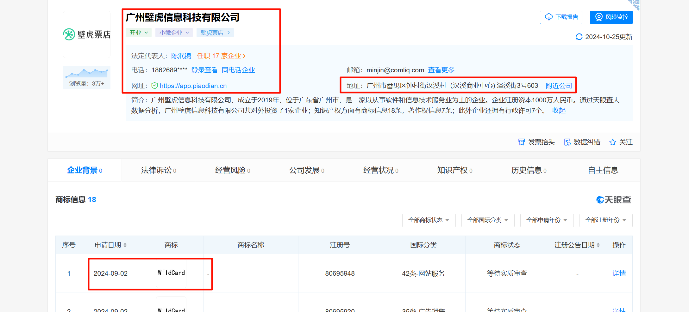
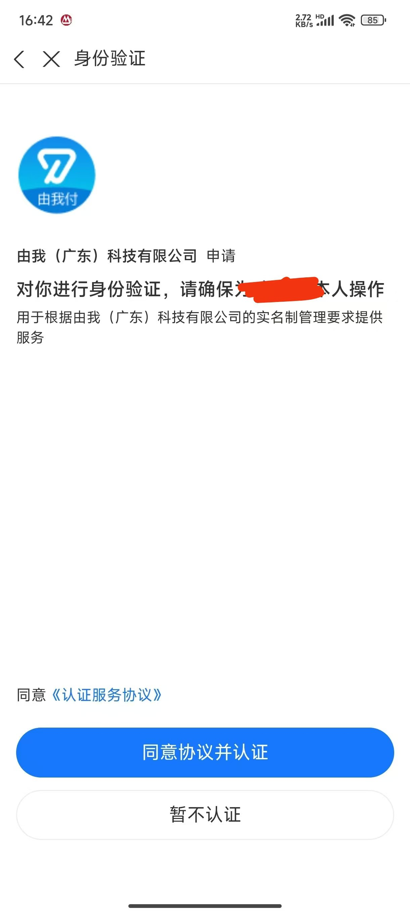
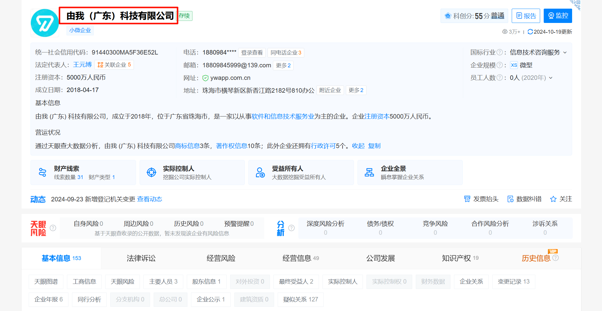
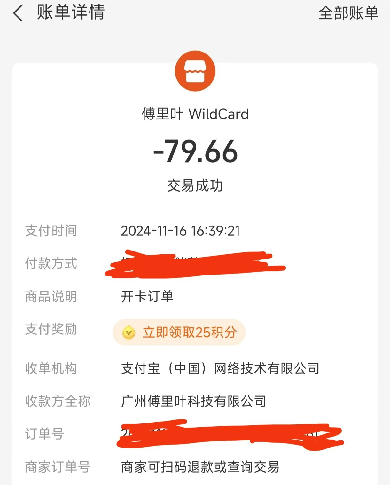
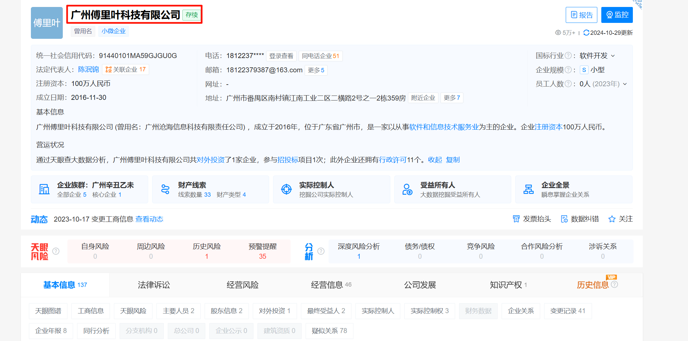

# 前言

[ChatGPT](https://chatgpt.com/) 真的非常厉害。在使用google时，有时候我们可能无法准确的描述我们的问题，从而导致无法找到解决方法。但是我们使用这些输出信息，直接询问 `chatgpt` ，它可能会直接告诉我们正确的答案。并且这个询问过程是可以迭代的，即 `chatgpt` 可以根据之前的 `chat` 信息，进一步给出答案。国内的大模型，我之前尝试过 [讯飞星火大模型](https://xinghuo.xfyun.cn/) 。它对于整个 `chat` 过程的理解不行。它往往只回复当前提问的内容，而无法使用整个 `chat` 过程中的上下文信息。

我平时使用 `chatgpt` 的免费版。但是想使用最新的模型或者 [API keys - OpenAI API](https://platform.openai.com/api-keys) 时，则需要一张国外的银行卡。

本文介绍如果给 `chatgpt` 绑定一个银行卡。

# 给chatgpt绑定一个银行卡

## OCBC(华侨银行) 银行卡的办理

参考：[💳【2024最新】新加坡华侨银行OCBC开户教程🇸🇬8个月使用经验、OCBC开户使用教程👊OCBC APP在家线上秒开、最容易的境外银行账户💯白嫖80块、申请就下实体卡｜数字牧民LC - YouTube](https://www.youtube.com/watch?v=kVbl2YFkZhI)

[华侨银行](https://zh.wikipedia.org/wiki/%E8%8F%AF%E5%83%91%E9%8A%80%E8%A1%8C) 通常缩写并简称为OCBC，是新加坡的第二大银行。是一家正经的银行。

我尝试过了，也办下来实体卡了。但现在被自己冻结用不了了。。

当时申请了实体卡时，ocbc app里面有个虚拟卡可以临时使用。我没有保存信息虚拟卡的信息，只好到web页面上去查询。

吃亏在英语比较烂，web 页面中有个冻结的选项(冻结的单词不认识)，我不小心给点上了，把自己给冻结了。它也不是立即冻结的，而是先给我发了短信，询问我是否是否确认冻结，并给了几天缓冲。当时是快国庆，也暂时没管这事。

国庆结束后，完全冻结实了，想着解冻下。我拨打ocbc的国内客服，这个号码一直是关机状态，放了一段时间也没管它。

这两天，我想用 chatgpt key了， 于是打ocbc的国际客户电话，转中文客服查询。客服说只有到新加坡的网点才能解冻。得。。

唉，教训：和银行有关的事情，一点也拖延不得。办理国外的银行卡，一旦被冻结，是相当麻烦的事情。

## wise 数字卡的办理

参考：[【2024最新】Wise注册教程、Wise入金激活方法🎉 跨境汇款神器Wise怎么用？Wise实体Visa卡怎么申请？全套中国资料注册Wise｜数字牧民LC - YouTube](https://www.youtube.com/watch?v=bSLe-NGAjD4&t=496s)

[Wise](https://zh.wikipedia.org/wiki/Wise) 是一家总部位于伦敦的金融科技公司，可以提供汇款功能。wise app 里面可以申请 wise 卡：[Wise 怎么用？汇款、收款和申请借记卡教程 - Wise](https://wise.com/zh-cn/blog/how-to-use-wise)

注册没有什么难度。但是它要求使用同用户入金激活账户。我没有同名的海外银行账户，激活不了。

todo：开通香港银行卡 --> 激活wise。

## WildCard

参考：[WildCard海外虚拟万事达卡，0月费0管理费，可用支付宝充值，可免KYC，余额可提现，半价享ChatGPT Plus、Claude Pro原生体验，可绑定App Store、Google Play - YouTube](https://www.youtube.com/watch?v=NkHmz25yLRY)

**谨慎使用。谨慎使用。**

即使 `wildcard` 直接跑路，只要不在卡里存钱(钱一充入 `wildcard` ，即把这个钱转入 `chatgpt` 账号)，最多损失的不过是开户的 10 美元。

但是 `wildcard` 的注册过程，需要填入姓名，身份证，并需要调用 支付宝进行人脸识别。这个信息泄漏是需要格外格外信息。我非常担心信息问题，特别是和金融有关时。

感觉这个 `wildcard` 资本太小，可能会出问题。相较于 OCBC 这样的银行，`wildcard` 完全无法取得我的信任。

我通过网络公开信息查了下 `wildcard` 背后公司得相关信息。

从 [Wildcard避坑_哔哩哔哩_bilibili](https://www.bilibili.com/video/BV1Um421J7Ej/?vd_source=ea1e003da1d6dc8e1c2cff14189549ee) 知道，`wildcard` 背后 是 广州壁虎信息科技有限公司。

在创建虚拟卡的时候，需要用户调用支付宝进行人脸验证。这个验证过程，在计算机程序上，是 “由我（广东）科技有限公司 ”发起的。

而往虚拟卡里充值时，接收方是 广州傅里叶科技有限公司 。

目前来看。`WildCard` 背后的公司都在国内。开卡费可能会损失掉。用户信息可能会被泄漏。

2025/4/19修：前段时间，想起来这件事，安全起见，我把这个虚拟卡给注销掉了。wildcard账号尚未注销。

# 最后

**有没有什么更好的方法可以获取open ai官方的key？**

2025/4/19修：用国内的AI服务。现在国内的ai服用也挺好用的。
