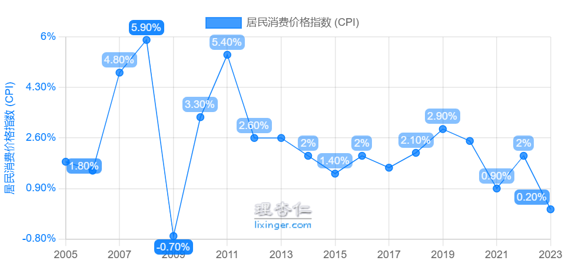

# 前言

手上有一万元，我想知道一年后，这一万元的购买力是多少？

在经济学上，使用 [通货膨胀率](https://zh.wikipedia.org/zh-cn/%E9%80%9A%E8%B2%A8%E8%86%A8%E8%84%B9%E7%8E%87) 来表示货币购买力的下降速度。

那通货膨胀率如何计算呢？近十年，中国的通货膨胀率是多少？

相关链接：[如何查询通货膨胀率_哔哩哔哩_bilibili](https://www.bilibili.com/video/BV1VLcNewEfN/) 、[现在的100万，10年后值多少？_通胀](https://www.sohu.com/a/480419950_120235986)

# 居民消费价格指数

相关链接：[居民消费价格指数 - 国家统计局-知识库](https://www.stats.gov.cn/zs/tjws/zytjzbqs/jmxxggzs/)

在一定程度上，我们可以使用CPI来代表通货膨胀率。

> 居民消费价格指数（Consumer  Price  Index，简称CPI），是度量一定时期内居民消费商品和服务价格水平总体变动情况的相对数，综合反映居民消费商品和服务价格水平的变动趋势和变动程度。
> 
> 
> 
> 
> 
> 它在一定程度上反映通货膨胀（紧缩）的程度。测定一定时期通货膨胀（紧缩）程度有不同的方法，应用较多也较普遍的就是CPI。严格地说，CPI并不等于通货膨胀率，因为CPI只反映了居民消费领域的价格变化，而不能代表全社会价格总水平的变化，但从CPI的变化中，可以看出价格变动的大致趋势，在一定程度上反映了通货膨胀（紧缩）的程度。
> 
> 
> 
> 
> 
> 它可以用于计算货币购买力。**CPI的倒数通常被视为货币购买力指数，即货币购买力的变化与CPI的变化成反比关系。例如，2022年全国CPI为102.0％，货币购买力指数则为1÷102.0％×100％＝98.0％，换句话说，在2021年用100元可以买到的商品和服务，在2022年需要花102元才能买到相同的商品和服务**。在社会经济生活中，人们往往参考CPI来调整补偿、救助和补贴标准，消除货币购买力下降的影响。

> 价格指数编制中，将一组固定数量的商品和服务统称为“篮子”。根据调查方案规定，每五年更换一次“篮子”，本轮CPI的“篮子”固定在2020年。CPI调查的“篮子”应当包括居民日常生活消费全部的商品和服务。但由于人力和财力的限制，不可能也没有必要采用普查方式调查居民消费的全部商品和服务的价格。与国际上做法一样，我国统计部门抽选一组一定时期内居民经常消费的、对居民生活影响相对较大的、有代表性的、固定数量的商品和服务作为“篮子”。其中不包括奢侈品、投资品等。

# 中国近十年的CPI

中国的 CPI 数据可以在国家统计局查找到：[国家数据-各种价格指数](https://data.stats.gov.cn/easyquery.htm?cn=C01)

在”理杏仁“网站，可以看到更好看的表格展示：[居民消费价格指数|大陆|价格指数|宏观 - 理杏仁](https://www.lixinger.com/analytics/macro/price-index/cn/cpi)

**可以看到，近十年，中国的CPI增长率大概是2%**。

