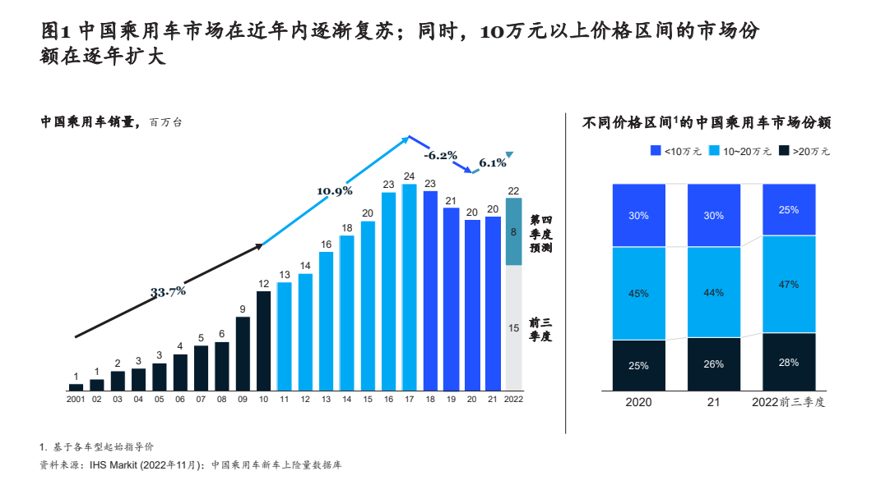

# 前言

本文计算下，买车与使用车一年的花销大概是多少。

# 买车前应做的预算

预算包含：一次性支出的汽车落地费用；日常支出的保险，油费，罚款，停车费等。

## 汽车落地费用

### 购车时的一次性支出

汽车落地费用分为这部分：裸车价、购置税、上牌费等（车险放到日常支出中，因为每年都要缴费)

裸车价，我按照大概15万计算。下面是 《2023麦肯锡中国汽车消费者洞察》中 中国乘用车不同价格区间的市场份额。

如果裸辞价是15万元。那购车税是 1.5万。[《中华人民共和国车辆购置税法》](https://www.gov.cn/xinwen/2018-12/30/content_5353497.htm) 中规定了车辆购置税的税率为百分之十。目前新能源车型没有购车税，但早晚会有的。新能源车和燃油车都是在路上跑，理应同等对待。只是新能源车是新事物，新技术，前期培养市场(产业/消费者)，没有购车税可以理解。但是新能源市场有所成熟后，新能源车和燃油车理应同等对待（就像北京的高考和河北的高考一样）。

上牌费等费用，不多，我算500好了。

### 汽车使用年限

估算一辆家庭汽车报废周期为12年吧。相关连接： [中国汽车平均使用年限-汽车之家](https://www.autohome.com.cn/ask/9492062.html)

> 在中国，汽车工业的革新引领了政策调整，小型私家车的使用年限不再严格限制，而是以公里数为考量标准，上限设定为60万公里。总体来看，车主更换汽车的决策因素多于固定年限，车辆状况和市场变化都会影响其使用年限。在实际操作中，这些年限仅供参考，车主可根据个人需求和车辆状况灵活对待。

至于报废汽车的回收价算作汽车使用过程中的日常的维护费用吧。

## 汽车日常支出费用

日常支出的保险，油费，罚款，停车费等。下面计算支出费用是按照年进行计算。

首先保险费，每年大概算2000吧。对于老司机或许保险费会比较低，比如只交交强险和第三者责任险。[汽车保险一年多少钱-太平洋保险](https://www.cpic.com.cn/baike/131.html)

> 那么汽车保险一年多少钱呢？我们一起来了解一下吧。这个问题不能一概而论，保险的费用，和新车的价格直接相关，考虑到大多数家庭购买的10万左右的经济型轿车，给出具体的费用明细供大家参考交强险950元（必须购买），车损险差不多1000元，第三者责任险可以保5万、10万、20万，按10万算是600元，盗抢险300多，车上人员按5座算每座1万元就是100元左右，以上项目的不计免赔加起来要400元，自燃险50元，玻璃单独破损按国产玻璃算100元，划痕险300元，以及这3者的不计免赔50多元，一共差不多4000元左右。

油费大概算作3600元。每天开15公里，每月开20天，油耗为8升/百公里，汽油价格按8元/升计算，总计 `15*20*12/8*8` = 3600。如果连这点距离都开不到，那还是小电驴好使。需要用车的时候，打个车就行。(相关连接： [一年油费开支大概多少？-汽车之家](https://www.autohome.com.cn/ask/11083126.html) )

罚款大概算600吧。大概是一年违规三次。

停车费不同地方差别很大，估算为1500吧。小城市空间足够，找个地方停停就行。稍微有点规模的城市都要考虑停车费。

# 一辆车一年的成本

车辆本身的损耗：(150000(裸车价格) + 15000(购置税)) / 12(报废年限) = 13750

车辆日常使用费用 2000(保险) + 3600(油费) + 600(罚款) + 1500(停车费) = 7700

一辆车一年的成本约：13750 + 7700 = 21450

# 最后

我向来是不建议买车的。

- 大城市的公共交通很方便。堵车可能导致开车还没有地铁快。开车可能还有限行。即使买了车，平常也开的也少。
- 小城市就那点面积。电驴/摩托半个小大概就能到，比开车舒服多了。

以家庭为单位，有需要，买个代步车可以考虑。

- 以家庭为单位，从人均的角度来说，买车和使用车的成本降低了至少一半。
- 从实用性角度出发，代步车的性价比高。某些场景的出行更加方便。

至于有钱人，随意。不合适再换一辆就是。
