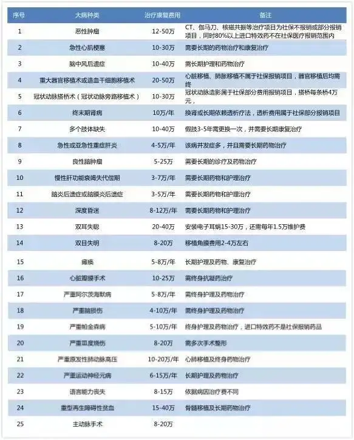

# 前言

知乎上有一个话题，[如果你得了重疾，费用超过多少你会放弃治疗？ - 知乎](https://www.zhihu.com/question/271913673) 。

这个话题很好，**父母渐渐上了年纪，我们自身也难免会有意外。在医院的治疗过程中，我们需要避免 “人财两空” 的情况出现，毕竟活着的人还要继续生活。那，如果得了重疾，费用超过多少会放弃治疗？**

这个问题，每个人早晚都要面对，我们可以提前思考下应对方案。

# 重大疾病的医疗和康复费用

目前重大疾病的医疗和康复费用是多少？我们得先知道一个大概得数值，然后才能做相关的决定。

保险行业对这个是最清楚的了，因为他们会计算收益与成本，不会做赔本买卖。

这里是 [保监会规定的常见25种重大疾病包括哪些？-太平洋保险](https://www.cpic.com.cn/c/2020-12-01/1611813.shtml)。知乎回答中有一个整理后的好看表格，我这里复制下那张图片。

# 重大疾病的应对方案

每个人的环境和收入情况都不相同。这是我感觉比较合适的应对方案。

1. 每年都要体检。有问题及时发现。这样，人的身体不会因为疾病，突然崩溃。至于慢性的疾病，在当前的医疗水平下，适当的治疗，康复活着多活几年是没有问题的。
2. 必须购买医疗保险。比如农村合作医疗保险，社保等。一个人必须至少有一份医疗保险。因为对于重大疾病，目前的医保应该能报销一半左右。
3. **强制储蓄一笔资金，用于应对意外情况的发生。这笔钱不动，这笔钱是救命钱。如果超过预期，治疗无望，则放弃治疗，避免人财两空**。至于这笔钱的额度，我建议是每人不超过30万。如果医保可以报销一半，则总共治疗可以花费60万左右，可以达到上面重大疾病的治疗费用范围。再多的话，可能也是治不好了，可以考虑放弃。
4. 情况允许的情况下，可以了解“重疾险”，这类额外的保险。
