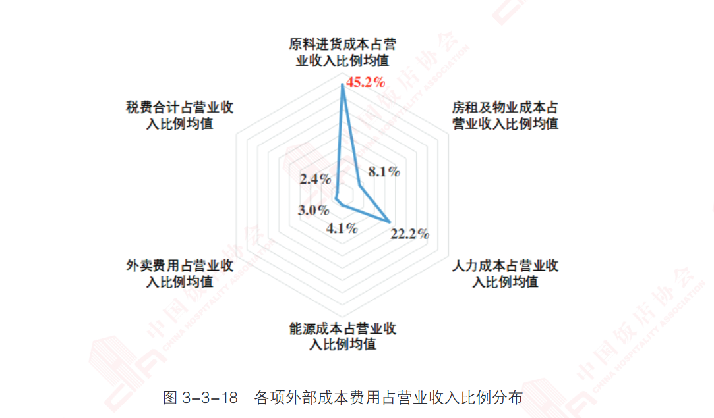

# 前言

胃肠道不好已有多年。辣椒一多吃了些，就会拉肚子。这是为什么？

# 吃辣椒腹泻的原因

[腹泻 - 症状与病因](https://www.mayoclinic.org/zh-hans/diseases-conditions/diarrhea/symptoms-causes/syc-20352241)，可表现为稀便、水样便以及排便次数可能增多。参考 [知道你为啥便秘吗？哔哩哔哩_bilibili](https://www.bilibili.com/video/BV1ch411Y7pG/) 我们可以知道，**腹泻的本质是大肠没能将肠道残渣中的水分吸收完，这些残渣便被肠道通过蠕动，排出体外了**。

我们已经知道了腹泻的本质了。那为什么吃辣椒会导致腹泻呢？

这主要有三种原因。

**其中一个原因是辣椒素能加速胃肠蠕动。**参考：[为什么“一吃辣就拉肚子”？多年的困惑解开了_上观新闻](https://m.jfdaily.com/sgh/detail?id=835178) 、[为什么现在吃辣之后拉肚子的现象越来越常见？ - 知乎](https://www.zhihu.com/question/20696502)

> 辣椒含有大量的辣椒素，辣椒素能刺激舌尖、口腔黏膜及口腔神经末梢，促进唾液分泌，有利于食物的消化吸收，并使人感到兴奋，产生快感。由于辣椒素不易被消化道分解代谢，会使肠道产生火辣辣的感觉。肠道壁上有很多神经元，接收到烧灼的信号，加快胃肠蠕动，将“辣椒素”排出体外。在这个过程中，肠道的粪便还没来得及成形，同时会吸收肠道中的水分，使大便变稀。

**其二是，食材和食材加工过程中，本身卫生不达标，和辣椒没什么关系。**在 [发现报告](https://www.fxbaogao.com/) 中，我们可以找到 《2024中国*餐饮*业*年度报告*》。我们可以看到餐饮行业的成本占比。餐饮业的毛利率(收入-食材成本)必然是要超过50%的。比如，我们进店吃顿饭，花费了50元，食材成本不会超过25元。北上深(北京上海深圳)餐饮的毛利率必然更高，因为房租成本更高。

> 餐饮行业门槛低、入行易，使得其成为很多初次创业者的首选。首都经济贸易大学针对一线和新一线城市餐饮商户的调研显示，在 2500 个样本中，近六成商户的启动资金小于12 万元，其中小于 6 万元的占比达 28.5%，启动资金超过 30 万元的商户占比仅有 12%。然而近年来行业经营成本不断上升，用工压力持续，价格战迫使企业不断压缩利润空间，如果没有稳定的资金流和供应链作为支撑，新企业在竞争中很难胜出。据企查查平台数据，2023 年国内餐饮企业注吊销数量是 2022 年全年的 2 倍多。而即便是挺过了第一轮激战，升级过程中庞大的开支（例如数字化、产业链升级）也将会淘汰无法转型的企业。伴随着行业竞争的持续，“宽进严出”的特征将更加明显。

餐饮行业的竞争很激烈。假如我是商家，如果门店已经到了生死存亡的关头，我一定为下调食品质量，为了生存。食品的下线是可以很低的。顶多是上那些肠胃不好的人拉拉肚子而已。

**其三是，胃肠道本身存在疾病，比如炎症等。**辣椒摄入过量，让本就羸弱的肠胃受到刺激。肠道蠕动加速导致腹泻。

# 最后

我还能活多久？也许有天就没了。为了活得更久，先从三餐规律开始。

至于吃什么，那得看附近的门店里面卖什么吃的了。

相关视频：[你每天这样吃饭，简直是在慢性自杀！I 胃病自救指南_哔哩哔哩_bilibili](https://www.bilibili.com/video/BV1VM411N7qc/?spm_id_from=333.337.search-card.all.click&vd_source=ea1e003da1d6dc8e1c2cff14189549ee)
