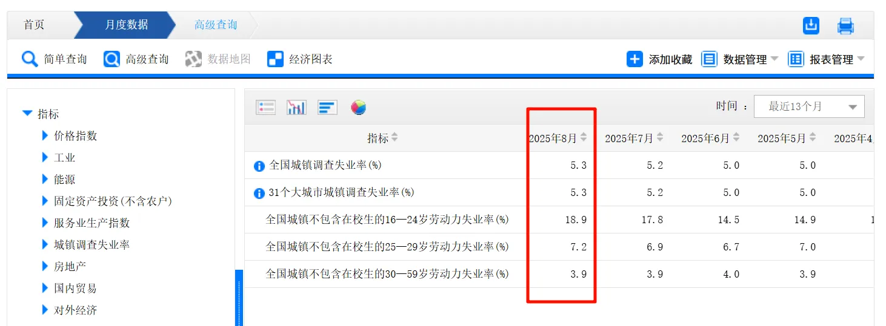

# 前言

在知乎上有个讨论：[为什么公司不直接开除员工，而是要求员工主动辞职呢？ - 知乎](https://www.zhihu.com/question/6436257329)

这类问题还是值得考虑分析下的。

在结婚前，我们应当考虑，离婚的时候“财产”该如何分配。

类似的，在工作中，我们也应当考虑，如果有一天公司劝退我们，我们该怎么应对。

不同的环境，有不同的应对方式，很难有一个统一的标准。

本文主要考虑，“为什么有时候，公司不直接开除员工，而是劝员工主动离职？”

# 背景介绍

在开始分析这个问题之前，我们 需要补充些背景材料。

## 《劳动合同法》中的赔偿规定

我们可以在 [国家法律法规数据库](https://flk.npc.gov.cn/index) 中，找到 《中华人民共和国劳动合同法》。

当然，这里讨论的前提是，公司愿意遵循劳动法的相关规定。如果不遵守，那又是另一个问题了。

具体的法律文件，它的法条之间有依赖关系，即满足了什么条件，才能触发什么规定，看着略微有点费劲。

找万能的 AI 给个答案 ，哈哈。

首先是 N 的定义。“N”代表你在该用人单位的工作年限。它是计算经济补偿的基数。工作年限从你入职该公司开始，到劳动合同解除时为止。如果年中工作时间超过六个月但不满一年，会按一年计算；不满六个月，则按半年计算。例如，如果你工作了3年8个月，那么N按4年算；如果工作了3年4个月，则N按3.5年算。计算经济补偿时所用的“月工资”，是指你在劳动合同解除前12个月的平均工资。这个平均工资通常包括计时工资、计件工资、奖金、津贴和补贴等货币性收入。

| 补偿标准 | 法律性质 | 核心适用情形 | 关键法律依据 |
| --- | --- | --- | --- |
| **N** | **经济补偿金**：合法解除/终止劳动合同的补偿 | 协商一致解除、特定情况下劳动者主动解除、经济性裁员、劳动合同到期不续签等 | 《劳动合同法》第46条 |
| **N+1** | **经济补偿金 (N) + 代通知金 (+1)**：合法解除但未提前30日通知 | 仅限于法律规定的三种特定情形，且用人单位**未提前30天书面通知** | 《劳动合同法》第40条 |
| **2N** | **赔偿金**：违法解除或终止劳动合同的惩罚性赔偿 | 用人单位解除合同的行为不符合法律规定，属于违法解除 | 《劳动合同法》第87条 |

## 稳岗返还政策

来源[人力资源社会保障部 财政部 税务总局关于延续实施失业保险稳岗惠民政策措施的通知_国务院部门文件_中国政府网](https://www.gov.cn/zhengce/zhengceku/202504/content_7020428.htm)

一、延续实施稳岗返还政策。参保企业足额缴纳失业保险费12个月以上，**上年度未裁员或裁员率不高于上年度全国城镇调查失业率控制目标**，30人（含）以下的参保企业裁员率不高于参保职工总数20%的，可以申请失业保险稳岗返还。大型企业按不超过企业及其职工上年度实际缴纳失业保险费的30%返还，**中小微企业按不超过60%返还**。稳岗返还资金可用于职工生活补助、缴纳社会保险费、转岗培训、技能提升培训等稳定就业岗位以及降低生产经营成本支出。社会团体、基金会、社会服务机构、律师事务所、会计师事务所、以单位形式参保的个体工商户参照实施。

## 失业率数据的查看

可以在 [国家统计局](https://www.stats.gov.cn/) ，看到失业率数据。

数据是数据，现实是现实。

主动离职是无法领取失业金的。且，主动离职后，医保次月则无法报销。

我们国家有城乡居民医疗保险。但是，对于个人而言，城乡居民医保和社保，不能同时缴纳。且，居民医疗保险，得上一年度缴纳，本年度才生效。

这就带来一个困境：如果某天“主动”离职了，我们就没有医保在身。

此时，我们的一个选择是，参加灵活就业的医保。对于国家而言，这部分参加灵活就业的人员，是灵活就业中，不是失业状态，哈哈。但是吧，灵活就业不能单单只交医保，必须连着养老保险一起交。即使按照北京的最低标准缴纳灵活就业，每个月至少得支出 2000+。

另一个选择是，从职工医保，转城乡居民医保。这个我没试过，具体情况可以问下12345。比如：[宿州市职工医保转居民医保的操作指南](https://m12333.cn/qa/pzcde.html)

> 参保人连续2年（含2年）以上参加职工医保，因工作变动，不再缴纳职工医保，立即转为居民医保，缴纳居民医保后，不受待遇等待期限制。如未及时转为居民医保并缴费的，只要在职工医保中断缴费3个月(含)以内参加城乡居民医保并缴费的，不设待遇等待期，中断期间的待遇可追溯享受。

所以，最好不要主动离职，一定要让公司裁退。但是，糟心的工作，还是早离职的好。毕竟，垃圾公司，有太多恶心人的方式。

# 为什么公司倾向于，劝员工主动离职

在了解上面的背景后，我将分析三个主体的利弊：公司，个人，社会。

## 公司的利弊分析

利：节约成本与规避风险。

- 经济成本：直接开除员工，公司通常需要支付经济补偿金（“N”或“N+1”），而员工主动辞职则无需支付。对于工作年限长的员工，这是一笔可观的节省。
- 法律风险：直接开除若被认定为违法解除，公司需支付赔偿金（“2N”）。通过“劝退”方式，若能达成“协商一致解除”，公司仅需支付经济补偿金（“N”），降低了诉讼风险和潜在的高额赔偿。
- 管理成本：处理劳动纠纷会耗费公司大量人力和管理资源
- 内部稳定：直接开除可能引发其他员工的恐慌和不安，影响团队士气和工作效率。温和的“劝退”有助于维持表面稳定，避免“杀鸡儆猴”的负面效应
- 外部声誉：大规模裁员或频繁开除员工可能损害公司声誉，影响招聘和业务合作。“劝退”显得更体面，有助于维护公司形象

弊：潜在风险与成本

- 协商成本：成功的“劝退”往往需要与员工进行谈判，可能仍需支付一定的补偿（协商解除的“N”），并耗费管理时间
- 操作不当的风险：如果公司在“劝退”过程中采取调岗降薪、刻意冷落等不当手段逼迫员工，一旦被员工掌握证据，仍可能被认定为违法解除或被迫离职，公司需承担相应的法律后果

## 员工层面的利弊分析

弊：

- 经济损失：最直接的是失去应得的经济补偿金
- 社保中断：主动辞职通常无法领取失业保险金同时，社保（尤其是医疗保险）可能中断，带来短期保障缺失的风险
- 求职压力：在就业市场环境下，主动辞职后寻找新工作的压力和空窗期成本不容忽视。
- 潜在的负面情绪消耗：无论选择哪种方式，被“劝退”本身可能给员工带来职业挫败感和心理压力。若选择与公司对峙维权，可能需投入较多时间和精力

利：无

## 稳岗返还政策的利弊分析

弊：

- 给员工带来了上面的损失：这个政策，在一定程度上，“鼓励”了合法的企业，劝员工主动离职，而不是直接裁员。
- 加剧不公：信息不对称可能导致不熟悉法律的劳动者权益受损，加剧职场不公。

利：无

- 如果这个政策能给企业减负，那就是扯淡。收的时候，直接少收些不就完事了。
- 同理，减少企业裁员也是扯淡。
