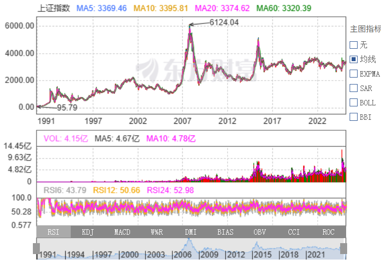

# 名词定义

首先是名词定义。

[A股](https://zh.wikipedia.org/wiki/A%E8%82%A1_(%E4%B8%AD%E5%9C%8B)) 也称为人民币普通股票，是指那些在中国大陆注册、在中国股票市场股票上市的普通股，以人民币认购和交易。A股在上海证券交易所、深圳证券交易所和北京证券交易所进行交易。

[韭菜](https://zh.wikipedia.org/wiki/%E5%89%B2%E9%9F%AD%E8%8F%9C) 一词在中文世界中用于形容在股市被大户欺压的散户，因为韭菜耐寒不容易死，割了又可以很快重新生长，从而不断供养采收者。

# A股是个韭菜场

名词定义完后，我来表述我的观点：A股是个韭菜场。

在东方财富网，可以查看到 历年的上证指数和沪深 300 指数。

2025 年 7 月 12 号，上证指数是 3510.18 点。十年前， 2015 年 7 月 31 号，上证指数 3663.73 点。没有丝毫上涨，反而下跌。

2025 年 7 月 12 号，沪深 300 指数是 4014.81 点。十年前， 2015 年 7 月 30 号，沪深 300 指数 3815.41 点。10年涨了200点。

**这么多年，股市都在3000点上下徘徊。这件事必有原因**。

# 我还是要进A股看看

目前(2025年7月)货币基金的年收益率大概是 1.3%左右。债卷基金的年收益率大概是 2% 左右。

货币基金和债卷基金都跑不赢通胀的啦：[经济篇：居民消费价格指数](../life/economics-consumer-price-index.md)

另外，我一直担心，未来十年内，地方债暴雷时，连锁反应，债卷基金可能会亏损的厉害(相较于债卷的风险)，比如 20%的本金损失。  
  
所以，我来进 A 股看看，当一名韭菜，练练手。
