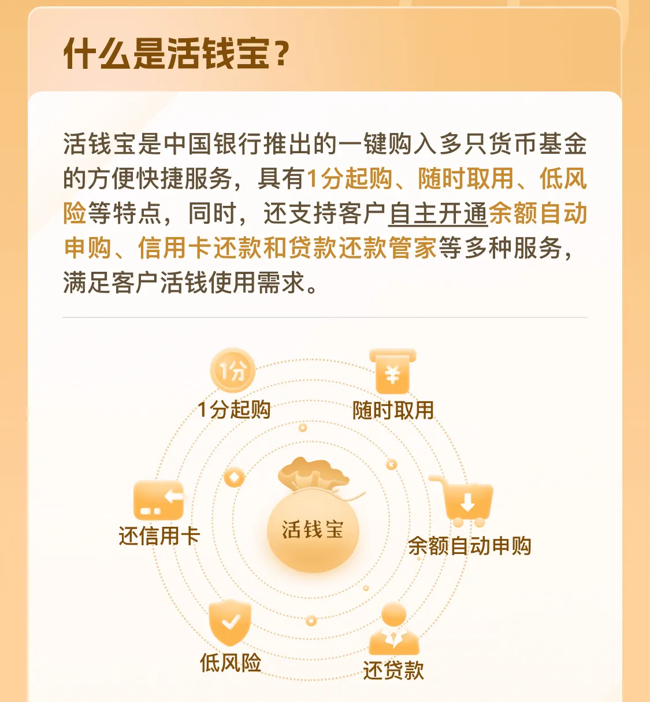

# 活钱宝的介绍

活钱宝是中国银行推出的一键购入多只货币基金的方便快捷服务，具有1分起购、随时取用、低风险等特点，同时，还支持客户自主开通余额自动申购、信用卡还款和贷款还款管家等多种服务，满足客户活钱使用需求。

1. 活钱宝对接10只货币基金，单日单只产品快赎额度为1万元，当日到账（一般情况下可实时到账)。
2. 活钱宝对接的货币基金风险等级为R1，最低一分钱起购。T日15:00前购买，T+1日确认后即可享受收益。
3. 余额自动申购：您可以自主选择开通该项服务，您开通之后，根据您的授权系统会在每个交易日自动申购活钱宝底层货币基金，申购金额为活钱宝专属卡活期账户中超过最小留存金额的部分。
4. 信用卡还款：您可以自主选开通该项服务，您开通之后，根据您的授权系统将在您关联的信用卡的还款日前2个交易日自动发起普通赎回活钱宝持仓，赎回金额为信用卡当期人民币账单剩余应还金额，赎回款将在还款日前1个交易日入账您的活钱宝专属卡账户，用来准备还信用卡。
5. 贷款还款专家：您可以自主选择开通该项服务，您开通之后，根据您的授权系统将在您关联的贷款的还款日前2个交易日自动发起普通赎回活钱宝持仓，赎回金额为当期贷款应还金额或您签约时设置的金额，赎回款将在还款日前1个交易日入账您的活钱宝专属卡账户，用来准备还贷款。

风险提示：**货币基金不等于银行存款，基金有风险，投资须谨慎**。历史业绩不代表未来收益表现，不等于产品实际收益，具体信息以中国银行官方APP或官网公告为准。快速赎回服务非法定义务，提现有条件依约可暂停。**活钱宝底层产品由相关管理机构发行与管理，中国银行作为代销机构，不承担产品的投资、兑付和风险管理责任，一切产品要素和交易规则均以产品说明书、基金合同、基金招募说明书等法律文件为准。**

# 活钱宝的转入规则

【智能转入规则】

为默认转入规则，自动分配买入金额**尽量满足最高快赎额度，并兼顾收益**（根据监管规定，单个客户单日单只产品快赎额度为1万元）。

活钱宝将根据您输入的转入金额，智能分析您的活钱宝持仓，再根据目前活钱宝对接产品的7日年化收益率，**优先买入收益率高的产品**。具体规则如下：

第一步：按照7日年化收益率从高到低的顺序对底层所有货币基金进行排序，例如，活钱宝底层有4只产品A/B/C/D，且按照7日年化收益率从高到低的顺序为A>B>C>D。

第二步：按照上述顺序依次买入，逐步满足每只产品金额均不低于1万元。即如果某只产品金额不足1万元，则分配金额使其达到1万元；如果某只产品金额已经不低于1万元，则本步骤将不给该只产品分配转入金额；

第三步：如果经过上述步骤，您还有剩余转入金额需要分配，则将按照第一步确定顺序以1万元为单位依次买入；

第四步：重复第三步，直到满足您输入的转入金额要求。

【自定义转入规则】  
支持客户自选转入产品。您可自己选择转入活钱宝一只或多只产品，购买金额。

# 活钱宝的转出规则

【晋通转出规则】

自动分配普通赎回金额**尽量满足下次快赎额度最大**并兼顾收益。(根据监管规定，单个客户单日单只产品快赎额度为1万元。)

活钱宝将根据您输入的转出金额，智能分析您的活钱宝持仓，再根据目前活钱宝对接产品的7日年化收益率，**优先赎回收益率低的产品**。具体规则如下：

第一步:按照对底层货币基金产品进行排序。例如，活钱宝底层有4只产品A/B/C/D，且按照7日年化收益率从低到高的顺序为D<C<B<A，则赎回顺序为D->C->B->A。

第二步:按照上述顺序依次赎回各只产品至只剩1万元金额。即如果某只产品金额高于1万元，则赎回该产品超过1万元的部分，如果某只产品金额不足1万元，则本步骤将不赎回该只产品;

第三步:经过上述步骤，如果还需赎回，则按照第步顺序依次把每只产品剩余金额全部赎回。

【快速转出规则】

支持赎回金额2小时到账

您可以自己选择快赎一只产品，如您需要快赎多只产品可进行多次操作满足您的用款需求。

# 活钱宝内的货币基金

## 中银如意宝货币 A (00450)

[中银如意宝货币A(004502)行情走势—天天基金网](https://fund.eastmoney.com/004502.html?spm=search)

1. 申购费率为 0。正常情况下，不收取赎回费。
2. 管理费率 为 0.25%（每年）。托管费率0.05%（每年）。销售服务费率为0.01%（每年）。 管理费、托管费、销售服务费从基金资产中每日计提。每个交易日公告的基金净值已扣除管理费、托管费和销售服务费，无需投资者在每笔交易中另行支付。
3. **（2025/5/1）****万份收益率 为 0.3276。七日年化率1.5560%**
4. 货币型-普通货币类型的基金。基金持仓中，债卷占 65.97%，银行存款占 15.66%，其他占 18.37%。
5. 基金管理人是中银基金。基金托管人是招商银行。
