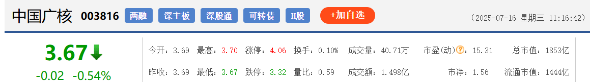

以 [中国广核(sz003816)](https://quote.eastmoney.com/sz003816.html?jump_to_web=true) 为例，介绍下，股票基础信息的含义。

股票当前的价格是3.67，是最近一笔成交的股票价格。相较于昨日收盘价，下降了0.02。

国内股票交易时间非常统一：周一至周五（法定节假日除外）上午9：30开盘，11：30收盘；下午13：00开盘，15：00收盘。 “**昨收**”即“昨日收盘价”​​，指前一交易日结束时的最后一笔成交价格。“**今开**”即“今日开盘价”​​，指股票在当天连续竞价时段（9:30）的第一笔成交价格。

“**最高**”指股票在单个交易日中达到的最高成交价格。“**最低**”指单个交易日中的最低成交价格。

**涨停**​​是指股票当日价格上涨达到交易所规定的最大涨幅限制（如A股普通股为10%）。涨停价 = 前收盘价 × (1 + 涨幅限制)。​​**跌停**​​是指股票当日价格下跌至最大跌幅限制（如A股普通股为10%）。跌停价 = 前收盘价 × (1 - 跌幅限制)​​。即使触发涨跌停，​​交易不停止​​，投资者可在涨停价挂买单或跌停价挂卖单，但成交难度增加。

**换手率**反映股票在一定时间内（通常为日、周）转手买卖的频率，体现市场流动性和投资者参与热度。换手率 =（某时期成交量 ÷ 流通总股本）× 100%。例如：某股日成交200万股，流通股本1亿股，则日换手率为2%。

一般情况，大多股票每日换手率在1%——2.5%（不包括初上市的股票）。70%的股票的换手率基本在3%以下，3%就成为一种分界。那么大于3%又意味着什么？当一支股票的换手率在3%——7%之间时，该股进入相对活跃状态。7%——10%之间时，则为强势股的出现，股价处于高度活跃当中。

换手率结合股价走势，可以为投资者提供一些参考。例如，在高位出现高换手率，可能预示着主力资金正在出货；在低位出现高换手率，可能预示着主力正在吸筹。

**量比**是衡量相对成交量的指标。它是指股市开市后平均每分钟的成交量与过去5个交易日平均每分钟成交量之比。其计算公式为：量比=（现成交总手数 / 现累计开市时间(分) ）/ 过去5日平均每分钟成交量。量比为0.8-1.5倍，则说明成交量处于正常水平；量比在1.5-2.5倍之间则为温和放量，如果股价也处于温和缓升状态，则升势相对健康，可继续持股，若股价下跌，则可认定跌势难以在短期内结束，从量的方面判断应可考虑停损退出；

**成交量**的单位一般为手，1手等于100股。**成交额** = ∑(每笔成交价 × 成交量) 。

**[市盈率](https://zh.wikipedia.org/wiki/%E5%B8%82%E7%9B%88%E7%8E%87)（Price Earnings Ratio，简称P/E或PER）是股票投资中最核心的估值指标之一**，**用于衡量股票价格与企业盈利能力的相对关系**。

市盈率 = 股票价格 ÷ 每股收益 = 公司市值 ÷ 年度净利润​​。但上市公司通常只会把部分盈利用来派发股息，其余用来作进一步发展，所以市盈率的倒数并不直接等同于股息率。

静态市盈率= 总市值÷ 上年度净利润。

动态市盈率= 总市值÷ 全年预估利润。

**市净率**（英语：Price-to-book ratio，缩写：PBR、PB、P/B ratio），或称市账率、股价净值比，又名市价净值比（英语：Market-to-book ratio，缩写：Ｍ/B ratio），或称市帐值比，指股票的每股股价除以每股净值，或是股票市值除以净值。
