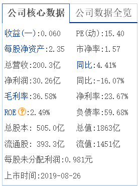
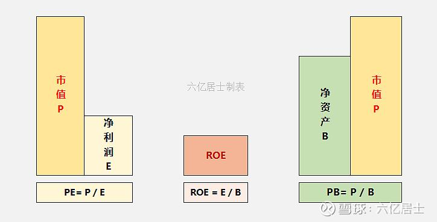

以 [中国广核(sz003816)](https://quote.eastmoney.com/sz003816.html?jump_to_web=true) 为例，介绍下，股票基础信息的含义。

​​**收益(一)**：常表示公司在最近一个​​季度的净利润​​除以​​总股本​​计算得出的值。0.060元意味着公司在最近的这个季度里，平均每一股股票能为股东赚取0.06元人民币的净利润。这是衡量公司近期盈利能力的核心指标。这仅是会计利润​​，表示公司赚到的钱，但不等于实际可分配的现金。是否分红需看公司现金流和分红政策。

​**​每股净资产**：每股账面价值。意味着如果公司立即清算，理论上每股股东权益对应的净资产价值为2.35元。这是衡量公司财务安全垫和内在价值的基础指标

**ROE = 每股净利润 / 每股净资产**。比如这家企业净资产1000万元，利润100万元，则ROE = 100 / 1000 = 10%。ROE脱离市值概念，仅看企业利用净资产的经营效率 (来源： [估值的标尺：浅析ROE指标的优与劣 雪球](https://xueqiu.com/9391624441/210953697))

​**​每股未分配利润**：指公司历年的累计未分配利润除以总股本得出的每股金额。
