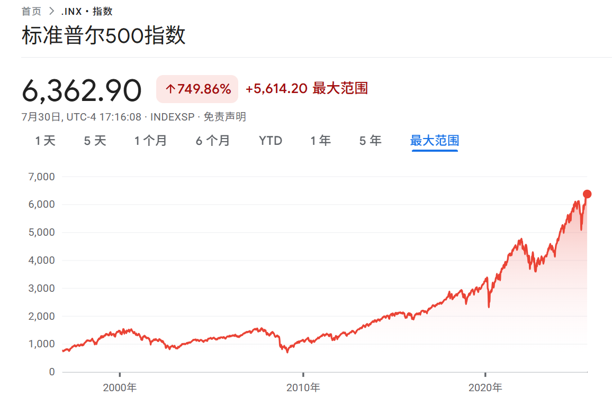
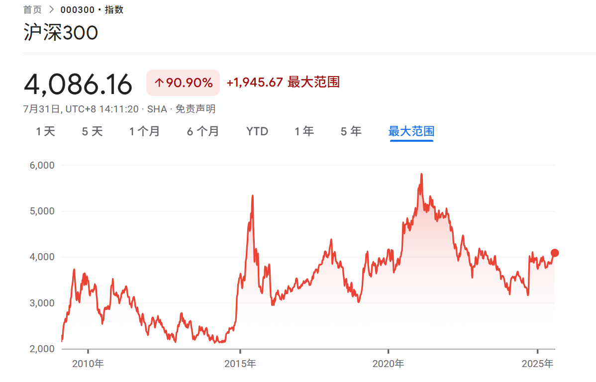

# 前言

沪深300的指数基金，我感觉没有投资意义，过去10年了，指数还那样。

所以，我尝试投投美股的指数基金。

2025/7/21，我买了点[标普500ETF南方](https://fundf10.eastmoney.com/513650.html)。买入的时候成交价格是1.624。今天(2025/7/28)，收盘价格是1.653，单位净值1.643，期间涨了1.66%；感觉这个涨幅有点太快了。

标普500ETF南方基金(513650)：资金规模33.71亿，运作费用0.75%，追踪标普500指数，交易方式T+0。

关于基金的介绍可以参考这个视频：[你应该买基金么？买什么基金最合适？bilibili](https://www.bilibili.com/video/BV1154y1n734/)。

下面是一些关于该基金的概念。

# QDII型基金

“标普500ETF南方”是QDII型基金。

QDII（Qualified Domestic Institutional Investor，合格境内机构投资者）基金诞生于2006年，是中国资本账户未完全开放下的过渡性制度。它是中国境内发行的公募基金，经监管部门批准后投资于境外证券市场（如股票、债券、REITs等），帮助国内投资者突破外汇管制限制，实现全球资产配置。

# ETF介绍

“标普500ETF南方”是一种ETF（Exchange Traded Fund，交易型开放式指数基金）。

ETF是一种在证券交易所上市交易的被动型投资基金，兼具股票的交易灵活性与基金的分散投资优势。

**ETF通过复制特定指数（如沪深300、行业指数或跨境指数）的成份股构成投资组合，实现与标的指数收益的高度拟合**。**投资者可像买卖股票一样在二级市场实时交易ETF份额**。

想要搞清楚ETF的原理，还有有点复杂的。非金融专业的散户认为买了ETF就是买了一揽子股票就行。详细介绍可以参考：[你必须知道的ETF交易原理： ETF的价格是如何决定的？_哔哩哔哩_bilibili](https://www.bilibili.com/video/BV1ET4y1n7oe/)

​**​核心优势​**​

- ​**​分散风险​**​：持有指数内全部或部分成份股，避免个股波动风险（如沪深300ETF覆盖A股龙头公司）。
- ​**​成本低廉​**​：管理费（0.15%-0.5%/年）低于主动基金，且免印花税。
- ​**​透明度高​**​：每日公布持仓清单，投资者可实时跟踪组合构成。
- ​**​交易灵活​**​：支持T+0（跨境/商品ETF）或T+1交易，流动性强

# 标普500ETF

“标普500ETF南方”追踪的是标普500指数。

来源： [标普500ETF-雪球](https://xueqiu.com/5441277347/327278452?md5__1038=n4+xyDcCe7qmqGKDQD/f5Y7KPiKoxD5oYi34x)

- ​**​标普500指数（S&P 500）​**​ 由标准普尔公司编制，覆盖美国市值最大、流动性最强的500家上市公司（如苹果、微软、亚马逊、英伟达等），横跨科技、金融、医疗、消费等11个行业，被视为“美国经济晴雨表”。
- ​**​行业分布均衡​**​：信息技术（约29%-38%）、金融（10%-14%）、医疗保健（约11%）占比较高，分散性优于纯科技指数（如纳斯达克100）

看看标普500指数，再看看沪深300指数。用脚投票都选标普500指数。

