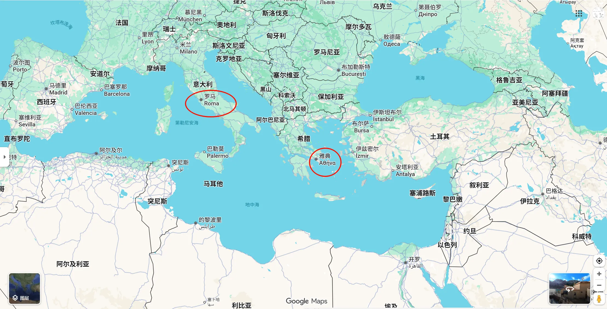
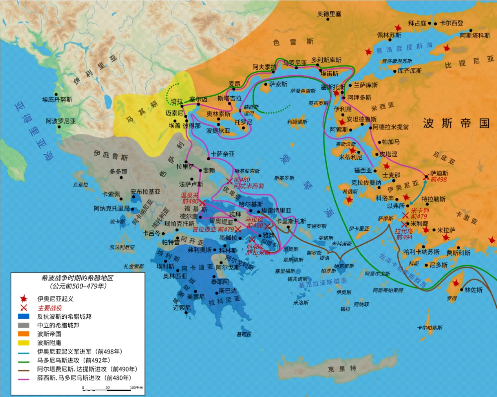
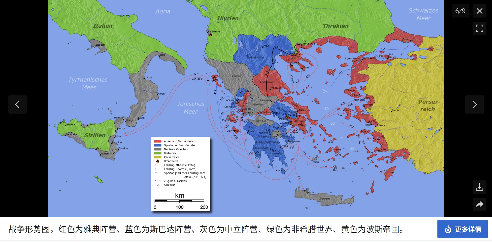
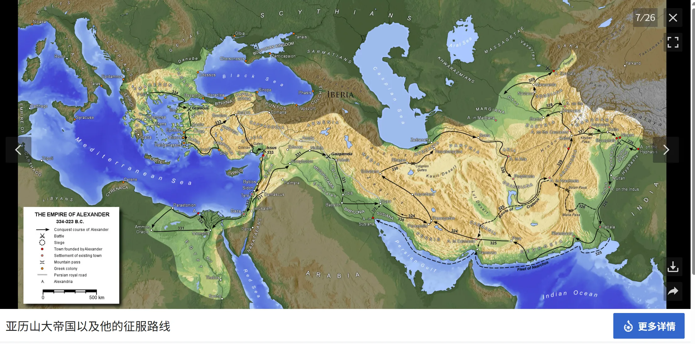
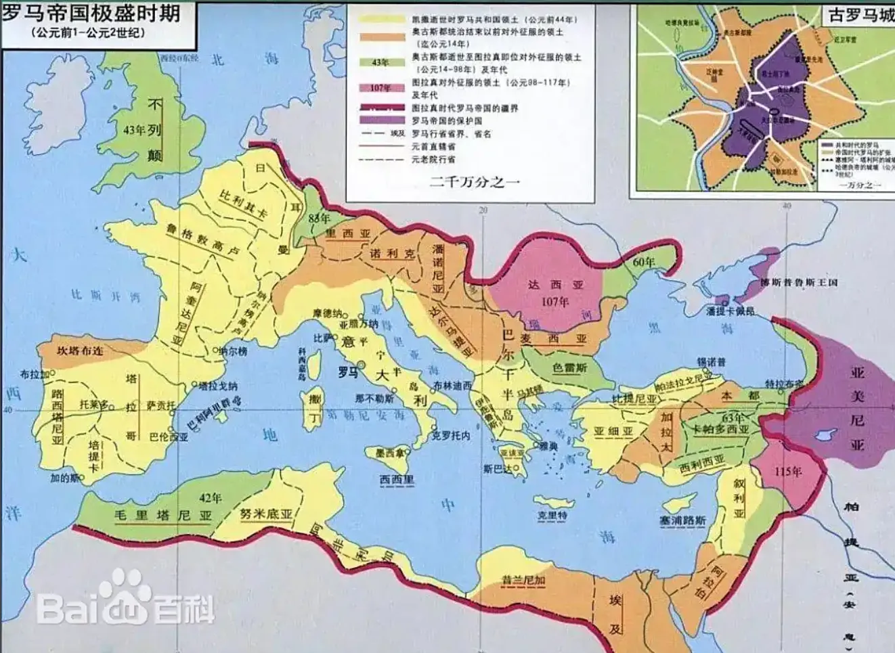

# 前言

这本书还是比较难读的，因为我不是欧洲人，缺少对欧洲人文背景的了解。

囫囵吞个枣，倒也能读。

总体评价：一般以上，推荐不满。

1. ️这本书的优点是，串起了欧洲的古典时代。
2. 缺点是，对于非欧洲人，对于缺少欧洲历史背景的人而言，这本书的易读性比较低。（就像这本书的最后一章，我是没有搞明白，为什么基督教会兴起）
3. 但，总的来说，是一本不错的历史科普书籍，虽然有些难读。

2025/10/5

# 本书回顾

## 希腊，雅典，罗马，“傻傻”分不清楚

相关链接：[我想问问希腊，罗马，雅典到底有什么区别？谁先存在？谁统一，一直理不清楚？ - 知乎](https://www.zhihu.com/question/381542709)

雅典和罗马具有 2000 多年的历史。今天，我们可以在 google map 上，直接看到这两个城市的位置。

下面将顺着历史的脉络，了解“希腊”、“雅典”、“罗马”这些名词的含义。

### 希波战争(公元前499年~公元前449年)

链接：[波希战争 - 维基百科，自由的百科全书](https://zh.wikipedia.org/wiki/%E6%B3%A2%E5%B8%8C%E6%88%98%E4%BA%89) 、[世界历史/希波战争 - 维基教科书，自由的教学读本](https://zh.wikibooks.org/wiki/%E4%B8%96%E7%95%8C%E6%AD%B7%E5%8F%B2/%E5%B8%8C%E6%B3%A2%E6%88%B0%E7%88%AD)

(下面内容，来自上面链接)

1. 公元前547年，波斯的[居鲁士大帝](https://zh.wikipedia.org/wiki/%E5%B1%85%E9%B2%81%E5%A3%AB%E5%A4%A7%E5%B8%9D)征服了[爱奥尼亚](https://zh.wikipedia.org/wiki/%E4%BC%8A%E5%A5%A7%E5%B0%BC%E4%BA%9E)，但此后爱奥尼亚的[希腊语](https://zh.wikipedia.org/wiki/%E5%B8%8C%E8%85%8A%E8%AF%AD)城邦一直在寻求独立。
2. 到了前499年，[米利都](https://zh.wikipedia.org/wiki/%E7%B1%B3%E5%88%A9%E9%83%BD)的僭主[阿里斯塔格拉斯](https://zh.wikipedia.org/wiki/%E9%98%BF%E9%87%8C%E6%96%AF%E5%A1%94%E6%A0%BC%E6%8B%89%E6%96%AF)在波斯的支持下出海远征[纳克索斯岛](https://zh.wikipedia.org/wiki/%E7%BA%B3%E5%85%8B%E7%B4%A2%E6%96%AF%E5%B2%9B)失败而被解任。阿里斯塔格拉斯趁机鼓动整个[小亚细亚](https://zh.wikipedia.org/wiki/%E5%B0%8F%E4%BA%9A%E7%BB%86%E4%BA%9A)的希腊语地区起来反抗波斯的统治，由此拉开了[伊奥尼亚起义](https://zh.wikipedia.org/wiki/%E4%BC%8A%E5%A5%A5%E5%B0%BC%E4%BA%9A%E8%B5%B7%E4%B9%89)的序幕。
3. 随着叛乱的发展，越来越多的[小亚细亚](https://zh.wikipedia.org/wiki/%E5%B0%8F%E4%BA%9A%E7%BB%86%E4%BA%9A)小国被卷入到这场纷争中。[雅典](https://zh.wikipedia.org/wiki/%E9%9B%85%E5%85%B8)和[埃雷特里亚](https://zh.wikipedia.org/wiki/%E5%9F%83%E9%9B%B7%E7%89%B9%E9%87%8C%E4%BA%9E)则为阿里斯塔格拉斯提供军事援助，于前498年协助后者占领并焚毁了波斯的地方首府[萨迪斯](https://zh.wikipedia.org/wiki/%E8%90%A8%E7%AC%AC%E6%96%AF)。
4. 波斯人重组军队进击叛乱的米利都，于前493年将叛乱镇压了下去。
5. 为了确保波斯帝国日后不受叛乱的威胁，同时加大对内陆希腊人的影响，[大流士一世](https://zh.wikipedia.org/wiki/%E5%A4%A7%E6%B5%81%E5%A3%AB%E4%B8%80%E4%B8%96)决定先发制人征服希腊。他誓言要向[雅典](https://zh.wikipedia.org/wiki/%E9%9B%85%E5%85%B8)和[埃雷特里亚](https://zh.wikipedia.org/wiki/%E5%9F%83%E9%9B%B7%E7%89%B9%E9%87%8C%E4%BA%9E)报[萨第斯](https://zh.wikipedia.org/wiki/%E8%90%A8%E7%AC%AC%E6%96%AF)被焚的一箭之仇。第一次入侵始于前492年，在波斯将军[马多尼乌斯](https://zh.wikipedia.org/wiki/%E9%A9%AC%E9%93%8E%E5%B0%BC%E6%96%AF)指挥下军队攻下了[色雷斯](https://zh.wikipedia.org/wiki/%E8%89%B2%E9%9B%B7%E6%96%AF)和[马其顿](https://zh.wikipedia.org/wiki/%E9%A9%AC%E5%85%B6%E9%A1%BF)，却因征途中的小差错而功败垂成。
6. 波斯人又于前490年派去了第二支军队，在[达提斯](https://zh.wikipedia.org/w/index.php?title=%E8%BE%BE%E6%8F%90%E6%96%AF&action=edit&redlink=1)和[阿塔佛涅斯](https://zh.wikipedia.org/w/index.php?title=%E9%98%BF%E5%A1%94%E4%BD%9B%E6%B6%85%E6%96%AF_(%E9%98%BF%E5%A1%94%E4%BD%9B%E6%B6%85%E6%96%AF%E4%B9%8B%E5%AD%90)&action=edit&redlink=1)的指挥下横渡[爱琴海](https://zh.wikipedia.org/wiki/%E7%88%B1%E7%90%B4%E6%B5%B7)，占领了[基克拉泽斯](https://zh.wikipedia.org/wiki/%E5%9F%BA%E5%85%8B%E6%8B%89%E6%B3%BD%E6%96%AF)，围困了[埃雷特里亚](https://zh.wikipedia.org/wiki/%E5%9F%83%E9%9B%B7%E7%89%B9%E9%87%8C%E4%BA%9E)并最终将其毁掉。他们随后挥师[雅典](https://zh.wikipedia.org/wiki/%E9%9B%85%E5%85%B8)，却在[马拉松战役](https://zh.wikipedia.org/wiki/%E9%A9%AC%E6%8B%89%E6%9D%BE%E6%88%98%E5%BD%B9)被雅典军队打败。波斯人的第一次入侵就此止步，大流士也在前486年死去。
7. 前480年，大流士之子[薛西斯一世](https://zh.wikipedia.org/wiki/%E8%96%9B%E8%A5%BF%E6%96%AF%E4%B8%80%E4%B8%96)亲率一支古代历史上首屈一指的大军开始了对希腊的第二次入侵。波斯军队在[温泉关战役](https://zh.wikipedia.org/wiki/%E6%B8%A9%E6%B3%89%E5%85%B3%E6%88%98%E5%BD%B9)击败由[斯巴达](https://zh.wikipedia.org/wiki/%E6%96%AF%E5%B7%B4%E8%BE%BE)和[雅典](https://zh.wikipedia.org/wiki/%E9%9B%85%E5%85%B8)领导的希腊联军后，曾一度占领了希腊的大部分土地，然而他们的海军却在接下来的[萨拉米斯海战](https://zh.wikipedia.org/wiki/%E8%90%A8%E6%8B%89%E7%B1%B3%E6%96%AF%E6%88%98%E5%BD%B9)中被希腊联合海军击溃。随后希腊人转守为攻，在[普拉提亚战役](https://zh.wikipedia.org/wiki/%E6%99%AE%E6%8B%89%E6%8F%90%E4%BA%9A%E6%88%98%E5%BD%B9)中再次得胜，从而结束了波斯的侵略。

### **伯罗奔尼撒战争(**公元前404年~公元前431年**)**

链接：[伯罗奔尼撒战争 - 维基百科，自由的百科全书](https://zh.wikipedia.org/wiki/%E4%BC%AF%E7%BD%97%E5%A5%94%E5%B0%BC%E6%92%92%E6%88%98%E4%BA%89)

(下面内容，来自上面链接)

1. 以[雅典](https://zh.wikipedia.org/wiki/%E9%9B%85%E5%85%B8)为首的[提洛同盟](https://zh.wikipedia.org/wiki/%E6%8F%90%E6%B4%9B%E5%90%8C%E7%9B%9F)与军事强国[斯巴达](https://zh.wikipedia.org/wiki/%E6%96%AF%E5%B7%B4%E9%81%94)为首的[伯罗奔尼撒联盟](https://zh.wikipedia.org/wiki/%E4%BC%AF%E7%BE%85%E5%A5%94%E5%B0%BC%E6%92%92%E8%81%AF%E7%9B%9F)之间的**伯罗奔尼撒战争**从公元前431年持续到公元前404年，期间因多次停战而中断，最终以斯巴达人的胜利告终。这场战争结束了雅典和[雅典式民主](https://zh.wikipedia.org/wiki/%E9%9B%85%E5%85%B8%E5%BC%8F%E6%B0%91%E4%B8%BB)的古典时代，并永久地改变了希腊文明。几乎当时所有的[希腊城邦](https://zh.wikipedia.org/wiki/%E5%B8%8C%E8%87%98%E5%9F%8E%E9%82%A6)都参与其中，战斗几乎遍及整个希腊文化圈。
2. 战争的过程怪复杂的，没搞清除，略。

斯巴达在称霸希腊不久后，(公元前371年)便被新兴的[底比斯](https://zh.wikipedia.org/wiki/%E5%BA%95%E6%AF%94%E6%96%AF_(%E5%B8%8C%E8%87%98))打败。

### 马其顿王国(前9世纪～前2世纪)

链接：[马其顿王国 - 维基百科，自由的百科全书](https://zh.wikipedia.org/wiki/%E9%A6%AC%E5%85%B6%E9%A0%93%E7%8E%8B%E5%9C%8B#%E5%B8%9D%E5%9C%8B%E8%A7%A3%E4%BD%93) 、[亚历山大大帝 - 维基百科，自由的百科全书](https://zh.wikipedia.org/zh-cn/%E4%BA%9A%E5%8E%86%E5%B1%B1%E5%A4%A7%E5%A4%A7%E5%B8%9D#%E9%A6%AC%E5%85%B6%E9%A0%93%E5%9C%8B%E7%8E%8B)

(下面内容，来自上面链接)

1. 在西元前4世纪之前，马其顿王国是一个游离在雅典、斯巴达、底比斯等主要希腊城邦之外的小邦。
2. [腓力二世](https://zh.wikipedia.org/wiki/%E8%85%93%E5%8A%9B%E4%BA%8C%E4%B8%96_(%E9%A9%AC%E5%85%B6%E9%A1%BF))（[前359年](https://zh.wikipedia.org/wiki/%E5%89%8D359%E5%B9%B4)～[前336年](https://zh.wikipedia.org/wiki/%E5%89%8D336%E5%B9%B4)）在位期间，马其顿的人民变得富有，并有能力建造海军。
3. 公元[前338年](https://zh.wikipedia.org/wiki/%E5%89%8D338%E5%B9%B4)，腓力二世打败了雅典和底比斯，并利用外交手段让斯巴达臣服于自己。至此，马其顿统一了全部古希腊城邦。
4. 腓力二世的儿子[亚历山大大帝](https://zh.wikipedia.org/wiki/%E4%BA%9E%E6%AD%B7%E5%B1%B1%E5%A4%A7%E5%A4%A7%E5%B8%9D)（[前356年](https://zh.wikipedia.org/wiki/%E5%89%8D356%E5%B9%B4)～[前323年](https://zh.wikipedia.org/wiki/%E5%89%8D323%E5%B9%B4)）子承父业，领导全希腊城邦打败并吞并了波斯第一帝国，把版图扩展到[印度河](https://zh.wikipedia.org/wiki/%E5%8D%B0%E5%BA%A6%E6%B2%B3)。此时的马其顿王国因为亚历山大的武功赫赫，而被尊称为“亚历山大帝国”或“马其顿帝国”。亚历山大帝国是继波斯帝国之后，历史上第2个地跨[欧](https://zh.wikipedia.org/wiki/%E6%AC%A7%E6%B4%B2)、[亚](https://zh.wikipedia.org/wiki/%E4%BA%9A%E6%B4%B2)、[非](https://zh.wikipedia.org/wiki/%E9%9D%9E%E6%B4%B2)三洲的国家。
5. 前323年6月10或11日，亚历山大逝世于[巴比伦](https://zh.wikipedia.org/wiki/%E5%B7%B4%E6%AF%94%E5%80%AB)城[尼布甲尼撒二世](https://zh.wikipedia.org/wiki/%E5%B0%BC%E5%B8%83%E7%94%B2%E5%B0%BC%E6%92%92%E4%BA%8C%E4%B8%96)的王宫之内，年仅32岁。
6. 亚历山大大帝死后，他的帝国被他的部下们迅速瓜分。亚历山大的帝国最初被分割为四大部分，[卡山得](https://zh.wikipedia.org/wiki/%E5%8D%A1%E5%B1%B1%E5%BE%97)统治[希腊](https://zh.wikipedia.org/wiki/%E5%B8%8C%E8%85%8A)，[莱西马库斯](https://zh.wikipedia.org/wiki/%E5%88%A9%E8%A5%BF%E9%A6%AC%E7%A7%91%E6%96%AF)占据[色雷斯](https://zh.wikipedia.org/wiki/%E8%89%B2%E9%9B%B7%E6%96%AF)，被称为“胜利者”的[塞琉古一世](https://zh.wikipedia.org/wiki/%E5%A1%9E%E7%90%89%E5%8F%A4%E4%B8%80%E4%B8%96)得到[美索不达米亚](https://zh.wikipedia.org/wiki/%E7%BE%8E%E7%B4%A2%E4%B8%8D%E8%BE%BE%E7%B1%B3%E4%BA%9A)和[波斯](https://zh.wikipedia.org/wiki/%E6%B3%A2%E6%96%AF)，而[托勒密一世](https://zh.wikipedia.org/wiki/%E6%89%98%E5%8B%92%E5%AF%86%E4%B8%80%E4%B8%96)分得[黎凡特](https://zh.wikipedia.org/wiki/%E9%BB%8E%E5%87%A1%E7%89%B9)和[埃及](https://zh.wikipedia.org/wiki/%E5%9F%83%E5%8F%8A)。
7. 到公元前一世纪大多数西部的希腊化地区都被[罗马共和国](https://zh.wikipedia.org/wiki/%E7%BD%97%E9%A9%AC%E5%85%B1%E5%92%8C%E5%9B%BD)吞并。

### 罗马(公元前8世纪初~公元1453年东罗马帝国覆灭)

链接：[古罗马 - 维基百科，自由的百科全书](https://zh.wikipedia.org/zh-cn/%E5%8F%A4%E7%BD%97%E9%A9%AC#%E4%B8%AD%E4%B8%96%E7%BA%AA%E7%BD%97%E9%A9%AC%E5%B8%9D%E5%9B%BD)

(下面内容，来自上面链接)

1. 罗马共和国。公元前5世纪至前3世纪初，平民与贵族的斗争告一段落，[意大利半岛](https://zh.wikipedia.org/wiki/%E6%84%8F%E5%A4%A7%E5%88%A9%E5%8D%8A%E5%B2%9B)基本被罗马统一。[百人队会议](https://zh.wikipedia.org/wiki/%E7%99%BE%E4%BA%BA%E9%98%9F%E4%BC%9A%E8%AE%AE)从贵族中选出两名[执政官](https://zh.wikipedia.org/wiki/%E6%89%A7%E6%94%BF%E5%AE%98_(%E7%BD%97%E9%A9%AC))行使最高行政权力，为期1年；管理国家的主要机构为元老院、高级长官及公民大会，而掌握国家实权的则是元老院。随着贵族与平民之间对立的加深，贵族承认了平民所选的“保民官”，负责保护平民的权力不受贵族侵犯。约前450年，颁布了[十二铜表法](https://zh.wikipedia.org/wiki/%E5%8D%81%E4%BA%8C%E9%93%9C%E8%A1%A8%E6%B3%95)，明定了平民与贵族不能通婚的限制，这也标志着[罗马法](https://zh.wikipedia.org/wiki/%E7%BD%97%E9%A9%AC%E6%B3%95)的诞生。
2. 罗马又发动了3次[布匿战争](https://zh.wikipedia.org/wiki/%E5%B8%83%E5%8C%BF%E6%88%98%E4%BA%89)，在前146年征服了[迦太基](https://zh.wikipedia.org/wiki/%E8%BF%A6%E5%A4%AA%E5%9F%BA)并使之成为罗马的一个行省。前215年－前168年发动3次[马其顿战争](https://zh.wikipedia.org/wiki/%E7%AC%AC%E4%B8%80%E6%AC%A1%E9%A9%AC%E5%85%B6%E9%A1%BF%E6%88%98%E4%BA%89)，征服[伊比利亚半岛](https://zh.wikipedia.org/wiki/%E4%BC%8A%E6%AF%94%E5%88%A9%E4%BA%9A%E5%8D%8A%E5%B2%9B)、[马其顿王国](https://zh.wikipedia.org/wiki/%E9%A9%AC%E5%85%B6%E9%A1%BF%E7%8E%8B%E5%9B%BD)并控制了整个[古希腊](https://zh.wikipedia.org/wiki/%E5%8F%A4%E5%B8%8C%E8%85%8A)，又通过[罗马-叙利亚战争](https://zh.wikipedia.org/wiki/%E7%BE%85%E9%A6%AC-%E6%95%98%E5%88%A9%E4%BA%9E%E6%88%B0%E7%88%AD)和外交手段，占领了[西亚](https://zh.wikipedia.org/wiki/%E8%A5%BF%E4%BA%9A)的[小亚细亚](https://zh.wikipedia.org/wiki/%E5%B0%8F%E4%BA%9A%E7%BB%86%E4%BA%9A)半岛和[黎凡特](https://zh.wikipedia.org/wiki/%E9%BB%8E%E5%87%A1%E7%89%B9)地区，建成一个横跨[欧洲](https://zh.wikipedia.org/wiki/%E6%AC%A7%E6%B4%B2)、[亚洲](https://zh.wikipedia.org/wiki/%E4%BA%9A%E6%B4%B2)、[非洲](https://zh.wikipedia.org/wiki/%E9%9D%9E%E6%B4%B2)，把[地中海](https://zh.wikipedia.org/wiki/%E5%9C%B0%E4%B8%AD%E6%B5%B7)变成内海的[大国](https://zh.wikipedia.org/wiki/%E5%A4%A7%E5%9B%BD)。
3. 前82年，贵族派支持的[苏拉](https://zh.wikipedia.org/wiki/%E8%8B%8F%E6%8B%89)率军占领罗马。次年，迫使公民大会选举他为终身独裁官，开创了罗马历史上军事独裁的先例。前60年，[克拉苏](https://zh.wikipedia.org/wiki/%E9%A9%AC%E5%BA%93%E6%96%AF%C2%B7%E6%9D%8E%E9%94%A1%E5%B0%BC%C2%B7%E5%85%8B%E6%8B%89%E8%8B%8F)、[凯撒](https://zh.wikipedia.org/wiki/%E5%87%AF%E6%92%92)、[庞培](https://zh.wikipedia.org/wiki/%E6%A0%BC%E6%B6%85%E4%B9%8C%E6%96%AF%C2%B7%E5%BA%9E%E8%B4%9D)秘密结盟，共同控制罗马政局，史称[前三头同盟](https://zh.wikipedia.org/wiki/%E5%89%8D%E4%B8%89%E5%A4%B4%E5%90%8C%E7%9B%9F)。前48年，[尤利乌斯·凯撒](https://zh.wikipedia.org/wiki/%E5%B0%A4%E5%88%A9%E4%B9%8C%E6%96%AF%C2%B7%E5%87%AF%E6%92%92)先后打败另外两人，被宣布为终身独裁官，集军政大权于一身。他厉行改革，但因[独裁](https://zh.wikipedia.org/wiki/%E7%8B%AC%E8%A3%81)统治而招致政敌仇视，于前44年3月15日遭贵族派阴谋分子刺杀。凯撒死后，罗马内战又起。前43年，[安东尼](https://zh.wikipedia.org/wiki/%E9%A9%AC%E5%85%8B%C2%B7%E5%AE%89%E4%B8%9C%E5%B0%BC)、[雷必达](https://zh.wikipedia.org/wiki/%E9%9B%B7%E5%BF%85%E8%BE%BE)、[屋大维](https://zh.wikipedia.org/wiki/%E5%B1%8B%E5%A4%A7%E7%BB%B4)公开结盟，获得统治国家5年的合法权力 ，史称[后三头同盟](https://zh.wikipedia.org/wiki/%E5%90%8E%E4%B8%89%E5%A4%B4%E5%90%8C%E7%9B%9F)。随后屋大维将另外两人打败，于前27年元老院授予屋大维“奥古斯都”的尊号，建立[元首制](https://zh.wikipedia.org/wiki/%E5%85%83%E9%A6%96%E5%88%B6)。共和国宣告灭亡，罗马进入帝国时代。
4. 公元1世纪中叶[基督教](https://zh.wikipedia.org/wiki/%E5%9F%BA%E7%9D%A3%E6%95%99)兴起，公元2世纪、3世纪迅速传播。
5. 395年，统一的帝国分裂为[东罗马帝国](https://zh.wikipedia.org/wiki/%E4%B8%9C%E7%BD%97%E9%A9%AC%E5%B8%9D%E5%9B%BD)和[西罗马帝国](https://zh.wikipedia.org/wiki/%E8%A5%BF%E7%BD%97%E9%A9%AC%E5%B8%9D%E5%9B%BD)两部分。
6. 476年9月，西罗马帝国覆灭；1453年5月29日，东罗马覆灭。

### 结论

[古希腊](https://zh.wikipedia.org/wiki/%E5%8F%A4%E5%B8%8C%E8%85%8A) 泛指爱琴海一带在罗马人和基督教进入前的古文明。其大部分时期并非统一势力，文化繁荣的经典时期为一些城邦百家争鸣的状态。

[古雅典](https://zh.wikipedia.org/wiki/%E5%8F%A4%E9%9B%85%E5%85%B8) 是一个古希腊城邦。

[古罗马](https://zh.wikipedia.org/zh-cn/%E5%8F%A4%E7%BD%97%E9%A9%AC) 是意大利半岛上的城邦。

这本书介绍了，欧洲的[古典时代](https://zh.wikipedia.org/wiki/%E5%8F%A4%E5%85%B8%E6%97%B6%E4%BB%A3)。古典时代，是对希腊-罗马世界（以地中海为中心，包括古希腊和古罗马等一系列文明）的长期文化史的一个广义称谓。在这个时期中，古希腊文明和古罗马文明十分繁荣，对欧洲、北非、西亚等地施加巨大的影响。通常认为古典时代起始于古希腊黑暗时代后，一直延伸至基督教出现以及罗马帝国的衰落。
