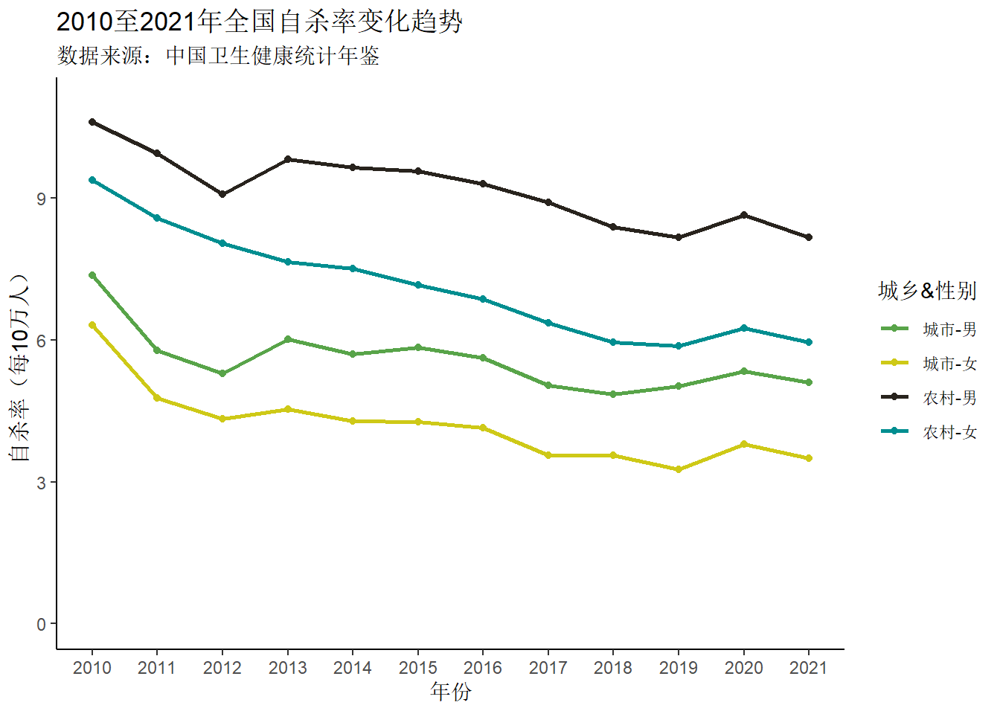
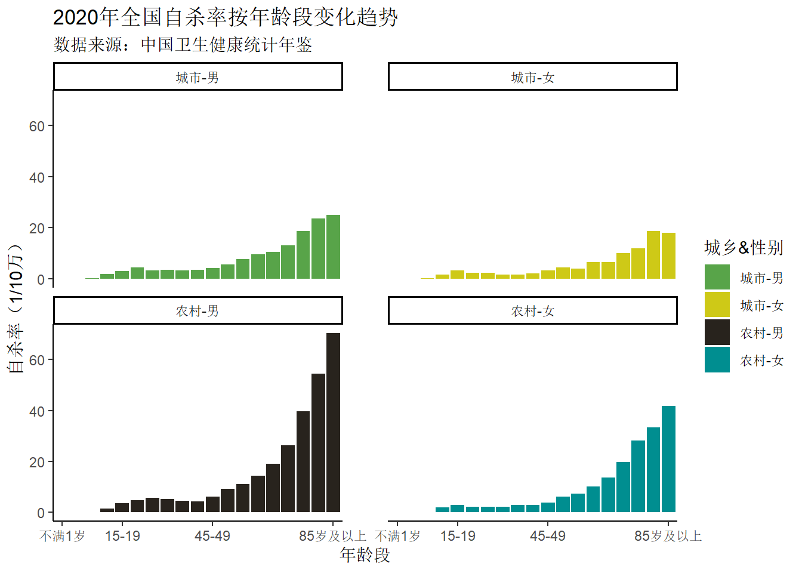

## 前言

前段时间，我闲着没事，在县城的老城区溜达。

溜达的时候，经过了半废弃的古城。但是隔着一座桥的旁边，是拥挤的居民区，还有矮破的瓦房。看着，挺难受的。钱，糟蹋了。

后来，溜达到县城的图书馆。我上高中那会，县城的图书馆，还在一个类似于居民楼的二层。记不得啥时候，现在的图书馆搬迁到文化广场这块，修的挺好，里面的环境也很好。紧邻着图书馆，有一所小学。学校有读书声，操场上有学生上体育课，挺好。这个学校，外观有一个地方，看着难受，就是，走廊使用防护网封起来了。我的感觉是，校领导，为了防止学生跳楼，把走廊封起来了。或许，即使，既往没有学生跳楼，校领导也会把防护网安装上。

我回去后，搜了下这所学校的自杀报道，不出意外是搜不到的。

我在《中国卫生健康统计年鉴》，搜了下未成年的自杀率，并不高。

我这个人奉行，好死不如赖活着。但是，我想了解下，人自杀的原因，中国的自杀情况。特别是，现在小学生的自杀情况。

## AI 写书评

涂尔干《自杀论》不是心理学意义上的“想不开”，而是一部用统计方法证明：**自杀首先是社会事实**——个人行为背后，有可测量的社会结构与规范在起作用。

### 核心主张

涂尔干把自杀定义为：当事人**明知**其行为会导致死亡，而由自己直接、间接促成的死亡。他比较各国、各群体自杀率，发现差异稳定、可预测，说明自杀不能仅用个人性格、精神疾病解释，而要看人与**社会整合**(integration)（是否被群体接纳、有归属）和**社会规制**(regulation)（生活是否有清晰规范与期待）的关系。

### 四种自杀类型

| 类型 | 社会状况 | 典型情形 |
| --- | --- | --- |
| **利己型** | 整合不足，人过于孤立 | 未婚者、少子家庭、新教徒（相对天主教徒）自杀率更高；知识分子、个人主义盛行 |
| **利他型** | 整合过强，人为集体牺牲 | 传统社会中的殉职、殉节；军人、某些宗教中的自我牺牲 |
| **失范型** | 规制崩溃，生活失去坐标 | 经济危机、暴富、离婚、社会剧变；旧规范失效、新规范未立 |
| **宿命型** | 规制过强，人毫无出路 | 奴隶、囚徒等被制度压垮（书中着墨较少） |

两条轴：**整合太高或太低**、**规制太强或太弱**，都会推高自杀率。健康状态是“不多不少”——人既属于某个共同体，又有可遵循的生活秩序。

### 方法上的意义

涂尔干用教会记录、婚姻状况、战争前后数据等，说明自杀率随**社会结构**变化：战争期间自杀率下降（整合与共同目标增强）；经济繁荣或萧条时，失范型自杀会上升。这开创了用社会学解释“看似最私人的选择”的路径，也奠定了“社会事实”这一概念。

### 局限与当代启示

- **心理与生理**：抑郁、创伤、神经科学等，涂尔干基本未纳入；今天通常认为社会因素与个体因素并存。
- **中国语境**：他主要分析19世纪欧洲数据，不能直接套用；但“失范”（升学竞争、城乡差异、家庭结构变化）和“利己”（孤独、缺乏支持网络）仍常用来讨论青少年、老年人自杀。

### 一句话

《自杀论》的价值在于：把自杀从“个人不幸”拉进**社会结构**的视野——不是为自杀开脱，而是说明，要减少自杀，不能只劝个人“想开点”，还要问：我们生活在怎样的制度、关系和规范里。

## AI总结现代社会学的自杀结论

涂尔干之后，社会学没有推翻《自杀论》，而是把它当作起点，用新数据、新理论和新方法不断修正。大致可以归纳成下面几条。

### 社会因素仍然成立，但不再“包打天下”

当代共识是：**自杀 = 个体脆弱性 × 社会结构 × 具体情境**，三者叠加，而不是“要么纯心理、要么纯社会”。

- 整合、失范、规制这些概念仍在用，但会和心理疾病、创伤、物质滥用等并列，而不是互相替代。
- 群体自杀率高，不等于某个自杀的人一定“缺整合”——这叫**生态谬误**（用宏观数据推断个体）。社会学今天更强调：怎么从“社会结构”连到“具体的人”。

### 涂尔干框架的修正与扩展

| 方向 | 现代结论 |
| --- | --- |
| **网络与关系** | 不只是“有没有结婚、有没有宗教”，而是**实际支持网络**的质量——谁能在危机时帮到你、你会不会求助。 |
| **失范的新形态** | 不只是经济危机，还包括疫情、失业、离婚、移民、网络暴力等**规范突然失效**的情境。 |
| **“整合过多”的悖论** | 高度凝聚的小社区（某些封闭群体、高压学校）整体自杀率可能不高，但一旦出现自杀，更容易**传染、扎堆**（自杀簇）。整合既是保护，也可能是风险。 |
| **统计本身是社会产物** | 怎么认定“自杀”、家属会不会瞒报、媒体怎么报道，都会影响数据。自杀率不只是“自然发生”，也是被**社会建构**出来的。 |

### 几条跨文化、跨时代的稳定规律

- **性别**：多数国家男性自杀死亡率高于女性，女性**未遂**更多——与社会对“求助”“男子气概”、自杀手段的致命性有关。
- **年龄**：发达国家常见模式是**老年人**自杀率最高；青少年自杀绝对数少，但每一次都牵动舆论，且与**学业压力、同伴关系、家庭冲突**高度相关。
- **手段**：谁手边有什么致命工具，谁就更可能“一时冲动”成功——社会学非常强调**手段限制**（禁高毒农药、高楼防护、管制药物），这不只是工程问题，也是社会政策。
- **传染效应**：媒体报道方式会影响后续自杀（“维特效应”）；规范、负责任的报道本身是一种社会干预。

### 5. 社会学对预防的结论（比“想开点”更具体）

现代自杀学预防强调**三层**：

1. **环境层**：限制致命手段（农药、高楼、枪支等）——防护网属于这一层。
2. **关系层**：家庭、学校、社区的可及支持；降低求助污名。
3. **结构层**：减少长期失范来源——经济保障、公平的教育与工作机会、对危机事件的制度回应。

社会学并不反对心理治疗，但指出：**只抓个人，不改结构和环境，效果有限**。中国农药管制降低自杀率，就是结构干预成功的范例。

## 中国自杀率统计

中国的自杀统计，可以在 [中国卫生健康统计年鉴](https://www.nhc.gov.cn/mohwsbwstjxxzx/tjzxtjsj/tjsj_list.shtml) 找到。但是，问题是，官方数据源只提供 pdf 版本的，没有 excel 版本的，没法表格分析。网上有卫生统计年鉴 excel 格式的，但是得收费。得不自己整理一手数据了，怪麻烦得。

**有人整理了，我引用下。下面内容来**自：[看一看我国自杀率变化趋势 | earfanfan | 袁凡](https://yuanfan.rbind.io/project/population3/?utm_source=chatgpt.com)

> 按城乡和性别来看，从2010年到2021年我国自杀率整体呈现下降趋势。若比较自杀率高低，应是`农村-男 > 农村-女 > 城市-男 > 城市-女`，即农村自杀率高于城市，而分别在农村和城市则均为男性自杀率高于女性。

> 按年龄段来看，不论城乡或性别，自杀率随着年龄增加而升高。极其明显的是，老年人自杀率极高。

## 写书评的今天

2026 年 5 月 23 日，北京，阴。

晚上吃了碳水油脂的混合物，现在有点困。
